# 08 — مخطط الاعتماديات

> أي قدرة تتطلب أخرى قبلها. هذا يقيد وضعها: لا يمكن وضع قدرة في التنقل الرئيسي إذا كانت غير قابلة للاستخدام حتى توجد ثلاث أشياء أخرى.

## مخطط الاعتماديات (Mermaid)

```mermaid
graph TD
    %% التأسيس الأولي
    Setup[F-006 تأسيس محلي<br/>إدخال اسم المشروع]
    Profile[ملف النشاط محفوظ]

    Setup --> Profile

    %% دورة الطلب
    NewDraft[F-010 سجل جديد]
    DraftEditor[F-012 محرر المسودة]
    CostEditor[F-014 محرر التكلفة]
    AgreementEditor[F-015 محرر الاتفاق]
    OrderDetail[F-016 تفاصيل الطلب]
    StartExec[F-017 ابدأ التنفيذ]
    MarkReady[F-018 جاهز للتسليم]
    Deliver[F-019 تم التسليم]
    Collect[F-020 تحصيل المتبقي]
    Debt[F-021 تسجيله دينًا]

    Profile --> NewDraft
    NewDraft --> DraftEditor
    DraftEditor --> CostEditor
    CostEditor --> AgreementEditor
    AgreementEditor --> OrderDetail
    OrderDetail --> StartExec
    StartExec --> MarkReady
    MarkReady --> Deliver
    Deliver --> Collect
    Deliver --> Debt

    %% الكتالوج مرتبط بالمسودة
    Catalog[F-063 الكتالوج]
    DraftEditor -->|رابط اختياري| Catalog

    %% المالية تتطلب بيانات
    Finance[F-027 الوضع المالي]
    DeliveredOrder[طلب مسلّم أو حدث مالي]
    Deliver --> DeliveredOrder
    DeliveredOrder -->|يظهر وحدة period_result| Finance

    %% الكاش يتطلب المالية
    CashWallets[F-049 محافظ الكاش]
    CashWalletNew[F-050 محفظة ورصيد بداية]
    CashTransfer[F-051 تحويل بين المحافظ]
    CashAdjust[F-052 ضبط بسبب]
    CashReverse[F-053 تراجع عن أثر]

    Finance --> CashWallets
    CashWallets --> CashWalletNew
    CashWallets -->|2+ محافظ| CashTransfer
    CashWallets --> CashAdjust
    CashWallets --> CashReverse

    %% الموردون يتطلب المالية
    Suppliers[F-054 مشتريات المواد]
    SupplierPurchase[F-055 سجل شراء مواد]
    SupplierPayment[F-056 سجل دفعة]

    Finance --> Suppliers
    Suppliers --> SupplierPurchase
    SupplierPurchase -->|payable > 0| SupplierPayment

    %% المخزون يتطلب المالية
    Inventory[F-057 المواد والمخزون]
    MaterialNew[F-058 مادة ورصيد بداية]
    InvReceipt[F-059 استلام شراء]
    InvConsume[F-060 استهلاك لطلب]
    InvWaste[F-061 هدر أو ضبط]
    InvReverse[F-062 تراجع عن حركة]

    Finance --> Inventory
    Inventory --> MaterialNew
    MaterialNew -->|مادة موجودة| InvReceipt
    MaterialNew -->|مادة موجودة| InvConsume
    MaterialNew -->|مادة موجودة| InvWaste
    Inventory --> InvReverse

    %% حق المالك يتطلب المالية
    OwnerEnt[F-042 دفتر حق المالك]
    OwnerPolicy[F-043 إضافة سياسة]
    OwnerSuccessor[F-044 تعديل سياسة]
    OwnerRecord[F-045 تسجيل حق]
    OwnerOpening[F-046 رصيد افتتاحي]
    OwnerMovement[F-047 سحب أو إرجاع]
    OwnerReverse[F-048 تراجع]

    Finance --> OwnerEnt
    OwnerEnt --> OwnerPolicy
    OwnerEnt --> OwnerSuccessor
    OwnerPolicy --> OwnerRecord
    OwnerEnt --> OwnerOpening
    OwnerEnt --> OwnerMovement
    OwnerEnt --> OwnerReverse

    %% الأحداث المالية تتطلب المالية
    FinEventExpCash[F-036 مصروف مدفوع]
    FinEventExpPay[F-037 التزام لمورد]
    FinEventInv[F-038 استثمار]
    FinEventWithdraw[F-039 سحب شخصي]
    FinEventSettle[F-040 تسديد التزام]

    Finance --> FinEventExpCash
    Finance --> FinEventExpPay
    Finance --> FinEventInv
    Finance --> FinEventWithdraw
    FinEventExpPay -->|payables > 0| FinEventSettle

    %% G5 يتطلب المالية
    G5Decl[F-041 محرر متوقع G5]
    Finance --> G5Decl

    %% الجدول يتطلب طلبات
    Schedule[F-070 جدول المواعيد]
    ScheduleEditor[F-073 محرر الموعد]
    OrdersOrSchedules[طلبات أو مواعيد موجودة]

    OrderDetail -->|ينشئ موعدًا| OrdersOrSchedules
    OrdersOrSchedules -->|يظهر وحدة schedule| Schedule
    Schedule --> ScheduleEditor

    %% الموقف الافتتاحي البديل
    GuidedImport[F-076 إدخال موقف افتتاحي]
    Profile -->|جهاز فارغ| GuidedImport

    %% تنسيق
    classDef foundational fill:#e8f5e9,stroke:#2e7d32,stroke-width:2px
    classDef finance fill:#fff3e0,stroke:#e65100,stroke-width:2px
    classDef order fill:#e3f2fd,stroke:#1565c0,stroke-width:2px
    classDef buried fill:#fce4ec,stroke:#c62828,stroke-width:2px

    class Setup,Profile,CashWalletNew,MaterialNew,OwnerOpening,GuidedImport foundational
    class Finance,CashWallets,Suppliers,Inventory,OwnerEnt finance
    class NewDraft,DraftEditor,CostEditor,AgreementEditor,OrderDetail order
    class CashTransfer,CashAdjust,CashReverse,InvReceipt,InvConsume,InvWaste,InvReverse,OwnerPolicy,OwnerSuccessor,OwnerRecord,OwnerMovement,OwnerReverse buried
```



## السلاسل الحرجة

### السلسلة 1: من التأسيس إلى أول محفظة كاش

```
تأسيس محلي → ملف نشاط → (بدء طلب → تكلفة → اتفاق → تنفيذ → جاهز → تسليم)
→ وحدة period_result تظهر → الوضع المالي → طبقة الأفعال → محافظ الكاش → محفظة ورصيد بداية
```

**الطول: 10+ خطوات.** هذه أطول سلسلة في التطبيق، وهي سلسلة تأسيسية — أول ما يحتاجه مستخدم جديد.

### السلسلة 2: من التأسيس إلى تسجيل استثمار مالك

```
تأسيس محلي → ملف نشاط → (دورة طلب كاملة) → الوضع المالي → طبقة الأفعال → سجل استثمارًا
```

**الطول: 10+ خطوات.** تسجيل رأس المال الافتتاحي يتطلب إكمال دورة طلب كاملة.

### السلسلة 3: من التأسيس إلى مادة ورصيد بداية

```
تأسيس محلي → ملف نشاط → (دورة طلب كاملة) → الوضع المالي → طبقة الأفعال → المواد والمخزون → مادة ورصيد بداية
```

**الطول: 11+ خطوات.**

### السلسلة 4: البديل — استيراد موقف افتتاحي

```
تأسيس محلي → ملف نشاط → الإعدادات → افتح طبقة بيانات البداية → اختيار ملف → تأكيد
```

**الطول: 5 خطوات.** لكنها تتطلب ملف JSON جاهزًا.

### السلسلة 5: من طلب إلى تحويل بين محافظ

```
محفظة كاش موجودة → محفظة ثانية → تحويل بين المحافظ
```

**الطول: يحتاج محفظتين أولًا.**

## ما يقيد هذا المخطط

1. **لا يمكن نقل محافظ الكاش أو المخزون أو الموردين لتنقل رئيسي** طالما أن الوصول إليها يمر عبر `/finance` المشروطة. إذا أُريد نقلها، يجب فك الاعتماد على `/finance` أولًا.

2. **لا يمكن نقل الأحداث المالية (استثمار، مصروف، سحب) لـ FAB** طالما أن المحفظة الكاشية قد لا تكون موجودة بعد. إذا نُقلت، يجب إما قبول الحالة الفارغة أو ربطها بإنشاء محفظة تلقائيًا.

3. **لا يمكن نقل حق المالك لتنقل رئيسي** طالما أن سياسته تحتاج إلى أعمال مكتملة لحساب قيمته. قد تكون بطاقة ملخص كافية، لكن الدفتر الكامل يحتاج بيانات.

4. **الكتالوج قابل للنقل** — اعتماده الوحيد هو ملف نشاط محفوظ. يمكن نقله لتنقل رئيسي أو FAB دون كسر شيء.

5. **الجدول قابل للنقل جزئيًا** — اعتماده على طلبات موجودة. يمكن إظهاره دائمًا بحالة فارغة، لكن قيمته تظهر فقط بالبيانات.
