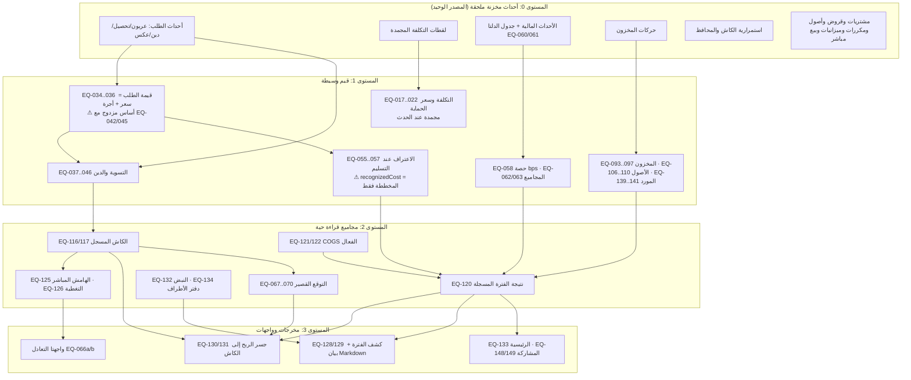

# تدقيق المعادلات المالية في نظام Micro — جرد مفهومي كامل من الألف إلى الياء

> تاريخ التدقيق: 2026-09-25 · الوقت: Asia/Amman · المرجع: main @ `c02fb458b1c97d30f67ca7f5a82de82bbc77325d` · لغة التقرير: العربية

```text
Repository: https://github.com/Qays7753/Micro
Branch/ref: main
Exact full SHA: c02fb458b1c97d30f67ca7f5a82de82bbc77325d
Working-tree state: clean — لا تعديلات محلية؛ HEAD مطابق لـ origin/main (تحقق git ls-remote مباشر)
Analysis date/time/timezone: 2026-09-25 · Asia/Amman
Runtime URL and build identity: غير مستخدم — التدقيق على الكود المصدري والأدلة الثابتة فقط (NOT_EXECUTED)
Micro writes performed: NONE
Financial data writes performed: NONE
```

---

## ١. الملخص التنفيذي

هذا التقرير جردٌ مفهومي شامل وقراءة فقط لكل معادلة وحساب مالي وانتقال حالة وقاعدة تقريب وحارس رفض يعمل داخل نظام Micro كما هو منشور على الفرع main عند الالتزام c02fb458b1c97d30f67ca7f5a82de82bbc77325d. لم يُعدَّل أي ملف في المستودع، ولم تُكتب أي بيانات مالية، ولم تُشغَّل الواجهة على بيانات حقيقية. المنهج: قراءة إلزامية لوثائق الحوكمة (AGENTS.md وفهرس الوثائق وعقود المال)، ثم مسح واسع بوكلاء متخصصين خمسة غير متكافئة الأدوار (جرد شامل، ثم إغناء بالمعنى، ثم سلامة تدفق البيانات، ثم مطابقة الاختبارات والعقود، ثم مراجعة مستقلة)، ثم دمج مُصالِح واحد لكل النتائج في سجل واحد بمعرفات ثابتة EQ-001..EQ-171.

النتيجة الكمية: 171 معادلة وقاعدة مالية مسجلة موزعة على 19 فئة عملية (أكبرها: التسوية والقبض 24، قواعد الحالة 20، التكلفة 16، الكاش والمحافظ 12، مجاميع الفترة 12). منها 160 منفذة فعلًا في الكود، و5 دلائل اختبارية مجمدة (توقعات الاختبارات نفسها)، و4 نصوص عقدية مرجعية، ومعادلتان موثقتان فقط بلا تنفيذ (Markup و Margin — EQ-033). التغطية الاختبارية: 149 معادلة باختبارات مباشرة (87%)، و14 بتغطية غير مباشرة، و8 بلا اختبار (كلها نصوص توثيقية أو دلائل مستوى الوثائق).

الخلاصة المفهومية الكبرى: بنية Micro المالية سليمة التصميم في جوهرها المحاسبي. النظام يفصل الكاش عن النتيجة، والعربون عن الربح، والدين عن المقبوض، وشراء المخزون عن تكلفة البيع، ومال المالك عن إيراد التشغيل؛ ويمثل المال بأعداد صحيحة آمنة (قرش/ملي/bps) بلا فواصل عائمة؛ ويطبق سياسة تقريب موجهة للحماية (نصف-أعلى للبند، سقف لتكلفة الوحدة، أرضي للإهلاك)؛ ويجمد لقطات التكلفة التاريخية فلا يعيد كتابتها؛ ويصحح بالعكس الموثق بمفاتيح حتمية لا بالحذف؛ ويعرض «المجهول» كحالة معرفة لا كصفر. هذه مبادئ معيارية في أنظمة المال الصغيرة وتنفذ في Micro باتساق داخلي عالٍ واختبارات ممتازة.

لكن التدقيق وثّق عشرة تعارضات وأربع فجوات مفهومية تحتاج قرار المالك قبل أي تصحيح، أهمها ثلاث: (1) مسار تحصيل الدين وعكس القبضة يحسبان السقف والمتبقي على السعر المتفق وحده بينما «القيمة القابلة للتحصيل» المعلنة أساسًا موحدًا تشمل أجرة التوصيل — فيبقى فرق الأجرة غير قابل للتحصيل وتُكتب الذمة صفرًا (C1/س1)؛ (2) كلفة التوصيل التي يدفعها المشروع تخصم من مؤشر ربح الطلب لكنها لا تدخل نتيجة الفترة ولا تولد حدث كاش، فمجموع مؤشرات الطلبات لا يساوي نتيجة الفترة والتسجيل اليدوي يخصم مرتين (C2/N7/س2)؛ (3) واجهتان تعرضان «نقطة التعادل» بهامشين مختلفين (مساهمة G5 مقابل هامش مباشر في المالية) تحت الاسم نفسه (س3).

إضافة إلى ذلك: 13 موقعًا على الأقل يعيد حساب قيم المجال داخل الواجهة (مرايا عرض) أحدها بلا تقييد المجال في معاينة تعديل الشراء؛ وتسميات قابلة لسوء القراءة (صافي حركة الكاش، المبيعات، الإهلاك المستحق)؛ وانجراف توثيقي في عقود قائمة (01 و06 و05 §3.2.1) وفي أرقام الإصدار داخل AGENTS.md (36/28 مقابل 38/30 في الكود).

التقييم المهني المستقل (طبقة ب) يصنف البنية الأساسية GOOD_PRACTICE في عشر ممارسات مركزية، وACCEPTABLE_WITH_CAVEAT في المرايا، وNEEDS_IMPROVEMENT في خمس نقاط (فجوة كلفة النقل، وجه التعادل، افتراض القبض في البيع المباشر، التسميات، انجراف التوثيق)، وCONCEPTUALLY_RISKY في نقطة واحدة هي أساس سقف الدين. كل توصية محددة بالموضع والسبب والحد الآمن للتنفيذ، ولا تُنفذ أي توصية تغيّر معنى المال قبل قرار المالك.

الحد الأهم لهذا التقرير: اكتمال الجرد ليس إثباتًا للصحة. هذا التقرير يسلّم المالك الأدلة والأسئلة، والقرار المفهومي — خاصة أسئلة س1 وس2 وس3 — يبقى له وحده.

### أرقام الجرد في سطر واحد

- المعادلات المسجلة: **171** (EQ-001..EQ-171)
- الحالات: 161 منفذة (IMPLEMENTED) · 5 دلائل اختبارية مجمدة (TEST_ORACLE) · 4 نصوص عقدية مرجعية (DOCUMENTED) · 1 موثق فقط بلا تنفيذ (DOCUMENTED_ONLY)
- التقييم المفهيمي: 138 متسقة · 7 بتسمية قابلة للتضليل · 8 تحتاج مراجعة · 4 متعارضة · 13 مصدر مكرر · 1 غير منفذة
- التغطية الاختبارية: 149 مباشرة · 14 غير مباشرة · 8 بلا اختبار (كلها دلائل وثائقية)

---

## ٢. كيفية قراءة هذا التقرير

بُني التقرير لقارئ يعرف مشروعه ولا يقرأ الكود. كل معادلة تُشرح بالعربية أولًا: ماذا تحسب، لماذا، أين تظهر، ماذا تعني، وماذا لا يجوز أن تُفهم به. الأدلة التقنية (مسارات الملفات والأسطر وأسماء الاختبارات) تبقى كما هي بالإنجليزية داخل السجل والملاحق لتسهيل التحقق، ولا تترجم.

التمييز المركزي الذي يحكم كل التقرير: طبقتان منفصلتان لكل قضية. الطبقة (أ) «ما يفعله Micro الآن» تصف السلوك الحالي من الكود والعقود والاختبارات فقط، بدلائل: VERIFIED (تحقق بمسار وسطر)، INFERRED (استنتاج من أدلة متعددة)، UNVERIFIED (غير متحقق)، NOT_EXECUTED (لم يُشغل). الطبقة (ب) «تقييم ZAI المهني المستقل» ترأيًا مستقلًا بمقاييس GOOD_PRACTICE / ACCEPTABLE_WITH_CAVEAT / NEEDS_IMPROVEMENT / CONCEPTUALLY_RISKY / CANNOT_ASSESS. لا تختلط الطبقتان أبدًا؛ وجود سلوك منفذ لا يوصف بالصحة لمجرد أنه يعمل.

حالات التنفيذ المعروفة لكل معادلة: IMPLEMENTED (كود منفذ)، TEST_ORACLE (توقع اختبار يوثق قاعدة مقصودة)، DOCUMENTED (نص عقد مرجعي)، DOCUMENTED_ONLY (موثق بلا كود)، PARTIAL، CONFLICTING. والتقييم المفهيمي: CONSISTENT (الكود والعقد والاختبار والمعنى متفقون)، CONSISTENT_BUT_POORLY_LABELED (الحساب صحيح والتسمية قد تضل)، NEEDS_REVIEW (الأدلة ناقصة أو القاعدة غير محددة)، CONTRADICTORY (اختلاف بين مصدرين)، DUPLICATED_SOURCE (أكثر من تنفيذ نشط قد ينحرف)، NOT_IMPLEMENTED (موثق بلا تنفيذ).

معرف المعادلات EQ-001..EQ-171 ثابت في كل التقرير والملفين؛ تستخدمه للقفز بين السجل والرسم الاعتمادي والأمثلة وجدول المقارنة. تقرأ جدول «السلوك الحالي مقابل التقييم المهني» (القسم 11) بترتيب أهمية القرار لا بترتيب المعرفات.

كل الأمثلة المحسوبة (القسم 8) بأرقام اصطناعية تمامًا لا علاقة لها بأي بيانات حقيقية، وكل مثال يذكر مصدر تحققه: إما قيم مجمدة في اختبارات قائمة، أو اشتقاق حرفي من الصيغة المنفذة؛ وما لم يمكن تحقيقه من مصدر وُسم ILLUSTRATIVE_ONLY.

---

## ٣. المفاهيم المالية التي يميزها Micro

Micro لا يجمع الأرقام؛ يفصل معاني المال قبل أن يحسبها. هذه الفروق الاثنا عشر تحكم كل ما يلي:

### الكاش مقابل النتيجة
الكاش ما قُبض أو دُفع فعليًا في قناة محددة؛ النتيجة ما اعترف به النظام إيرادًا وتكلفة وفق سياسة التسليم والفترة. إنشاء الطلب والتسليم لا يزيدان الكاش؛ والعربون يزيده عند قبضه. يجمع الرقمان فقط عبر «جسر الربح إلى الكاش» (EQ-130/131) الذي يعرض الفرق غير المفسر بصدق بدل إخفائه.
- المرجع: عقد 05 §3.1-3.2، عقد 30، EQ-116/117 مقابل EQ-120

### العربون مقابل الربح النهائي
العربون كاش محصل مسبقًا لا ربحًا. عند الإلغاء يُرد أو يُحتفظ بتسوية موثقة؛ والمحتفظ به يبقى معلقًا حتى يصنفه المالك صراحة (مال مالك / إيراد / مختلط) — والتصنيف استبدال موثق لا تعديل صامت.
- المرجع: AGENTS.md §6، عقد 02، EQ-048..052

### الدين مقابل الكاش المقبوض
الدين مستحق على العميل لا كاشًا؛ تحصيله يزيد الكاش دون إعادة الاعتراف بالإيراد أو تحميل التكلفة مرة ثانية. الحالة settled تعني إقفال الذمة وفق قاعدة السقف المعتمدة (انظر التعارض C1).
- المرجع: عقد 05 §3.2، EQ-040..042

### شراء المخزون مقابل تكلفة البيع (COGS)
شراء المادة ينقص الكاش أو ينشئ التزامًا ولا يصبح تكلفة بيع لحظة الشراء؛ التكلفة تولد عند الاستهلاك الموثق بقيمة تناسبية (EQ-094) وتُستبدل بالتكلفة المعترف بها إن وُجد استهلاك مسجل (EQ-121).
- المرجع: AGENTS.md §6، عقد 11/28، EQ-094/121/122

### مال المالك مقابل إيراد التشغيل
الاستثمار وحقن رأس المال والسحب الشخصي والقرض ليست مبيعات ولا مصاريف تشغيلية؛ تدخل دفتر حق المالك وحده (بأنواعه الثلاثة: نقدي/بالساعة/حصة) ولا تدخل نتيجة الفترة قط.
- المرجع: عقد 05 §3.3، عقد 29، EQ-072..082

### الأمانات (amanah)
كاش محفوظ لغير المشروع داخل صندوقه؛ يظهر في الكاش المسجل لكن لا يصرف إلا ضمن حد المحفوظة (released ≤ held).
- المرجع: عقد 10، EQ-150

### درجة المعرفة لا الدقة الزائفة
لكل نتيجة حالة معرفة: known / estimated / partial / incomplete / stale / variable. الغائب ليس صفرًا؛ والناقص يُعلن بالاسم مع الفعل التالي، والنتيجة النهائية تُمنع عند نقص عنصر مؤثر (كوقت العمل).
- المرجع: عقد 05 §8، EQ-024/025/057

### اللقطة المجمدة والتاريخ
لقطة التكلفة ومدخلاتها تُنسخ وتُجمَّد عند حد المجال؛ تغيير الأسعار لاحقًا يغذي لقطات جديدة فقط. التصحيح عكس/تسوية موثقة تترك أثرًا كاملًا (سبب/وقت/مصدر/علاقة عكس).
- المرجع: عقد 03، عقد 34، EQ-022/023/061

### قفل المراجعة (needs_review)
الطلب المسلّم الذي يدخل المراجعة تُحجب نتيجته وتُمنع كل العمليات العامة على الحالة واللقطة والمال إلا عبر منفذ التصحيح الموثق reverseDelivery (منفذ فعلاً بعلاقة عكس وسبب إلزامي ومفتاح حتمية).
- المرجع: AGENTS.md §6، EQ-047/053

### الحتمية (idempotency)
كل كتابة حساسة بمفتاح غير فارغ مصنف بنوع العملية؛ إعادة الإرسال لا تضاعف الأثر وتُفحص القيم قبل قبول إعادة المحاولة؛ التعارض المالي لا يُحل بآخر كتابة صامتة بل برفض storage_stale.
- المرجع: AGENTS.md §6/§10، EQ-152/153

### الفترة بتوقيت عمّان
انتماء الطلب للفترة يتحدد بتاريخ حدث التسليم محولًا إلى تاريخ الأعمال المحلي في Asia/Amman (لا تاريخ القبض ولا اقتطاع UTC)؛ الفترات شاملة الحدود؛ الاستحقاق المكرر يعالج الشهر القصير بقاعدة معلنة.
- المرجع: عقد 05 §، EQ-124/155، EQ-083..085

### ما لا يُجمع عمدًا
الكاش مع النتيجة، والعربون مع الربح، والدين مع المقبوض، ومال المالك مع الإيراد، والأمانة مع الكاش الحر، والتعادل المحاسبي مع السيولة: أزواج تُعرض متجاورة مع شرح العلاقة، ولا تُدمج في رقم واحد باسم «ما أملك».
- المرجع: النموذج المالي التشغيلي §9، جدول MUST_NOT_COMBINE في القسم 7

---

## ٤. الاتفاقيات العامة: وحدات وعملة وتقريب وإشارات وتواريخ

| الاتفاقية | القاعدة المعتمدة |
|---|---|
| **العملة** | الدينار الأردني JOD هو العملة الأولى والوحيدة في النموذج المحلي. لا يوجد تحويل عملات ولا أسعار صرف في أي مسار منفذ. |
| **الوحدة الصغرى للمال (minor)** | القرش = 1/100 دينار. كل المال المخزن والمحسوب أعداد صحيحة من القروش (MoneyMinor). لا فواصل عائمة في أي مسار مالي؛ القيم العشرية تُحلل عند الإدخال (بحدود خانتين) ثم تُخزن صحيحة (EQ-007). |
| **وحدة الكمية (milli)** | الوحدة الداخلية للكميات = 1/1000 (QuantityMilli). الكمية القابلة للتمثيل الدقيق تُقبل وإلا تُرفض بأكملها (EQ-004/010)؛ التحويل بين وحدتين يشترط قابلية القسمة الدقيقة (EQ-012). |
| **النسب (bps)** | النسبة المئوية تُمثل بنقاط أساس (1/100 من بالمئة). 25% = 2500 bps. النسبة غير القابلة للتمثيل الدقيق تُرفض (EQ-008). |
| **الحساب الآمن** | addSafe يرفض الجمع خارج الأعداد الصحيحة الآمنة (فشل مغلق لا تقريب)، وكل قسمة تمر بأحد المساعدين الثلاثة: roundHalfUp / floorRatio / ceilRatio — لا Math.round مباشر في المال. |
| **سياسة التقريب وموقعها** | يُقرَّب كل بند (مادة/وقت) إلى قرش نصف-الأعلى قبل الجمع (EQ-017/018)؛ تكلفة الوحدة تُقرَّب للأعلى (سقف) حمايةً من نقص التسعير (EQ-020)؛ الإهلاك الشهري للأرضي مع شهر لحاق (EQ-107)؛ حصص التوزيع تُمتص بالمتمم حتى لا يتجاوز المجموع الأصل (EQ-089..092)؛ استحقاقات المالك نصف-أعلى بلا قسمة أرضية أبدًا (عقد 05 §5.3). |
| **الإشارات** | المبالغ المدخلة موجبة؛ العكس والتعديل يُمثلان بقيم معكوسة في الدلتا (−) لا بتبديل نوع الحدث. الفرق قد يكون سالبًا (عدّ الصندوق، فرق الجسر) ويُعرض بإشارته. |
| **التواريخ والفترات** | تواريخ العمل المحلية YYYY-MM-DD بتوقيت Asia/Amman عبر businessTime (EQ-155)؛ الطوابع الزمنية ISO-8601. الفترة شاملة الحدين (from ≤ date ≤ to). تاريخ دخول الطلب = تاريخ حدث التسليم محولًا محليًا (EQ-124). |
| **الفراغ والمجهول** | null يعني «غير معروف/غير متاح» ويعرض «غير متاح»؛ الصفر معلومة صريحة. المجاميع تنتشر فيها null (الجمع لا يحوّلها صفرًا)؛ والمصروف بلا أحداث يبقى null لا صفرًا (EQ-143). |
| **التجميد مقابل الحساب الحي** | اللقطات (تكلفة، اعتراف، استحقاق، قيمة استهلاك، نتيجة تخلص) تُجمد عند حدثها ولا تعاد؛ المجاميع والتقارير والأرصدة تُشتق حية عند كل قراءة من الأحداث الملحقة. لا يوجد رصيد كاش أو مخزون أو متبقي قرض مخزن. |

---

## ٥. خريطة المعادلات الكاملة

### ٥-أ. التوزيع على الفئات

| الفئة | العدد |
|---|---:|
| 1. تطبيع المدخلات والتحليل الرقمي | 4 |
| 2. تحويل الوحدات المالية | 4 |
| 3. الكمية وتحويل الوحدات | 5 |
| 4. التسعير والمجموع | 7 |
| 5. القبض والتسوية والذمم | 24 |
| 6. التكلفة المباشرة | 16 |
| 7. النتيجة والهوامش | 8 |
| 8. الكاش والمحافظ | 12 |
| 9. أرصدة الأطراف ومال المالك | 10 |
| 10. المخزون والاستهلاك | 9 |
| 11. القروض والسداد | 2 |
| 12. التقديرات والفروق | 3 |
| 13. مجاميع الفترات والمقارنة | 12 |
| 14. اللقطات المجمدة | 4 |
| 15. قواعد الحالة والتصحيح | 20 |
| 16. التقارير والتصدير | 10 |
| 17. التقريب والتنسيق والدقة | 5 |
| 18. الثوابت والحراس | 11 |
| 19. دلائل الاختبار والتوثيق | 5 |
| **المجموع** | **171** |

### ٥-ب. الجدول الجامع (كل المعادلات)

| المعرّف | الاسم | الفئة | الصيغة | الموضع الأساسي | الحالة |
|---|---|---|---|---|---|
| EQ-001 | التقريب نصف-الأعلى بعيدًا عن الصفر | 17. التقريب والتنسيق والدقة | roundHalfUp(n, d) = ⌊n/d⌋ + (2·(n mod d) ≥ d ? 1 : 0) | `src/domain/shared/numeric.ts:102` | IMPLEMENTED |
| EQ-002 | القسمة السقفية (للاستخدامات غير السالبة) | 17. التقريب والتنسيق والدقة | ceilRatio(n, d) = ⌊n/d⌋ + (n mod d ≠ 0 ? 1 : 0) | `src/domain/shared/numeric.ts:114` | IMPLEMENTED |
| EQ-003 | القسمة الأرضية | 17. التقريب والتنسيق والدقة | floorRatio(n, d) = ⌊n/d⌋ | `src/domain/shared/numeric.ts:109` | IMPLEMENTED |
| EQ-004 | الكمية بدقة أجزاء الألف | 3. الكمية وتحويل الوحدات | quantityMilliExact(q) = m where m = Math.round(q×1000), iff m safe ∧ m > 0 ∧ \|q − m/1000\| ≤ Number.EPSILON, else null | `q−milli/1000\\| ≤ ε else null \| src/domain/shared/numeric.ts:94` | IMPLEMENTED |
| EQ-005 | جمع آمن للأعداد الصحيحة | 2. تحويل الوحدات المالية | addSafe(a, b) = a + b iff both safe ints ∧ no overflow, else null | `src/domain/shared/numeric.ts:82` | IMPLEMENTED |
| EQ-006 | تنسيق المال (وحدة صغرى → دينار) | 2. تحويل الوحدات المالية | formatMoneyMinor(m) = new Intl.NumberFormat("en-US",{min/maxFractionDigits:2, useGrouping:true}).format(m / 100) | `apps/.../presentation/formatters.ts:77` | IMPLEMENTED |
| EQ-007 | تحليل نص المال | 1. تطبيع المدخلات والتحليل الرقمي | minor = Number(whole)×100 + Number((""+fraction+"00").slice(0,2)); reject >2 decimals | `apps/.../application/input/englishNumeric.ts:33` | IMPLEMENTED |
| EQ-008 | نسبة مئوية إلى أساس نقطة | 2. تحويل الوحدات المالية | bps = Math.round(percent×100) iff Number.isSafeInteger(bps) ∧ bps/100 === percent, else null | `apps/.../application/input/englishNumeric.ts:82` | IMPLEMENTED |
| EQ-009 | صدى كمية إلى ملي | 2. تحويل الوحدات المالية | milli = Math.round(q×1000) iff \|q − milli/1000\| ≤ ε ∧ milli safe, else null (accepts 0) | `apps/.../application/input/englishNumeric.ts:94` | IMPLEMENTED |
| EQ-010 | تحليل نص الكمية | 3. الكمية وتحويل الوحدات | milli = Number(whole)×1000 + Number((fraction+"000").slice(0,3)); reject >3 decimals and overflow | `apps/.../application/input/englishNumeric.ts:55` | IMPLEMENTED |
| EQ-011 | عرض الكمية بالملي | 17. التقريب والتنسيق والدقة | quantityMilliToFixed3(m) = sign + ⌊\|m\|/1000⌋ + "." + pad3(\|m\| − 1000×⌊\|m\|/1000⌋); trailing zeros trimmed (formatQuantityMilli); fixed3 kept (formatQuantityMilliFixed3) | `m\\|/1000⌋.pad3(\\|m\\|−1000⌊…⌋) \| apps/.../presentation/formatters.ts:103` | IMPLEMENTED |
| EQ-012 | تحويل كمية بين وحدتين (صريح) | 3. الكمية وتحويل الوحدات | result = (quantityMilli × numerator) / denominator; require (milli×numerator) safe ∧ (milli×numerator) mod denominator = 0 | `src/domain/catalog/policies.ts:127` | IMPLEMENTED |
| EQ-013 | توحيد كمية G5 على وحدة الهدف | 3. الكمية وتحويل الوحدات | normalizeQuantity(milli, fromUnit, toUnit) = convertQuantityMilli(milli, conversion) iff same dimension & active conversion, else null | `apps/.../application/g5/g5Service.ts:82` | IMPLEMENTED |
| EQ-014 | تطبيع الأرقام الهندية/الفارسية | 1. تطبيع المدخلات والتحليل الرقمي | replace [٠-٩ ۰-۹] with ASCII digits before pattern validation | `apps/.../application/input/englishNumeric.ts:16` | IMPLEMENTED |
| EQ-015 | عرض/إدخال الكمية في الحقول | 3. الكمية وتحويل الوحدات | text = (milli/1000).toFixed(3).replace(/\.0+$/,"") ; onMilliChange: quantity = quantityMilli/1000 | `apps/.../components/forms/EnglishQuantityInput.tsx:8` | IMPLEMENTED |
| EQ-016 | حارس المبلغ الموجب/غير السالب | 1. تطبيع المدخلات والتحليل الرقمي | assertPositiveMinor: Number.isSafeInteger(v) ∧ v > 0; assertNonNegativeInteger: isInteger ∧ v ≥ 0 | `src/domain/shared/numeric.ts:71` | IMPLEMENTED |
| EQ-017 | تكلفة بند المادة | 6. التكلفة المباشرة | itemCostMinor = roundHalfUp(quantityMilli × unitPriceMinor, 1000) | `src/domain/craft-order/policies.ts:198` | IMPLEMENTED |
| EQ-018 | تكلفة الوقت | 6. التكلفة المباشرة | timeCostMinor = roundHalfUp(minutes × hourlyRateMinor, 60) (0 when either is null) | `src/domain/craft-order/policies.ts:250-264` | IMPLEMENTED |
| EQ-019 | التكلفة المخططة | 6. التكلفة المباشرة | plannedCostMinor = Σ itemCost + timeCost + packagingMinor + deliveryMinor + wasteMinor | `src/domain/craft-order/policies.ts:266-267` | IMPLEMENTED |
| EQ-020 | سقف تكلفة الوحدة | 6. التكلفة المباشرة | unitCostMinor = ceilRatio(plannedCostMinor × 1000, quantityMilli) — exact milli ratio, not float division | `src/domain/craft-order/policies.ts:221-232` | IMPLEMENTED |
| EQ-021 | سعر الحماية للوحدة | 4. التسعير والمجموع | priceFloorMinor = unitCostMinor + safetyBufferMinor | `src/domain/craft-order/policies.ts:269` | IMPLEMENTED |
| EQ-022 | لقطة التكلفة (الحساب الكامل) | 6. التكلفة المباشرة | calculateCostSnapshot = {materialCostMinor, timeCostMinor, plannedCostMinor, unitCostMinor, priceFloorMinor, knowledgeState, knowledgeGaps, frozen input} | `src/domain/craft-order/policies.ts:234-288` | IMPLEMENTED |
| EQ-023 | تجميد لقطة التكلفة | 14. اللقطات المجمدة | freezeCostSnapshot: deep-clone input (items, time) then Object.freeze each level; costSnapshots appended immutably on revision | `src/domain/craft-order/policies.ts:120-127` | IMPLEMENTED |
| EQ-024 | حالة معرفة التكلفة | 15. قواعد الحالة والتصحيح | knowledgeState = no-components∨incompleteTime → incomplete; stale material → stale; variable source → variable; estimated item → estimated; else known  (checked in this exact priority) | `src/domain/craft-order/policies.ts:172-179` | IMPLEMENTED |
| EQ-025 | فجوات المعرفة الموثقة | 15. قواعد الحالة والتصحيح | gaps = [{no_cost_components:M},{time_incomplete:M},{stale_material_price:O},{estimated_item:O},{variable_cost_source:O}] (derived; legacy snapshots derive on read) | `src/domain/craft-order/policies.ts:183-196` | IMPLEMENTED |
| EQ-026 | تقادم سعر المادة | 15. قواعد الحالة والتصحيح | stale ⇔ ∃ item.priceDate < localDateMinusDays(ammanDate(snapshot.createdAt), freshnessDays) | `src/domain/craft-order/policies.ts:162-170` | IMPLEMENTED |
| EQ-027 | سعر الاتفاق من سعر الحماية | 4. التسعير والمجموع | startAgreementPrice() = null; applyProtectionPriceAsStart(p) = p; ready ⇔ p ≠ null ∧ int ∧ > 0 (and knowledgeState ∉ {incomplete, partial}) | `apps/.../application/agreements/agreementPrice.ts:1-22` | IMPLEMENTED |
| EQ-028 | معاينة/حفظ تقدير التكلفة | 4. التسعير والمجموع | preview = calculateCostSnapshot(id, {…user input, priceDate=now, source user_input}) | `apps/.../application/estimates/costEstimateService.ts:39-79` | IMPLEMENTED |
| EQ-029 | التكلفة المخططة لقالب الكتالوج | 4. التسعير والمجموع | plannedCostTpl = (Σ priced componentMinor) + timeMinor + packaging + delivery + waste — only when everythingKnown, else null; knowledge = estimated/incomplete/unavailable | `apps/.../application/catalog/templatePlannedCostService.ts:109-207` | IMPLEMENTED |
| EQ-030 | تقدير تكلفة مكوّن القالب | 4. التسعير والمجموع | componentMinor = roundHalfUp(component.quantityMilli × suggestion.unitPriceMinor, 1000) | `apps/.../application/catalog/templatePlannedCostService.ts:140` | IMPLEMENTED |
| EQ-031 | وقت القالب | 6. التكلفة المباشرة | timeMinor = roundHalfUp(extras.timeMinutes × extras.hourlyRateMinor, 60) if both non-null | `apps/.../application/catalog/templatePlannedCostService.ts:161-164` | IMPLEMENTED |
| EQ-032 | سعر الوحدة من آخر استلام | 10. المخزون والاستهلاك | unitPriceMinor = roundHalfUp(lastReceipt.valueDeltaMinor × 1000, lastReceipt.quantityDeltaMilli) | `apps/.../application/inventory/materialSuggestions.ts:59-61` | IMPLEMENTED |
| EQ-033 | معادلات الMarkup والMargin | 4. التسعير والمجموع | price_from_markup = unit_cost × (1 + markup_rate); price_from_margin = unit_cost / (1 − target_margin) | `docs/contracts/05 §5.2` | DOCUMENTED_ONLY |
| EQ-034 | أجرة التوصيل القابلة للفاتورة | 5. القبض والتسوية والذمم | billableDeliveryFeeMinor = (responsibility ∈ {customer_pays_project, shared} ∧ ¬feeIncludedInPrice) ? feeChargedMinor : 0; no terms → 0 | `shared) ∧ ¬feeIncludedInPrice else 0 \| src/domain/craft-order/policies.ts:371-377` | IMPLEMENTED |
| EQ-035 | كلفة النقل على المشروع | 5. القبض والتسوية والذمم | projectDeliveryCostMinor = (responsibility ≠ customer_pays_courier ∧ ¬costIncludedInProductCost) ? costPaidMinor : 0; no terms → 0 | `src/domain/craft-order/policies.ts:382-388` | IMPLEMENTED |
| EQ-036 | قيمة الطلب القابلة للتحصيل | 5. القبض والتسوية والذمم | orderValueMinor = agreedPriceMinor + (billableDeliveryFeeMinor ?? 0) | `src/domain/craft-order/policies.ts:392-395` | IMPLEMENTED |
| EQ-037 | مشتقات التسوية | 5. القبض والتسوية والذمم | receivableMinor = max(orderValueMinor − collectedMinor, 0); settlementStatus = collected=0→unpaid; receivable=0→paid; else partially_paid | `src/domain/craft-order/policies.ts:345-353` | IMPLEMENTED |
| EQ-038 | قبض العربون | 5. القبض والتسوية والذمم | depositCollected += a; collected += a; then withSettlement; guard a + collected ≤ orderValue | `src/domain/craft-order/policies.ts:671-702` | IMPLEMENTED |
| EQ-039 | تحصيل المتبقي بعد التسليم | 5. القبض والتسوية والذمم | collected += a (guard a + collected ≤ orderValue); status → settled iff receivable = 0 | `src/domain/craft-order/policies.ts:704-742` | IMPLEMENTED |
| EQ-040 | الدين المسجل | 15. قواعد الحالة والتصحيح | isRegisteredCustomerDebt ⇔ settlementStatus = "debt" ∧ receivableMinor > 0 | `src/domain/craft-order/policies.ts:745-747` | IMPLEMENTED |
| EQ-041 | تسجيل الدين | 5. القبض والتسوية والذمم | delivered ∧ receivable > 0 → status=settled, settlementStatus=debt; event amount = receivableMinor | `src/domain/craft-order/policies.ts:749-775` | IMPLEMENTED |
| EQ-042 | تحصيل الدين المسجل | 5. القبض والتسوية والذمم | collected += a (guard ≤ agreedPrice — NOTE: uses agreedPrice not orderValue); receivable = max(agreedPrice − collected, 0); settlement = paid ⇔ receivable=0 else debt | `src/domain/craft-order/policies.ts:780-814` | IMPLEMENTED |
| EQ-043 | حالة التسوية بعد تصحيح السعر | 5. القبض والتسوية والذمم | (settled ∨ debt) ? (receivable=0 → paid else debt) : (collected=0 → unpaid; receivable=0 → paid; else partially_paid) | `src/domain/craft-order/policies.ts:826-835` | IMPLEMENTED |
| EQ-044 | تصحيح السعر المتفق | 5. القبض والتسوية والذمم | receivable = max(newPrice + (fee ?? 0) − collected, 0); recognizedRevenue/profit refresh only if delivered ∧ final | `src/domain/craft-order/policies.ts:844-892` | IMPLEMENTED |
| EQ-045 | التراجع عن قبضة | 5. القبض والتسوية والذمم | reversedSoFar = Σ reversals of source; guard reversedSoFar + a ≤ sourceAmount ∧ a ≤ collected; collected −= a; receivable = max(agreedPrice − collected, 0) | `src/domain/craft-order/policies.ts:916-959` | IMPLEMENTED |
| EQ-046 | حالة التسوية بعد عكس قبضة | 5. القبض والتسوية والذمم | same decision table as EQ-043 with collectedMinor passed post-reversal | `src/domain/craft-order/policies.ts:901-914` | IMPLEMENTED |
| EQ-047 | عكس التسليم الموثق | 15. قواعد الحالة والتصحيح | recognizedRevenueMinor := 0; recognizedCostMinor := 0; profitIndicatorMinor := null; resultStatus := review_required; status := needs_review (cash untouched) | `src/domain/craft-order/policies.ts:990-1041` | IMPLEMENTED |
| EQ-048 | العربون المحتفظ به (قراءة متوافقة) | 5. القبض والتسوية والذمم | retainedDepositMinor = depositRetainedMinor ?? (depositSettlement = retain_deposit ? depositCollectedMinor : 0) | `src/domain/craft-order/policies.ts:1105-1110` | IMPLEMENTED |
| EQ-049 | تسوية عربون الطلب الملغى | 5. القبض والتسوية والذمم | pending = depositCollected − retained; refund: collected−=a, deposit−=a, retained stays; retain: retained+=a; settled ⇔ (depositAfter − retainedAfter) = 0; final = settled ∧ retained>0 → retain_deposit else refund_deposit; settlementStatus → cancelled_refunded/cancelled_retained | `src/domain/craft-order/policies.ts:1130-1167` | IMPLEMENTED |
| EQ-050 | عكس عربون نشط قبل التسليم | 5. القبض والتسوية والذمم | standing = depositCollected − retained; guard a ≤ standing ∧ a ≤ collected; deposit −= a; collected −= a; withSettlement | `src/domain/craft-order/policies.ts:1239-1278` | IMPLEMENTED |
| EQ-051 | معنى العربون المحتفظ | 15. قواعد الحالة والتصحيح | total = owner + revenue; total < retained → null; both > 0 → mixed; owner only → owner; revenue only → revenue; else null | `src/domain/craft-order/policies.ts:1305-1316` | IMPLEMENTED |
| EQ-052 | مبالغ تصنيف/تصحيح تصنيف العربون | 15. قواعد الحالة والتصحيح | unclassified = retained − owner − revenue; classify: nextOwner/nextRevenue += a by meaning; reclassify: sums −= from-meaning amount, += to-meaning amount; guards: non-negative sums ∧ nextTotal ≤ retained | `src/domain/craft-order/policies.ts:1286-1303, 1362-1436` | IMPLEMENTED |
| EQ-053 | قفل «يحتاج مراجعة» للطلب المسلّم | 15. قواعد الحالة والتصحيح | reject money events iff status=needs_review ∧ hasDeliveredEvent ∧ ¬hasDeliveryReversal (documented delivery reversal is the only exit) | `src/domain/craft-order/policies.ts:294-300` | IMPLEMENTED |
| EQ-054 | آخر تسليم ساري (عزو الفترة) | 15. قواعد الحالة والتصحيح | lastEffectiveDeliveryEvent = last status_changed→delivered event with no matching delivery_reversed | `apps/.../application/fulfillment/deliveryAttribution.ts:16-26` | IMPLEMENTED |
| EQ-055 | مكونات نتيجة الطلب | 7. النتيجة والهوامش | revenue = price + fee (null if fee null); cost = productCost(planned) + deliveryCost (null if cost null); result = revenue − cost (null if either null); incompleteReasons declared | `src/domain/craft-order/policies.ts:397-418` | IMPLEMENTED |
| EQ-056 | الاعتراف عند التسليم | 7. النتيجة والهوامش | recognizedRevenue = breakdown.revenue ?? agreedPrice; recognizedCost = costSnapshot.plannedCost; profitIndicator = (resultStatus = final ∧ no incompleteReasons) ? resultMinor : null | `src/domain/craft-order/policies.ts:556-568` | IMPLEMENTED |
| EQ-057 | نتيجة من حالة المعرفة | 15. قواعد الحالة والتصحيح | known→final; incomplete\|partial→incomplete; stale\|variable→review_required; estimated→estimated | `src/domain/craft-order/policies.ts:355-364` | IMPLEMENTED |
| EQ-058 | حصة المشروع من مصروف مشترك | 6. التكلفة المباشرة | calculatedShareMinor = roundHalfUp(totalAmountMinor × percentageBps, 10_000) | `src/domain/financial-event/policies.ts:35-42` | IMPLEMENTED |
| EQ-059 | شكل الحصة المشتركة | 15. قواعد الحالة والتصحيح | knowledge = expectedKnowledge(basis) (agreed→known, owner_estimate→estimated, needs_review→needs_review); allocated ⇒ (percentageBps ∧ total ∧ calculatedShare = EQ-058(total,bps)); unallocated ⇒ basis=needs_review ∧ total > 0 ∧ no bps/share | `src/domain/financial-event/policies.ts:48-145` | IMPLEMENTED |
| EQ-060 | جدول أثر الحدث المالي (9 أعمدة) | 15. قواعد الحالة والتصحيح | per event type: [cash, payable, ownerCapital, operatingExpense, amanah, asset, loan, revenue, loanPayable] × amount; asset_disposal_cash: cash = +amount ∧ asset = −bookValueMinor(context); unallocated shared → operatingExpense = 0 | `src/domain/financial-event/policies.ts:290-354` | IMPLEMENTED |
| EQ-061 | عكس حدث مالي | 15. قواعد الحالة والتصحيح | reversal = same type/amount; every delta = −source delta (optional nullish columns read as 0 then negated); never reversible twice | `src/domain/financial-event/policies.ts:426-458` | IMPLEMENTED |
| EQ-062 | مجاميع الأحداث المالية | 16. التقارير والتصدير | totals = Σ per column over events (+eventCount) | `src/domain/financial-event/policies.ts:483-510` | IMPLEMENTED |
| EQ-063 | تسويات التزام قائمة | 5. القبض والتسوية والذمم | activeSettlements(payableId) = Σ amount of payable_settlement_cash linked to payable, excluding reversals and reversed settlements | `src/domain/financial-event/policies.ts:470-481` | IMPLEMENTED |
| EQ-064 | هامش المساهمة بعد الكلفة المباشرة | 7. النتيجة والهوامش | totalRevenue = Σ recognizedRevenue of final orders in window; totalVariableCost = Σ recognizedCost (+ directly-linked variable expenses); contributionMargin = totalRevenue − totalVariableCost | `src/domain/g5/policies.ts:533-567` | IMPLEMENTED |
| EQ-065 | هامش المساهمة للوحدة | 7. النتيجة والهوامش | contributionMarginPerUnitMinor = roundHalfUp(contributionMarginMinor × 1000, totalQuantityMilli) iff margin ∈ [0, MAX_SAFE/1000] ∧ quantity > 0, else null | `src/domain/g5/policies.ts:461-474` | IMPLEMENTED |
| EQ-066 | وحدات نقطة التعادل | 7. النتيجة والهوامش | breakEvenUnits = ceilRatio(fixedExpenseMinor × totalQuantityMilli, contributionMarginMinor × 1000) with numerator/denominator safety pre-checks; null on unsafe or invalid status; calculateBreakEvenUnits(fixed, deliveredQuantityUnits, directMargin) = ceilRatio(fixed × milli, margin×1000) | `src/domain/g5/policies.ts:569-633` | IMPLEMENTED |
| EQ-067 | توقع الكاش القصير | 8. الكاش والمحافظ | projectedCashMinor = recordedCashMinor + declaredCollections − declaredCommitments (only when status ≠ incomplete; else null); undated balances add declared gaps | `src/domain/g5/policies.ts:828-950` | IMPLEMENTED |
| EQ-068 | المتوقعات السارية | 15. قواعد الحالة والتصحيح | reversal valid iff it matches original (amount, direction, dueOn, source, related ids); active = declarations − reversed; duplicate ids/keys → invalid | `src/domain/g5/policies.ts:673-710` | IMPLEMENTED |
| EQ-069 | أرصدة داخل أفق الكاش | 8. الكاش والمحافظ | dated in-window → adds to collections/commitments; undated: remaining = balance.amount − Σ linked declarations (if < amount → incomplete undated remainder); linkedAmount > balance → invalid | `src/domain/g5/policies.ts:727-767` | IMPLEMENTED |
| EQ-070 | قراءة السحب الآمن الاستشارية | 8. الكاش والمحافظ | headroomMinor = shortCash.projectedCashMinor − reserveMinor; status follows shortCash (needs_review/available); negative headroom declared with reason (no clamp); disabled/unset/no-cash/incomplete → status incomplete (no number) | `src/domain/owner-safe-withdrawal/policies.ts:26-96` | IMPLEMENTED |
| EQ-071 | أفق الكاش 7/30/90 | 8. الكاش والمحافظ | horizon(N) = [today, today + N − 1] (shiftLocalDays via Date.UTC midnight; inclusive both ends) | `apps/.../application/finance/shortCashHorizon.ts:49-87` | IMPLEMENTED |
| EQ-072 | حق المالك بالساعة | 9. أرصدة الأطراف ومال المالك | timeAmountMinor = roundHalfUp(amountMinor × minutes, 60); requires minutes int > 0 with source keys | `src/domain/owner-entitlement/policies.ts:494-533` | IMPLEMENTED |
| EQ-073 | الحق لكل عمل مكتمل | 9. أرصدة الأطراف ومال المالك | amountMinor = policy.amountMinor × completedWorkCount; requires keys.length = count ∧ unique | `src/domain/owner-entitlement/policies.ts:536-572` | IMPLEMENTED |
| EQ-074 | الحق لكل وحدة | 9. أرصدة الأطراف ومال المالك | unitAmountMinor = roundHalfUp(quantityMilli × amountMinor, 1000) | `src/domain/owner-entitlement/policies.ts:575-633` | IMPLEMENTED |
| EQ-075 | حق نسبة الربح | 9. أرصدة الأطراف ومال المالك | share = roundHalfUp(recognizedProfitMinor × percentageBps, 10_000); only from G3 recorded result with status recorded_only; share ≤ 0 → incomplete | `src/domain/owner-entitlement/policies.ts:636-691` | IMPLEMENTED |
| EQ-076 | حق نسبة البيع المكتمل | 9. أرصدة الأطراف ومال المالك | share = roundHalfUp(completedSaleMinor × percentageBps, 10_000); requires positive base + unique keys | `src/domain/owner-entitlement/policies.ts:694-751` | IMPLEMENTED |
| EQ-077 | حرس فترة سياسة الحق | 15. قواعد الحالة والتصحيح | monthly ⇒ isFullCalendarMonth (from −01 ∧ to = lastDayOfMonth); weekly ⇒ inclusiveDays = 7 ((localDayNumber(to) − localDayNumber(from))/86400000 + 1); daily ⇒ from = to; fixed_period ⇒ evidence range = policy range exactly; fixed_shift ⇒ always incomplete (no shift ledger) | `src/domain/owner-entitlement/policies.ts:754-824` | IMPLEMENTED |
| EQ-078 | دلتا حركة المالك | 9. أرصدة الأطراف ومال المالك | cashDelta = draw ? −amount : +amount; entitlementDelta = (settlement∨pre_draw) ? −a : (settlement_of_prior_draw ? +a : 0); openingDelta = settlement ? (draw ? −a : +a) : 0; capitalDelta = owner_draw ? −a : new_capital ? +a : 0; reversal negates all four | `src/domain/owner-entitlement/policies.ts:357-438` | IMPLEMENTED |
| EQ-079 | رصيد الحق المتبقي | 9. أرصدة الأطراف ومال المالك | remainingEntitlementBalance = openingBalanceRemaining + approvedEntitlements(signed) + Σ movement.entitlementDelta; balanceState positive/negative/zero | `apps/.../finance/ownerEntitlementService.ts:282-306` | IMPLEMENTED |
| EQ-080 | رصيد افتتاحي متبقٍ | 9. أرصدة الأطراف ومال المالك | openingBalanceRemaining = signedOpeningTotal + Σ openingBalanceDeltaMinor (movements) | `apps/.../finance/ownerEntitlementService.ts:282-287` | IMPLEMENTED |
| EQ-081 | مجاميع موقّعة بالتراجعات | 9. أرصدة الأطراف ومال المالك | signedRecordTotal = Σ amount×(reversalOfId ? −1 : +1); same for openings; movements via selector×sign | `apps/.../finance/ownerEntitlementService.ts:188-195` | IMPLEMENTED |
| EQ-082 | التكرار التقاطعي للمالك | 15. قواعد الحالة والتصحيح | duplicate ⇔ same direction ∧ \|cashDelta\| = \|amount\| ∧ same occurredOn between owner events and active movements (both excluding reversals) | `amount\\|, occurredOn across events & movements \| apps/.../finance/ownerEntitlementService.ts:201-248` | IMPLEMENTED |
| EQ-083 | حساب فترات التكرار الشهري | 13. مجاميع الفترات والمقارنة | monthsBetween = (y₂×12+m₂) − (y₁×12+m₁); after(period, m) = y'×12 + (m−1) + m then integer div/mod 12 | `src/domain/recurring-expense/policies.ts:87-99` | IMPLEMENTED |
| EQ-084 | عدد أيام الشهر | 13. مجاميع الفترات والمقارنة | Feb: 29 iff (y%4=0 ∧ (y%100≠0 ∨ y%400=0)) else 28; {4,6,9,11}→30; else 31 | `src/domain/recurring-expense/policies.ts:101-108` | IMPLEMENTED |
| EQ-085 | حل تاريخ الاستحقاق | 13. مجاميع الفترات والمقارنة | dueOn = `${period}-${pad2(dueDay)}` if dueDay ≤ days else monthEndPolicy: last_valid_day → day=days; skip; ask (lastValidDay=days) | `src/domain/recurring-expense/policies.ts:349-365` | IMPLEMENTED |
| EQ-086 | الجدول والفترة الأولى | 13. مجاميع الفترات والمقارنة | onSchedule ⇔ Δ(anchor→period) ≥ 0 ∧ Δ mod interval = 0; firstScheduled = anchorPeriod if anchor dueOn ≥ anchorDate else after(anchor, interval); next = after(from, interval) | `src/domain/recurring-expense/policies.ts:368-388` | IMPLEMENTED |
| EQ-087 | حالة انتباه التذكير المتكرر | 15. قواعد الحالة والتصحيح | attention = (snoozedUntil ?? dueOn) > today ? upcoming : = today ? due_today : overdue (planned/snoozed only); displayState: recording&&!inFlight → result_unknown; recorded∧reversed → reversed | `src/domain/recurring-expense/policies.ts:589-596` | IMPLEMENTED |
| EQ-088 | مطابقة الحدث المُقرَّر بالنية | 15. قواعد الحالة والتصحيح | event matches intent ⇔ type ∧ amountMinor ∧ idempotencyKey all equal | `src/domain/recurring-expense/policies.ts:638-647` | IMPLEMENTED |
| EQ-089 | توزيع لكل وحدة ناتج | 6. التكلفة المباشرة | raw = rateMinorPerWholeUnit × quantityMilli; amount = roundHalfUp(raw, 1000) — with problems: missing_input / unsafe_range (rate > MAX/milli) / overflow (raw > MAX−500) | `src/domain/recurring-margin/policies.ts:195-214` | IMPLEMENTED |
| EQ-090 | توزيع الوقت الفعلي | 6. التكلفة المباشرة | amount = policy.rateMinor × evidence.actualTimeMinutes (integer; requires all in-scope orders have time) | `src/domain/recurring-margin/policies.ts:245-264` | IMPLEMENTED |
| EQ-091 | توزيع نسبة الإيراد المكتمل | 6. التكلفة المباشرة | amount = roundHalfUp(recognizedRevenueMinor × percentageBps, 10_000); must be > 0 | `src/domain/recurring-margin/policies.ts:267-288` | IMPLEMENTED |
| EQ-092 | الربح بعد التوزيع | 7. النتيجة والهوامش | resultMinor = evidence.directMarginMinor − amountMinor; status known only with complete evidence (coverage: policy range ⊇ period ∧ ≥ 1 final order) | `src/domain/recurring-margin/policies.ts:335-379` | IMPLEMENTED |
| EQ-093 | موضع مادة بالمخزون | 10. المخزون والاستهلاك | position = { quantityMilli = Σ movements.quantityDeltaMilli, valueMinor = Σ movements.valueDeltaMinor, movementCount } | `src/domain/inventory-material/policies.ts:212-223` | IMPLEMENTED |
| EQ-094 | قيمة الاستهلاك | 10. المخزون والاستهلاك | value = full position value if qty = position.quantity; else roundHalfUp(qtyMilli × position.valueMinor, position.quantityMilli); result must be ∈ (0, position.value) else throw (Decision 20: "أخرِج المتبقي كاملًا"); unknown-cost pure position (value=0 flagged unknown) → 0 | `src/domain/inventory-material/policies.ts:259-278` | IMPLEMENTED |
| EQ-095 | معرفة تكلفة الموضع | 10. المخزون والاستهلاك | hasUnknown = any movement costKnowledge unknown; knowledge = !hasUnknown → known; valueMinor > 0 → partial; else unknown | `src/domain/inventory-material/policies.ts:281-290` | IMPLEMENTED |
| EQ-096 | الاستهلاك المرتبط بطلب | 10. المخزون والاستهلاك | Σ \|quantityDeltaMilli\| of consumption movements with orderId+materialId, excluding reversed ids | `consumption.milli\\| for orderId+materialId excluding reversed \| src/domain/inventory-material/policies.ts:229-250` | IMPLEMENTED |
| EQ-097 | المتبقي للاستهلاك | 10. المخزون والاستهلاك | remaining = max(plannedQuantityMilli − alreadyConsumedForOrderMilli, 0) | `src/domain/inventory-material/policies.ts:253-258` | IMPLEMENTED |
| EQ-098 | تنبيه المخزون المنخفض | 10. المخزون والاستهلاك | untracked → untracked; unknown quantity → unknown_quantity; threshold null/≤0/unsafe → unset; qty < threshold → below; = → equal; else above | `src/domain/inventory-material/policies.ts:76-89` | IMPLEMENTED |
| EQ-099 | سجل النقص | 18. الثوابت والحراس | shortageQuantityMilli must equal requestedQuantityMilli − availableQuantityMilli (both ints; requested > 0; available ≥ 0) | `src/domain/inventory-material/policies.ts:302-326` | IMPLEMENTED |
| EQ-100 | عدم سالبية المخزون | 18. الثوابت والحراس | after proposed writes: position.quantityMilli ≥ 0 ∧ position.valueMinor ≥ 0 | `src/domain/inventory-material/policies.ts:291-299` | IMPLEMENTED |
| EQ-101 | نقص عند التسليم | 10. المخزون والاستهلاك | shortage = max(remainingToConsume − position.quantityMilli, 0); suggestedAction = remaining≤0→skip; shortage≤0→consume; available>0→consume_with_shortage; else record_shortage; consume_with_shortage consumes min(requested, available) | `apps/.../fulfillment/deliveryReviewService.ts:290-292` | IMPLEMENTED |
| EQ-102 | المخطط المجمّع لمادة | 10. المخزون والاستهلاك | planned = Σ quantityMilliExact(item.quantity) over snapshot items with same materialId (integer milli space, SA-5 R3); unlinked items listed separately | `apps/.../fulfillment/deliveryReviewService.ts:161-171, 220-249` | IMPLEMENTED |
| EQ-103 | قراءة القرض (صادر/مستلم) | 11. القروض والسداد | repaid = Σ active repayments (reversal = null); outstanding = max(principal − repaid, 0); status = outstanding ≤ 0 ? settled : open | `src/domain/loan/policies.ts:54-64; received-loan/policies.ts:73-83` | IMPLEMENTED |
| EQ-104 | حدود دفعات القروض | 18. الثوابت والحراس | a ≤ outstanding; reject after settled; correction: newPrincipal ≥ repaidActive | `src/domain/loan/policies.ts:67-93,131-133; received-loan 86-116,158-160` | IMPLEMENTED |
| EQ-105 | أحداث القرض النشطة | 11. القروض والسداد | activeLoanEvents = events with loanContext.loanId ∧ correctionType ≠ reverse ∧ not reversed | `src/domain/loan/policies.ts:144-153; received-loan 190-199` | IMPLEMENTED |
| EQ-106 | القيمة المتبقية للأصل | 6. التكلفة المباشرة | residualOf = residualValueMinor ?? 0; guard 0 ≤ residual < acquisitionAmountMinor | `src/domain/asset/policies.ts:49-65` | IMPLEMENTED |
| EQ-107 | الإهلاك الشهري | 6. التكلفة المباشرة | monthlyDepreciationMinor = floorRatio(acquisition − residual, lifeMonths); 0 if depreciable ≤ 0; null if life unknown | `src/domain/asset/policies.ts:175-180` | IMPLEMENTED |
| EQ-108 | الأشهر الكاملة المنقضية | 13. مجاميع الفترات والمقارنة | elapsed = (Δy×12 + Δm) − (dateDay < startDay ? 1 : 0), clamped ≥ 0; firstChargeMonth = month(depreciationStart + 1 month) via integer div (Math.trunc — months not money) | `src/domain/asset/policies.ts:183-189` | IMPLEMENTED |
| EQ-109 | التراكمي المجدول | 6. التكلفة المباشرة | scheduled = elapsed ≥ lifeMonths ? (acquisition − residual) : elapsed × monthly | `src/domain/asset/policies.ts:209-216` | IMPLEMENTED |
| EQ-110 | الرصيد الدفتري للأصل | 14. اللقطات المجمدة | bookValue = acquisition − depreciation − disposalBookValue(context-frozen) − writeOff amounts (active events only) | `src/domain/asset/policies.ts:226-247` | IMPLEMENTED |
| EQ-111 | عرض الإهلاك المستحق | 14. اللقطات المجمدة | proposed = scheduled − recorded (readiness ready/fully_depreciated/unknown_life/unknown_start/retired); remainingMonths = max(0, life − elapsed) | `src/domain/asset/policies.ts:250-304` | IMPLEMENTED |
| EQ-112 | نتيجة التخلص من أصل | 14. اللقطات المجمدة | gainLossMinor = proceedsMinor − bookValueMinor (bookValue frozen in event context; bookValue ≥ 0 required) | `src/domain/asset/policies.ts:307-323` | IMPLEMENTED |
| EQ-113 | رصيد المحفظة | 8. الكاش والمحافظ | walletBalance = Σ cashDeltaMinor of wallet entries; totalWalletCash = Σ balances | `src/domain/cash-continuity/policies.ts:131-133` | IMPLEMENTED |
| EQ-114 | تحويل بين محفظتين | 8. الكاش والمحافظ | transfer_out.cashDelta = −amount (wallet A); transfer_in.cashDelta = +amount (wallet B); shared transferId; reversal mirrors both (must be exactly 2 entries else refuse) | `apps/.../cash/cashContinuityService.ts:246-294` | IMPLEMENTED |
| EQ-115 | فرق عدّ الدرج | 8. الكاش والمحافظ | differenceMinor = countedMinor − wallet.balanceMinor; settle → cash_adjustment entry delta = difference; newBalance = counted; difference = 0 → refuse (no adjustment) | `apps/.../pages/CashCount.tsx:89-125` | IMPLEMENTED |
| EQ-116 | الكاش غير الموزع | 8. الكاش والمحافظ | unallocatedCashMinor = orderPulse.registeredCollections + project.cashMinor − supplierPurchaseCashPaid + directSalesCash − allocatedToWallets (allocations excluding reversed) | `apps/.../finance/projectFinancialService.ts:446-451` | IMPLEMENTED |
| EQ-117 | الكاش المسجل الكلي | 8. الكاش والمحافظ | recordedCashMinor = unallocatedCashMinor + walletCashMinor (Σ all continuity entries) | `apps/.../finance/projectFinancialService.ts:524` | IMPLEMENTED |
| EQ-118 | توزيع/تغطية من غير الموزع | 8. الكاش والمحافظ | allocation delta > 0: delta ≤ unallocated; delta < 0: walletBalance + delta ≥ 0; unallocatedAfter = unallocated − delta; walletAfter = balance + delta | `apps/.../finance/projectFinancialService.ts:1069-1139` | IMPLEMENTED |
| EQ-119 | حرس تغطية السحب | 8. الكاش والمحافظ | walletBalance ≥ amountMinor (unallocated/null wallet explicitly allowed without check) | `apps/.../finance/withdrawalWalletGuard.ts:30-62` | IMPLEMENTED |
| EQ-120 | نتيجة الفترة المسجلة (G3) | 13. مجاميع الفترات والمقارنة | resultMinor = recognizedRevenueMinor + directSaleRevenueMinor − effectiveDirectCostMinor − directSaleCostKnownMinor − recordedOperatingExpenseMinor − assetDepreciationMinor − assetWriteOffLossMinor + assetDisposalResultMinor + retainedDepositRevenueMinor; null if any direct sale cost unknown; status incomplete iff any reasons | `apps/.../finance/projectFinancialService.ts:811-822` | IMPLEMENTED |
| EQ-121 | التكلفة المباشرة الفعّالة | 6. التكلفة المباشرة | per final order: observedCogs > 0 ? recognizedCost − snapshotMaterialCost + observedCogs : recognizedCost; effectiveDirectCost = Σ per order | `apps/.../finance/projectFinancialService.ts:318-379` | IMPLEMENTED |
| EQ-122 | COGS المسجّل | 6. التكلفة المباشرة | recordedCogsMinor = Σ \|valueDeltaMinor\| of qualified movements (cost-backed consumption on final orders, excluding reversed); unallocatedInventoryCost & generalInventoryWaste tracked separately | `valueDeltaMinor\\| of cost-backed consumption on final orders \| apps/.../finance/projectFinancialService.ts:326-348` | IMPLEMENTED |
| EQ-123 | دليل تغطية COGS | 15. قواعد الحالة والتصحيح | cogsStatus = finals = 0 → not_available; all covered → recorded; some → partial; none → not_available | `apps/.../finance/projectFinancialService.ts:349-357` | IMPLEMENTED |
| EQ-124 | انتماء السجل للفترة | 13. مجاميع الفترات والمقارنة | inPeriod(d) ⇔ from ≤ d ≤ to; deliveredAt = ammanDate(lastEffectiveDelivery.createdAt); events by occurredOn | `apps/.../finance/projectFinancialService.ts:654-674` | IMPLEMENTED |
| EQ-125 | الهامش المباشر (أعمال/دورية) | 7. النتيجة والهوامش | directMargin = Σ (recognizedRevenue − recognizedCost) over final orders (per work-name grouping in insights:471-479; recurringWork:471-477) | `apps/.../finance/projectFinancialService.ts:892-895` | IMPLEMENTED |
| EQ-126 | تغطية الكاش بعد الالتزامات | 8. الكاش والمحافظ | cashCoverageAfterLiabilities = recordedCash − supplierPayables; incomplete when receivables/payables/amanah > 0; break-even coverage uses calculateBreakEvenUnits(fixed, deliveredQty, directMargin) when clean | `apps/.../finance/projectFinancialService.ts:933-945` | IMPLEMENTED |
| EQ-127 | مقارنة فترتين | 13. مجاميع الفترات والمقارنة | delta = B − A (null if either null); changeBps = roundHalfUp(delta × 10_000, valueA) (null when A = 0/null); worstStatus = max rank(invalid > incomplete > recorded_only); overlapping = a.from ≤ b.to ∧ b.from ≤ a.to | `apps/.../finance/periodComparisonService.ts:358-374` | IMPLEMENTED |
| EQ-128 | صافي كشف الفترة | 16. التقارير والتصدير | cashNet = Σ cashIn lines + Σ cashOut lines (negative) + correctionsNet; orderCollections = Σ (collection/deposit events, reversed/refunded/deposit_reversed subtracted); direct sales collected by sale date; supplier initial + later payments − reversals | `apps/.../finance/statementService.ts:530-533` | IMPLEMENTED |
| EQ-129 | أثر التصحيح في الكشف | 16. التقارير والتصدير | netEffectMinor = reversal.cashDelta + (originalInPeriod ? original.cashDelta : 0) | `apps/.../finance/statementService.ts:330-347` | IMPLEMENTED |
| EQ-130 | تغيّر الكاش المقيس (الجسر) | 16. التقارير والتصدير | recordedCashDeltaMinor = orderCollections + directSalesCollected + Σ eventCashDelta − supplierPayments + continuityTotalCash (opening/adjustment/orphan reversals; transfers & allocations excluded as internal zero-net) | `apps/.../finance/profitToCashBridgeService.ts:137-209` | IMPLEMENTED |
| EQ-131 | مجموع الجسر والفرق غير المطابق | 16. التقارير والتصدير | bridgedTotalMinor = Σ 14 bridge lines (result + add-backs − removals + timings + owner/asset/loan/amanah flows + cash adjustments); remainderMinor = measured − bridged; remainder ≠ 0 → status incomplete, remainder shown as its own line (never zeroed) | `apps/.../finance/profitToCashBridgeService.ts:371-372` | IMPLEMENTED |
| EQ-132 | نبض الطلبات المحلي | 16. التقارير والتصدير | pulse = {registeredCollections = Σ collected; registeredDebt = Σ receivable of registered debts; recognizedRevenue/Cost of final orders; counts by status} | `apps/.../financial-pulse/financialPulseService.ts:37-69` | IMPLEMENTED |
| EQ-133 | مبيعات الرئيسية | 16. التقارير والتصدير | totalSales = period.recognizedRevenueMinor + period.directSaleRevenueMinor; result state known ⇔ resultMinor ≠ null; away-day digest = sales/expense/newOrder sums for last activity day | `apps/.../home/homeControlCenterService.ts:536-537` | IMPLEMENTED |
| EQ-134 | دفتر الأطراف | 9. أرصدة الأطراف ومال المالك | per party (name-normalized): receivable += order.receivable (debt) / sale (revenue − collected, partial_debt); payable += purchase.payable + payable-event remaining (amount − activeSettlements); totals Σ; paidAfterInitial = max(0, paidMinor − initialPayment) | `apps/.../parties/partyLedgerService.ts:69-216` | IMPLEMENTED |
| EQ-135 | ورقة التحصيل | 5. القبض والتسوية والذمم | sources = registered debts + delivered remainders + direct-sale debts (partial_debt, outstanding > 0); collect guard a ≤ outstanding; remainingAfter = max(revenue − collected, 0); wallet attribution via distributeUnallocated | `apps/.../collections/collectionService.ts:71-195` | IMPLEMENTED |
| EQ-136 | قبض البيع المباشر | 5. القبض والتسوية والذمم | collected = collectedMinor ?? revenue; status = collected = revenue ? collected_in_full : partial_needs_review (declared overrides); profitMinor = cost = null ? null : revenue − cost; cancel excluded later | `src/domain/direct-sale/policies.ts:35-88` | IMPLEMENTED |
| EQ-137 | متبقّي البيع المباشر | 5. القبض والتسوية والذمم | outstanding = max(revenue − collected, 0) | `src/domain/direct-sale/policies.ts:50-52` | IMPLEMENTED |
| EQ-138 | «خفّضت السعر» | 5. القبض والتسوية والذمم | revenue := collected; profit := collected − cost (null-safe); collectionStatus := collected_in_full; revision records before price | `src/domain/direct-sale/policies.ts:155-179` | IMPLEMENTED |
| EQ-139 | مشتقات شراء المورد | 5. القبض والتسوية والذمم | paidMinor = Σ payments − Σ paymentReversals; payableMinor = totalMinor − paidMinor; status = paid ≤ 0 → unpaid; ≥ total → paid; else partially_paid | `src/domain/supplier-purchase/policies.ts:28-45` | IMPLEMENTED |
| EQ-140 | دفعة مورد | 5. القبض والتسوية والذمم | effectivePayable = total − effectivePaid; guard a ≤ effectivePayable; paid recomputed with reversals; 0 ≤ paid ≤ total | `src/domain/supplier-purchase/policies.ts:134-173` | IMPLEMENTED |
| EQ-141 | تعديل شراء | 5. القبض والتسوية والذمم | paidAfterEdit = newInitial + laterPayments − reversedLater; guards 0 ≤ paidAfterEdit ≤ newTotal; payment rebuild preserves later payments; reversal of initial forbidden here (edit only) | `src/domain/supplier-purchase/policies.ts:66-79, 220-252` | IMPLEMENTED |
| EQ-142 | قراءة حالة الميزانية | 13. مجاميع الفترات والمقارنة | spent = null → under_review (notes spent_unknown); spent ≤ amount → within, remaining = amount − spent; spent > amount → exceeded, overrun = spent − amount (interpretation only, no blocking) | `src/domain/budget/policies.ts:248-278` | IMPLEMENTED |
| EQ-143 | منصرف الميزانية | 13. مجاميع الفترات والمقارنة | spentMinor = Σ operatingExpenseDeltaMinor of in-month events scoped by category (or all for general); null when month has no operating events (unknown ≠ 0) | `apps/.../finance/expenseBudgetService.ts:200-217` | IMPLEMENTED |
| EQ-144 | عدم تعدد الميزانيات على حد واحد | 18. الثوابت والحراس | overlap ⇔ same periodKind+periodKey ∧ (either general_expense ∨ same categoryLabel); active only | `src/domain/budget/policies.ts:80-105` | IMPLEMENTED |
| EQ-145 | ملخص الوقت الفعلي | 12. التقديرات والفروق | actualMinutes = Σ minutesDelta of active (positive, unreversed) records; varianceMinutes = planned = null ? null : actual − planned; status recorded/needs_review/not_recorded | `src/domain/actual-time/policies.ts:50-82` | IMPLEMENTED |
| EQ-146 | فرق المادة الفعلية الدوري | 12. التقديرات والفروق | varianceMinor = actualMaterialMinor − plannedMaterialMinor (only when recorded count = final count > 0); actual = Σ consumption values of final orders | `apps/.../finance/recurringWorkService.ts:395-433` | IMPLEMENTED |
| EQ-147 | هدر العمل الدوري | 12. التقديرات والفروق | totalWaste = orderWaste + catalogItemWaste + catalogTemplateWaste + generalProject + unallocated (Σ \|valueDeltaMinor\| of waste movements by wasteContext) | `valueDelta\\| \| apps/.../finance/recurringWorkService.ts:434-470` | IMPLEMENTED |
| EQ-148 | نص مشاركة الطلب | 16. التقارير والتصدير | remaining text = formatMoney(max(0, agreedPrice − deposit)); deposit line when > 0; cancelled variants by settlement status | `apps/.../share/shareMessageService.ts:66-109` | IMPLEMENTED |
| EQ-149 | القبض القائم للمشاركة | 16. التقارير والتصدير | remaining(event) = sourceAmount − Σ reversals; deposit standing = depositCollected − retained > 0 | `apps/.../share/shareMessageService.ts:48-64` | IMPLEMENTED |
| EQ-150 | حد الأمانات | 18. الثوابت والحراس | released amount ≤ held = Σ amanahDelta (whole event set); reversal of a held amanah must satisfy source delta ≤ held; edit must keep post-edit amanah ≥ 0; messages include available/requested | `apps/.../finance/projectFinancialService.ts:1031-1039, 1342-1350` | IMPLEMENTED |
| EQ-151 | تسديد ضمن المتبقي | 18. الثوابت والحراس | settlement ≤ payable.amountMinor − activeSettlements; on edit: amount ≤ remaining + source.amount | `apps/.../finance/projectFinancialService.ts:1325-1337, 1166-1178` | IMPLEMENTED |
| EQ-152 | علاقة التزام كتابة القرض | 18. الثوابت والحراس | create: exactly loan_outgoing event; payment: repayments length = stored+1 ∧ added.eventId = event; reversal: one newly-marked repayment whose reversalEventId = event; received-loan mirror (receivedLoanCommitGuard) | `apps/.../storage/local/loanCommitGuard.ts:16-57` | IMPLEMENTED |
| EQ-153 | اتساق اشتقاقات الشراء عند الكتابة | 18. الثوابت والحراس | paidMinor = totalPaid − totalReversed must equal stored paidMinor; payable = total − paid; status per table; 0 ≤ paid ≤ total — recomputed inside transaction | `apps/.../storage/local/supplierScheduleCommitGuard.ts:63-81` | IMPLEMENTED |
| EQ-154 | فحوص السلامة المالية (MIC) | 18. الثوابت والحراس | checks incl.: repaidActive ≤ principal (loans & received); retained-deposit counters must equal Σ active classification events (total/owner/revenue); inventory positions non-negative & equal recomputation; wallet transfer pairs sum to 0; period reader result = statement result (parity); pending retained deposits counted; loans events ↔ repayments mapping | `apps/.../finance/integrityCheckService.ts:805-1470` | IMPLEMENTED |
| EQ-155 | تاريخ الأعمال بتوقيت عمّان | 15. قواعد الحالة والتصحيح | localDateInAmman(t) = Intl.DateTimeFormat("en",{timeZone:"Asia/Amman",…}).formatToParts → "YYYY-MM-DD"; ammanDateOrNull returns null for invalid | `src/domain/shared/businessTime.ts:38-55` | IMPLEMENTED |
| EQ-156 | تصنيف تاريخ الاستحقاق | 13. مجاميع الفترات والمقارنة | state(d,today) = null→unknown; d<today→overdue; =→today; >→upcoming; aging bucket: overdue / current(today,upcoming) / unknown | `apps/.../finance/dueDateAging.ts:16-27` | IMPLEMENTED |
| EQ-157 | مجموع كاش الاستيراد الموجه | 16. التقارير والتصدير | acceptedCashMinor = Σ wallet.openingMinor (g82 guided opening import) | `apps/.../transfers/guidedOpeningImportService.ts:357` | IMPLEMENTED |
| EQ-158 | صيغة ربح البيع عند التصدير | 18. الثوابت والحراس | profitMinor must equal (costMinor = null ? null : revenueMinor − costMinor) — validated on export/import round-trip | `apps/.../transfers/transferFamilyValidators.ts:286` | IMPLEMENTED |
| EQ-159 | عرض متبقّي البيع السريع | 1. تطبيع المدخلات والتحليل الرقمي | remaining = max(saleAmount − collected, 0) (form-level live derivation) | `apps/.../components/finance/QuickSaleForm.tsx:194,336` | IMPLEMENTED |
| EQ-160 | عروض تسوية العربون (واجهة) | 5. القبض والتسوية والذمم | standing = max(deposit − retained, 0); pending = deposit − retained; coverProposal = min(pending, documentedCost); refundProposal = pending − cover; unclassified = retained − classified; reversal previews: collected−reversal / receivable+reversal | `apps/.../components/orders/OrderDepositPanels.tsx:94-423` | IMPLEMENTED |
| EQ-161 | تجميد القيم الدقيقة المعتمدة | 19. دلائل الاختبار والتوثيق | oracles: quantityMilliExact(2.7)=2700, (1.001)=1001, (0.1+0.2)=300, rejects 0.0005/2.70001/0/-2.7/NaN/1e13; roundHalfUp(15,10)=2, (−15,10)=−2, (1001×1000,2000)=501; ceilRatio(1000,3)=334; floorRatio(100,3)=33 | `tests/domain/exact-values.characterization.test.ts` | TEST_ORACLE |
| EQ-162 | حدود التقريب الموثقة | 19. دلائل الاختبار والتوثيق | oracles: calculateSharedProjectShareMinor(100,5050)=51; (100,4950)=50; perOutputUnitAmountMinor(1500,1001)=1502; (1500,999)=1499; (1,1)={amountMinor:0}; calculateCostSnapshot 21/qty1 unitCost=21; 21/qty0.7 unitCost=30 (not 31) | `tests/domain/rounding-boundaries.characterization.test.ts` | TEST_ORACLE |
| EQ-163 | توصيف الدوال الست المعقدة | 19. دلائل الاختبار والتوثيق | oracles: contribution margin {5000,1800,3200,perUnit 1600, mix sorted desc}; exclusion/gap reasons texts; owner entitlement paths; createOwnerMovement deltas; short cash window logic; shared share normalization; allocation policy outcomes | `tests/domain/complex-six.characterization.test.ts` | TEST_ORACLE |
| EQ-164 | محاكاة ما قبل البناء | 19. دلائل الاختبار والتوثيق | expected: FT-01 cash 500−50=450, inventory 50, consumed cost 10, inventory 40; FT-02 deposit +30 cash, receivable 70, profit null pre-delivery; FT-03 revenue 100, cost 60, profit 40… | `docs/quality/pre-build-experiment-simulation-v1.json/.md` | TEST_ORACLE |
| EQ-165 | مجموعة سيناريوهات الاختبار | 19. دلائل الاختبار والتوثيق | expected numeric outcomes per scenario (statement/cash/g5 journeys) | `docs/scenarios/scenario-test-set-v1.md, -results-v1.md` | TEST_ORACLE |
| EQ-166 | نص الحساب المعلن للتوزيع | 17. التقريب والتنسيق والدقة | display strings: quantity = ((milli ?? 0)/1000).toFixed(3); rate = ((rate ?? 0)/100).toFixed(2) per 1.000 units; percentage = (bps/100).toFixed(2)% | `src/domain/recurring-margin/policies.ts:291-307` | IMPLEMENTED |
| EQ-167 | معادلة نتيجة الفترة (النص الكنسي) | 13. مجاميع الفترات والمقارنة | إيراد طلبات مسلّمة بنتيجة final − التكلفة المباشرة المعترف بها − دلتا المصروف التشغيلي = نتيجة الفترة المسجلة (delivery-date attribution, Asia/Amman) | `docs/contracts/05 §3.2` | DOCUMENTED |
| EQ-168 | تركيبة التكلفة المخططة (النص) | 6. التكلفة المباشرة | planned_cost = material + time + packaging + delivery + waste | `docs/contracts/05 §4.1` | DOCUMENTED |
| EQ-169 | سعر الحماية (النص) | 4. التسعير والمجموع | unit_cost = ceil(planned_cost/quantity); price_floor_per_unit = unit_cost + safety_buffer_per_unit | `docs/contracts/05 §5.1` | DOCUMENTED |
| EQ-170 | التعادل (النص الكنسي) | 7. النتيجة والهوامش | contribution_margin_per_unit = price − variable_cost_per_unit; break_even_units = fixed ÷ contribution_margin_per_unit; refuse display when margin ≤ 0 or data incomplete | `docs/contracts/05 §7; 17-contribution-break-even` | DOCUMENTED |
| EQ-171 | التعديل لا ينزل الشراء تحت المستلم الموثّق | 18. الثوابت والحراس | input.totalMinor ≥ receivedValueMinor = Σ activeReceipts.valueDeltaMinor; if expectedQuantityMilli set: receivedQuantity = Σ activeReceipts.quantityDeltaMilli (same ceiling idea) | `apps/.../suppliers/supplierPurchaseService.ts:317-344` | IMPLEMENTED |

### ٥-ج. مفاهيم لا يحسبها النظام عمدًا (NOT_IMPLEMENTED_OR_NOT_FOUND بالدليل)

- **ربح المشروع منذ البداية**: يحتاج Ledger عامًا وفترات وسياسة اعتراف أوسع — مستهدف لاحق بقرار النموذج التشغيلي §14.
- **توزيع المصروف المشترك على طلب/منتج**: ممنوع بلا قاعدة معلنة (عقد 05 §6)؛ يدخل الفترة بحصة معلنة فقط.
- **نقطة التعادل من CraftOrder وحده**: ممنوعة صراحة (عقد 05 §7)؛ تُحسب من الفترة والهامش.
- **COGS لحظة الشراء**: لا يوجد؛ يولد عند الاستهلاك الموثق.
- **اعتراف ربح عند قبض العربون**: محظور (القبض ليس ربحًا).
- **التسليم الجزئي/الإرجاع/الخصم بعد الاتفاق**: خارج النموذج الحالي؛ تنقل الحالة إلى المراجعة الصريحة بدل اختراع معالجة.
- **تقييم المخزون بطرق بديلة (FIFO/متوسط مرجح)**: التنفيذ الوحيد: القيمة التناسبية على الرصيد الحالي (قرار 20).
- **تحويل عملات / عملات متعددة**: غير منفذ؛ عقد تحويل مستقل شرط مسبق.

---

## ٦. سجل المعادلات الكامل حسب الفئة

كل معادلة تُعرض ببطاقة موحدة: الحساب أولًا، ثم المعنى، ثم ما لا يجوز تفسيره به، ثم تدفق البيانات، ثم الأدلة. المسارات والأسطر أدلة تحقق فقط.

### 1. تطبيع المدخلات والتحليل الرقمي (4 معادلة)

#### EQ-007 — تحليل نص المال

| الحقل | القيمة |
|---|---|
| المعرّف | EQ-007 |
| الفئة | 1. تطبيع المدخلات والتحليل الرقمي |
| الصيغة | minor = Number(whole)×100 + Number((""+fraction+"00").slice(0,2)); reject >2 decimals |
| المدخلات | ASCII money text "12.34" |
| المخرجات | minor:int \| null |
| الشروط والحراس | regex ^\d+(\.\d{0,2})?$; safe-integer checks |
| التقريب | none — extra decimals rejected (fail closed) |
| سلوك الفراغ/الصفر | null |
| مواقع التنفيذ | `apps/.../application/input/englishNumeric.ts:parseEnglishNumericText:33-53` |
| المستهلكون | EnglishMoneyInput-style fields across editors (via blurEnglishNumericText:116-128) |
| الغرض | تحويل ما يكتبه المستخدم في حقل مال إلى قرش صحيح بحد خانتين عشريتين. |
| المفهوم/الميزة | تطبيع الإدخال المالي. |
| يظهر في | كل حقول إدخال المال (EnglishMoneyInput/EnglishNumberInput في المحررات: نموذج التكلفة، الاتفاق، البيع المباشر، الأحداث المالية، الأصول، القروض...). |
| سؤال المستخدم | أدخل المبلغ كما أكتبه عادةً — هل يفهمه النظام؟ |
| مسار البيانات | حقل نص مالي في نموذج → `parseEnglishNumericText` → minor صحيح → خدمة → تخزين. |
| مصدر الحقيقة | النص قبل الحفظ؛ الحقيقة المالية بعد الحفظ = minor المخزن. |
| تجميد أم حساب حي | تحويل حد الإدخال (يرفض >2 منازل). |
| أثر تغيير تاريخي | لا شيء (لا يُخزن نص الرقم). |
| التصدير/الاستيراد | التصدير لا يمر بالنص أبدًا (minor مباشرة). |
| الحتمية | n/a. |
| القفل/التقادم | n/a. |
| العقد | C05 §5.3 (لا دقة أدق من الوحدة الصغرى)؛ C25 §4 (صدق الإدخال) |
| الاختبار | DIRECT — app:application/input/englishNumeric.test.ts "converts validated text without turning incomplete input into zero"؛ app:exact-values.characterization.test.ts "parses money text to exact minor units and rejects sub-qirsh precision" |
| السيناريو | — |
| القرارات | D-036 |
| حالة التنفيذ | IMPLEMENTED |
| فئة الدليل | VERIFIED |
| التقييم المفهومي | CONSISTENT — متسقة |

**المعنى المالي:** 3.5 تُقرأ 350 قرشًا؛ و3.456 تُرفض لأن الدينار لا يقبل أكثر من خانتين.

**ما لا يجوز تفسيره به:** ليس محول عملات ولا سعر صرف؛ هو قارئ نص موحد فقط.

**ملاحظة:** money can only carry 2 decimals at the input boundary.

#### EQ-014 — تطبيع الأرقام الهندية/الفارسية

| الحقل | القيمة |
|---|---|
| المعرّف | EQ-014 |
| الفئة | 1. تطبيع المدخلات والتحليل الرقمي |
| الصيغة | replace [٠-٩ ۰-۹] with ASCII digits before pattern validation |
| المدخلات | raw input string |
| المخرجات | normalized string |
| الشروط والحراس | no free-text normalization; storage untouched |
| التقريب | n/a |
| سلوك الفراغ/الصفر | n/a |
| مواقع التنفيذ | `apps/.../application/input/englishNumeric.ts:normalizeAsciiDigits:16-19` |
| المستهلكون | parse paths of numeric inputs |
| الغرض | تحويل الأرقام الهندية/الفارسية (٠-٩) التي يكتبها المستخدم إلى أرقام إنجليزية قبل التحقق. |
| المفهوم/الميزة | احتواء الإدخال العربي. |
| يظهر في | كل حقول المال والكمية الرقمية في التطبيق. |
| سؤال المستخدم | أكتب بالأرقام الهندية أحيانًا — هل يُقبل إدخالي؟ |
| مسار البيانات | لوحة مفاتيح عربية/فارسية → normalizeAsciiDigits قبل النمط → نفس مسارات EQ-007/010. |
| مصدر الحقيقة | النص المطبَّع (لا يُخزن). |
| تجميد أم حساب حي | تطبيع حد الإدخال. |
| أثر تغيير تاريخي | لا شيء (لا يمس التخزين). |
| التصدير/الاستيراد | لا أثر. |
| الحتمية | n/a. |
| القفل/التقادم | n/a. |
| العقد | — |
| الاختبار | DIRECT — app:application/input/englishNumeric.normalize.test.ts "يحول الأرقام العربية-الهندية إلى إنجليزية بلا تغيير المعنى" (+ الفارسية والخلط) |
| السيناريو | — |
| القرارات | المجموعة ٦ بند ٥ (أرقام إنجليزية) |
| حالة التنفيذ | IMPLEMENTED |
| فئة الدليل | VERIFIED |
| التقييم المفهومي | CONSISTENT — متسقة |
| نقص التحديد | تطبيع لوحة مفاتيح — بلا عقد مستقل (غير مالي بطبيعته). |

**المعنى المالي:** القيمة تُفهم أياً كانت هيئة الرقم؛ المبلغ يصبح قرشًا صحيحًا كالمعتاد.

**ما لا يجوز تفسيره به:** ليس تحويل لغة أو ترجمة؛ هو تطبيع رموز فقط قبل القواعد نفسها.

**ملاحظة:** preserves numeric meaning across keyboards.

#### EQ-016 — حارس المبلغ الموجب/غير السالب

| الحقل | القيمة |
|---|---|
| المعرّف | EQ-016 |
| الفئة | 1. تطبيع المدخلات والتحليل الرقمي |
| الصيغة | assertPositiveMinor: Number.isSafeInteger(v) ∧ v > 0; assertNonNegativeInteger: isInteger ∧ v ≥ 0 |
| المدخلات | minor amounts |
| المخرجات | throw on violation |
| الشروط والحراس | applied before any computation/write |
| التقريب | n/a |
| سلوك الفراغ/الصفر | rejection is explicit with Arabic message |
| مواقع التنفيذ | `src/domain/shared/numeric.ts:71-80; module-local variants (craft-order assertPositiveInteger:73-77; financial-event assertPositiveMinor:18-25 with MAX_SAFE guard AV-05; supplier-purchase assertPositive:20-27; recurring-margin positiveMinor:31-35 …)` |
| المستهلكون | every domain create/record function |
| الغرض | حارس موحد يرفض المبالغ غير الصحيحة أو غير الموجبة قبل أي كتابة مالية. |
| المفهوم/الميزة | حواجز الإدخال (لا مبلغ سالب/صامت). |
| يظهر في | رسائل الرفض في المحررات المالية كافة (اتفاق، عربون، حدث، أصل، قرض، شراء). |
| سؤال المستخدم | لو أخطأت بمبلغ صفر أو سالب — هل يفسد سجلي؟ |
| مسار البيانات | حارس داخل كل دالة إنشاء/تسجيل نطاق قبل أي كتابة (craft-order assertPositiveInteger، financial-event assertPositiveMinor بحد MAX_SAFE (AV-05)، supplier-purchase، recurring-margin…). |
| مصدر الحقيقة | قيمة الإدخال قبل التخزين. |
| تجميد أم حساب حي | فحص لحظي قبل الكتابة. |
| أثر تغيير تاريخي | يمنع دخول القيم غير الصالحة أصلًا (بوابة كتابة). |
| التصدير/الاستيراد | المحققات تعيد فحص الإيجابية على الحقول الحساسة (مثل amountMinor>0 في validSupplierPurchase). |
| الحتمية | جزء من نفس الالتزام. |
| القفل/التقادم | قبل الحرس كله. |
| العقد | C05 §5.3؛ C06 (حارس AV-05 للحدود) |
| الاختبار | DIRECT — shared.test.ts "preserves shared overflow and validation guards"؛ financial-event.test.ts "rejects amounts beyond the safe-integer bound — money that loses precision is refused (AV-05)"؛ INDIRECT — كل اختبارات النطاق ترفض القيم غير الصالحة |
| السيناريو | PS-14 |
| القرارات | — |
| حالة التنفيذ | IMPLEMENTED |
| فئة الدليل | VERIFIED |
| التقييم المفهومي | CONSISTENT — متسقة |
| نقص التحديد | عائلة حرس متكررة بعدة نسخ محلية (craft-order/financial-event/supplier-purchase/recurring-margin) بلا مواصف عقد واحد جامع. |

**المعنى المالي:** المال حدث موثق موجب؛ الصفر قيمة صريحة تُدخل بقرار، والسالب يُصحح بعكس موثق لا بإدخال سالب.

**ما لا يجوز تفسيره به:** الرفض ليس تعقيدًا؛ يحمي من أثر مالي مشوه ثم تصحيحه أغلى.

**ملاحظة:** family entry — dozens of wrappers share this shape (deduplicated).

#### EQ-159 — عرض متبقّي البيع السريع

| الحقل | القيمة |
|---|---|
| المعرّف | EQ-159 |
| الفئة | 1. تطبيع المدخلات والتحليل الرقمي |
| الصيغة | remaining = max(saleAmount − collected, 0) (form-level live derivation) |
| المدخلات |  |
| المخرجات |  |
| الشروط والحراس |  |
| التقريب |  |
| سلوك الفراغ/الصفر |  |
| مواقع التنفيذ | `apps/.../components/finance/QuickSaleForm.tsx:194, 336; pages/DirectSaleEditor.tsx:235 (difference = revenue − collected); pages/Collect.tsx:319, 421 (remaining preview; half-suggestion Math.floor(outstanding/2))` |
| المستهلكون |  |
| الغرض | عرض متبقّي البيع السريع مباشرة في النموذج: max(السعر − المقبوض, 0) واقتراح نصف المتبقي في التحصيل. |
| المفهوم/الميزة | معاينة حية في نماذج البيع/التحصيل. |
| يظهر في | الورقة السريعة للبيع (QuickSaleForm)، محرر البيع المباشر، وورقة التحصيل (Collect — اقتراح النصف). |
| سؤال المستخدم | وأنا أسجل — أرى فورًا كم بقي؟ |
| مسار البيانات | QuickSaleForm (336: remaining = max(saleAmount − collected, 0))، DirectSaleEditor:235 (difference = revenue − collected)، Collect:319/421 (remaining preview + اقتراح النصف) — معاينات إدخال قبل الكتابة عبر الخدمة. |
| مصدر الحقيقة | مدخلات النموذج اللحظية (لا تخزين). |
| تجميد أم حساب حي | عرض لحظي. |
| أثر تغيير تاريخي | n/a. |
| التصدير/الاستيراد | n/a. |
| الحتمية | الكتابة الفعلية عبر DirectSaleService (مفاتيح/مراجعات). |
| القفل/التقادم | n/a. |
| العقد | — (عرض حي في النماذج) |
| الاختبار | INDIRECT — app:pages/DirectSaleEditor.ui.test.tsx ("declares total-price semantics..."، "loads a saved sale and submits its corrected values")؛ QuickFormsEnter.w43.dom.test.tsx وQuickFormsNotify.dom.test.tsx (تدفقات البيع السريع)؛ components/forms/EnglishQuantityInput.test.ts (حدود الكمية) |
| السيناريو | — |
| القرارات | — |
| حالة التنفيذ | IMPLEMENTED |
| فئة الدليل | VERIFIED |
| التقييم المفهومي | DUPLICATED_SOURCE — مصدر مكرر |
| سبب التقييم | عروض المتبقي في نماذج البيع السريع/التحصيل تعكس معادلة المجال دون استيرادها. |
| نقص التحديد | معاينات UI مرآة لـEQ-137 بلا اختبار تكافؤ قيم مع مسار النطاق (اقتراح النصف Math.floor(outstanding/2) في Collect.tsx:421 بلا أي عقد أو اختبار). |

**المعنى المالي:** المعاينة من نفس قواعد الدومين (لا معادلة موازية في الواجهة)؛ القيم تتطابق قبل وبعد الحفظ.

**ما لا يجوز تفسيره به:** المعاينة ليست حفظًا؛ اقتراح «النصف» مذكور كملء مبدئي قابل للتعديل لا توصية مالية.

**ملاحظة:** UI preview mirrors of EQ-137 (marked for parity checks).


### 2. تحويل الوحدات المالية (4 معادلة)

#### EQ-005 — جمع آمن للأعداد الصحيحة

| الحقل | القيمة |
|---|---|
| المعرّف | EQ-005 |
| الفئة | 2. تحويل الوحدات المالية |
| الصيغة | addSafe(a, b) = a + b iff both safe ints ∧ no overflow, else null |
| المدخلات | two integers |
| المخرجات | sum \| null |
| الشروط والحراس | overflow windows for both signs |
| التقريب | none (exact) |
| سلوك الفراغ/الصفر | null = "exceeds safe precision" — consumers mark invalid, never round |
| مواقع التنفيذ | `src/domain/shared/numeric.ts:addSafe:82-91` |
| المستهلكون | g5 contribution windows, g5 mix accumulation |
| الغرض | جمع صحيح آمن يمنع فيض الأعداد قبل حدوثه في أي مجموع مالي. |
| المفهوم/الميزة | أمان الأعداد الصحيحة (قرش). |
| يظهر في | داخلي — حارس تحت المجاميع (أحداث، محافظ، ذمم)؛ أثره الظاهر رفض قيمة غير آمنة. |
| سؤال المستخدم | (ضمني) هل يمكن أن «ينكسر» رقم كبير فيضيع مالي؟ |
| مسار البيانات | تراكمات G5 (contributions/mix) داخل `src/domain/g5/policies.ts` — نتيجة التراكم تُستخدم في القراءة فقط. |
| مصدر الحقيقة | قيم الأحداث/الطلبات المخزنة. |
| تجميد أم حساب حي | قراءة لحظية؛ لا تخزين. |
| أثر تغيير تاريخي | قراءات G5 تتغير مع البيانات (لا تجميد). |
| التصدير/الاستيراد | n/a (يُعاد الحساب بعد الاستيراد). |
| الحتمية | n/a. |
| القفل/التقادم | n/a. |
| العقد | — |
| الاختبار | INDIRECT — shared.test.ts "preserves shared overflow and validation guards"؛ g5.test.ts وcomplex-six (تراكم مجاميع G5 بالحدود) |
| السيناريو | — |
| القرارات | — |
| حالة التنفيذ | IMPLEMENTED |
| فئة الدليل | VERIFIED |
| التقييم المفهومي | CONSISTENT — متسقة |
| نقص التحديد | حارس دقة داخلي G5 بلا عقد مستقل — سلوك الرفض موثق بالاختبار فقط. |

**المعنى المالي:** النظام يرفض الجمع إن تجاوز حد الأمان الصحيح بدل إنتاج رقم خاطئ صامت.

**ما لا يجوز تفسيره به:** ليس حدًّا على ثروتك؛ هو حد تقني معلن لحماية صحة السجل.

**ملاحظة:** only used in G5 aggregate accumulation.

#### EQ-006 — تنسيق المال (وحدة صغرى → دينار)

| الحقل | القيمة |
|---|---|
| المعرّف | EQ-006 |
| الفئة | 2. تحويل الوحدات المالية |
| الصيغة | formatMoneyMinor(m) = new Intl.NumberFormat("en-US",{min/maxFractionDigits:2, useGrouping:true}).format(m / 100) |
| المدخلات | minor: number \| null |
| المخرجات | string "1,234.56" \| "—" |
| الشروط والحراس | null/undefined/non-finite → "—" |
| التقريب | Intl 2-dp rounding after minor/100 (display contract P-001) |
| سلوك الفراغ/الصفر | em dash for unknown |
| مواقع التنفيذ | `apps/prototype-web/client/src/presentation/formatters.ts:formatMoneyMinor:77-80; formatMoneyWithUnit:84-87 (+" د.أ")` |
| المستهلكون | virtually every page/component (single display-contract source) |
| الغرض | تحويل القرش المخزن إلى نص دينار مقروء بخانتين عشريتين وفواصل آلاف. |
| المفهوم/الميزة | عقد عرض المال الواحد. |
| يظهر في | كل شاشة تعرض مبلغًا (مكوّن MoneyValue/‏formatMoneyMinor — من صفحة الطلب والمالية والمحافظ والبيان إلى الأصول والقروض). |
| سؤال المستخدم | كم هذا المبلغ بالدينار؟ |
| مسار البيانات | خدمة تُرجع minor → `presentation/formatters.ts:formatMoneyMinor/formatMoneyWithUnit` → كل صفحة. |
| مصدر الحقيقة | القيمة المخزنة/المشتقة في الخدمة. |
| تجميد أم حساب حي | تنسيق لحظي. |
| أثر تغيير تاريخي | لا شيء. |
| التصدير/الاستيراد | لا يمس التصدير (يصدَّر minor الصحيح). |
| الحتمية | n/a. |
| القفل/التقادم | n/a. |
| العقد | docs/quality/money-date-display-acceptance-v1.md (عقد العرض المقبول — المال)؛ C25 §2 (تمثيل المال الموحد) |
| الاختبار | DIRECT — app:presentation/formatters.test.ts "formats positive, negative, and zero JOD minor units with ASCII digits"؛ app:exact-values.characterization.test.ts "formats money in canonical 2-decimal form without value mutation"؛ INDIRECT — PresentationFormats.w44.dom.test.tsx |
| السيناريو | — |
| القرارات | P-001 (سجل قبول A2)؛ D-039 (العرض بمنزلتين) |
| حالة التنفيذ | IMPLEMENTED |
| فئة الدليل | VERIFIED |
| التقييم المفهومي | CONSISTENT — متسقة |

**المعنى المالي:** العرض وحده يتحول من القرش إلى دينار؛ الحساب يبقى دائمًا بالقرش الصحيح.

**ما لا يجوز تفسيره به:** التنسيق ليس تقريبًا جديدًا ولا حسابًا؛ الرقم المعروض هو نفس المخزن، والفواصل للقراءة فقط.

**ملاحظة:** REGISTERED because it converts minor→major (interpretation change).

#### EQ-008 — نسبة مئوية إلى أساس نقطة

| الحقل | القيمة |
|---|---|
| المعرّف | EQ-008 |
| الفئة | 2. تحويل الوحدات المالية |
| الصيغة | bps = Math.round(percent×100) iff Number.isSafeInteger(bps) ∧ bps/100 === percent, else null |
| المدخلات | percent:number ≥ 0 |
| المخرجات | bps:int \| null |
| الشروط والحراس | representability check rejects sub-bps precision (fail closed) |
| التقريب | Math.round only recovers intended integer (≈1e-13 float error); rejection is the real gate |
| سلوك الفراغ/الصفر | null → caller shows safe message |
| مواقع التنفيذ | `apps/.../application/input/englishNumeric.ts:percentToBpsExact:82-87` |
| المستهلكون | shared-expense percentage fields, owner entitlement percentage fields |
| الغرض | تحويل نسبة مئوية يدخلها المالك إلى أساس نقطة صحيح بدون فقدان. |
| المفهوم/الميزة | دقة النسب المالية. |
| يظهر في | محرر الحدث المالي (نسبة الحصة المشتركة)، دفتر حق المالك (نسبة الربح/البيع)، سياسات التوزيع ولوحة G5Declaration — يظهر أثره في النسب المحفوظة. |
| سؤال المستخدم | أريد حصة 30% — هل تحفظ كما قصدتها؟ |
| مسار البيانات | حقل نسبة (مصروف مشترك/حق مالك) → percentToBpsExact → bps صحيح → تخزين في السياسة/السياق. |
| مصدر الحقيقة | bps المخزن (expenseContext.sharedProjectShare.percentageBps، سياسات الحق). |
| تجميد أم حساب حي | تحويل حد إدخال (يرفض دقة أقل من نقطة أساس). |
| أثر تغيير تاريخي | لا شيء. |
| التصدير/الاستيراد | bps ينتقل كما هو؛ المحقق يتحقق أن calculatedShare = الدالة(total, bps). |
| الحتمية | n/a. |
| القفل/التقادم | n/a. |
| العقد | C14 §3.4 (percentageBps 1..10000 ونصف-الأعلى) |
| الاختبار | DIRECT — app:exact-values.characterization.test.ts "parses percentage text to whole basis points exactly and rejects finer precision" |
| السيناريو | P02-C04 (نسبة 20% من فاتورة مشتركة) |
| القرارات | D-036 |
| حالة التنفيذ | IMPLEMENTED |
| فئة الدليل | VERIFIED |
| التقييم المفهومي | CONSISTENT — متسقة |

**المعنى المالي:** 30% تصبح 3000 bps وتحفظ بدقة؛ و30.333% تُرفض إن لم تكن قابلة للتمثيل.

**ما لا يجوز تفسيره به:** النسبة ليست مبلغًا؛ bps وحدة تخزين دقة لا رقم يُعرض للمستخدم كما هو.

**ملاحظة:** canonical percent→bps conversion (no silent rounding).

#### EQ-009 — صدى كمية إلى ملي

| الحقل | القيمة |
|---|---|
| المعرّف | EQ-009 |
| الفئة | 2. تحويل الوحدات المالية |
| الصيغة | milli = Math.round(q×1000) iff \|q − milli/1000\| ≤ ε ∧ milli safe, else null (accepts 0) |
| المدخلات | quantity:number ≥ 0 |
| المخرجات | milli:int \| null |
| الشروط والحراس | q ≥ 0 |
| التقريب | none beyond recovery; rejects non-representable |
| سلوك الفراغ/الصفر | null = empty field |
| مواقع التنفيذ | `apps/.../application/input/englishNumeric.ts:echoQuantityMilli:94-99` |
| المستهلكون | quantity inputs echo path |
| الغرض | إرجاع «صدى» الكمية المدخلة بالملي للتأكد من قابلية تمثيلها قبل الحفظ. |
| المفهوم/الميزة | دقة الكميات في النماذج. |
| يظهر في | داخلي — يُستخدم داخل حقول الكمية (يشبه EQ-004) ويظهر أثره برفض غير القابل للتمثيل. |
| سؤال المستخدم | هل حُفظت الكمية كما كتبتها حرفيًا؟ |
| مسار البيانات | إدخال كمية → echoQuantityMilli → echo عرض (يقبل 0) — لا تخزين. |
| مصدر الحقيقة | الملي الملتزم في النموذج. |
| تجميد أم حساب حي | لحظي. |
| أثر تغيير تاريخي | لا شيء. |
| التصدير/الاستيراد | n/a. |
| الحتمية | n/a. |
| القفل/التقادم | n/a. |
| العقد | — |
| الاختبار | DIRECT — app:exact-values.characterization.test.ts "quantity input echo keeps the same milli value through blur re-formatting"؛ englishNumeric.test.ts "formats persisted quantities and minor units as English text" |
| السيناريو | — |
| القرارات | D-036 |
| حالة التنفيذ | IMPLEMENTED |
| فئة الدليل | VERIFIED |
| التقييم المفهومي | NEEDS_REVIEW — تحتاج مراجعة |
| سبب التقييم | صدى الكمية بالملي قريب من EQ-004 لكنه يقبل الصفر (0)؛ فرق القبول غير موثق بعقد صريح. |
| نقص التحديد | صدى إدخال/عرض فقط — بلا عقد مالي حاكم (تُعامل كحدود إدخال). |

**المعنى المالي:** ما لا يمكن تمثيله بدقة أجزاء الألف لا يُقبل؛ الصدى يضمن عدم تشويه الإدخال.

**ما لا يجوز تفسيره به:** الصدى ليس تأكيد حفظ؛ هو فحص قابلية تمثيل قبل أي كتابة.

**ملاحظة:** input/display boundary only — no business decision.


### 3. الكمية وتحويل الوحدات (5 معادلة)

#### EQ-004 — الكمية بدقة أجزاء الألف

| الحقل | القيمة |
|---|---|
| المعرّف | EQ-004 |
| الفئة | 3. الكمية وتحويل الوحدات |
| الصيغة | quantityMilliExact(q) = m where m = Math.round(q×1000), iff m safe ∧ m > 0 ∧ \|q − m/1000\| ≤ Number.EPSILON, else null |
| المدخلات | quantity: number (float) |
| المخرجات | milli:int \| null |
| الشروط والحراس | q finite, > 0; sub-milli precision rejected |
| التقريب | Math.round used only to recover intended integer from float product; representability check rejects real over-precision |
| سلوك الفراغ/الصفر | null for 0, negatives, NaN, ±Inf, 1e13, 1.0005, 2.70001 |
| مواقع التنفيذ | `src/domain/shared/numeric.ts:quantityMilliExact:94-100` |
| المستهلكون | craft-order assertValidQuantity/materialItemCostMinor/unitCostCeiling; g5Service toQuantityMilli; owner-entitlement unitEntitlement; deliveryReviewService; recurringWorkService |
| الغرض | قبول الكمية فقط إذا كانت قابلة للتمثيل بدقة أجزاء الألف، وإلا تُرفض بدل تقريبها بصمت. |
| المفهوم/الميزة | دقة الكميات (لا تقريب صامت). |
| يظهر في | داخلي — يغذي إدخالات الكمية في نموذج التكلفة والحاسبة ولوحات المواد؛ يظهر أثره كرسالة رفض في حقول الكمية. |
| سؤال المستخدم | إذا أدخلت 2.70001 وحدة، هل يقبلها النظام ويقرّبها دون علمي؟ |
| مسار البيانات | إدخال واجهة (EnglishQuantityInput/parse) → خدمة → دالة نطاق تستدعي quantityMilliExact قبل الحساب → القيمة بالملي تُخزَّن (snapshot input، حركات مخزون، قرارات G5). |
| مصدر الحقيقة | الملي الصحيح المخزن. |
| تجميد أم حساب حي | تحويل تمثيلي لحظي بفحص قابلية تمثيل (يرفض 1.0005) — لا تخزين مستقل. |
| أثر تغيير تاريخي | لا شيء (تحويل محدد). |
| التصدير/الاستيراد | الملي المخزن ينتقل كما هو؛ المحققات تشترط safe integer. |
| الحتمية | n/a. |
| القفل/التقادم | n/a. |
| العقد | C05 §5.3؛ C11 §"النموذج وسياسة القيمة" (تخزين quantityMilli) |
| الاختبار | DIRECT — tests/domain/quantity-characterization.test.ts (كل الحالات)؛ shared.test.ts describe "quantityMilliExact (A-04)"؛ exact-values.characterization.test.ts "keeps the owner's literal examples exactly in milli" + "accepts floating-point sum artifacts at their intended milli value" |
| السيناريو | PS-14 (دقة زائفة) |
| القرارات | D-036؛ STR-006/D-02 (توحيد الكمية بالملي) |
| حالة التنفيذ | IMPLEMENTED |
| فئة الدليل | VERIFIED |
| التقييم المفهومي | CONSISTENT — متسقة |

**المعنى المالي:** الكمية المالية تُخزن بأجزاء الألف الصحيحة؛ أي كسر أدق يُرفض ويُعلن، فلا يتحول إدخال المستخدم إلى رقم آخر بلا إخبار.

**ما لا يجوز تفسيره به:** الرفض ليس خطأً في النظام؛ هو دقة معلنة. ولا يعني أن 0.1+0.2 «تُصلح» — بل تُدمج بدقة أجزاء الألف فتصبح 0.300.

**ملاحظة:** canonical quantity→milli reference (STR-006/D-02).

#### EQ-010 — تحليل نص الكمية

| الحقل | القيمة |
|---|---|
| المعرّف | EQ-010 |
| الفئة | 3. الكمية وتحويل الوحدات |
| الصيغة | milli = Number(whole)×1000 + Number((fraction+"000").slice(0,3)); reject >3 decimals and overflow |
| المدخلات | ASCII quantity text "2.700" |
| المخرجات | milli:int \| null |
| الشروط والحراس | ^\d+(\.\d{0,3})?$; whole ≤ (MAX_SAFE−thousandths)/1000 |
| التقريب | none — extra digits rejected |
| سلوك الفراغ/الصفر | null |
| مواقع التنفيذ | `apps/.../application/input/englishNumeric.ts:parseEnglishQuantityText:55-65` |
| المستهلكون | EnglishQuantityInput |
| الغرض | تحويل نص الكمية المدخل إلى ملي صحيح بحد ثلاث خانات عشرية. |
| المفهوم/الميزة | تطبيع إدخال الكمية. |
| يظهر في | حقول الكمية (EnglishQuantityInput في نموذج التكلفة، لوحة المواد، محرر حركة المخزون، محرر الطلب). |
| سؤال المستخدم | أدخل 1.250 وحدة — هل تُحفظ كما هي؟ |
| مسار البيانات | نص كمية "2.700" → parseEnglishQuantityText → 2700 → onMilliChange → خدمة/نطاق. |
| مصدر الحقيقة | الملي المخزن لاحقًا. |
| تجميد أم حساب حي | تحويل حد (يرفض >3 منازل وفائض المدى). |
| أثر تغيير تاريخي | لا شيء. |
| التصدير/الاستيراد | n/a (النص لا يُصدَّر). |
| الحتمية | n/a. |
| القفل/التقادم | n/a. |
| العقد | C05 §5.3؛ C11 (milli) |
| الاختبار | DIRECT — app:exact-values.characterization.test.ts "parses the owner's literal quantity examples to their exact milli" + "rejects unsupported four-decimal quantity text at the boundary"؛ exact-values.cross-surface.test.ts "stores 2.7 units / 152040 minor in Memory and reads the identical integers back" |
| السيناريو | — |
| القرارات | D-036 |
| حالة التنفيذ | IMPLEMENTED |
| فئة الدليل | VERIFIED |
| التقييم المفهومي | CONSISTENT — متسقة |

**المعنى المالي:** الكميات المالية بالمواد تُدار بأجزاء الألف الصحيحة؛ أربع خانات عشرية أو أكثر تُرفض.

**ما لا يجوز تفسيره به:** ليس تحويل وحدات (كجم→غرام ممنوع في G4)؛ هو قراءة نص إلى مقياس الألف فقط.

**ملاحظة:** mirrors domain quantityMilliExact at text boundary.

#### EQ-012 — تحويل كمية بين وحدتين (صريح)

| الحقل | القيمة |
|---|---|
| المعرّف | EQ-012 |
| الفئة | 3. الكمية وتحويل الوحدات |
| الصيغة | result = (quantityMilli × numerator) / denominator; require (milli×numerator) safe ∧ (milli×numerator) mod denominator = 0 |
| المدخلات | quantityMilli, DirectConversion{numerator, denominator} |
| المخرجات | {quantityMilli, exact:true} \| throw |
| الشروط والحراس | dimension equality asserted separately (assertSameDimension); self-conversion rejected at creation |
| التقريب | NONE — inexact conversions throw ("صحح العامل بدل التقريب الخفي") |
| سلوك الفراغ/الصفر | throw = fail closed |
| مواقع التنفيذ | `src/domain/catalog/policies.ts:convertQuantityMilli:127-139` |
| المستهلكون | g5Service normalizeQuantity (EQ-013) |
| الغرض | تحويل كمية بين وحدتين من نفس البعد فقط إذا كان الناتج عددًا صحيحًا بالملي. |
| المفهوم/الميزة | تحويل الوحدات الصريح (الكتالوج/G4-A). |
| يظهر في | داخلي — يغذي توحيد كميات G5 (EQ-013) وقراءات الكتالوج؛ لا يظهر رقم التحويل نفسه للمستخدم. |
| سؤال المستخدم | عندي قالب بكمية بوحدة مختلفة عن وحدة الطلب — كيف تُجمع؟ |
| مسار البيانات | وحدات/تحويلات مخزنة (`measurementUnits`, `directConversions`) → `convertQuantityMilli` (نطاق) → g5Service/قوالب → عرض/قراءة. |
| مصدر الحقيقة | معاملات التحويل المخزنة (numerator/denominator). |
| تجميد أم حساب حي | تحويل لحظي عند القراءة (يرفض غير القابل للقسمة — لا تقريب). |
| أثر تغيير تاريخي | تغيير معامل يغيّر قراءات G5 التاريخية (تُقرأ حية) لكن لا يمس الكميات المجمدة في اللقطات/الحركات. |
| التصدير/الاستيراد | الوحدات والتحويلات تنتقل وتتحقق علاقيًا. |
| الحتمية | n/a. |
| القفل/التقادم | n/a. |
| العقد | C15 §5 (التحويلات المباشرة الصريحة — ناتج = كمية × بسط ÷ مقام، وإلا رفض) |
| الاختبار | DIRECT — app:application/catalog/catalogCore.test.ts "supports the six shared dimensions and exact direct conversion without floating point truth" + "rejects invalid quantities and never allows a zero or negative conversion factor"؛ INDIRECT — tests/domain/catalog.test.ts |
| السيناريو | — (مصفوفة التغطية G5: "كمية مقياس الألف والوحدات") |
| القرارات | — |
| حالة التنفيذ | IMPLEMENTED |
| فئة الدليل | VERIFIED |
| التقييم المفهومي | CONSISTENT — متسقة |

**المعنى المالي:** لا تُجمع تفاح ببرتقال؛ التحويل يجب أن يكون تامًا بلا كسر، وإلا تُعلن القراءة ناقصة.

**ما لا يجوز تفسيره به:** ليس محول وحدات عامًا؛ لا يخمّن معامل تحويل ولا يقبل ناتجًا غير صحيح.

**ملاحظة:** only exact quantity conversions allowed.

#### EQ-013 — توحيد كمية G5 على وحدة الهدف

| الحقل | القيمة |
|---|---|
| المعرّف | EQ-013 |
| الفئة | 3. الكمية وتحويل الوحدات |
| الصيغة | normalizeQuantity(milli, fromUnit, toUnit) = convertQuantityMilli(milli, conversion) iff same dimension & active conversion, else null |
| المدخلات | milli, sourceUnitId, targetUnitId, units, conversions |
| المخرجات | milli \| null |
| الشروط والحراس | first non-null organized unit becomes target; unit mismatch → quantityIssue "needs_conversion" |
| التقريب | exact or null |
| سلوك الفراغ/الصفر | null → order counted but quantity excluded (incomplete) |
| مواقع التنفيذ | `apps/.../application/g5/g5Service.ts:normalizeQuantity:82-109; orderInputs:111-183` |
| المستهلكون | G5Service.readDecision (contribution inputs) |
| الغرض | توحيد كميات الطلبات النهائية على وحدة الهدف قبل حساب هامش المساهمة للوحدة ووحدات التعادل. |
| المفهوم/الميزة | هامش المساهمة والتعادل (G5 — عقد ١٧). |
| يظهر في | داخلي — يغذي EQ-065/EQ-066 الظاهرة في لوحة «التغطية والتعادل» بصفحة المالية. |
| سؤال المستخدم | كيف تُحسب وحدات التعادل وأنا أبيع بوحدتين مختلفتين؟ |
| مسار البيانات | طلبات مخزنة + وحدات/تحويلات → g5Service.normalizeQuantity → مدخلات مساهمة G5 (للوحدة الهدف) → قرار G5. |
| مصدر الحقيقة | quantity المخزنة على الطلب + جدول التحويلات. |
| تجميد أم حساب حي | قراءة لحظية؛ null عند غياب تحويل (استبعاد الكمية مع عدّ الطلب) — عدم اختراع. |
| أثر تغيير تاريخي | قراءة G5 تتبع التحويلات الحالية. |
| التصدير/الاستيراد | لا تخزين خاص؛ يعاد الحساب بعد الاستيراد. |
| الحتمية | n/a. |
| القفل/التقادم | n/a. |
| العقد | C15 §5؛ C17 §5 (توحيد الوحدة قبل جمع الكميات) |
| الاختبار | DIRECT — app:application/g5/g5Service.test.ts "normalizes compatible catalog units through an exact G4-A conversion before G5 aggregation"؛ INDIRECT — tests/domain/g5.test.ts "does not combine incompatible quantity units into one break-even scale"؛ complex-six |
| السيناريو | مصفوفة تغطية G5 (سطر تحويل G4-A الدقيق) |
| القرارات | — |
| حالة التنفيذ | IMPLEMENTED |
| فئة الدليل | VERIFIED |
| التقييم المفهومي | CONSISTENT — متسقة |

**المعنى المالي:** تُجمع الكميات فقط بعد تطابق الوحدة أو تحويل صريح داخل البعد نفسه؛ وإلا تصبح كمية التعادل null مع حالة ناقصة.

**ما لا يجوز تفسيره به:** لا يُخلط مزيج الوحدات في رقم واحد مضلل؛ غياب التحويل الدقيق يوقف الرقم ولا يخترعه.

#### EQ-015 — عرض/إدخال الكمية في الحقول

| الحقل | القيمة |
|---|---|
| المعرّف | EQ-015 |
| الفئة | 3. الكمية وتحويل الوحدات |
| الصيغة | text = (milli/1000).toFixed(3).replace(/\.0+$/,"") ; onMilliChange: quantity = quantityMilli/1000 |
| المدخلات | milli:int \| null |
| المخرجات | string / quantity number |
| الشروط والحراس | null → "" |
| التقريب | toFixed(3) is representation of milli-scaled value |
| سلوك الفراغ/الصفر | empty |
| مواقع التنفيذ | `apps/.../components/forms/EnglishQuantityInput.tsx:8; components/cost/MaterialSheet.tsx:125` |
| المستهلكون | cost editors, material sheets |
| الغرض | عرض الكمية في حقول الإدخال كنص عشري قابل للتحرير ذهابًا وإيابًا بالملي. |
| المفهوم/الميزة | إدخال/عرض الكمية الموحد. |
| يظهر في | مكوّن EnglishQuantityInput ولوحة المواد MaterialSheet في نموذج التكلفة. |
| سؤال المستخدم | أرى 0.750 — هل أعدلها إلى 0.8 وتُفهم؟ |
| مسار البيانات | EnglishQuantityInput يعرض `(milli/1000).toFixed(3)` ويقتطع الأصفار؛ Commit بالملي عبر parse. |
| مصدر الحقيقة | valueMilli (ملي صحيح من/إلى الخدمة). |
| تجميد أم حساب حي | تمثيل لحظي (toFixed يسترجع الألف بالضبط لأن milli صحيح ≤ safe). |
| أثر تغيير تاريخي | لا شيء. |
| التصدير/الاستيراد | لا أثر (العرض فقط). |
| الحتمية | n/a. |
| القفل/التقادم | n/a. |
| العقد | money-date-display-acceptance (صف الكمية) |
| الاختبار | DIRECT — app:components/forms/EnglishQuantityInput.test.ts "preserves a user-entered real zero and exact decimal quantity"؛ INDIRECT — components/order/ActualMaterialPanel.dom.test.tsx؛ exact-values.cross-surface |
| السيناريو | — |
| القرارات | — |
| حالة التنفيذ | IMPLEMENTED |
| فئة الدليل | VERIFIED |
| التقييم المفهومي | CONSISTENT — متسقة |
| نقص التحديد | تحويل milli↔major مكرر داخل JSX (مع EQ-011) بلا مسار تنسيق واحد مفروض باختبار تكافؤ. |

**المعنى المالي:** الحقل يعمل بذات مقياس أجزاء الألف؛ التحرير لا يمر عبر float غير مضبوط.

**ما لا يجوز تفسيره به:** التحرير ليس تقريبًا صامتًا؛ القيم غير القابلة للتمثيل تُرفض.

**ملاحظة:** JSX-embedded milli↔major conversion (flag MULTI_LOCATION with EQ-011 family).


### 4. التسعير والمجموع (7 معادلة)

#### EQ-021 — سعر الحماية للوحدة

| الحقل | القيمة |
|---|---|
| المعرّف | EQ-021 |
| الفئة | 4. التسعير والمجموع |
| الصيغة | priceFloorMinor = unitCostMinor + safetyBufferMinor |
| المدخلات | unitCost, safetyBuffer (minor, ≥ 0) |
| المخرجات | priceFloorMinor:int |
| الشروط والحراس | safetyBuffer is NOT a cost — only raises the protection price |
| التقريب | inherits unitCost ceiling |
| سلوك الفراغ/الصفر | none |
| مواقع التنفيذ | `src/domain/craft-order/policies.ts:269` |
| المستهلكون | snapshot; DraftEditor/CostCalculator surface; EstimateDetail |
| الغرض | إضافة هامش حماية لكل وحدة فوق تكلفة الوحدة لإنتاج «سعر الحماية». |
| المفهوم/الميزة | تسعير الحماية (عقد ٠٥ §5.1). |
| يظهر في | «سعر الحماية للقطعة» في الحاسبة ونموذج التكلفة؛ وزر «استخدم سعر الحماية كبداية» في محرر الاتفاق (AgreementEditor)؛ واقتراح السعر في محرر المسودة وصفحة التقدير وقائمة أدواتي. |
| سؤال المستخدم | ما أقل سعر أقبله دون أن أبيع تحت تكلفتي المعروفة؟ |
| مسار البيانات | unitCost + safetyBuffer → priceFloorMinor مجمد باللقطة → مسار الاتفاق (اقتراح سعر البداية EQ-027) → الواجهة (DraftEditor/الحاسبة). |
| مصدر الحقيقة | priceFloorMinor المجمد. |
| تجميد أم حساب حي | مجمدة؛ تُقرأ عند صياغة الاتفاق. |
| أثر تغيير تاريخي | لا. |
| التصدير/الاستيراد | ضمن اللقطة/التقدير (تقدير مستقل يحفظ الملخص). |
| الحتمية | كـ EQ-017. |
| القفل/التقادم | n/a (قراءة). |
| العقد | C05 §5.1 (price_floor = unit_cost + safety_buffer)؛ C03 |
| الاختبار | DIRECT — craft-order.test.ts "calculates a transparent cost and protection price without floating money"؛ INDIRECT — G3.dom.test.tsx "calculator: live result with honest unknowns, save with zero financial effect" |
| السيناريو | P01-C02؛ PS-02 |
| القرارات | — |
| حالة التنفيذ | IMPLEMENTED |
| فئة الدليل | VERIFIED |
| التقييم المفهومي | CONSISTENT — متسقة |

**المعنى المالي:** سعر الحماية = تكلفة الوحدة + هامش اختاره المالك لكل وحدة؛ هو أرضية قرار التسعير لا سقفًا.

**ما لا يجوز تفسيره به:** ليس سعر السوق ولا السعر العادل ولا ضمانًا للطلب؛ وهو أقل حد مقترح — البيع دونه مسموح بإقرار موثق بالسبب.

#### EQ-027 — سعر الاتفاق من سعر الحماية

| الحقل | القيمة |
|---|---|
| المعرّف | EQ-027 |
| الفئة | 4. التسعير والمجموع |
| الصيغة | startAgreementPrice() = null; applyProtectionPriceAsStart(p) = p; ready ⇔ p ≠ null ∧ int ∧ > 0 (and knowledgeState ∉ {incomplete, partial}) |
| المدخلات | protectionPriceMinor, knowledgeState |
| المخرجات | agreement start price |
| الشروط والحراس | protectionPriceIsReadyForAgreement gate |
| التقريب |  |
| سلوك الفراغ/الصفر |  |
| مواقع التنفيذ | `apps/.../application/agreements/agreementPrice.ts:1-22` |
| المستهلكون | DraftEditor agreement flow |
| الغرض | السماح ببدء سعر الاتفاق من سعر الحماية المحسوب، مع بقاء البداية قرارًا صريحًا. |
| المفهوم/الميزة | جسر التسعير ← الاتفاق. |
| يظهر في | محرر الاتفاق (AgreementEditor): عرض «سعر الحماية المشتق من نسخة التكلفة» وزر «استخدم سعر الحماية كبداية» وإقرار البيع تحت الحماية بسبب. |
| سؤال المستخدم | أريد أن أبدأ التفاوض من رقم يحميني — ما هو؟ |
| مسار البيانات | priceFloor المجمد → `applyProtectionPriceAsStart` (طبقة تطبيق agreements/agreementPrice.ts) → قيمة بداية محرر الاتفاق → agreedPriceMinor المخزن عند الاتفاق. |
| مصدر الحقيقة | عند الحفظ: agreedPriceMinor؛ قبلها: priceFloor المجمد (تمرير فقط). |
| تجميد أم حساب حي | تمرير بلا حساب. |
| أثر تغيير تاريخي | لا. |
| التصدير/الاستيراد | agreedPrice ينتقل (money). |
| الحتمية | اتفاق الطلب حتمي كما في EQ-022. |
| القفل/التقادم | n/a. |
| العقد | docs/quality/agreement-protection-price-b3-acceptance-v1.md؛ C02 (سعر متفق) |
| الاختبار | DIRECT — app:application/agreements/agreementPrice.test.ts ("starts with no agreed price...", "adopts the derived protection price only through an explicit action", "does not offer an incomplete or partial cost reading as an agreement starting price", "accepts only positive integer minor units as an agreed price") |
| السيناريو | P01-C02 |
| القرارات | B3 acceptance |
| حالة التنفيذ | IMPLEMENTED |
| فئة الدليل | VERIFIED |
| التقييم المفهومي | CONSISTENT — متسقة |

**المعنى المالي:** النظام يقترح ولا يفرض؛ تسجيل سعر أقل من الحماية يمر بإقرار سبب موثق.

**ما لا يجوز تفسيره به:** استخدام سعر الحماية كبداية ليس «تسعيرًا تلقائيًا»؛ السعر المتفق قرار بشري مسجل، والحماية اقتراح حماية.

**ملاحظة:** pass-through (no arithmetic) but gates a financial commitment.

#### EQ-028 — معاينة/حفظ تقدير التكلفة

| الحقل | القيمة |
|---|---|
| المعرّف | EQ-028 |
| الفئة | 4. التسعير والمجموع |
| الصيغة | preview = calculateCostSnapshot(id, {…user input, priceDate=now, source user_input}) |
| المدخلات | CostEstimateInput |
| المخرجات | {plannedCostMinor, unitCostMinor, priceFloorMinor, knowledgeState} |
| الشروط والحراس | same domain validation; zero side effects (thinking tool) |
| التقريب |  |
| سلوك الفراغ/الصفر |  |
| مواقع التنفيذ | `apps/.../application/estimates/costEstimateService.ts:39-79 (save 96-123)` |
| المستهلكون | CostCalculator page, EstimateDetail |
| الغرض | معاينة تقدير التكلفة وحفظه كوثيقة مستقلة بلا أي كتابة مالية. |
| المفهوم/الميزة | تقديرات ما قبل الاتفاق. |
| يظهر في | الحاسبة (/tools/calculator) وصفحة التقدير (/tools/estimate/:id) وقائمة التقديرات في أدواتي (Tools). |
| سؤال المستخدم | كمّل لي تقديرًا لعميل قبل أن نتفق — دون أن يلمس حساباتي؟ |
| مسار البيانات | CostCalculator → costEstimates.preview (نفس `calculateCostSnapshot` حية) → الحفظ يخزن المدخلات + الملخص (plannedCostMinor/unitCostMinor/priceFloorMinor/knowledgeState) في مخزن cost-estimates → EstimateDetail يعرض **القيم المخزنة** (`pages/EstimateDetail.tsx:155`). |
| مصدر الحقيقة | الملخص المخزن (أداة تفكير بلا أثر مالي — تعليق الخدمة). |
| تجميد أم حساب حي | الحساب حي عند الحفظ والقيم مجمدة عند العرض؛ تعليق types.ts:334 يقول «يُعاد حسابه عند الفتح للتأكد من الثبات» — **لم يُعثر على إعادة حساب عند الفتح في EstimateDetail** (تناقض توثيقي سلوكي طفيف). |
| أثر تغيير تاريخي | التقدير لا يتأثر بأسعار لاحقة (مدخلاته مخزنة). |
| التصدير/الاستيراد | costEstimates ضمن اللقطة؛ `validCostEstimate` شكلي فقط (لا يعيد الحساب). |
| الحتمية | معرف عشوائي؛ الحفظ مستقل (لا أحداث مالية). |
| القفل/التقادم | لا شيء (أداة). |
| العقد | docs/product-source-of-truth.md §10 (أدواتي والحاسبة — نفس calculateCostSnapshot)؛ C05 |
| الاختبار | DIRECT — app:application/estimates/costEstimateService.test.ts؛ INDIRECT — G3.dom.test.tsx "calculator: live result with honest unknowns, save with zero financial effect, then next actions" + "estimate detail: inputs/result/qualifier..." |
| السيناريو | P01-C10 (منتج مخطط) |
| القرارات | — |
| حالة التنفيذ | IMPLEMENTED |
| فئة الدليل | VERIFIED |
| التقييم المفهومي | CONSISTENT — متسقة |

**المعنى المالي:** التقدير لقطة تكلفة بمصدر «إدخال المستخدم»؛ لا ينشئ طلبًا ولا كاشًا ولا مخزونًا.

**ما لا يجوز تفسيره به:** التقدير ليس طلبًا ولا عرض سعر ملزمًا؛ رقمه لا يدخل أي نتيجة أو تقرير.

**ملاحظة:** reuses EQ-017..022 (single math path).

#### EQ-029 — التكلفة المخططة لقالب الكتالوج

| الحقل | القيمة |
|---|---|
| المعرّف | EQ-029 |
| الفئة | 4. التسعير والمجموع |
| الصيغة | plannedCostTpl = (Σ priced componentMinor) + timeMinor + packaging + delivery + waste — only when everythingKnown, else null; knowledge = estimated/incomplete/unavailable |
| المدخلات | CatalogTemplate + material suggestions + units |
| المخرجات | TemplatePlannedCost |
| الشروط والحراس | unit mismatch (component unit ≠ material unit) → no price, declared "unit_mismatch"; material w/o receipt → no_linked_price |
| التقريب | components & time use domain roundHalfUp |
| سلوك الفراغ/الصفر | honest partial: materialMinor = priced-only sum or null; plannedCost null unless complete |
| مواقع التنفيذ | `apps/.../application/catalog/templatePlannedCostService.ts:109-207` |
| المستهلكون | catalog readings surfaces |
| الغرض | حساب التكلفة المخططة لقالب منتج/خدمة من الكتالوج بشرط اكتمال معرفة كل مكوناته. |
| المفهوم/الميزة | التكلفة المخططة للكتالوج (G4-A). |
| يظهر في | صفحة الكتالوج (منتجاتي وخدماتي) — التكلفة المخططة للقالب بوسم مؤكد/مقدر/ناقص. |
| سؤال المستخدم | كم تكلفني نسخة واحدة من هذا المنتج المتكرر؟ |
| مسار البيانات | قوالب الكتالوج المخزنة + مقترحات المواد (EQ-032 حية من الحركات) + وحدات → `templatePlannedCostService.plannedCostOf` → قراءات الكتالوج (لا تخزين). |
| مصدر الحقيقة | القالب المخزن (components.quantityMilli/extras)؛ السعر مقترح حي. |
| تجميد أم حساب حي | **إعادة حساب عند القراءة** — لا قيمة مخزنة للقالب. |
| أثر تغيير تاريخي | قراءة القالب تتغير مع تغير آخر استلام (سلوك مقصود لسطح قراءة). |
| التصدير/الاستيراد | يعاد الحساب بعد الاستيراد من القوالب/الحركات المهاجرة. |
| الحتمية | n/a (قراءة). |
| القفل/التقادم | n/a. |
| العقد | C15 §6 (قالب العمل والمكونات)؛ OPS-004 (current-state) |
| الاختبار | DIRECT — app:application/catalog/templatePlannedCostService.test.ts ("تقدير كامل المعرفة...", "بلا استلام للمادة...", "وحدة المكوّن غير وحدة المادة...", "مكوّن حر بلا مادة...") |
| السيناريو | — |
| القرارات | OPS-004 (current-state) |
| حالة التنفيذ | IMPLEMENTED |
| فئة الدليل | VERIFIED |
| التقييم المفهومي | CONSISTENT — متسقة |
| نقص التحديد | قاعدة "كل شيء معروف وإلا null" للتخطيط الكلي للقالب غير مفصّلة في عقد ملف مستقل. |

**المعنى المالي:** القالب يجمع مكوناته بأسعار مقترحات المواد؛ إن نقص سعر أو معرفة تصبح التكلفة null مع حالة معلنة.

**ما لا يجوز تفسيره به:** تكلفة القالب ليست تكلفة طلب ماضٍ ولا COGS؛ هي مرجع تسعير فقط، والطلب يجمّد لقطته الخاصة.

#### EQ-030 — تقدير تكلفة مكوّن القالب

| الحقل | القيمة |
|---|---|
| المعرّف | EQ-030 |
| الفئة | 4. التسعير والمجموع |
| الصيغة | componentMinor = roundHalfUp(component.quantityMilli × suggestion.unitPriceMinor, 1000) |
| المدخلات | component quantityMilli, last-receipt unit price |
| المخرجات | componentMinor \| null |
| الشروط والحراس | unit identity (nameAr === suggestion.unit) |
| التقريب |  |
| سلوك الفراغ/الصفر |  |
| مواقع التنفيذ | `apps/.../application/catalog/templatePlannedCostService.ts:140` |
| المستهلكون |  |
| الغرض | تقدير تكلفة مكوّن واحد داخل قالب الكتالوج (كمية × سعر مقترح المادة) بتقريب نصف-الأعلى. |
| المفهوم/الميزة | بنود تكلفة القالب. |
| يظهر في | داخلي — يُغذي التكلفة المخططة للقالب (EQ-029) الظاهرة في الكتالوج. |
| سؤال المستخدم | كم يمثل هذا المكون من تكلفة القالب؟ |
| مسار البيانات | كما EQ-029 — `roundHalfUp(component.quantityMilli × unitPriceMinor, 1000)` في طبقة التطبيق. |
| مصدر الحقيقة | لا تخزين — قراءة لحظية. |
| تجميد أم حساب حي | حية. |
| أثر تغيير تاريخي | كما EQ-029. |
| التصدير/الاستيراد | n/a. |
| الحتمية | n/a. |
| القفل/التقادم | n/a. |
| العقد | C15 §6 |
| الاختبار | DIRECT — app:templatePlannedCostService.test.ts (roundHalfUp(3000×1500,1000)=4500) |
| السيناريو | — |
| القرارات | — |
| حالة التنفيذ | IMPLEMENTED |
| فئة الدليل | VERIFIED |
| التقييم المفهومي | DUPLICATED_SOURCE — مصدر مكرر |
| سبب التقييم | صيغة بند القالب منسوخة يدويًا من EQ-017 في templatePlannedCostService.ts:140 بلا اختبار تكافؤ مباشر بين الموقعين. |
| نقص التحديد | مرآة لمعادلة EQ-017 في طبقة التطبيق — التكافؤ مع النطاق غير مفروض باختبار مباشر. |

**المعنى المالي:** كل مكون يُحسب بذات قاعدة بند المادة (EQ-017) لكن من مقترحات الكتالوج لا من لقطة طلب.

**ما لا يجوز تفسيره به:** السعر المستخدم «مؤكد من آخر استلام» أو «تقديري» — التقديري لا يُسمى تكلفة نهائية.

**ملاحظة:** duplicate of EQ-017 semantics — flagged for later agents to confirm parity.

#### EQ-033 — معادلات الMarkup والMargin

| الحقل | القيمة |
|---|---|
| المعرّف | EQ-033 |
| الفئة | 4. التسعير والمجموع |
| الصيغة | price_from_markup = unit_cost × (1 + markup_rate); price_from_margin = unit_cost / (1 − target_margin) |
| المدخلات | unit_cost, markup_rate \| target_margin (< 100%) |
| المخرجات | price (capability) |
| الشروط والحراس | margin must be < 100% and ≥ 0; deferred capability |
| التقريب |  |
| سلوك الفراغ/الصفر |  |
| مواقع التنفيذ | `docs/contracts/05-financial-p0-policies.md:117-122 (§5.2) — NO code implementation` |
| المستهلكون |  |
| الغرض | تعريف معادلاتي Markup وMargin في الوثيقة (من الكلفة بإضافة، أو على السعر بهدف). |
| المفهوم/الميزة | مفاهيم التسعير المرجعية. |
| يظهر في | غير قابل للتتبع للواجهة — نص العقدي فقط (05 §5.2)، لا يوجد كود ينفذها ولا شاشة تعرضها. |
| سؤال المستخدم | ما الفرق بين رفع السعر على التكلفة وهدف هامش من سعر البيع؟ |
| مسار البيانات | معادلة موثقة فقط (docs/contracts/05 §5.2) — لا تنفيذ. |
| مصدر الحقيقة | النص التعاقدي. |
| تجميد أم حساب حي | إعادة اشتقاق عند كل حدث ثم تخزين (مشتق-مخزن). |
| أثر تغيير تاريخي | لا إعادة كتابة؛ كل تصحيح حدث عكسي/مراجعة موثق. الحتمية: eventExists(type,idempotencyKey) في النطاق + reuse في orderCommitGuard؛ تجميد الأحداث يمنع الإسقاط. storage_stale: رفض صادر بلا كتابة (storage_stale) عند تزامن مسارين (G-003). review-lock: assertNotLockedDeliveredReview على كل مسارات القبض/العربون/الدين/العكس/الإلغاء (policies.ts:465,573,632,679,712,752,793,924,1065,1248). |
| التصدير/الاستيراد | العدّادات والأحداث تنتقل معًا؛ الاستيراد يفحص شكل العدّادات + تفرّد (type:idempotencyKey) للأحداث — **لا يعيد اشتقاق العدّادات** (الثقة للمجموعة المخزنة كما كتبها النطاق؛ التعادل يضمنه مسار الكتابة + حراس الالتزام). |
| الحتمية | n/a. |
| القفل/التقادم | n/a. |
| العقد | C05 §5.2 (markup/margin — نص فقط) |
| الاختبار | NONE — لا كود ولا اختبار (DOCUMENTED_ONLY) |
| السيناريو | PS-02 (مفهوم التسعير) |
| القرارات | C05 §5.2: "price_from_margin قدرة لاحقة حتى يملك النظام عقد الرسوم والضرائب والتقريب، ولا تدخل شاشة Prototype كحقيقة جاهزة" |
| حالة التنفيذ | DOCUMENTED_ONLY |
| فئة الدليل | VERIFIED |
| التقييم المفهومي | NOT_IMPLEMENTED — غير منفذة |
| سبب التقييم | معادلتا ال Markup وال Margin موثقتان في عقد 05 §5.2 بلا كود أو اختبار؛ العقد نفسه يؤجل ال Margin حتى عقد رسوم وضرائب وتقريب. |
| تعارضات موثقة | معادلة في عقد CURRENT بلا تنفيذ — مؤجلة بعلم العقد نفسه (فجوة موثقة لا خطأ تنفيذ). |
| نقص التحديد | معادلة موثقة فقط — لا توقَّع قيمًا متوقعة في أي اختبار. |

**المعنى المالي:** وثيقة فقط: markup يضاف للتكلفة، margin نسبة من سعر البيع؛ الخلط بينهما يفسد التسعير.

**ما لا يجوز تفسيره به:** لا يجوز اعتبارهما ميزة منفذة أو أرقامًا يعرضها النظام؛ هما مرجع معرفي مؤجل.

**ملاحظة:** markup/margin intentionally NOT in Prototype screens yet.

#### EQ-169 — سعر الحماية (النص)

| الحقل | القيمة |
|---|---|
| المعرّف | EQ-169 |
| الفئة | 4. التسعير والمجموع |
| الصيغة | unit_cost = ceil(planned_cost/quantity); price_floor_per_unit = unit_cost + safety_buffer_per_unit |
| المدخلات |  |
| المخرجات |  |
| الشروط والحراس |  |
| التقريب |  |
| سلوك الفراغ/الصفر |  |
| مواقع التنفيذ | `docs/contracts/05:108-111 (§5.1); implemented at EQ-020/021` |
| المستهلكون |  |
| الغرض | النص الكنوني لسعر الحماية (unit_cost = ceil؛ price_floor = unit_cost + buffer). |
| المفهوم/الميزة | عقد التسعير المكتوب. |
| يظهر في | غير قابل للتتبع للواجهة — نص عقد ٠٥ §5.1؛ التنفيذ EQ-020/021 يظهر في الحاسبة/التكلفة/الاتفاق. |
| سؤال المستخدم | (ضمني) ما تعريف «سعر الحماية» الرسمي؟ |
| مسار البيانات | نص عقد ٠٥ §5.1 — التطبيق EQ-020/021 (ceil + هامش حماية). |
| مصدر الحقيقة | docs/contracts. |
| تجميد أم حساب حي | n/a. |
| أثر تغيير تاريخي | n/a. |
| التصدير/الاستيراد | n/a. |
| الحتمية | n/a. |
| القفل/التقادم | n/a. |
| العقد | C05 §5.1 (unit_cost = ceil(...)؛ price_floor = unit_cost + buffer) |
| الاختبار | NONE (نص) — التنفيذ مختبر عبر EQ-020/EQ-021 |
| السيناريو | PS-02 |
| القرارات | D-021 |
| حالة التنفيذ | DOCUMENTED |
| فئة الدليل | VERIFIED |
| التقييم المفهومي | CONSISTENT — متسقة |
| تعارضات موثقة | [مرتبط بتعارض #4] C01 يكتبها بقسمة بلا ceil. |

**المعنى المالي:** الحماية حد أدنى معرفًا بدقة لكل وحدة؛ النص يمنع إعادة تعريفه عرضيًا.

**ما لا يجوز تفسيره به:** النص لا يجعل الحماية «سعر السوق» أو «سعر البيع المستهدف» — هو أرضية حماية فقط.


### 5. القبض والتسوية والذمم (24 معادلة)

#### EQ-034 — أجرة التوصيل القابلة للفاتورة

| الحقل | القيمة |
|---|---|
| المعرّف | EQ-034 |
| الفئة | 5. القبض والتسوية والذمم |
| الصيغة | billableDeliveryFeeMinor = (responsibility ∈ {customer_pays_project, shared} ∧ ¬feeIncludedInPrice) ? feeChargedMinor : 0; no terms → 0 |
| المدخلات | OrderDeliveryTerms |
| المخرجات | MoneyMinor \| null (null = required but unrecorded) |
| الشروط والحراس | null fee never becomes 0 silently (incompleteReasons in breakdown) |
| التقريب |  |
| سلوك الفراغ/الصفر |  |
| مواقع التنفيذ | `src/domain/craft-order/policies.ts:371-377` |
| المستهلكون | orderValueMinor, orderResultBreakdown, reviseAgreedPrice |
| الغرض | تحديد أجرة التوصيل القابلة للفاتورة على الزبون حسب مسؤولية التوصيل. |
| المفهوم/الميزة | شروط التوصيل في الطلب (عقد دورة الطلب). |
| يظهر في | داخلي — يُغذي قيمة الطلب القابلة للتحصيل (EQ-036)؛ مدخل شروط التوصيل في نموذج الطلب، وأثرها في المتبقي بصفحة الطلب وورقة التحصيل. |
| سؤال المستخدم | من يدفع أجرة التوصيل، وهل تدخل في مطلوباتي من الزبون؟ |
| مسار البيانات | deliveryTerms المسجلة قبل التسليم (recordDeliveryTerms — حدث موثق) → billableDeliveryFeeMinor → orderValueMinor وorderResultBreakdown. |
| مصدر الحقيقة | deliveryTerms المخزنة (feeChargedMinor/feeIncludedInPrice/responsibility). |
| تجميد أم حساب حي | تُقرأ حية عند كل اشتقاق قيمة/تسوية؛ الأجرة غير المسجلة لا تُخترع (null≠0). |
| أثر تغيير تاريخي | شروط النقل لا تُعدَّل بعد التسليم (حارس recordDeliveryTerms) — التصحيح الوحيد عكس التسليم. |
| التصدير/الاستيراد | deliveryTerms اختيارية تنتقل (توافق رجعي). |
| الحتمية | حدث delivery_terms_recorded بمفتاح العملية. |
| القفل/التقادم | قبل التسليم فقط + قفل المراجعة. |
| العقد | C02 §"شروط النقل والتوصيل" (الأجرة القابلة للفاتورة) |
| الاختبار | DIRECT — tests/domain/craft-order-delivery-terms.test.ts "customer pays the project: fee joins order value once..." + "fee already included in the sale price is not counted twice" + "a missing required delivery amount stays unrecorded — no invented zero..." |
| السيناريو | P01-C06 (توصيل) |
| القرارات | حزمة رحلة المنتج 2026-09-16 (ORD-003) |
| حالة التنفيذ | IMPLEMENTED |
| فئة الدليل | VERIFIED |
| التقييم المفهومي | CONSISTENT — متسقة |

**المعنى المالي:** أجرة الزبون عبر المشروع تدخل قيمة الطلب مرة واحدة، مع علمين يمنعان الاحتساب المزدوج (محتواة في السعر/في التكلفة).

**ما لا يجوز تفسيره به:** أجرة يدفعها الزبون للناقل مباشرة = معلومة سياق فقط، لا إيراد ولا كاش ولا مصروف.

#### EQ-035 — كلفة النقل على المشروع

| الحقل | القيمة |
|---|---|
| المعرّف | EQ-035 |
| الفئة | 5. القبض والتسوية والذمم |
| الصيغة | projectDeliveryCostMinor = (responsibility ≠ customer_pays_courier ∧ ¬costIncludedInProductCost) ? costPaidMinor : 0; no terms → 0 |
| المدخلات | OrderDeliveryTerms |
| المخرجات | MoneyMinor \| null |
| الشروط والحراس | courier-paid = contextual only (no cash/revenue/expense) |
| التقريب |  |
| سلوك الفراغ/الصفر |  |
| مواقع التنفيذ | `src/domain/craft-order/policies.ts:382-388` |
| المستهلكون | orderResultBreakdown |
| الغرض | تحديد كلفة النقل التي يتحملها المشروع وتدخل تكلفة الطلب المخططة. |
| المفهوم/الميزة | تكلفة توصيل على المشروع. |
| يظهر في | داخلي — يُغذي التكلفة المخططة (EQ-019) الظاهرة في أسطح التكلفة. |
| سؤال المستخدم | التوصيل الذي أدفعه أنا — أين يظهر أثره؟ |
| مسار البيانات | نفس مصدر EQ-034 → projectDeliveryCostMinor → مكون نتيجة الطلب (costMinor) والنص الصادق للنواقص. |
| مصدر الحقيقة | costPaidMinor/costIncludedInProductCost المخزنة. |
| تجميد أم حساب حي | حية عند الاشتقاق؛ الإيراد المعروف يجمد نتيجتها عند التسليم (EQ-056). |
| أثر تغيير تاريخي | التعديل بعد التسليم ممنوع (نفس حارس EQ-034). |
| التصدير/الاستيراد | ضمن deliveryTerms. |
| الحتمية | كالعائلة. |
| القفل/التقادم | كـ EQ-034. |
| العقد | C02 (نفس القسم — المسؤوليات الأربع) |
| الاختبار | DIRECT — craft-order-delivery-terms.test.ts "delivery cost already included in product cost is not subtracted twice" + "the project pays: cost enters the result once and no fee is charged" + "the customer pays the courier directly: contextual information only..." |
| السيناريو | P06-C01 |
| القرارات | ORD-003 |
| حالة التنفيذ | IMPLEMENTED |
| فئة الدليل | VERIFIED |
| التقييم المفهومي | CONSISTENT — متسقة |

**المعنى المالي:** كلفة النقل على المشروع تدخل التكلفة مرة واحدة إن لم تكن محتواة في تكلفة المنتج.

**ما لا يجوز تفسيره به:** ليست مصروفًا تشغيليًا عامًا؛ هي تكلفة مباشرة للطلب ضمن اللقطة.

#### EQ-036 — قيمة الطلب القابلة للتحصيل

| الحقل | القيمة |
|---|---|
| المعرّف | EQ-036 |
| الفئة | 5. القبض والتسوية والذمم |
| الصيغة | orderValueMinor = agreedPriceMinor + (billableDeliveryFeeMinor ?? 0) |
| المدخلات | order |
| المخرجات | MoneyMinor |
| الشروط والحراس | unified base for collection ceilings |
| التقريب |  |
| سلوك الفراغ/الصفر |  |
| مواقع التنفيذ | `src/domain/craft-order/policies.ts:392-395` |
| المستهلكون | withSettlement, collectDeposit, collectRemaining |
| الغرض | احتساب قيمة الطلب القابلة للتحصيل = السعر المتفق + الأجرة القابلة للفاتورة. |
| المفهوم/الميزة | قيمة الطلب (أساس سقوف القبض). |
| يظهر في | داخلي — أساس «المتبقي» المعروض في صفحة الطلب وورقة التحصيل وأسقف العربون والقبض. |
| سؤال المستخدم | كم المطلوب من الزبون في نهاية المطاف؟ |
| مسار البيانات | agreedPrice + (fee??0) → orderValueMinor → سقوف القبض (collectDeposit:684، collectRemaining:717) وتسوية العربون الابتدائية (agreementService:126). |
| مصدر الحقيقة | agreedPriceMinor + deliveryTerms. |
| تجميد أم حساب حي | تُحسب عند كل حدث تسوية (مشتق-مخزن في receivableMinor). |
| أثر تغيير تاريخي | تصحيح السعر يفتح المتبقي بالقيمة الجديدة (reviseAgreedPrice) — لا يمس القبضات السابقة. |
| التصدير/الاستيراد | المكونات تنتقل؛ orderValue يعاد اشتقاقه عند الأحداث الجديدة. |
| الحتمية | كالعائلة. |
| القفل/التقادم | كالعائلة. |
| العقد | C02 ("orderValueMinor أساس سقوف القبض والعربون") |
| الاختبار | DIRECT — craft-order-delivery-terms.test.ts "the charged fee is collectable through the existing deposit and remaining flows" |
| السيناريو | P01-C07 |
| القرارات | ORD-003 |
| حالة التنفيذ | IMPLEMENTED |
| فئة الدليل | VERIFIED |
| التقييم المفهومي | CONSISTENT — متسقة |
| تعارضات موثقة | [مرتبط بتعارض #1 — مسارات الدين EQ-042/EQ-045 تستخدم agreedPriceMinor لا orderValueMinor] |

**المعنى المالي:** كل قبض وعربون يُسقف بهذه القيمة، فلا يُقبض فوق المستحق أبدًا.

**ما لا يجوز تفسيره به:** قيمة الطلب ليست إيرادًا معترفًا؛ الاعتراف يحدث عند التسليم وفق السياسة (EQ-056).

#### EQ-037 — مشتقات التسوية

| الحقل | القيمة |
|---|---|
| المعرّف | EQ-037 |
| الفئة | 5. القبض والتسوية والذمم |
| الصيغة | receivableMinor = max(orderValueMinor − collectedMinor, 0); settlementStatus = collected=0→unpaid; receivable=0→paid; else partially_paid |
| المدخلات | order.collectedMinor, orderValue |
| المخرجات | {receivableMinor, settlementStatus} |
| الشروط والحراس | re-derived after every money event (withSettlement) |
| التقريب |  |
| سلوك الفراغ/الصفر |  |
| مواقع التنفيذ | `src/domain/craft-order/policies.ts:withSettlement:345-353` |
| المستهلكون | all collection/deposit/price-revision paths |
| الغرض | اشتقاق حالة التسوية: غير مدفوع/مدفوع/جزئي، والمتبقي = ما زاد على المقبوض (بحد أدنى صفر). |
| المفهوم/الميزة | تسوية الطلب (العربون والقبض). |
| يظهر في | صفحة الطلب (OrderDetail): «المقبوض … من … · المتبقي …» وشارة حالة التسوية؛ وقائمة الطلبات (Orders). |
| سؤال المستخدم | كم قبضت من هذا الطلب وكم بقي؟ |
| مسار البيانات | withSettlement عند كل حدث → receivableMinor/settlementStatus مخزنة → القراء (collection sheet EQ-135، partyLedger، pulse) والواجهة. |
| مصدر الحقيقة | العدّادات المخزنة المرآة للأحداث. |
| تجميد أم حساب حي | إعادة اشتقاق عند كل حدث + تخزين. |
| أثر تغيير تاريخي | عبر أحداث معكوسة موثقة فقط. |
| التصدير/الاستيراد | شكلي (كما في العائلة). |
| الحتمية | كالعائلة. |
| القفل/التقادم | كالعائلة. |
| العقد | C02 §"الانتقالات" (تم التسليم → تمت التسوية: المتبقي صفر أو دين)؛ C05 §3.2 |
| الاختبار | DIRECT — craft-order.test.ts "keeps deposit, delivery, collection, and profit separate"؛ craft-order-corrections.test.ts (حالات التسوية بعد التراجع/التصحيح) |
| السيناريو | FT-03 |
| القرارات | D-014 |
| حالة التنفيذ | IMPLEMENTED |
| فئة الدليل | VERIFIED |
| التقييم المفهومي | CONSISTENT — متسقة |

**المعنى المالي:** المقبوض كاش حقيقي؛ المتبقي مستحق على الزبون حتى التسليم، ثم يصير دينًا إن لم يُحصّل.

**ما لا يجوز تفسيره به:** القبض ليس ربحًا، والمتبقي ليس كاشًا؛ كلاهما يُقرأ بحسب مرحلة الطلب لا كأرقام ربح.

#### EQ-038 — قبض العربون

| الحقل | القيمة |
|---|---|
| المعرّف | EQ-038 |
| الفئة | 5. القبض والتسوية والذمم |
| الصيغة | depositCollected += a; collected += a; then withSettlement; guard a + collected ≤ orderValue |
| المدخلات | amountMinor |
| المخرجات | order + deposit_collected event |
| الشروط والحراس | positive int; status ∉ {delivered, settled, cancelled}; review lock |
| التقريب |  |
| سلوك الفراغ/الصفر |  |
| مواقع التنفيذ | `src/domain/craft-order/policies.ts:671-702` |
| المستهلكون |  |
| الغرض | تسجيل قبض العربون: يزيد كاش الطلب المقبوض وحساب العربون، بسقف قيمة الطلب. |
| المفهوم/الميزة | العربون (كاش مقدم لا ربح). |
| يظهر في | لوحة العربون في صفحة الطلب (OrderDepositPanels) وورقة إضافة عربون أثناء الرحلة، مع وجهة محفظة صريحة. |
| سؤال المستخدم | قبضت عربونًا — كيف يسجل؟ |
| مسار البيانات | نموذج عربون (صفحة الطلب/الاتفاق/المسودة) → collectDeposit (نطاق) → حدث deposit_collected + عدّادات → عند التسليم أثر كاش عبر deliveryReviewService (قيد محفظة عند القبض عند التسليم) أو تخصيص لاحق (distributeUnallocated بسطر المصدر). |
| مصدر الحقيقة | الأحداث + العدّادات. |
| تجميد أم حساب حي | مشتق-مخزن. |
| أثر تغيير تاريخي | لا حذف — العكس الموثق EQ-050. |
| التصدير/الاستيراد | كالعائلة. |
| الحتمية | مفتاح العملية من المستدعي (operationKey) + eventExists. |
| القفل/التقادم | collectDeposit محروس (679). |
| العقد | C01/C02 (قبض عربون)؛ C05 §3.2 (جدول الاعتراف) |
| الاختبار | DIRECT — craft-order.test.ts "keeps deposit, delivery, collection, and profit separate" + "prevents deposit collection after delivery or cancellation" + "rejects blank idempotency keys" |
| السيناريو | FT-02؛ P01-C05 |
| القرارات | D-011 |
| حالة التنفيذ | IMPLEMENTED |
| فئة الدليل | VERIFIED |
| التقييم المفهومي | CONSISTENT — متسقة |

**المعنى المالي:** العربون يرفع الكاش فورًا لكنه لا ينشئ ربحًا ولا يغيّر حالة النتيجة؛ قد يُرد أو يُحتفظ به عند الإلغاء.

**ما لا يجوز تفسيره به:** العربون ليس دفعة من ربح الطلب ولا «بيعًا مكتملًا جزئيًا»؛ هو كاش معلق المعنى حتى التسليم/الإلغاء.

#### EQ-039 — تحصيل المتبقي بعد التسليم

| الحقل | القيمة |
|---|---|
| المعرّف | EQ-039 |
| الفئة | 5. القبض والتسوية والذمم |
| الصيغة | collected += a (guard a + collected ≤ orderValue); status → settled iff receivable = 0 |
| المدخلات |  |
| المخرجات |  |
| الشروط والحراس | requires delivered; auto-settlement event appended when paid |
| التقريب |  |
| سلوك الفراغ/الصفر |  |
| مواقع التنفيذ | `src/domain/craft-order/policies.ts:704-742` |
| المستهلكون |  |
| الغرض | تحصيل المتبقي بعد التسليم بسقف قيمة الطلب؛ يقلّص المتبقي/الدين دون إعادة اعتراف إيراد. |
| المفهوم/الميزة | تحصيل المتبقي. |
| يظهر في | زر «تحصيل المتبقي الآن» في صفحة الطلب وورقة التحصيل (Collect). |
| سؤال المستخدم | سلّمت الطلب — كيف أحصّل الباقي؟ |
| مسار البيانات | ورقة التحصيل/صفحة الطلب → collectRemaining (يتطلب delivered) → حدث collection_recorded + حالة settled تلقائيًا عند اكتمال المتبقي. |
| مصدر الحقيقة | الأحداث/العدّادات. |
| تجميد أم حساب حي | مشتق-مخزن. |
| أثر تغيير تاريخي | عبر العكس EQ-045. |
| التصدير/الاستيراد | كالعائلة. |
| الحتمية | operationKey + eventExists + حرس orderCommitGuard. |
| القفل/التقادم | محروس (712). |
| العقد | C02 §"الفعل التالي"؛ C05 §3.2 |
| الاختبار | DIRECT — craft-order.test.ts "settles a fully prepaid order at delivery and shows no collection action" |
| السيناريو | FT-03؛ P01-C07 |
| القرارات | C05 §9.11 (الدفع الكامل مقدمًا) |
| حالة التنفيذ | IMPLEMENTED |
| فئة الدليل | VERIFIED |
| التقييم المفهومي | CONSISTENT — متسقة |

**المعنى المالي:** القبض بعد التسليم يزيد الكاش ويطفئ الدين/المتبقي فقط؛ الإيراد اعترف مرة عند التسليم ولا يتكرر.

**ما لا يجوز تفسيره به:** التحصيل ليس إيرادًا جديدًا ولا يرفع نتيجة الفترة؛ هو تحويل مستحق إلى كاش.

#### EQ-041 — تسجيل الدين

| الحقل | القيمة |
|---|---|
| المعرّف | EQ-041 |
| الفئة | 5. القبض والتسوية والذمم |
| الصيغة | delivered ∧ receivable > 0 → status=settled, settlementStatus=debt; event amount = receivableMinor |
| المدخلات |  |
| المخرجات |  |
| الشروط والحراس | guards as EQ-040; event carries debt amount |
| التقريب |  |
| سلوك الفراغ/الصفر |  |
| مواقع التنفيذ | `src/domain/craft-order/policies.ts:749-775` |
| المستهلكون |  |
| الغرض | تسجيل الدين بعد التسليم: يجعل الطلب «مسوّى» بحالة debt ومبلغ الدين = المتبقي، دون أي كاش. |
| المفهوم/الميزة | تسليم بدين (عقد ٠١). |
| يظهر في | فعل «سجّل دينًا» بعد التسليم في صفحة الطلب. |
| سؤال المستخدم | سلّمت ولم يقبض الباقي — كيف لا يضيع حقي؟ |
| مسار البيانات | زر «سجّل الدين» → registerRemainingDebt (fulfillment) → registerDebt (نطاق): يتطلب delivered ومتبقيًا → status=settled + settlementStatus=debt + حدث debt_registered بمبلغ المتبقي. |
| مصدر الحقيقة | الحدث + العدّادات. |
| تجميد أم حساب حي | مشتق-مخزن. |
| أثر تغيير تاريخي | لا يمس القبضات؛ الدين قابل للتحصيل لاحقًا. |
| التصدير/الاستيراد | كالعائلة. |
| الحتمية | debtKey حتمي `${id}:register-debt-${amount}` + eventExists + reuse. |
| القفل/التقادم | محروس (752). |
| العقد | C05 §3.2؛ C02 §"قواعد لا يجوز كسرها" |
| الاختبار | DIRECT — craft-order.test.ts "registers a debt without increasing cash" (حدث debt_registered بمبلغ الذمة) |
| السيناريو | FT-04 |
| القرارات | D-031 (حارس المراجعة على التسجيل) |
| حالة التنفيذ | IMPLEMENTED |
| فئة الدليل | VERIFIED |
| التقييم المفهومي | CONSISTENT — متسقة |

**المعنى المالي:** النظام يفصل الاعتراف (تم عند التسليم) عن التحصيل (لاحقًا)؛ الطلب يُغلق تجاريًا ويبقى دينًا ظاهرًا.

**ما لا يجوز تفسيره به:** تسجيل الدين لا يساوي «قبضًا مؤجلًا مضمونًا»؛ لا يغير الكاش ولا يعد بتحصيل.

#### EQ-042 — تحصيل الدين المسجل

| الحقل | القيمة |
|---|---|
| المعرّف | EQ-042 |
| الفئة | 5. القبض والتسوية والذمم |
| الصيغة | collected += a (guard ≤ agreedPrice — NOTE: uses agreedPrice not orderValue); receivable = max(agreedPrice − collected, 0); settlement = paid ⇔ receivable=0 else debt |
| المدخلات |  |
| المخرجات |  |
| الشروط والحراس | isRegisteredCustomerDebt; review-lock guard |
| التقريب |  |
| سلوك الفراغ/الصفر |  |
| مواقع التنفيذ | `src/domain/craft-order/policies.ts:780-814` |
| المستهلكون |  |
| الغرض | تحصيل الدين المسجل: يزيد المقبوض بسقف السعر المتفق ويعيد حساب الدين المتبقي. |
| المفهوم/الميزة | تحصيل الذمم. |
| يظهر في | حقل «تحصيل الدين المسجل» المملوء بالمتبقي في صفحة الطلب، وورقة التحصيل. |
| سؤال المستخدم | الزبون بدأ يسدد دينه — كيف أسجل؟ |
| مسار البيانات | ورقة التحصيل/صفحة الطلب (دين مسجل) → collectRegisteredDebt (نطاق 780-814) → حدث collection_recorded وتحديث collected/receivable/settlementStatus. |
| مصدر الحقيقة | الأحداث/العدّادات. |
| تجميد أم حساب حي | مشتق-مخزن. |
| أثر تغيير تاريخي | عكس القبضة EQ-045 يرجع الدين. |
| التصدير/الاستيراد | كالعائلة. |
| الحتمية | eventExists(collection_recorded) + reuse في الحارس. |
| القفل/التقادم | محروس (793) مع تعليق D-2. |
| العقد | C05 §3.2؛ C02 ("المتبقي صفر أو تحويله إلى دين موثق") |
| الاختبار | DIRECT — craft-order.test.ts "collects a registered debt partially without reopening the order" + "completes a registered debt to paid and never exceeds the agreed price" + "rejects debt collection without a registered debt or beyond the agreed price, and retries idempotently"؛ craft-order-review-lock.test.ts "structurally guards collectRegisteredDebt..." |
| السيناريو | FT-04 |
| القرارات | D-031/D-2 |
| حالة التنفيذ | IMPLEMENTED |
| فئة الدليل | VERIFIED |
| التقييم المفهومي | CONTRADICTORY — متعارضة |
| سبب التقييم | سقف تحصيل الدين وrecurring المتبقي على agreedPriceMinor (policies.ts:795-806) بينما orderValueMinor = السعر + الأجرة هو «الأساس الموحد» المعلن (policies.ts:390-395) وعقد 02:43؛ الاختبارات جمّدت القاعدة القديمة. |
| تعارضات موثقة | [تعارض #1] src/domain/craft-order/policies.ts:797-798: "if (amountMinor + order.collectedMinor > order.agreedPriceMinor) throw new Error('التحصيل لا يمكن أن يتجاوز السعر المتفق عليه.')" والسطر 806: receivable = max(agreedPrice − collected, 0) — مقابل C02 سطر 43: "الأجرة المسجلة عبر المشروع تدخل قيمة الطلب القابلة للتحصيل مرة واحدة (orderValueMinor أساس سقوف القبض والعربون)" وorderValueMinor (policies.ts:392-395). مسار الدين يستثني أجرة التوصيل القابلة من السقف/المتبقي. |
| نقص التحديد | القاعدة (agreedPrice كأساس الدين) غير مذكورة صراحة في أي عقد — مستخلصة من التنفيذ والاختبارات فقط. |

**المعنى المالي:** الدفعة تُخصم من الدين المسجل بسقف دقيق؛ الطلب يتحول إلى paid عند اكتمال السداد.

**ما لا يجوز تفسيره به:** السداد ليس إيرادًا جديدًا ولا ربحًا؛ النظام هنا يسقّف بالسعر المتفق (لا بقيمة الطلب كاملة — فروق الأجرة تظهر حصرًا في الذمم/القراءة، وهو اختلاف موثق في السجل).

**ملاحظة:** AMBIGUITY for later agents: debt ceiling uses agreedPriceMinor while main paths use orderValueMinor (delivery fee excluded here).

#### EQ-043 — حالة التسوية بعد تصحيح السعر

| الحقل | القيمة |
|---|---|
| المعرّف | EQ-043 |
| الفئة | 5. القبض والتسوية والذمم |
| الصيغة | (settled ∨ debt) ? (receivable=0 → paid else debt) : (collected=0 → unpaid; receivable=0 → paid; else partially_paid) |
| المدخلات |  |
| المخرجات |  |
| الشروط والحراس |  |
| التقريب |  |
| سلوك الفراغ/الصفر |  |
| مواقع التنفيذ | `src/domain/craft-order/policies.ts:826-835` |
| المستهلكون |  |
| الغرض | جدول إعادة اشتقاق حالة التسوية بعد تصحيح السعر (مدفوع/جزئي/دين). |
| المفهوم/الميزة | تصحيح السعر بعد الاتفاق. |
| يظهر في | داخلي — يُغذي شارة التسوية في صفحة الطلب بعد تعديل السعر. |
| سؤال المستخدم | غيّرت السعر مع الزبون — كيف تتحدث حالة الدفع؟ |
| مسار البيانات | داخل reviseAgreedPrice — قرار الحالة النهائية (debt يبقى debt حتى السداد). |
| مصدر الحقيقة | الحالة المخزنة + المتبقي الجديد. |
| تجميد أم حساب حي | مشتق-مخزن عند الحدث. |
| أثر تغيير تاريخي | الاتفاق الأصلي باقٍ في الأحداث (fromPrice/toPrice). |
| التصدير/الاستيراد | كالعائلة. |
| الحتمية | priceKey (انظر ملاحظة EQ-044). |
| القفل/التقادم | assertPriceRevisionState يرفض needs_review. |
| العقد | — (جدول مشتق؛ C02 يحكم تصحيح السعر عمومًا) |
| الاختبار | DIRECT — craft-order-corrections.test.ts "يحفظ العربون والقبضات المسجلة ويفتح المتبقي وفق السعر الجديد" + "دين مسجل قابل للتحصيل فور تصحيح السعر صعودًا..." + "خفض السعر بعد رفعٍ يسدد المتبقي المفتوح..." |
| السيناريو | — |
| القرارات | — |
| حالة التنفيذ | IMPLEMENTED |
| فئة الدليل | VERIFIED |
| التقييم المفهومي | CONSISTENT — متسقة |
| تعارضات موثقة | [تعارض #1 ملحق] نفس قاعدة agreedPrice مستمرة بعد التصحيح (policies.ts:826-835). |
| نقص التحديد | جدول حالة التسوية بعد التصحيح غير موثق بعقد مستقل — الاختبارات وحدها تحدد التوقعات. |

**المعنى المالي:** المقبوض يبقى كما قبض؛ المتبقي/الدين يعاد حسابه على السعر الجديد بلا كاش جديد.

**ما لا يجوز تفسيره به:** تصحيح السعر ليس خصمًا صامتًا؛ إن ظهر متبقٍّ جديدًا فهو مستحق معلن لا يُدفن.

#### EQ-044 — تصحيح السعر المتفق

| الحقل | القيمة |
|---|---|
| المعرّف | EQ-044 |
| الفئة | 5. القبض والتسوية والذمم |
| الصيغة | receivable = max(newPrice + (fee ?? 0) − collected, 0); recognizedRevenue/profit refresh only if delivered ∧ final |
| المدخلات |  |
| المخرجات |  |
| الشروط والحراس | newPrice ≠ old; newPrice ≥ collected; state ∉ {draft, cancelled, needs_review} |
| التقريب |  |
| سلوك الفراغ/الصفر |  |
| مواقع التنفيذ | `src/domain/craft-order/policies.ts:844-892` |
| المستهلكون |  |
| الغرض | تصحيح السعر المتفق: متبقٍ = السعر الجديد (+ الأجرة) − المقبوض، مع تحديث الاعتراف إن كان الطلب مسلّمًا نهائيًا. |
| المفهوم/الميزة | مراجعة السعر الموثقة. |
| يظهر في | تعديل السعر في صفحة الطلب (مع حدث revision موثق). |
| سؤال المستخدم | اتفقنا على سعر مختلف بعد الاتفاق — كيف يُسجل بأمان؟ |
| مسار البيانات | صفحة الطلب (تعديل السعر) → fulfillmentService.revisePrice → reviseAgreedPrice: يعيد فتح المتبقي (newPrice+fee−collected)، يجدد الإيراد المعروف إن كان مسلّمًا (recognizeDelivery values) → حدث price_revised. |
| مصدر الحقيقة | agreedPriceMinor الجديد + الأحداث. |
| تجميد أم حساب حي | مشتق-مخزن؛ الإيراد المعروف يُجمَّد بقيمة السعر وقت حدث التسليم ويتجدد بالتصحيح (مصدران زمنيان موثقان بالأحداث). |
| أثر تغيير تاريخي | القبضات لا تُمس؛ الحدس: collected ≤ newPrice إلزامي. |
| التصدير/الاستيراد | كالعائلة (fromPrice/toPrice ينتقلان). |
| الحتمية | مفتاح `${id}:revise-price-${newPrice}-${timestamp}` (fulfillmentService:379) — **زمني لا حتمي**؛ الحماية الفعلية من حرس النطاق (رفض سعر مطابق للقائم) لا من المفتاح؛ إعادة المحاولة الصادقة بعد نجاح سترفض بأمان. |
| القفل/التقادم | قفل المراجعة عبر assertPriceRevisionState. |
| العقد | C02 §"قواعد لا يجوز كسرها" (تعديل السعر بعد الاتفاق)؛ المجموعة ٢ §10.5 (عناوين الاختبار) |
| الاختبار | DIRECT — tests/domain/craft-order-corrections.test.ts (الملف كامل: "يعدّل السعر ويحفظ الاتفاق الأصلي والسبب في الأحداث"، "يرفض سعرًا أقل مما قُبض فعليًا"، "idempotent...") |
| السيناريو | P02-C09 (تغير أسعار المواد) |
| القرارات | — |
| حالة التنفيذ | IMPLEMENTED |
| فئة الدليل | VERIFIED |
| التقييم المفهومي | CONSISTENT — متسقة |

**المعنى المالي:** تغيير السعر حدث موثق يعيد حساب المتبقي؛ ولا يعيد كتابة الاعتراف إلا بشروطه المعلنة (مسلّم + final).

**ما لا يجوز تفسيره به:** ليس «تعديلًا حرًا» يبدل التاريخ؛ النسخ القديمة والحدث باقية للمراجعة.

#### EQ-045 — التراجع عن قبضة

| الحقل | القيمة |
|---|---|
| المعرّف | EQ-045 |
| الفئة | 5. القبض والتسوية والذمم |
| الصيغة | reversedSoFar = Σ reversals of source; guard reversedSoFar + a ≤ sourceAmount ∧ a ≤ collected; collected −= a; receivable = max(agreedPrice − collected, 0) |
| المدخلات |  |
| المخرجات |  |
| الشروط والحراس | cumulative cap; cancelled orders refuse |
| التقريب |  |
| سلوك الفراغ/الصفر |  |
| مواقع التنفيذ | `src/domain/craft-order/policies.ts:916-959` |
| المستهلكون |  |
| الغرض | التراجع عن قبضة (عكس قبض) بسقف: مجموع المعكوسات + المبلغ ≤ أصل القبضة، وبحد المقبوض. |
| المفهوم/الميزة | عكس القبض الموثق. |
| يظهر في | معاينات عكس القبض في صفحة الطلب (المقبوض بعد العكس والمتبقي بعده). |
| سؤال المستخدم | سجّلت قبضًا بالخطأ/رددت مبلغًا — كيف أصحح؟ |
| مسار البيانات | صفحة الطلب/مركّب القبضة → reverseOrderCollection (نطاق 916-959) → حدث collection_reversed (reversesEventId) + عدّادات تنقص → الكاش يُفك تخصيصه بالمركّب (collectionReversalService → commitOrderCollectionReversal ذرّيًا مع قيد unattribute). |
| مصدر الحقيقة | الأحداث (المصدر + العكوس التراكمية ≤ sourceAmount). |
| تجميد أم حساب حي | مشتق-مخزن. |
| أثر تغيير تاريخي | الإيراد لا يتأثر (القبض ليس إيرادًا) — فصل مقصود. |
| التصدير/الاستيراد | كالعائلة (reversesEventId ينتقل). |
| الحتمية | eventExists(collection_reversed)؛ المفتاح الجذري من المستدعي (G6-F1-2)؛ المركّب بمفتاحين حتميين `${orderId}:reverse-collection:${operationKey}` و`${operationKey}:unattribute`. |
| القفل/التقادم | محروس (924). |
| العقد | C34 (مسار التصحيح الموثق)؛ C02 |
| الاختبار | DIRECT — craft-order-corrections.test.ts "يرد المبلغ للعميل ويعيد فتح المتبقي دون مسّ الإيراد" + "تراجع جزئي مسموح والتراكمي لا يتجاوز القبضة"؛ ReversalSurfacesExe010.dom.test.tsx |
| السيناريو | — |
| القرارات | D-031 |
| حالة التنفيذ | IMPLEMENTED |
| فئة الدليل | VERIFIED |
| التقييم المفهومي | CONTRADICTORY — متعارضة |
| سبب التقييم | عكس القبضة يعيد اشتقاق المتبقي من agreedPrice (policies.ts:942-953) لا من orderValue المستخدم في collectRemaining؛ القاعدتان غير متطابقتين بعد أي أجرة قابلة للفاتورة. |
| تعارضات موثقة | [تعارض #1 ملحق] policies.ts:953-954: receivable = Math.max(order.agreedPriceMinor - collectedMinor, 0) — نفس استثناء الأجرة. |

**المعنى المالي:** التصحيح عكس موثق لا حذف؛ الكاش ينقص بمقدار الرد فقط، والتاريخ محفوظ.

**ما لا يجوز تفسيره به:** عكس القبض ليس «إلغاء بيع»؛ الاعتراف إن حصل لا يُمس بهذا الباب إلا بعكس تسليم موثق.

**ملاحظة:** receivable here also uses agreedPrice (same note as EQ-042).

#### EQ-046 — حالة التسوية بعد عكس قبضة

| الحقل | القيمة |
|---|---|
| المعرّف | EQ-046 |
| الفئة | 5. القبض والتسوية والذمم |
| الصيغة | same decision table as EQ-043 with collectedMinor passed post-reversal |
| المدخلات |  |
| المخرجات |  |
| الشروط والحراس |  |
| التقريب |  |
| سلوك الفراغ/الصفر |  |
| مواقع التنفيذ | `src/domain/craft-order/policies.ts:901-914` |
| المستهلكون |  |
| الغرض | إعادة اشتقاق حالة التسوية بعد عكس قبضة بنفس جدول التصحيح. |
| المفهوم/الميزة | اتساق الحالة بعد التصحيح. |
| يظهر في | داخلي — يُغذي الشارات في صفحة الطلب بعد عكس القبض. |
| سؤال المستخدم | بعد رد المبلغ — هل عاد طلبي «غير مسدد»؟ |
| مسار البيانات | داخل reverseOrderCollection — معيّن الحالة (settled→debt…) مشترك مع تصحيح السعر (نفس الملف). |
| مصدر الحقيقة | الحالة/العدّادات. |
| تجميد أم حساب حي | مشتق-مخزن. |
| أثر تغيير تاريخي | موثق بالحدث. |
| التصدير/الاستيراد | كالعائلة. |
| الحتمية | مع الحدث نفسه. |
| القفل/التقادم | كـ EQ-045. |
| العقد | — (نفس منطق EQ-043) |
| الاختبار | DIRECT — craft-order-corrections.test.ts "طلب مسوّى بقبض كامل يعود دينًا مسجلًا بعد التراجع" و"تحصيل الدين المسجل قابل للتراجع أيضًا" |
| السيناريو | — |
| القرارات | — |
| حالة التنفيذ | IMPLEMENTED |
| فئة الدليل | VERIFIED |
| التقييم المفهومي | CONSISTENT — متسقة |

**المعنى المالي:** الحالة تعاد من المقبوض الفعلي بعد العكس؛ قد يعود الطلب جزئيًا أو دينًا بصدق.

**ما لا يجوز تفسيره به:** العكس لا يخترع حالة «ملغى»؛ الحالة تتبع المال الفعلي لا الإدارة اليدوية.

#### EQ-048 — العربون المحتفظ به (قراءة متوافقة)

| الحقل | القيمة |
|---|---|
| المعرّف | EQ-048 |
| الفئة | 5. القبض والتسوية والذمم |
| الصيغة | retainedDepositMinor = depositRetainedMinor ?? (depositSettlement = retain_deposit ? depositCollectedMinor : 0) |
| المدخلات |  |
| المخرجات |  |
| الشروط والحراس |  |
| التقريب |  |
| سلوك الفراغ/الصفر |  |
| مواقع التنفيذ | `src/domain/craft-order/policies.ts:1105-1110` |
| المستهلكون |  |
| الغرض | قراءة العربون المحتفظ به بشكل متوافق مع البيانات القديمة والجديدة. |
| المفهوم/الميزة | العربون المحتفظ (عقد ٢٩). |
| يظهر في | طبقة العربونات المعلقة في صفحة المالية (DepositsLayer) وصفحة الطلب عند الإلغاء. |
| سؤال المستخدم | بعد إلغاء طلب بعربون — كم «معلقًا» لدي؟ |
| مسار البيانات | retainedDepositMinor (نطاق 1105-1110) يقرأ depositRetainedMinor المخزن ?? احتياط التوافق (settlement=retain→collected) → لوحات العربون، retainedDepositService، MIC-12. |
| مصدر الحقيقة | depositRetainedMinor المخزن (تُحدَّث عند أحداث retain/reversal). |
| تجميد أم حساب حي | مشتق-مخزن مع احتياط رجعي. |
| أثر تغيير تاريخي | الاحتفاظ الجزئي يلحق بالعدّاد (append-only عبر أحداث). |
| التصدير/الاستيراد | حقل اختياري ينتقل (توافق رجعي). |
| الحتمية | أحداث retain/refund بمفاتيح مفتاح التأكيد (EXE-004: مفتاح لكل تأكيد رد). |
| القفل/التقادم | التسوية تتطلب cancelled + needs_review. |
| العقد | C29 §2.6/§5 (العربون المحتفظ معلق حتى القرار) |
| الاختبار | DIRECT — app:application/finance/retainedDepositService.test.ts "lists pending retained deposits as the safe default state"؛ INDIRECT — G4RetainedDeposit.dom.test.tsx "shows the three-outcome decision with pending as the safe default" |
| السيناريو | FT-08 |
| القرارات | C29 (Conflict E) |
| حالة التنفيذ | IMPLEMENTED |
| فئة الدليل | VERIFIED |
| التقييم المفهومي | CONSISTENT — متسقة |

**المعنى المالي:** العربون المحتفظ كاش قُبض سابقًا بلا معنى محدد؛ يبقى معلقًا حتى قرار صريح (مال مالك أو إيراد).

**ما لا يجوز تفسيره به:** المحتفظ ليس ربحًا تلقائيًا ولا مال مالك تلقائيًا؛ التصنيف قرار المالك (EQ-051/052).

**ملاحظة:** legacy back-compat derivation.

#### EQ-049 — تسوية عربون الطلب الملغى

| الحقل | القيمة |
|---|---|
| المعرّف | EQ-049 |
| الفئة | 5. القبض والتسوية والذمم |
| الصيغة | pending = depositCollected − retained; refund: collected−=a, deposit−=a, retained stays; retain: retained+=a; settled ⇔ (depositAfter − retainedAfter) = 0; final = settled ∧ retained>0 → retain_deposit else refund_deposit; settlementStatus → cancelled_refunded/cancelled_retained |
| المدخلات |  |
| المخرجات |  |
| الشروط والحراس | status=cancelled ∧ settlement=needs_review; a ≤ pending |
| التقريب |  |
| سلوك الفراغ/الصفر |  |
| مواقع التنفيذ | `src/domain/craft-order/policies.ts:1112-1167 (assertSettleDepositAllowed:1112-1125)` |
| المستهلكون |  |
| الغرض | تسوية عربون الطلب الملغى: رد و/أو احتفاظ بمبالغ صريحة حتى تصفير العلاقة. |
| المفهوم/الميزة | إلغاء بعربون (عقد ٠١). |
| يظهر في | خيارات العربون الثلاثة عند الإلغاء في صفحة الطلب (رد/احتفاظ/تسوية لاحقة) ولوحة OrderDepositPanels. |
| سؤال المستخدم | ألغيت طلبًا وعليّ عربون — أرد أم أحتفظ؟ |
| مسار البيانات | لوحة تسوية الملغى → settleDepositRefund/Retain (نطاق 1112-1229) → أحداث deposit_refunded/deposit_retained + نتيجة العدّادات (depositSettlementOutcome) → الرد يفك تخصيصات المحفظة بمقدار الرد (commitDepositRefundSettlement ذرّي: الطلب + قيود الكاش معًا). |
| مصدر الحقيقة | الأحداث + العدّادات. |
| تجميد أم حساب حي | مشتق-مخزن؛ الحالة الختامية تُقفل فقط عند depositAfter−retainedAfter=0. |
| أثر تغيير تاريخي | رد/احتفاظ جزئي موثقان متكرران. |
| التصدير/الاستيراد | كالعائلة. |
| الحتمية | eventType+idempotencyKey (eventExists) + فحص داخل المعاملة لحدث الرد بمفتاحه (refundEventKey) وإعادة الاستخدام الصادقة. |
| القفل/التقادم | يتطلب حالة ملغى. |
| العقد | C02 §"قواعد لا يجوز كسرها" (إلغاء مع عربون)؛ C05 §3.2؛ C29 §5 (Conflict E) |
| الاختبار | DIRECT — craft-order.test.ts "supports an explicit deposit refund and makes retry idempotent" + "supports an explicit deposit retention and rejects contradictory settlement" + "marks cancellation with a deposit as needing explicit settlement"؛ G4RetainedDeposit.dom.test.tsx "shows the mandatory settlement impact preview and supports a partial refund that keeps the remainder pending" |
| السيناريو | FT-08 |
| القرارات | D-014؛ C29 Conflict E |
| حالة التنفيذ | IMPLEMENTED |
| فئة الدليل | VERIFIED |
| التقييم المفهومي | CONSISTENT — متسقة |

**المعنى المالي:** الرد ينقص الكاش الموثق؛ الاحتفاظ يترك القيمة معلقة بقرار لاحق؛ كلاهما بأسباب ومبالغ موثقة.

**ما لا يجوز تفسيره به:** الإلغاء لا يخفي العربون ولا يحوله ربحًا/خسارة بصمت؛ التسوية صريحة دائمًا.

**ملاحظة:** partial refund keeps needs_review; amount shown in error uses pendingMinor/100.

#### EQ-050 — عكس عربون نشط قبل التسليم

| الحقل | القيمة |
|---|---|
| المعرّف | EQ-050 |
| الفئة | 5. القبض والتسوية والذمم |
| الصيغة | standing = depositCollected − retained; guard a ≤ standing ∧ a ≤ collected; deposit −= a; collected −= a; withSettlement |
| المدخلات |  |
| المخرجات |  |
| الشروط والحراس | status ∉ {delivered, settled, cancelled} |
| التقريب |  |
| سلوك الفراغ/الصفر |  |
| مواقع التنفيذ | `src/domain/craft-order/policies.ts:1239-1278 (EXE-010 AUD-NEW-05)` |
| المستهلكون |  |
| الغرض | عكس عربون نشط قبل التسليم (رد جزئي من العربون القائم) بسقفي القائم والمقبوض. |
| المفهوم/الميزة | عكس العربون قبل التسليم. |
| يظهر في | لوحة العربون في صفحة الطلب (عكس بمبلغ وسبب). |
| سؤال المستخدم | رددت جزءًا من العربون قبل التنفيذ — كيف يظهر؟ |
| مسار البيانات | لوحة عكس العربون النشط → fulfillmentService (518-564) → reverseActiveDeposit (نطاق 1239-1278): ينقص العربون القائم والمقبوض معًا → حدث deposit_reversed → التخصيصات تُعكس بالمركّب (commitDepositRefundSettlement بنوع deposit_reversed). |
| مصدر الحقيقة | الأحداث + العدّادات؛ السقف = العربون القائم (collected−retained) والمقبوض أرضية. |
| تجميد أم حساب حي | مشتق-مخزن. |
| أثر تغيير تاريخي | لا حذف؛ الإيراد لم يُعرف بعد (قبل التسليم). |
| التصدير/الاستيراد | كالعائلة. |
| الحتمية | مفتاح نطاق عكسي مستقل (reverse-deposit namespace) + eventExists + حارس المعاملة. |
| القفل/التقادم | بعد التسليم ممنوع (الإيراد اعتُرف) — يحوّل لعكس التسليم أولًا. |
| العقد | EXE-010 (عكس عربون نشط — موثق في current-state/عقد ٢٩ §5) |
| الاختبار | DIRECT — ReversalSurfacesExe010.dom.test.tsx "shows the reversal panel pre-delivery, requires a reason, and reverses the standing deposit"؛ INDIRECT — craft-order.test.ts (حراسة القبض بعد الإلغاء) |
| السيناريو | — |
| القرارات | EXE-010 (AUD-NEW-05) |
| حالة التنفيذ | IMPLEMENTED |
| فئة الدليل | VERIFIED |
| التقييم المفهومي | CONSISTENT — متسقة |

**المعنى المالي:** ينقص الكاش والعربون معًا بالمقدار المردود فقط؛ المتبقي من العربون يبقى قائمًا.

**ما لا يجوز تفسيره به:** ليس «إلغاء العربون كله»؛ جزئي بمبلغ صريح، والمحتفظ/المردود تُدار لاحقًا بتسوية موثقة.

#### EQ-063 — تسويات التزام قائمة

| الحقل | القيمة |
|---|---|
| المعرّف | EQ-063 |
| الفئة | 5. القبض والتسوية والذمم |
| الصيغة | activeSettlements(payableId) = Σ amount of payable_settlement_cash linked to payable, excluding reversals and reversed settlements |
| المدخلات |  |
| المخرجات |  |
| الشروط والحراس |  |
| التقريب |  |
| سلوك الفراغ/الصفر |  |
| مواقع التنفيذ | `src/domain/financial-event/policies.ts:470-481 (reversedEventIds:461-467)` |
| المستهلكون | listSettleablePayables (remaining = amount − activeSettlements), g5 payables, party ledger |
| الغرض | تسويات الالتزام القائمة = مجموع تسديدات مصروف مستحق فعّالة (باستثناء المعكوس). |
| المفهوم/الميزة | تسديد الالتزامات. |
| يظهر في | داخلي — يُغذي حرس التسديد (EQ-151) وعرض الالتزامات في بطاقة الالتزامات بصفحة المالية. |
| سؤال المستخدم | كم سددت فعليًا من هذا الالتزام المستحق؟ |
| مسار البيانات | الأحداث → activeSettlements (470-481) → listSettleablePayables (المتبقي=amount−activeSettlements) وg5/parties. |
| مصدر الحقيقة | الأحداث (settlement/reversal). |
| تجميد أم حساب حي | قراءة. |
| أثر تغيير تاريخي | عبر أحداث. |
| التصدير/الاستيراد | الأحداث تنتقل. |
| الحتمية | n/a. |
| القفل/التقادم | n/a. |
| العقد | C06 ("لا يسمح بأن يتجاوز التسديد المتبقي المسجل على ذلك الالتزام") |
| الاختبار | DIRECT — financial-event.test.ts describe "active settlements against a payable" (كامل)؛ projectFinancialService.test.ts "prevents duplicate writes and prevents settling more than a linked payable" + describe "payable settlements after a reversal (A-01)" + "settlement source liveness (A-03)" |
| السيناريو | — |
| القرارات | — |
| حالة التنفيذ | IMPLEMENTED |
| فئة الدليل | VERIFIED |
| التقييم المفهومي | CONSISTENT — متسقة |

**المعنى المالي:** المصروف المستحق يُحسب مرة عند الاستحقاق؛ التسديد يخفض الالتزام والكاش دون مضاعفة المصروف.

**ما لا يجوز تفسيره به:** التسديد ليس مصروفًا جديدًا؛ دفع مالٍ مقابل التزام سبق قياسه.

#### EQ-135 — ورقة التحصيل

| الحقل | القيمة |
|---|---|
| المعرّف | EQ-135 |
| الفئة | 5. القبض والتسوية والذمم |
| الصيغة | sources = registered debts + delivered remainders + direct-sale debts (partial_debt, outstanding > 0); collect guard a ≤ outstanding; remainingAfter = max(revenue − collected, 0); wallet attribution via distributeUnallocated |
| المدخلات |  |
| المخرجات |  |
| الشروط والحراس |  |
| التقريب |  |
| سلوك الفراغ/الصفر |  |
| مواقع التنفيذ | `apps/.../collections/collectionService.ts:71-242` |
| المستهلكون |  |
| الغرض | ورقة التحصيل: مصادر التحصيل (ديون مسجلة + متبقي مسلّم + ديون بيع مباشر) بسقف المتبقي، ووجهة كاش صريحة. |
| المفهوم/الميزة | رحلة التحصيل (Scope B). |
| يظهر في | صفحة ورقة التحصيل (Collect) — تُفتح من الرئيسية/دفتر الناس/الطلب. |
| سؤال المستخدم | من أين أبدأ تحصيل اليوم؟ وكم بالضبط على كل شخص؟ |
| مسار البيانات | قراءة الذمم (طلب: debt أو delivered-remaining؛ بيع: partial_debt) → ورقة التحصيل → collect → المسار المملوك (fulfillment/directSales) + تخصيص المحفظة (distributeUnallocated بسطر مصدر `${orderId}:${idempotencyKey}`). |
| مصدر الحقيقة | الحقول المخزنة (تُقرأ قبل كل تحصيل — freshness). |
| تجميد أم حساب حي | حية. |
| أثر تغيير تاريخي | عبر أحداث التحصيل. |
| التصدير/الاستيراد | يعاد. |
| الحتمية | input.idempotencyKey من الورقة + مصدر السطر الحتمي (يغذي عكس المركّب S2-04أ). |
| القفل/التقادم | مسارات الملكية محروسة بقفل المراجعة. |
| العقد | — (ورقة التحصيل — المجموعة ٢ §6) |
| الاختبار | DIRECT — app:application/collections/collectionService.test.ts (الملف: "يسرد الذمم القابلة للتحصيل..."، "يمنع التحصيل فوق المتبقي برسالة تعرض المتبقي والمطلوب"، "تحصيل كامل لدين بيع آجل يغلق الذمة...") |
| السيناريو | P06-C07؛ P08-C03 |
| القرارات | — |
| حالة التنفيذ | IMPLEMENTED |
| فئة الدليل | VERIFIED |
| التقييم المفهومي | CONSISTENT — متسقة |

**المعنى المالي:** «كاش+ ومتبقٍ− — لا إيراد ولا ربح» (نص الشاشة)؛ التحصيل يحرك الكاش والذمة فقط.

**ما لا يجوز تفسيره به:** التحصيل لا يرفع نتيجة الفترة؛ النتيجة اعترفت مسبقًا، وهذه حركة كاش.

#### EQ-136 — قبض البيع المباشر

| الحقل | القيمة |
|---|---|
| المعرّف | EQ-136 |
| الفئة | 5. القبض والتسوية والذمم |
| الصيغة | collected = collectedMinor ?? revenue; status = collected = revenue ? collected_in_full : partial_needs_review (declared overrides); profitMinor = cost = null ? null : revenue − cost; cancel excluded later |
| المدخلات |  |
| المخرجات |  |
| الشروط والحراس | collected > revenue → throw |
| التقريب |  |
| سلوك الفراغ/الصفر |  |
| مواقع التنفيذ | `src/domain/direct-sale/policies.ts:35-88` |
| المستهلكون |  |
| الغرض | قبض البيع المباشر: المقبوض مقابل الإيراد، والحالة (كامل/جزئي يحتاج مراجعة)، والربح = إيراد − تكلفة إن عُرفت. |
| المفهوم/الميزة | البيع المباشر (X-06). |
| يظهر في | محرر البيع المباشر (DirectSaleEditor) والورقة السريعة للبيع (QuickSaleForm من QuickActionSheet). |
| سؤال المستخدم | بعت نقديًا/بالدين الآن — كيف أسجله بسرعة وبصدق؟ |
| مسار البيانات | بيع مباشر (create/update) → النطاق يحدّث collected/status/profit → السجل المخزن (revisions موثقة) → القراء (position/parties/collections). |
| مصدر الحقيقة | collectedMinor + collectionStatus + profitMinor المخزنة. |
| تجميد أم حساب حي | مشتق-مخزن (يحدّث عند كل مراجعة). |
| أثر تغيير تاريخي | تعديل/إلغاء/تخفيض سعر موثقة كسجل مراجعات (X-06). |
| التصدير/الاستيراد | السجل ينتقل؛ **الاستيراد يعيد التحقق: profit = cost==null?null:revenue−cost** (EQ-158) + مراجعات متناسقة + إلغاء له مراجعة cancel أخيرة. |
| الحتمية | create بمفتاح (reuse)؛ update/cancel بمفتاح + expectedRevisionCount (تحقق تزامن متفائل). |
| القفل/التقادم | n/a. |
| العقد | — (بيع مباشر — product-source-of-truth §4؛ X-06/و٤) |
| الاختبار | DIRECT — app:application/direct-sales/directSaleService.test.ts (الملف: "saves a direct sale independently while preserving unknown cost"، "updates allowed fields, recalculates profit..."، describe "DirectSaleService agreed vs collected (X-06, و٤)") |
| السيناريو | P08-C02؛ FT-02 (بيع نقد/آجل) |
| القرارات | current-state §25 (المجموعة ٣ — البيع المباشر)؛ X-06 |
| حالة التنفيذ | IMPLEMENTED |
| فئة الدليل | VERIFIED |
| التقييم المفهومي | NEEDS_REVIEW — تحتاج مراجعة |
| سبب التقييم | غياب collected في البيع المباشر يفسَّر قبضًا كاملًا (collected = collected ?? revenue) — افتراض صامت بخلاف مبدأ «المجهول ليس صفرًا». |
| نقص التحديد | قبض/ربح البيع المباشر بلا عقد ملف — يحكمه source-of-truth واختبارات. |

**المعنى المالي:** القبض الجزئي قرار معلن (فرق/دين/مراجعة) لا تخمين؛ الربح لا يظهر إلا بتكلفة معروفة.

**ما لا يجوز تفسيره به:** قبض البيع ليس الربح؛ والبيع بلا تكلفة مسجلة يظهر ربحه null — لا صفر.

#### EQ-137 — متبقّي البيع المباشر

| الحقل | القيمة |
|---|---|
| المعرّف | EQ-137 |
| الفئة | 5. القبض والتسوية والذمم |
| الصيغة | outstanding = max(revenue − collected, 0) |
| المدخلات |  |
| المخرجات |  |
| الشروط والحراس |  |
| التقريب |  |
| سلوك الفراغ/الصفر |  |
| مواقع التنفيذ | `src/domain/direct-sale/policies.ts:50-52` |
| المستهلكون | collection sheet, quick sale form, position |
| الغرض | متبقّي البيع المباشر = max(الإيراد − المقبوض, 0). |
| المفهوم/الميزة | دين البيع المباشر. |
| يظهر في | «الفرق/المتبقي» في محرر البيع المباشر والورقة السريعة وورقة التحصيل. |
| سؤال المستخدم | كم بقي على المشتري من بيعه المباشر؟ |
| مسار البيانات | directSaleOutstandingMinor (نطاق 50-52) → ورقة التحصيل/الموضع. |
| مصدر الحقيقة | revenue−collected المخزنة. |
| تجميد أم حساب حي | مشتق-مخزن. |
| أثر تغيير تاريخي | بالمراجعات. |
| التصدير/الاستيراد | ضمن السجل. |
| الحتمية | n/a. |
| القفل/التقادم | n/a. |
| العقد | — |
| الاختبار | DIRECT — directSaleService.test.ts "refuses collecting above the agreed price with an honest boundary message"؛ collectionService.test.ts (remainingAfter)؛ INDIRECT — app:transfers/localTransferService.directSaleRoundTrip.test.ts |
| السيناريو | P08-C03 |
| القرارات | — |
| حالة التنفيذ | IMPLEMENTED |
| فئة الدليل | VERIFIED |
| التقييم المفهومي | DUPLICATED_SOURCE — مصدر مكرر |
| سبب التقييم | متبقي البيع المباشر له مرايا في saleCollectionReversalService.ts:206,356 (revenue − collected) وعروض الواجهة (QuickSaleForm/DirectSaleEditor/Collect). |

**المعنى المالي:** المتبقي مستحق؛ عند اختيار «فرق دَين» يصير ضمن دفتر الناس وقابلًا للتحصيل.

**ما لا يجوز تفسيره به:** المتبقي ليس خسارة ولا خصمًا؛ تحويله دَينًا قرارك الموثق في لوحة الفرق.

#### EQ-138 — «خفّضت السعر»

| الحقل | القيمة |
|---|---|
| المعرّف | EQ-138 |
| الفئة | 5. القبض والتسوية والذمم |
| الصيغة | revenue := collected; profit := collected − cost (null-safe); collectionStatus := collected_in_full; revision records before price |
| المدخلات |  |
| المخرجات |  |
| الشروط والحراس | requires collected < revenue (no full-paid cut) |
| التقريب |  |
| سلوك الفراغ/الصفر |  |
| مواقع التنفيذ | `src/domain/direct-sale/policies.ts:155-179` |
| المستهلكون |  |
| الغرض | خيار «خفّضت السعر»: الإيراد يصبح المقبوض، والربح = المقبوض − التكلفة، مع توثيق السعر قبل التعديل. |
| المفهوم/الميزة | قرارات الفرق في البيع المباشر (X-06). |
| يظهر في | لوحة الفرق في محرر البيع المباشر (DirectSaleEditor) — خيار من ثلاثة عند قبض أقل من السعر. |
| سؤال المستخدم | قبضت أقل من الاتفاق — هل هو دين، أم تنازلت عن الباقي؟ |
| مسار البيانات | قرار تخفيض السعر → cutDirectSalePrice: revenue:=collected، profit:=collected−cost، status:=collected_in_full + مراجعة price_cut (beforeRevenueMinor). |
| مصدر الحقيقة | السجل المخزن بعد القرار + المراجعة. |
| تجميد أم حساب حي | مشتق-مخزن موثق. |
| أثر تغيير تاريخي | beforeRevenue محفوظ في المراجعة. |
| التصدير/الاستيراد | المراجعة تنتقل ويتحقق منها (isDirectSaleRevision + قصة الإلغاء). |
| الحتمية | مفتاح `${idempotencyKey}:cut`. |
| القفل/التقادم | n/a. |
| العقد | — (X-06 — خفض السعر الموثق) |
| الاختبار | DIRECT — directSaleService.test.ts "applies the price cut at recording time as a documented revision — the sale becomes 8 and the original 10 stays" |
| السيناريو | P08 (مرتجع/خصم) |
| القرارات | X-06 (current-state)؛ source-of-truth §4.19 |
| حالة التنفيذ | IMPLEMENTED |
| فئة الدليل | VERIFIED |
| التقييم المفهومي | CONSISTENT — متسقة |

**المعنى المالي:** قرار صريح موثق: خصم السعر يخفض الإيراد فيما دُفع فعلًا؛ والنظام ينبّه ولا يقرر مكان الفرق.

**ما لا يجوز تفسيره به:** «خفّضت السعر» ليس خصمًا صامتًا من التاريخ؛ السعر الأصلي محفوظ بالمراجعة، والفرق بقرارك.

#### EQ-139 — مشتقات شراء المورد

| الحقل | القيمة |
|---|---|
| المعرّف | EQ-139 |
| الفئة | 5. القبض والتسوية والذمم |
| الصيغة | paidMinor = Σ payments − Σ paymentReversals; payableMinor = totalMinor − paidMinor; status = paid ≤ 0 → unpaid; ≥ total → paid; else partially_paid |
| المدخلات |  |
| المخرجات |  |
| الشروط والحراس |  |
| التقريب |  |
| سلوك الفراغ/الصفر |  |
| مواقع التنفيذ | `src/domain/supplier-purchase/policies.ts:28-45 (recompute)` |
| المستهلكون |  |
| الغرض | مشتقات شراء المورد: المدفوع = الدفعات − المعكوس؛ المتبقي = الإجمالي − المدفوع؛ الحالة (غير مدفوع/جزئي/مدفوع). |
| المفهوم/الميزة | ذمم الموردين (عقد ٠٩). |
| يظهر في | «المتبقي (د.أ)» لكل شراء في صفحة الموردين (Suppliers) ومحرر الشراء. |
| سؤال المستخدم | كم دفعت للمورد وكم بقيت عليه؟ |
| مسار البيانات | دفعة/تراجع/تعديل → updateSupplierPurchase يعيد الحساب: paid = Σ payments − Σ reversals؛ payable = total − paid؛ status → **مخزنة** → القراء (position/parties/statement) + MIC. |
| مصدر الحقيقة | **payments[] + paymentReversals[] (الأحداث)؛ الحقول المشتقة مرآة**. |
| تجميد أم حساب حي | إعادة اشتقاق عند كل كتابة + تخزين. |
| أثر تغيير تاريخي | التراجعات موثقة (سجل دفعات ثابت). |
| التصدير/الاستيراد | **تحقق مزدوج معاد حسابه**: supplierScheduleCommitGuard.derivedFieldsConsistent عند الكتابة + validSupplierPurchase عند الاستيراد (يرفض اللا متطابق) — أقوى حماية استيراد في المستودع. |
| الحتمية | الحارس (reuse للمفتاح لكل kind + علاقة عملية واحدة بالضبط). |
| القفل/التقادم | n/a. |
| العقد | C09 (paidMinor/payableMinor/status — الجدول والحقول) |
| الاختبار | DIRECT — tests/domain/supplier-purchase-corrections.test.ts "يصحح الإجمالي والدفع الأولي..." + describe "recordSupplierPurchasePayment بعد تراجع موثق (S2-01)" ("دفعة جديدة بعد التراجع تطرح أثر التراجع — المدفوع والمتبقي صادقان")؛ app:application/suppliers/supplierPurchaseService.test.ts "records a partly paid material purchase in cash and payables without operating expense" + "settles a purchase by partial payments once and rejects overpayment" |
| السيناريو | P08-C07 (ائتمان مورد) |
| القرارات | — |
| حالة التنفيذ | IMPLEMENTED |
| فئة الدليل | VERIFIED |
| التقييم المفهومي | CONSISTENT — متسقة |

**المعنى المالي:** الشراء ليس مصروفًا تشغيليًا (نص الشاشة)؛ المتبقي ذمة تُسدد لاحقًا والكاش يخرج عند الدفع.

**ما لا يجوز تفسيره به:** دفع المورد ليس مصروف فترة؛ المصروف يُقاس عند الاستهلاك (COGS) أو كحدث تشغيلي مستقل، لا بمجرد الشراء.

#### EQ-140 — دفعة مورد

| الحقل | القيمة |
|---|---|
| المعرّف | EQ-140 |
| الفئة | 5. القبض والتسوية والذمم |
| الصيغة | effectivePayable = total − effectivePaid; guard a ≤ effectivePayable; paid recomputed with reversals; 0 ≤ paid ≤ total |
| المدخلات |  |
| المخرجات |  |
| الشروط والحراس |  |
| التقريب |  |
| سلوك الفراغ/الصفر |  |
| مواقع التنفيذ | `src/domain/supplier-purchase/policies.ts:134-173 (S2-01)` |
| المستهلكون |  |
| الغرض | دفعة المورد: بسقف المتبقي الفعلي (الإجمالي − المدفوع الفعال) وضمان 0 ≤ المدفوع ≤ الإجمالي بعد كل دفعة. |
| المفهوم/الميزة | سداد ذمم الموردين. |
| يظهر في | ورقة الدفعة في محرر الشراء (SupplierPurchaseEditor) بمعاينة الأثر قبل الحفظ. |
| سؤال المستخدم | أسدد جزءًا للمورد — كيف يبقى الحساب صادقًا؟ |
| مسار البيانات | دفعة مورد → حرس a ≤ total − effectivePaid (نطاق 134-173) → حدث الدفعة + تخصيص محفظة مطابق (supplierAttributionCommitGuard G-002: يكمل الناقص داخل المعاملة أو skip بصدق). |
| مصدر الحقيقة | السجل + قيد التخصيص. |
| تجميد أم حساب حي | مشتق-مخزن + قيد مجمد. |
| أثر تغيير تاريخي | تراجع الدفعة موثق. |
| التصدير/الاستيراد |  |
| الحتمية | مفاتيح الدفعات/التراجعات + الحارس + شفاء التخصيص داخل المعاملة (MIC-17 للتحقق). |
| القفل/التقادم | n/a. |
| العقد | C09 §"حواجز الحقيقة" (لا دفعة تتجاوز المتبقي) |
| الاختبار | DIRECT — supplier-purchase-corrections.test.ts "يرفض دفعة تتجاوز المتبقي الفعلي بعد التراجع (لا المتبقي المخزن وحده)"؛ supplierPurchaseService.test.ts "settles a purchase by partial payments once and rejects overpayment" |
| السيناريو | — |
| القرارات | S2-01 |
| حالة التنفيذ | IMPLEMENTED |
| فئة الدليل | VERIFIED |
| التقييم المفهومي | CONSISTENT — متسقة |

**المعنى المالي:** الدفع جزئي صريح؛ التراجع الموثق عن دفعة يعيدها دون مساس الشراء.

**ما لا يجوز تفسيره به:** الدفعة ليست «شراء جديد» ولا تكرر الكاش؛ وعكس الدفعة ليس إلغاء الشراء.

#### EQ-141 — تعديل شراء

| الحقل | القيمة |
|---|---|
| المعرّف | EQ-141 |
| الفئة | 5. القبض والتسوية والذمم |
| الصيغة | paidAfterEdit = newInitial + laterPayments − reversedLater; guards 0 ≤ paidAfterEdit ≤ newTotal; payment rebuild preserves later payments; reversal of initial forbidden here (edit only) |
| المدخلات |  |
| المخرجات |  |
| الشروط والحراس |  |
| التقريب |  |
| سلوك الفراغ/الصفر |  |
| مواقع التنفيذ | `src/domain/supplier-purchase/policies.ts:66-79, 220-252, 257-289` |
| المستهلكون |  |
| الغرض | تعديل الشراء: إعادة بناء المدفوع (دفعة أولى جديدة + لاحقة − معكوس) بضوابط 0 ≤ مدفوع ≤ إجمالي جديد. |
| المفهوم/الميزة | تصحيح الشراء الموثق. |
| يظهر في | تعديل الشراء في محرر الشراء (SupplierPurchaseEditor) مع تراجع موثق عن الدفعات اللاحقة. |
| سؤال المستخدم | غلط في فاتورة المورد — أعدّلها كيف؟ |
| مسار البيانات | تعديل الشراء → إعادة بناء الدفع الأولي بمعرّفه القديم + clamp [0,total] (نطاق 66-79, 220-252) → مراجعة موثقة before*. |
| مصدر الحقيقة | المراجعة + الدفعات اللاحقة غير المسة. |
| تجميد أم حساب حي | مشتق-مخزن. |
| أثر تغيير تاريخي | المراجعة تحفظ قبل-القيم. |
| التصدير/الاستيراد | المراجعات تنتقل ويتحقق منها الحارس (قبل-القيم = الحية). |
| الحتمية | مفتاح المراجعة + علاقة «مراجعة واحدة بالضبط». |
| القفل/التقادم | n/a. |
| العقد | C09 (التعديل المجموعة ٢ §10.4 — موثق) |
| الاختبار | DIRECT — supplier-purchase-corrections.test.ts (الملف: "يصحح الإجمالي والدفع الأولي ويحفظ القيم قبل التصحيح في مراجعة"، "يرفض إجماليًا أقل من الدفعات المسجلة عليه"، "يستعيد المتبقي للمورد ويحفظ الدفعة الأصلية وعلاقة التراجع") |
| السيناريو | — |
| القرارات | — |
| حالة التنفيذ | IMPLEMENTED |
| فئة الدليل | VERIFIED |
| التقييم المفهومي | DUPLICATED_SOURCE — مصدر مكرر |
| سبب التقييم | معاينة تعديل شراء المورد في SupplierPurchaseEditor.tsx:489-505 مرآة بلا تقييد [0,total] الذي يطبقه المجال عند الحفظ؛ المعاينة قد تعرض رقمًا يرفضه الحارس. |

**المعنى المالي:** التعديل يحفظ الدفعات اللاحقة ولا يسمح بتعديل يناقض ما سُدد فعلًا؛ الدفعة الأولية تُصحح من باب التعديل لا العكس.

**ما لا يجوز تفسيره به:** ليس تعديلًا حرًا فوق التاريخ؛ القيود تحفظ الدليل المادي (استلامات/دفعات) من التناقض.

#### EQ-160 — عروض تسوية العربون (واجهة)

| الحقل | القيمة |
|---|---|
| المعرّف | EQ-160 |
| الفئة | 5. القبض والتسوية والذمم |
| الصيغة | standing = max(deposit − retained, 0); pending = deposit − retained; coverProposal = min(pending, documentedCost); refundProposal = pending − cover; unclassified = retained − classified; reversal previews: collected−reversal / receivable+reversal |
| المدخلات |  |
| المخرجات |  |
| الشروط والحراس |  |
| التقريب |  |
| سلوك الفراغ/الصفر |  |
| مواقع التنفيذ | `apps/.../components/orders/OrderDepositPanels.tsx:94-423; pages/OrderDetail.tsx:960, 1256, 1368-1413` |
| المستهلكون |  |
| الغرض | عروض تسوية العربون (واجهة): القائم، المعلق، اقتراح التغطية = min(المعلق، التكلفة الموثقة)، اقتراح الرد = الباقي، وغير المصنف. |
| المفهوم/الميزة | رحلة تسوية العربون المعروضة. |
| يظهر في | لوحات العربون في صفحة الطلب (OrderDepositPanels) ومعاينات العكس — كلها قبل الحفظ بمعاينة أثر. |
| سؤال المستخدم | ألغيت طلبًا وعندي عربون — كم أرد وكم أحتفظ وكم «يغطي التكلفة»؟ |
| مسار البيانات | OrderDepositPanels: standing (94: max(collected−retained,0))، pending/cover/refund (230-233: min(pending, plannedCost) وpending−cover)، unclassified (370-373/386-388/420-423: retained−classified) — معاينات إلزامية قبل القرار؛ الكتابة عبر fulfillment/retainedDepositServices. |
| مصدر الحقيقة | حقول الطلب المخزنة. |
| تجميد أم حساب حي | عرض لحظي من مجمدات. |
| أثر تغيير تاريخي | n/a (معاينة). |
| التصدير/الاستيراد | n/a. |
| الحتمية | مفاتيح التأكيد (EXE-004 مفتاح لكل تأكيد رد مستقل). |
| القفل/التقادم | القرارات نفسها محروسة ببوابات الحالة (ملغى/قبل التسليم). |
| العقد | C29 §5 (معاينة أثر إلزامية قبل قرار العربون) |
| الاختبار | DIRECT (سطح) — app:G4RetainedDeposit.dom.test.tsx "shows the mandatory settlement impact preview and supports a partial refund that keeps the remainder pending"؛ ReversalSurfacesExe010.dom.test.tsx ("reverses the standing deposit")؛ INDIRECT — OrderDetail.ui.test.tsx |
| السيناريو | — |
| القرارات | C29 Conflict E؛ EXE-010 |
| حالة التنفيذ | IMPLEMENTED |
| فئة الدليل | VERIFIED |
| التقييم المفهومي | DUPLICATED_SOURCE — مصدر مكرر |
| سبب التقييم | عروض تسوية العربون في OrderDepositPanels مرايا لـ EQ-048/049/050/052، واقتراح «التغطية» (cover) موجود في الواجهة وحدها. |
| نقص التحديد | صيغ العروض (standing/pending/coverProposal) في components/orders/OrderDepositPanels.tsx:94-423 وOrderDetail.tsx مرايا UI بلا اختبار تكافؤ رقمي مع مسار النطاق. |

**المعنى المالي:** الاقتراح مبني على التكلفة الموثقة (تغطية ما صرفت فعلًا) والباقي رد؛ غير المصنف يظهر دائمًا.

**ما لا يجوز تفسيره به:** الاقتراحات ليست قرارًا تلقائيًا ولا «حساب ربح»؛ الأرقام مرشدة والتنفيذ بمبالغ صريحة تختارها.

**ملاحظة:** previews only — writes go through domain; MULTI_LOCATION flagged.


### 6. التكلفة المباشرة (16 معادلة)

#### EQ-017 — تكلفة بند المادة

| الحقل | القيمة |
|---|---|
| المعرّف | EQ-017 |
| الفئة | 6. التكلفة المباشرة |
| الصيغة | itemCostMinor = roundHalfUp(quantityMilli × unitPriceMinor, 1000) |
| المدخلات | MaterialCostItem{quantity, unitPriceMinor, priceDate} |
| المخرجات | itemCostMinor:int |
| الشروط والحراس | name/unit non-blank; quantity > 0; unitPrice non-negative int; valid priceDate; milli-exact quantity |
| التقريب | single half-up at item level |
| سلوك الفراغ/الصفر | null from roundHalfUp → throw "يتجاوز الدقة الآمنة" |
| مواقع التنفيذ | `src/domain/craft-order/policies.ts:materialItemCostMinor:198-213` |
| المستهلكون | calculateCostSnapshot (EQ-022); mirrored at templatePlannedCostService (EQ-030) & catalog component cost |
| الغرض | حساب تكلفة بند المادة الواحد (كمية بالملي × سعر الوحدة بالقرش) بتقريب نصف-الأعلى. |
| المفهوم/الميزة | تكلفة لقطة المادة (عقد التكلفة ٠٣). |
| يظهر في | بنود المواد في معاينة التكلفة (نموذج التكلفة في المسودة CostEditor والحاسبة CostCalculator ولوحة المواد). |
| سؤال المستخدم | هذه الخامة تكلفني كم في هذا الطلب؟ |
| مسار البيانات | محرر تكلفة (مسودة/طلب/تقدير) → costService.saveSnapshot/preview → `materialItemCostMinor` داخل `calculateCostSnapshot` → التجميد في CostSnapshot (المسودة تحفظ المدخلات؛ الطلب يجمّد النتيجة عند الإنشاء/المراجعة). |
| مصدر الحقيقة | بعد التجميد: حقول اللقطة (materialCostMinor…input)؛ قبل التجميد: مدخلات المسودة. |
| تجميد أم حساب حي | **مجمدة** عند نقطة إنشاء الطلب (`createCraftOrder` يجمّد costSnapshot عبر freezeCostSnapshot) وعند كل `reviseOrderCost` (snapshot جديد بإصدار). |
| أثر تغيير تاريخي | تغيير أسعار المواد لاحقًا لا يمس لقطة الطلب؛ المقترحات الحية (EQ-032) تغذي لقطات جديدة فقط. |
| التصدير/الاستيراد | تنتقل اللقطة داخل الطلب؛ `validDomainCostSnapshot` يفحص أن الحقول الثمانية money (لا يعيد الحساب — ثقة مجمدة). |
| الحتمية | معرف اللقطة عشوائي عند الحفظ؛ اتفاق الطلب حتمي (`order-${draft.id}` + linkedOrderId) فإعادة التشغيل reuse. |
| القفل/التقادم | مراجعة تكلفة الطلب (`reviseOrderCost`) محروسة بـ assertNotLockedDeliveredReview. |
| العقد | C03 §"حساب القطعة المخصصة" (material_cost = Σ quantity × unit_price)؛ C05 §5.3 |
| الاختبار | DIRECT — tests/domain/craft-order.test.ts "calculates a transparent cost and protection price without floating money" وdescribe "material and time rounding follows the half-up minor policy (A-04)" ("rounds 1.005 meters at 1.00 up to 101 minor")؛ app:templatePlannedCostService.test.ts (4500) |
| السيناريو | P01-C02؛ FT-07 |
| القرارات | D-036 |
| حالة التنفيذ | IMPLEMENTED |
| فئة الدليل | VERIFIED |
| التقييم المفهومي | CONSISTENT — متسقة |
| نقص التحديد | MULTI_LOCATION (domain + templatePlannedCostService EQ-030) — لا اختبار تكافؤ مباشر بين الموقعين. |

**المعنى المالي:** كل سطر مادة يُحسب ويُقرّب مرة واحدة إلى قرش قبل الجمع؛ سعر التاريخ المعروف وقت القرار هو المستخدم.

**ما لا يجوز تفسيره به:** سعر الوحدة هنا ليس سعر السوق ولا سعر اليوم؛ هو سعر نسخة التكلفة المجمدة (Snapshot).

**ملاحظة:** MULTI_LOCATION (domain + template planner use identical math).

#### EQ-018 — تكلفة الوقت

| الحقل | القيمة |
|---|---|
| المعرّف | EQ-018 |
| الفئة | 6. التكلفة المباشرة |
| الصيغة | timeCostMinor = roundHalfUp(minutes × hourlyRateMinor, 60) (0 when either is null) |
| المدخلات | CostSnapshotInput.time{minutes, hourlyRateMinor} |
| المخرجات | timeCostMinor:int |
| الشروط والحراس | minutes ≥ 0 finite; hourlyRate non-negative int |
| التقريب | half-up to minor |
| سلوك الفراغ/الصفر | null input ⇒ cost 0 but knowledgeState incomplete (hasIncompleteTimeInput) |
| مواقع التنفيذ | `src/domain/craft-order/policies.ts:250-264` |
| المستهلكون | calculateCostSnapshot; templatePlannedCostService:161-164 (same formula); owner entitlement hourly uses roundHalfUp(amount×minutes,60) too (EQ-072) |
| الغرض | تحويل وقت العمل المقدر إلى تكلفة (دقائق × سعر الساعة) بتقريب نصف-الأعلى. |
| المفهوم/الميزة | تكلفة الوقت المؤثرة. |
| يظهر في | سطر الوقت في معاينة التكلفة (نموذج التكلفة/الحاسبة) وحالة المعرفة المرافقة. |
| سؤال المستخدم | كم يساوي وقتي في تكلفة هذا العمل؟ |
| مسار البيانات | كما EQ-017 عبر input.time (minutes×hourlyRateMinor ÷60). |
| مصدر الحقيقة | timeCostMinor المجمد في اللقطة. |
| تجميد أم حساب حي | مجمدة عند تجميد اللقطة. |
| أثر تغيير تاريخي | لا يمس السابق. |
| التصدير/الاستيراد | ضمن اللقطة (تحقق شكلي). |
| الحتمية | كـ EQ-017. |
| القفل/التقادم | كـ EQ-017. |
| العقد | C05 §4.2 (الوقت المفقود)؛ C03 (time_cost = estimated_minutes ÷ 60 × hourly_rate — نص) |
| الاختبار | DIRECT — craft-order.test.ts "rounds a fractional hour of work to the nearest minor unit in integer space"؛ app:templatePlannedCostService.test.ts (60×500→500) |
| السيناريو | P01-C02؛ P04-C01 |
| القرارات | D-036 |
| حالة التنفيذ | IMPLEMENTED |
| فئة الدليل | VERIFIED |
| التقييم المفهومي | CONSISTENT — متسقة |
| تعارضات موثقة | [تعارض #6] نص عقد C03 (سطر 39): "time_cost = estimated_minutes ÷ 60 × hourly_rate" يكتب القسمة عشرية بلا تقريب — التنفيذ integer: roundHalfUp(minutes × rate, 60) وفق C05 §5.3. |

**المعنى المالي:** وقتك مال؛ إن غاب الوقت أو كان سعر الساعة صفرًا «معروفًا» تصبح النسخة ناقصة لا ربحًا نهائيًا.

**ما لا يجوز تفسيره به:** الوقت المقدر ليس أجرًا مدفوعًا ولا COGS فعليًا؛ هو تقدير داخل التكلفة المخططة فقط.

**ملاحظة:** same formula in three semantic contexts (cost, template, owner wage).

#### EQ-019 — التكلفة المخططة

| الحقل | القيمة |
|---|---|
| المعرّف | EQ-019 |
| الفئة | 6. التكلفة المباشرة |
| الصيغة | plannedCostMinor = Σ itemCost + timeCost + packagingMinor + deliveryMinor + wasteMinor |
| المدخلات | snapshot input components (all non-negative minor ints) |
| المخرجات | plannedCostMinor:int |
| الشروط والحراس | components validated non-negative; item costs pre-rounded |
| التقريب | sum of already-rounded integers — no second rounding |
| سلوك الفراغ/الصفر | no nulls (missing time = 0 + incomplete knowledge) |
| مواقع التنفيذ | `src/domain/craft-order/policies.ts:266-267` |
| المستهلكون | calculateCostSnapshot, orderResultBreakdown (productCost), period costComposition |
| الغرض | جمع التكلفة المخططة الكاملة: المواد + الوقت + التغليف + التوصيل + الهدر. |
| المفهوم/الميزة | التكلفة المخططة (planned cost — عقد ٠٥ §4.1). |
| يظهر في | «الإجمالي المتوقع» في الحاسبة ونموذج التكلفة، ويغذي EQ-020/EQ-021 (تكلفة الوحدة وسعر الحماية). |
| سؤال المستخدم | كم سيكلفني هذا الطلب قبل أن أسعّره؟ |
| مسار البيانات | مجموع مكونات EQ-017/018 + packaging+delivery+waste → plannedCostMinor المجمد. |
| مصدر الحقيقة | plannedCostMinor في اللقطة (المسودة/الطلب)؛ يقرؤه orderResultBreakdown وperiod result. |
| تجميد أم حساب حي | مجمدة في اللقطة؛ التعديل الوحيد لقطة جديدة بمراجعة موثقة. |
| أثر تغيير تاريخي | لا يتغير تاريخيًا (الإيراد المعروف عند التسليم يستهلك المجمد — EQ-056). |
| التصدير/الاستيراد | ضمن الطلب (شكليًا). |
| الحتمية | كـ EQ-017. |
| القفل/التقادم | كـ EQ-017. |
| العقد | C05 §4.1 (planned_cost)؛ C03 |
| الاختبار | DIRECT — craft-order.test.ts "calculates a transparent cost and protection price without floating money" |
| السيناريو | P01-C02 |
| القرارات | D-021 |
| حالة التنفيذ | IMPLEMENTED |
| فئة الدليل | VERIFIED |
| التقييم المفهومي | CONSISTENT — متسقة |

**المعنى المالي:** التكلفة المخططة هي أساس التسعير وقت القرار، وتُجمد بنسخة عند اعتماد السعر.

**ما لا يجوز تفسيره به:** ليست التكلفة الفعلية النهائية؛ الاستهلاك الفعلي يُقاس لاحقًا (EQ-146) ولا يعيد كتابتها.

#### EQ-020 — سقف تكلفة الوحدة

| الحقل | القيمة |
|---|---|
| المعرّف | EQ-020 |
| الفئة | 6. التكلفة المباشرة |
| الصيغة | unitCostMinor = ceilRatio(plannedCostMinor × 1000, quantityMilli) — exact milli ratio, not float division |
| المدخلات | plannedCostMinor, quantity |
| المخرجات | unitCostMinor:int |
| الشروط والحراس | numerator must be safe integer ≥ 0; quantityMilliExact else throw |
| التقريب | directed CEILING (protects user from under-quoting); fixed the 21/0.7 → 30 vs 31 FP bug (Group 11) |
| سلوك الفراغ/الصفر | throw (fail closed, "لم يُقرّب الرقم") |
| مواقع التنفيذ | `src/domain/craft-order/policies.ts:unitCostCeilingMinor:221-232` |
| المستهلكون | calculateCostSnapshot |
| الغرض | تقسيم التكلفة المخططة على الكمية بتقريب سقفي حامٍ (21 دينارًا ÷ 0.7 = 30 لا 29). |
| المفهوم/الميزة | سقف تكلفة الوحدة المحافظ. |
| يظهر في | «تكلفة القطعة المتوقعة» في الحاسبة (CostCalculator) ونموذج التكلفة (CostEditor) وصفحة التقدير (EstimateDetail). |
| سؤال المستخدم | كم تكلف القطعة الواحدة حتى لا أسعّر تحت التكلفة؟ |
| مسار البيانات | plannedCost ×1000 ÷ quantityMilli → ceil → unitCostMinor مجمد باللقطة؛ أساس سقف السعر EQ-021. |
| مصدر الحقيقة | unitCostMinor المجمد. |
| تجميد أم حساب حي | مجمدة. |
| أثر تغيير تاريخي | لا. |
| التصدير/الاستيراد | ضمن اللقطة. |
| الحتمية | كـ EQ-017. |
| القفل/التقادم | كـ EQ-017. |
| العقد | C05 §5.1 (unit_cost = ceil(planned_cost/quantity))؛ C03 §"توضيح عرض تكلفة الوحدة المحافظة" (100÷3=34) |
| الاختبار | DIRECT — rounding-boundaries.characterization.test.ts "craft-order unit cost keeps its ceiling contract, including the documented fractional FP boundary"؛ shared.test.ts "preserves line-item and unit-cost rounding policies"؛ craft-order.test.ts |
| السيناريو | P01-C02 |
| القرارات | D-036 (M4.1 — إصلاح قسمة FP 21/0.7=30) |
| حالة التنفيذ | IMPLEMENTED |
| فئة الدليل | VERIFIED |
| التقييم المفهومي | CONSISTENT_BUT_POORLY_LABELED — صحيحة بتسمية قابلة للتضليل |
| سبب التقييم | تكلفة الوحدة سقفية (⌈⌉) فلا يساوي ضربها بالكمية مجموع التكلفة؛ العرض المجاور للرقمين يحتاج التنويه الدائم. |
| تعارضات موثقة | [تعارض #4] نص عقد C01 §"قواعد الحساب" (سطر 52): "unit_cost = planned_cost ÷ quantity" بلا ceil — أقدم من C05 §5.1 والتنفيذ ceilRatio. |

**المعنى المالي:** التكلفة لكل وحدة تُقرّب للأعلى قصدًا؛ لذلك عند ضربها بالكمية قد تزيد قليلًا عن الإجمالي (100÷3→34×3=102) — أثر حماية معلن لا خطأ.

**ما لا يجوز تفسيره به:** الفرق الصاعد ليس ربحًا ولا رسومًا؛ هو أثر تقريب حماية فقط ولا يجوز «إصلاحه» بتغيير القاعدة.

**ملاحظة:** highest-visibility rounding rule in the product.

#### EQ-022 — لقطة التكلفة (الحساب الكامل)

| الحقل | القيمة |
|---|---|
| المعرّف | EQ-022 |
| الفئة | 6. التكلفة المباشرة |
| الصيغة | calculateCostSnapshot = {materialCostMinor, timeCostMinor, plannedCostMinor, unitCostMinor, priceFloorMinor, knowledgeState, knowledgeGaps, frozen input} |
| المدخلات | CostSnapshotInput (currency JOD, quantity, items, time, packaging/delivery/waste/safety, freshnessDays, createdAt) |
| المخرجات | CostSnapshot (frozen) |
| الشروط والحراس | id non-blank; currency JOD only; quantity milli-exact; dates valid; all minors non-negative; snapshot.quantity must equal input.quantity (self-consistency) |
| التقريب | item-level half-up → sum → unit ceiling |
| سلوك الفراغ/الصفر | throws on violations; knowledge nulls handled via knowledgeState |
| مواقع التنفيذ | `src/domain/craft-order/policies.ts:234-288` |
| المستهلكون | CostCalculator page, CostEstimateService, DraftService/fulfillment, storage round-trip |
| الغرض | الحاسبة الكاملة للقطة التكلفة: تجمّع بنود التكلفة وتشتق حالة المعرفة والفجوات. |
| المفهوم/الميزة | لقطة التكلفة (Cost Snapshot). |
| يظهر في | داخلي — يغذي كل أسطح التكلفة (نموذج التكلفة، الحاسبة، محرر الاتفاق، التقدير) والنتيجة لاحقًا. |
| سؤال المستخدم | ما الصورة الكاملة لتكلفة هذا العمل وبأي ثقة؟ |
| مسار البيانات | المدخلات → `calculateCostSnapshot` → كل الحقول المشتقة + knowledgeState → تجميد في snapshot الطلب/المسودة/التقدير. |
| مصدر الحقيقة | اللقطة المجمدة (input + derived معًا). |
| تجميد أم حساب حي | نقطة التجميد: `CostService.previewStored` يعيد الحساب من مدخلات المسودة المخزنة لحظة الاتفاق ثم `createCraftOrder` يجمّد النسخة النهائية؛ المراجعات تضيف لقطات (append-only). |
| أثر تغيير تاريخي | لا إعادة كتابة — التاريخ عبر لقطات متعددة مصنّفة بإصدارات. |
| التصدير/الاستيراد | تنتقل كاملة (شكليًا). |
| الحتمية | معرف الاتفاق/الأحداث حتمية. |
| القفل/التقادم | reviseOrderCost محروس بالقفل. |
| العقد | C03 (العقد الكامل للنسخة)؛ C05 §4 |
| الاختبار | DIRECT — craft-order.test.ts (معظم الملف: بنية/كمية/عملة/توذيع ذاتي)؛ craft-order-g3.test.ts |
| السيناريو | FT-07؛ P01-C02 |
| القرارات | D-015 |
| حالة التنفيذ | IMPLEMENTED |
| فئة الدليل | VERIFIED |
| التقييم المفهومي | CONSISTENT — متسقة |

**المعنى المالي:** اللقطة تجمّد المدخلات المعروفة وقت القرار مع حالتها (known/estimated/...)؛ هي أساس السعر والنتيجة اللاحقة.

**ما لا يجوز تفسيره به:** اللقطة ليست «تكلفتك النهائية»؛ هي تكلفة لحظة القرار، وتغيير أسعار الخامات بعدها لا يعدلها بصمت.

#### EQ-031 — وقت القالب

| الحقل | القيمة |
|---|---|
| المعرّف | EQ-031 |
| الفئة | 6. التكلفة المباشرة |
| الصيغة | timeMinor = roundHalfUp(extras.timeMinutes × extras.hourlyRateMinor, 60) if both non-null |
| المدخلات |  |
| المخرجات |  |
| الشروط والحراس |  |
| التقريب |  |
| سلوك الفراغ/الصفر |  |
| مواقع التنفيذ | `apps/.../application/catalog/templatePlannedCostService.ts:161-164` |
| المستهلكون |  |
| الغرض | حساب وقت القالب من دقائق إضافية وسعر ساعة بتقريب نصف-الأعلى. |
| المفهوم/الميزة | وقت القالب. |
| يظهر في | داخلي — يغذي تكلفة القالب في الكتالوج. |
| سؤال المستخدم | كم وقت تنفيذ هذا القالب وكم يساوي؟ |
| مسار البيانات | كما EQ-029 — `roundHalfUp(timeMinutes × hourlyRateMinor, 60)` في طبقة التطبيق. |
| مصدر الحقيقة | extras المخزنة في القالب. |
| تجميد أم حساب حي | حية. |
| أثر تغيير تاريخي | كما EQ-029. |
| التصدير/الاستيراد | n/a. |
| الحتمية | n/a. |
| القفل/التقادم | n/a. |
| العقد | C15 §6 (extras) |
| الاختبار | DIRECT — app:templatePlannedCostService.test.ts (60×500→500) |
| السيناريو | — |
| القرارات | — |
| حالة التنفيذ | IMPLEMENTED |
| فئة الدليل | VERIFIED |
| التقييم المفهومي | DUPLICATED_SOURCE — مصدر مكرر |
| سبب التقييم | صيغة وقت القالب منسوخة يدويًا من EQ-018 في templatePlannedCostService.ts:161-164 بلا اختبار تكافؤ مباشر. |
| نقص التحديد | مرآة EQ-018 — نفس الملاحظة. |

**المعنى المالي:** الوقت يُدخل مقدرًا إضافيًا ويُسعّر بسعر الساعة؛ غيابه يبقي التكلفة غير مكتملة.

**ما لا يجوز تفسيره به:** ليس وقتًا فعليًا مسجلًا (ذاك يُقاس لكل طلب عبر EQ-145) ولا أجرًا.

**ملاحظة:** alias of EQ-018 in template context.

#### EQ-058 — حصة المشروع من مصروف مشترك

| الحقل | القيمة |
|---|---|
| المعرّف | EQ-058 |
| الفئة | 6. التكلفة المباشرة |
| الصيغة | calculatedShareMinor = roundHalfUp(totalAmountMinor × percentageBps, 10_000) |
| المدخلات | totalAmountMinor > 0, bps ∈ [1, 10000] |
| المخرجات | share:int |
| الشروط والحراس | single rounding at bps ratio |
| التقريب |  |
| سلوك الفراغ/الصفر |  |
| مواقع التنفيذ | `src/domain/financial-event/policies.ts:35-42` |
| المستهلكون | shared-expense record intent, assertAllocatedShare consistency check |
| الغرض | حساب حصة المشروع من مصروف مشترك = إجمالي المصدر × النسبة (بتقريب نصف-الأعلى على 10,000). |
| المفهوم/الميزة | توزيع المصروف المشترك (عقد ١٤ §3.4). |
| يظهر في | بطاقة مراجعة الحصة (AllocationReviewCard) في محرر الحدث المالي عند إدخال إجمالي ونسبة. |
| سؤال المستخدم | فاتورة البيت 50 دينارًا وحصة مشروعي 30% — كم أدخل مصروفًا؟ |
| مسار البيانات | نموذج مصروف مشترك (percentage) → expenseRecordIntent/calculateSharedProjectShareMinor (نطاق 35-42) → calculatedShareMinor مخزن في expenseContext.sharedProjectShare → الحدث (amount=الحصة إلزاميًا). |
| مصدر الحقيقة | totalAmountMinor + percentageBps المخزنان في سياق الحدث. |
| تجميد أم حساب حي | مجمدة في الحدث. |
| أثر تغيير تاريخي | التصحيح حدث عكسي/بديل. |
| التصدير/الاستيراد | **يعاد التحقق حسابيًا عند الاستيراد** بنفس دالة النطاق (transferFamilyValidators.ts:381-390) — رفض عند عدم التطابق. |
| الحتمية | مفاتيح الحدث؛ عكس الحدث مرتبط correctionOfEventId. |
| القفل/التقادم | n/a (حدث مستقل). |
| العقد | C14 §3.4 (calculatedShareMinor بنصف-الأعلى)؛ C05 §6.2 |
| الاختبار | DIRECT — tests/domain/financial-event.test.ts "calculates and preserves a shared percentage in minor JOD units"؛ rounding-boundaries.characterization.test.ts "shared project share resolves the exact bps half upward once at the boundary" |
| السيناريو | FT-06؛ P02-C04 |
| القرارات | — |
| حالة التنفيذ | IMPLEMENTED |
| فئة الدليل | VERIFIED |
| التقييم المفهومي | CONSISTENT — متسقة |

**المعنى المالي:** الحصة المحسوبة هي ما يدخل نتيجة الفترة مرة واحدة؛ الإجمالي والنسبة يُحفظان معًا فلا نسبة مخفية.

**ما لا يجوز تفسيره به:** الحصة لا توزّع على طلب أو منتج؛ ومصروف مشترك بلا حصة يبقى «غير محمل» ولا يصبح صفرًا.

#### EQ-089 — توزيع لكل وحدة ناتج

| الحقل | القيمة |
|---|---|
| المعرّف | EQ-089 |
| الفئة | 6. التكلفة المباشرة |
| الصيغة | raw = rateMinorPerWholeUnit × quantityMilli; amount = roundHalfUp(raw, 1000) — with problems: missing_input / unsafe_range (rate > MAX/milli) / overflow (raw > MAX−500) |
| المدخلات |  |
| المخرجات |  |
| الشروط والحراس |  |
| التقريب |  |
| سلوك الفراغ/الصفر |  |
| مواقع التنفيذ | `src/domain/recurring-margin/policies.ts:perOutputUnitAmountMinor:195-214` |
| المستهلكون | calculateAllocationPolicy; catalog preview |
| الغرض | توزيع لكل وحدة ناتج = معدل لكل وحدة كاملة × الكمية الكلية بالملي، بتقريب مرة واحدة. |
| المفهوم/الميزة | سياسة تحميل اختيارية (per_output_unit — عقد ١٦ §6). |
| يظهر في | نص حساب التوزيع وقراءة «الربح بعد التحميل» في مقطع قراءات الكتالوج (CatalogReadingsSection) بصفحة الكتالوج. |
| سؤال المستخدم | أريد تحميل مصروف على إنتاجي بوحدة — كم المبلغ العادل للفترة؟ |
| مسار البيانات | سياسة التوزيع المخزنة (allocationPolicies) + قراءات الكتالوج → perOutputUnitAmountMinor (نطاق 195-214) → قراءات recurringWork/الكتالوج (لا تخزين للمبلغ). |
| مصدر الحقيقة | السياسة المخزنة (rate) + الكميات المقروءة. |
| تجميد أم حساب حي | حية. |
| أثر تغيير تاريخي | قراءة. |
| التصدير/الاستيراد | السياسات تنتقل (isValidAllocationPolicy + سلاسل الخلف + لا تداخل نشط). |
| الحتمية | n/a. |
| القفل/التقادم | n/a. |
| العقد | — (أسس التحميل الأربعة — مصفوفة التغطية G4-B + current-state؛ لا عقد ملف) |
| الاختبار | DIRECT — tests/domain/recurring-margin.test.ts describe "perOutputUnitAmountMinor (A-07 shared preview)" ("rounds the period total half-up to the nearest minor unit at milli boundaries"، "classifies missing, unsafe, and overflowing inputs...")؛ rounding-boundaries "per-output-unit allocation rounds once, half-up, and declares its computed zero"؛ app:recurringWorkService.test.ts "shows 12.000 units at 0.50 JOD per whole unit as 6.00 JOD" |
| السيناريو | مصفوفة التغطية — "أسس التحميل الأربعة" (G4-B) |
| القرارات | — |
| حالة التنفيذ | IMPLEMENTED |
| فئة الدليل | VERIFIED |
| التقييم المفهومي | CONSISTENT — متسقة |
| نقص التحديد | أسس التوزيع (per_output_unit/actual_time/revenue_percentage) بلا عقد ملف — تحكمها مصفوفة التغطية وcurrent-state. |

**المعنى المالي:** الجمع أولًا ثم التقريب مرة واحدة؛ 1.000 قطعة بمعدل 0.50 = 50 قرشًا لا 50000؛ والطفح يُعلن لا يُقرّب.

**ما لا يجوز تفسيره به:** ناتج الصفر بعد التقريب «معروف ومفسر» وليس نقص معرفة؛ ولا يجوز تحميله على طلب واحد.

**ملاحظة:** computed zero is declared ("نتيجة حسابية معلنة").

#### EQ-090 — توزيع الوقت الفعلي

| الحقل | القيمة |
|---|---|
| المعرّف | EQ-090 |
| الفئة | 6. التكلفة المباشرة |
| الصيغة | amount = policy.rateMinor × evidence.actualTimeMinutes (integer; requires all in-scope orders have time) |
| المدخلات |  |
| المخرجات |  |
| الشروط والحراس |  |
| التقريب |  |
| سلوك الفراغ/الصفر |  |
| مواقع التنفيذ | `src/domain/recurring-margin/policies.ts:245-264` |
| المستهلكون |  |
| الغرض | توزيع الوقت الفعلي = معدل الدقيقة × مجموع دقائق الأدلة الفعلية (شرط اكتمال الوقت لكل طلب). |
| المفهوم/الميزة | تحميل أساس الوقت الفعلي. |
| يظهر في | قراءة التوزيع في مقطع قراءات الكتالوج عند اختيار أساس الوقت. |
| سؤال المستخدم | أريد تحميل مصروف بحسب وقت التنفيذ الفعلي — كم؟ |
| مسار البيانات | السياسة (وقت فعلي) → rate×actualMinutes (صحيح، يشترط اكتمال كل الطلبات). |
| مصدر الحقيقة | actualTimeRecords (صافي العكوس). |
| تجميد أم حساب حي | حية. |
| أثر تغيير تاريخي | عكس وقت فعلي = مرآة minutesDelta (يتحقق الاستيراد منها). |
| التصدير/الاستيراد | السجلات تنتقل بمرايا مطابقة. |
| الحتمية | مفاتيح السجلات. |
| القفل/التقادم | n/a. |
| العقد | — (نفس مصفوفة G4-B) |
| الاختبار | DIRECT — recurring-margin.test.ts "calculates each allowed allocation basis from explicit evidence only" + "returns incomplete instead of zero when actual time evidence is missing" (عبر app:recurringWorkService.test.ts "keeps direct margin as the baseline and derives actual-time allocation...") |
| السيناريو | مصفوفة G4-B (وقت فعلي) |
| القرارات | — |
| حالة التنفيذ | IMPLEMENTED |
| فئة الدليل | VERIFIED |
| التقييم المفهومي | CONSISTENT — متسقة |

**المعنى المالي:** يحتاج أدلة وقت مسجلة كاملة (EQ-145)؛ نقصها يجعل القراءة ناقصة مع الفعل التالي.

**ما لا يجوز تفسيره به:** لا يحول الوقت إلى أجر ولا يعدّل Snapshot؛ الوقت دليل توزيع فقط.

#### EQ-091 — توزيع نسبة الإيراد المكتمل

| الحقل | القيمة |
|---|---|
| المعرّف | EQ-091 |
| الفئة | 6. التكلفة المباشرة |
| الصيغة | amount = roundHalfUp(recognizedRevenueMinor × percentageBps, 10_000); must be > 0 |
| المدخلات |  |
| المخرجات |  |
| الشروط والحراس |  |
| التقريب |  |
| سلوك الفراغ/الصفر |  |
| مواقع التنفيذ | `src/domain/recurring-margin/policies.ts:267-288` |
| المستهلكون |  |
| الغرض | توزيع نسبة الإيراد المكتمل = إيراد معترف × النسبة، موجبًا حصرًا. |
| المفهوم/الميزة | تحميل أساس نسبة الإيراد. |
| يظهر في | قراءة التوزيع في مقطع قراءات الكتالوج. |
| سؤال المستخدم | أريد نسبة من إيرادي المكتمل لتغطية مصروف — كم؟ |
| مسار البيانات | السياسة (نسبة) → roundHalfUp(recognizedRevenue×bps, 10000). |
| مصدر الحقيقة | المجمدات على الطلبات النهائية. |
| تجميد أم حساب حي | حية. |
| أثر تغيير تاريخي | تتبع المجمدات. |
| التصدير/الاستيراد | n/a. |
| الحتمية | n/a. |
| القفل/التقادم | n/a. |
| العقد | — (نفس مصفوفة G4-B) |
| الاختبار | DIRECT — recurring-margin.test.ts "calculates each allowed allocation basis from explicit evidence only" (نسبة الإيراد) |
| السيناريو | مصفوفة G4-B (نسبة إيراد final) |
| القرارات | — |
| حالة التنفيذ | IMPLEMENTED |
| فئة الدليل | VERIFIED |
| التقييم المفهومي | CONSISTENT — متسقة |

**المعنى المالي:** من الإيراد المعترف للطلبات النهائية داخل النطاق؛ ليس من المقبوض ولا من القيمة التعاقدية.

**ما لا يجوز تفسيره به:** ليست «عمولة مبيعات» ولا ضريبة؛ هي أساس توزيع أعلنته أنت.

#### EQ-106 — القيمة المتبقية للأصل

| الحقل | القيمة |
|---|---|
| المعرّف | EQ-106 |
| الفئة | 6. التكلفة المباشرة |
| الصيغة | residualOf = residualValueMinor ?? 0; guard 0 ≤ residual < acquisitionAmountMinor |
| المدخلات |  |
| المخرجات |  |
| الشروط والحراس |  |
| التقريب |  |
| سلوك الفراغ/الصفر |  |
| مواقع التنفيذ | `src/domain/asset/policies.ts:49-65` |
| المستهلكون |  |
| الغرض | القيمة المتبقية للأصل (residual): 0 ≤ المتبقية < قيمة الاقتناء، والغياب = صفر معلن. |
| المفهوم/الميزة | متبقية الإهلاك (عقد ٤٣ §2). |
| يظهر في | حقل المتبقية في محرر الأصل (AssetEditor) ومراجعتها في تفصيل الأصل (AssetDetail). |
| سؤال المستخدم | كم أتوقع أن تبقى قيمة الأصل في نهاية عمره؟ |
| مسار البيانات | AssetRecord.acquisitionAmountMinor + residualValueMinor (حقل اختياري 0≤r<acquisition) → كل حسابات الإهلاك. |
| مصدر الحقيقة | سجل الأصل (+ عقود مراجعات محفوظة contractRevisions). |
| تجميد أم حساب حي | الحقل مخزن؛ المتبقي يقرأ حيًا مع العقد النشط. |
| أثر تغيير تاريخي | مراجعة العقد = عقد جديد موثق (لا يعيد كتابة الإهلاك السابق). |
| التصدير/الاستيراد | السجل ينتقل كاملًا. |
| الحتمية | commitAssetRecord حارس العلاقة (حدث واحد بالضبط). |
| القفل/التقادم | تصحيح الاقتناء = عكس+بديل (commitAssetAcquisitionCorrection). |
| العقد | C43 §2 (القيمة المتبقية: 0 ≤ متبقية < القيمة) |
| الاختبار | DIRECT — tests/domain/assetResidual.test.ts "rejects out-of-bounds residual and over-long notes at creation (fail before write)" + "keeps legacy assets identical: absent/null residual reads zero..." |
| السيناريو | P02-C07 (أصل معتبق) |
| القرارات | C43 (نص المالك §4.8) |
| حالة التنفيذ | IMPLEMENTED |
| فئة الدليل | VERIFIED |
| التقييم المفهومي | CONSISTENT — متسقة |

**المعنى المالي:** الإهلاك يجري على (القيمة − المتبقية)؛ الدفتري يستقر عند المتبقية لا عند الصفر.

**ما لا يجوز تفسيره به:** المتبقية ليست سعر بيع مضمونًا؛ هي افتراض تخطيط معلن، وحدودها ترفض قبل الكتابة.

#### EQ-107 — الإهلاك الشهري

| الحقل | القيمة |
|---|---|
| المعرّف | EQ-107 |
| الفئة | 6. التكلفة المباشرة |
| الصيغة | monthlyDepreciationMinor = floorRatio(acquisition − residual, lifeMonths); 0 if depreciable ≤ 0; null if life unknown |
| المدخلات |  |
| المخرجات |  |
| الشروط والحراس |  |
| التقريب |  |
| سلوك الفراغ/الصفر |  |
| مواقع التنفيذ | `src/domain/asset/policies.ts:175-180` |
| المستهلكون |  |
| الغرض | الإهلاك الشهري = أرضي((القيمة − المتبقية) ÷ العمر بالأشهر). |
| المفهوم/الميزة | القسط الثابت (عقد ٤٣ §3). |
| يظهر في | داخلي — يُغذي الجدول والتراكمي (EQ-109/111) الظاهرة في تفصيل الأصل؛ الشهري نفسه يظهر في تفصيل الاقتراح. |
| سؤال المستخدم | كم «يستهلك» هذا الأصل شهريًا؟ |
| مسار البيانات | acquisition − residual ÷ lifeMonths → floor → monthlyDepreciationMinor (حي في planAssetDepreciation). |
| مصدر الحقيقة | العقد النشط. |
| تجميد أم حساب حي | حية عند القراءة؛ الإهلاك المسجل يجمَّد كحدث (asset_depreciation بمبلغ مقترح). |
| أثر تغيير تاريخي | الأحداث السابقة لا تعاد. |
| التصدير/الاستيراد | العقد ينتقل؛ الحسبة تعاد. |
| الحتمية | recordDepreciation عبر حارس الالتزام. |
| القفل/التقادم | n/a. |
| العقد | C43 §3 (الشهري = floor((القيمة − المتبقية) ÷ العمر)) |
| الاختبار | DIRECT — tests/domain/asset.test.ts "computes straight-line monthly depreciation from full elapsed months"؛ assetResidual.test.ts "depreciates (cost − residual) straight-line with floor rounding" |
| السيناريو | — |
| القرارات | C43 |
| حالة التنفيذ | IMPLEMENTED |
| فئة الدليل | VERIFIED |
| التقييم المفهومي | CONSISTENT — متسقة |

**المعنى المالي:** قسط محافظ بتقريب أرضي حتى لا يتجاوز التراكمي أبدًا؛ العمر/البداية المجهولة توقف الجدول.

**ما لا يجوز تفسيره به:** الإهلاك ليس مصروفًا نقديًا ولا يخصم من الصندوق شيئًا؛ هو قراءة دفترية غير نقدية.

#### EQ-109 — التراكمي المجدول

| الحقل | القيمة |
|---|---|
| المعرّف | EQ-109 |
| الفئة | 6. التكلفة المباشرة |
| الصيغة | scheduled = elapsed ≥ lifeMonths ? (acquisition − residual) : elapsed × monthly |
| المدخلات |  |
| المخرجات |  |
| الشروط والحراس |  |
| التقريب |  |
| سلوك الفراغ/الصفر |  |
| مواقع التنفيذ | `src/domain/asset/policies.ts:209-216` |
| المستهلكون |  |
| الغرض | التراكمي المجدول = min(الأشهر × الشهري، القيمة − المتبقية)؛ وعند اكتمال العمر يصل المتبقي القابل للإهلاك بالضبط. |
| المفهوم/الميزة | سقف التراكمي (عقد ٤٣ §3). |
| يظهر في | داخلي — يُغذي الفرق «المستحق مقابل المسجل» (EQ-111) في تفصيل الأصل. |
| سؤال المستخدم | كم يفترض أن يكون تراكمي إهلاك هذا الأصل حتى الآن؟ |
| مسار البيانات | elapsed×monthly أو (life مكتمل) acquisition−residual → scheduled (209-216) — اقتراح الإهلاك. |
| مصدر الحقيقة | العقد + أحداث الإهلاك المسجلة (recordedDepreciationMinor). |
| تجميد أم حساب حي | حية (اقتراح) — التسجيل يجمّد. |
| أثر تغيير تاريخي | الأحداث باقية. |
| التصدير/الاستيراد | يعاد. |
| الحتمية | مع حدث الإهلاك. |
| القفل/التقادم | n/a. |
| العقد | C43 §3 (سقف التراكمي = min(الأشهر × الشهري، القيمة − المتبقية)) |
| الاختبار | DIRECT — asset.test.ts "sweeps the last month so accumulated depreciation reaches acquisition exactly"؛ assetResidual.test.ts "caps scheduled accumulated at (cost − residual) and settles the book at residual" |
| السيناريو | — |
| القرارات | C43 |
| حالة التنفيذ | IMPLEMENTED |
| فئة الدليل | VERIFIED |
| التقييم المفهومي | CONSISTENT — متسقة |

**المعنى المالي:** الجدول سقفه القابل للإهلاك؛ الشهر الأخير يجمع الباقي فيستقر الدفتري عند المتبقية.

**ما لا يجوز تفسيره به:** الجدول ليس تسجيلًا؛ لا يدخل نتيجة فترة إلا بتسجيل صريح منك (المقتراح ≠ الحدث).

**ملاحظة:** final catch-up month keeps book at residual exactly.

#### EQ-121 — التكلفة المباشرة الفعّالة

| الحقل | القيمة |
|---|---|
| المعرّف | EQ-121 |
| الفئة | 6. التكلفة المباشرة |
| الصيغة | per final order: observedCogs > 0 ? recognizedCost − snapshotMaterialCost + observedCogs : recognizedCost; effectiveDirectCost = Σ per order |
| المدخلات |  |
| المخرجات |  |
| الشروط والحراس |  |
| التقريب |  |
| سلوك الفراغ/الصفر |  |
| مواقع التنفيذ | `apps/.../finance/projectFinancialService.ts:derivePeriodCogs:318-379` |
| المستهلكون |  |
| الغرض | التكلفة المباشرة الفعالة: لكل طلب نهائي، استبدال مواد Snapshot بالاستهلاك الموثق إن وُجد (مرة واحدة). |
| المفهوم/الميزة | سياسة مصدر التكلفة (عقد ١٤ §4). |
| يظهر في | تفصيل بنود التكلفة ضمن مقطع نتيجة الفترة في صفحة المالية (COGS مقابل Snapshot). |
| سؤال المستخدم | هل أحسب تكلفتي من خطتي أم من استهلاكي الفعلي الموثق؟ |
| مسار البيانات | ضمن نفس القارئ — derivePeriodCogs:318-379: لكل طلب نهائي: إن وُجد COGS مرصود (حركات استهلاك مدفوعة التكلفة مرتبطة بالطلب، EQ-122) فالتكلفة الفعالة = recognizedCost − materialCost(اللقطة) + observedCogs، وإلا recognizedCost كما هو. |
| مصدر الحقيقة | المجمدات + حركات المخزون. |
| تجميد أم حساب حي | حية (استبدال معلن يمنع ازدواج مادة اللقطة مع المرصود). |
| أثر تغيير تاريخي | عكس استهلاك يعدّل القراءة الحالية. |
| التصدير/الاستيراد | يعاد. |
| الحتمية | n/a. |
| القفل/التقادم | n/a. |
| العقد | C14 §4 (سياسة COGS الاختيارية — استبدال مكوّن المواد مرة واحدة) |
| الاختبار | DIRECT — projectFinancialService.test.ts "uses valued consumption for the material component once while retaining non-material Snapshot costs" + "keeps Snapshot as the explicit fallback when consumption is absent and does not call purchase receipt COGS" |
| السيناريو | P01-C06؛ P02-C01 |
| القرارات | — |
| حالة التنفيذ | IMPLEMENTED |
| فئة الدليل | VERIFIED |
| التقييم المفهومي | CONSISTENT — متسقة |

**المعنى المالي:** مصدر واحد معلن لكل طلب: استهلاك موثق يستبدل مكوّن المواد فقط، وبقية عناصر Snapshot مرة واحدة؛ لا ازدواج ولا صفر بديل.

**ما لا يجوز تفسيره به:** ليست «تكلفة فعلية كاملة»؛ الوقت والتغليف من الخطة، وغياب الاستهلاك يرجع للقطة مع إعلان cogsStatus.

**ملاحظة:** blends snapshot cost with recorded inventory consumption.

#### EQ-122 — COGS المسجّل

| الحقل | القيمة |
|---|---|
| المعرّف | EQ-122 |
| الفئة | 6. التكلفة المباشرة |
| الصيغة | recordedCogsMinor = Σ \|valueDeltaMinor\| of qualified movements (cost-backed consumption on final orders, excluding reversed); unallocatedInventoryCost & generalInventoryWaste tracked separately |
| المدخلات |  |
| المخرجات |  |
| الشروط والحراس |  |
| التقريب |  |
| سلوك الفراغ/الصفر |  |
| مواقع التنفيذ | `apps/.../finance/projectFinancialService.ts:326-363` |
| المستهلكون |  |
| الغرض | COGS المسجّل = مجموع \|قيمة\| حركات استهلاك مؤهلة (مرتبطة بطلبات نهائية، غير معكوسة)؛ مع فصل غير الموزع والهدر العام. |
| المفهوم/الميزة | COGS من الاستهلاك المثبت. |
| يظهر في | سطر COGS وحالته في تفصيل نتيجة الفترة بصفحة المالية والبيان. |
| سؤال المستخدم | كم تكلفتي الفعلية الموثقة للأعمال المسلّمة هذه الفترة؟ |
| مسار البيانات | الحركات النشطة (استهلاك cost-backed مرتبط بطلب نهائي) → Σ \|valueDeltaMinor\| → recordedCogs. |
| مصدر الحقيقة | قيم الحركات المجمدة (EQ-094). |
| تجميد أم حساب حي | قراءة (من مجمدات). |
| أثر تغيير تاريخي | مضمون بالحركات. |
| التصدير/الاستيراد | الحركات تنتقل. |
| الحتمية | n/a. |
| القفل/التقادم | n/a. |
| العقد | C14 §4 (recordedCogsMinor — الاستهلاك المؤهل غير المعكوس) |
| الاختبار | DIRECT — projectFinancialService.test.ts "excludes reversed consumption and unlinked or non-final consumption from COGS without changing the order Snapshot"؛ inventory-material.test.ts "marks only valued order-linked consumption as COGS evidence" |
| السيناريو | FT-01 |
| القرارات | — |
| حالة التنفيذ | IMPLEMENTED |
| فئة الدليل | VERIFIED |
| التقييم المفهومي | CONSISTENT — متسقة |

**المعنى المالي:** الاستهلاك الموثق فقط يدخل؛ الاستهلاك العام والهدر يظهران منفصلين ولا يوزعان تلقائيًا.

**ما لا يجوز تفسيره به:** شراء المادة ليس COGS؛ الشراء أثر مخزون/كاش، والتكلفة تولد عند الاستهلاك الموثق للطلب.

#### EQ-168 — تركيبة التكلفة المخططة (النص)

| الحقل | القيمة |
|---|---|
| المعرّف | EQ-168 |
| الفئة | 6. التكلفة المباشرة |
| الصيغة | planned_cost = material + time + packaging + delivery + waste |
| المدخلات |  |
| المخرجات |  |
| الشروط والحراس |  |
| التقريب |  |
| سلوك الفراغ/الصفر |  |
| مواقع التنفيذ | `docs/contracts/05:79-86 (§4.1); implemented at EQ-019` |
| المستهلكون |  |
| الغرض | النص الكنوني لتركيبة التكلفة المخططة (مواد+وقت+تغليف+توصيل+هدر). |
| المفهوم/الميزة | عقد التكلفة المكتوب. |
| يظهر في | غير قابل للتتبع للواجهة — نص عقد ٠٥ §4.1؛ التنفيذ في EQ-019 يظهر في أسطح التكلفة. |
| سؤال المستخدم | (ضمني) ما عناصر التكلفة الملزمة في Micro؟ |
| مسار البيانات | نص عقد ٠٥ §4.1 — التطبيق EQ-019 (مطابقة حرفية للمكونات الخمسة). |
| مصدر الحقيقة | docs/contracts. |
| تجميد أم حساب حي | n/a. |
| أثر تغيير تاريخي | n/a. |
| التصدير/الاستيراد | n/a. |
| الحتمية | n/a. |
| القفل/التقادم | n/a. |
| العقد | C05 §4.1 (planned_cost = material + time + packaging + delivery + waste) |
| الاختبار | NONE (نص) — التنفيذ مختبر عبر EQ-017..EQ-019/022 |
| السيناريو | P01-C02 |
| القرارات | D-021 |
| حالة التنفيذ | DOCUMENTED |
| فئة الدليل | VERIFIED |
| التقييم المفهومي | CONSISTENT — متسقة |

**المعنى المالي:** تحديد البنية يجعل التسعير قابلًا للمقارنة عبر الوقت والطلبات.

**ما لا يجوز تفسيره به:** القائمة ليست «كل التكاليف»؛ المصاريف العامة والمشتركة خارجها (عقد ٠٦/١٤) — وادعاء «تكلفة كاملة» بغيرها خطأ.


### 7. النتيجة والهوامش (8 معادلة)

#### EQ-055 — مكونات نتيجة الطلب

| الحقل | القيمة |
|---|---|
| المعرّف | EQ-055 |
| الفئة | 7. النتيجة والهوامش |
| الصيغة | revenue = price + fee (null if fee null); cost = productCost(planned) + deliveryCost (null if cost null); result = revenue − cost (null if either null); incompleteReasons declared |
| المدخلات |  |
| المخرجات |  |
| الشروط والحراس |  |
| التقريب |  |
| سلوك الفراغ/الصفر |  |
| مواقع التنفيذ | `src/domain/craft-order/policies.ts:orderResultBreakdown:397-418` |
| المستهلكون | recognizeDeliveryValues, reviseAgreedPrice refresh |
| الغرض | تفكيك مكونات نتيجة الطلب: الإيراد (سعر+أجرة) والتكلفة (تكلفة منتج+توصيل) والنتيجة والنواقص المعلنة. |
| المفهوم/الميزة | نتيجة الطلب (عقد ٠١). |
| يظهر في | داخلي — يُغذي الاعتراف عند التسليم (EQ-056) الظاهر في صفحة الطلب ومراجعة التسليم ونتيجة الفترة. |
| سؤال المستخدم | من هذا الطلب، ما إيراده وما تكلفته وما نتيجته؟ |
| مسار البيانات | الحقول المجمدة (agreedPrice، deliveryTerms، costSnapshot.plannedCost) → orderResultBreakdown (نطاق 397-418) → عرض تفاصيل الطلب وتغذية recognizeDeliveryValues (EQ-056). |
| مصدر الحقيقة | الحقول المخزنة (null تبقى معلنة لا صفرًا). |
| تجميد أم حساب حي | حساب لحظي من مجمدات؛ نتيجته تُجمد عند التسليم. |
| أثر تغيير تاريخي | المكونات الناقصة تبقى ناقصة (incompleteReasons). |
| التصدير/الاستيراد | المدخلات تنتقل؛ يعاد الحساب عند الحاجة. |
| الحتمية | n/a. |
| القفل/التقادم | n/a. |
| العقد | C05 §3.2 (جدول الاعتراف)؛ C02 (شروط النقل — دخول الأجرة/الكلفة مرة واحدة) |
| الاختبار | DIRECT — craft-order-delivery-terms.test.ts "orders without delivery terms keep the exact legacy result math (backward compatibility)" + "shared cost: only the project's recorded share and pass-through amounts enter the math" |
| السيناريو | FT-03 |
| القرارات | ORD-003 |
| حالة التنفيذ | IMPLEMENTED |
| فئة الدليل | VERIFIED |
| التقييم المفهومي | NEEDS_REVIEW — تحتاج مراجعة |
| سبب التقييم | كلفة النقل التي دفعها المشروع تدخل مكونات نتيجة الطلب (cost = productCost + deliveryCost) لكنها لا تدخل التكلفة المعترف بها للفترة. |

**المعنى المالي:** نتيجة الطلب = إيراد معترف − تكلفة معترفة عند التسليم؛ مع إعلان أي بند ناقص بدل تخمينه.

**ما لا يجوز تفسيره به:** نتيجة الطلب ليست ربح المشروع؛ هي نتيجة طلب واحد بمعرفته المتاحة، دون مصاريف عامة أو مشتركة.

**ملاحظة:** unknown ≠ 0 at the component level.

#### EQ-056 — الاعتراف عند التسليم

| الحقل | القيمة |
|---|---|
| المعرّف | EQ-056 |
| الفئة | 7. النتيجة والهوامش |
| الصيغة | recognizedRevenue = breakdown.revenue ?? agreedPrice; recognizedCost = costSnapshot.plannedCost; profitIndicator = (resultStatus = final ∧ no incompleteReasons) ? resultMinor : null |
| المدخلات |  |
| المخرجات |  |
| الشروط والحراس |  |
| التقريب |  |
| سلوك الفراغ/الصفر |  |
| مواقع التنفيذ | `src/domain/craft-order/policies.ts:recognizeDeliveryValues:556-568` |
| المستهلكون |  |
| الغرض | الاعتراف عند التسليم: الإيراد (أو السعر عند غياب التفكيك)، التكلفة من اللقطة، ومؤشر الربح فقط عند final. |
| المفهوم/الميزة | الاعتراف عند التسليم (سياسة الشريحة). |
| يظهر في | بطاقة نتيجة الطلب في صفحة الطلب (OrderDetail) ومعاينة أثر التسليم في مراجعة التسليم (DeliveryReview). |
| سؤال المستخدم | سلّمت — ماذا «يعترف» النظام الآن من إيراد وتكلفة وربح؟ |
| مسار البيانات | عند حدث التسليم (deliveryReviewService.commitDelivery → markDelivered/recognizeDeliveryValues) → recognizedRevenueMinor/recognizedCostMinor/profitIndicator/resultStatus تُجمَّد على الطلب → كل قراءات النتيجة (period/pulse/g5/owner) تستهلك المجمد. |
| مصدر الحقيقة | **الحقول المجمدة عند التسليم** (تتجدد فقط بتصحيح السعر EQ-044 أو تُحيَّد بعكس التسليم EQ-047). |
| تجميد أم حساب حي | **نقطة تجميد: حدث التسليم**. |
| أثر تغيير تاريخي | تغيير التكلفة/السعر لاحقًا لا يغير نتيجة فترة سابقة إلا بمسار تصحيح موثق (تصحيح السعر يجدد الإيراد المعروف فقط إن كان مسلّمًا — علاقة صريحة). |
| التصدير/الاستيراد | الحقول تنتقل (شكليًا)؛ تعادلها مضمون بمسار الكتابة. |
| الحتمية | reuse بحدث التسليم (deliveryKey) — commitOrderDelivery يعيد الاستخدام عند وجود الحدث/الحركات بنفس operationKey. |
| القفل/التقادم | التسليم نفسه بوابة؛ بعده القفل يحمي المجمدات. |
| العقد | C05 §3.2 (التسليم الكامل: السعر المتفق + Snapshot المخطط)؛ C01 |
| الاختبار | DIRECT — craft-order.test.ts "keeps deposit, delivery, collection, and profit separate" + "does not expose a final profit when delivery uses a non-known cost"؛ craft-order-g3.test.ts |
| السيناريو | FT-03؛ FT-04 |
| القرارات | D-013 |
| حالة التنفيذ | IMPLEMENTED |
| فئة الدليل | VERIFIED |
| التقييم المفهومي | NEEDS_REVIEW — تحتاج مراجعة |
| سبب التقييم | recognizedCost = planned فقط (بلا كلفة النقل) بينما recognizedRevenue يشمل الأجرة؛ عدم تناظر الإيراد/التكلفة عند التسليم. |
| تعارضات موثقة | [مرتبط بتعارض #4] C01 سطر 54: "profit_indicator = recognized_revenue - recognized_cost - applicable_expenses" — البند applicable_expenses غير منفذ على مستوى الطلب (التنفيذ: profitIndicator = revenue − cost فقط). |
| نقص التحديد | معنى applicable_expenses في C01 غير معرّف في أي مكان آخر. |

**المعنى المالي:** التسليم يفتح باب الاعتراف مرة واحدة؛ مؤشر الربح يظهر فقط إذا كانت المعرفة known وإلا يبقى null/تقديريًا.

**ما لا يجوز تفسيره به:** الاعتراف ليس قبضًا؛ قد تعترف نتيجة موجبة بينما الكاش صفر (بيع بالدين)، والعكس صحيح.

#### EQ-064 — هامش المساهمة بعد الكلفة المباشرة

| الحقل | القيمة |
|---|---|
| المعرّف | EQ-064 |
| الفئة | 7. النتيجة والهوامش |
| الصيغة | totalRevenue = Σ recognizedRevenue of final orders in window; totalVariableCost = Σ recognizedCost (+ directly-linked variable expenses); contributionMargin = totalRevenue − totalVariableCost |
| المدخلات | G5OrderInput[] (window [from,to]), G5ExpenseInput[] |
| المخرجات | ContributionMarginResult{status, totals, mix, guards…} |
| الشروط والحراس | non-final orders excluded (counted); invalid window → status invalid; margin ≤ 0 with finals → invalid; addSafe overflow → invalid |
| التقريب | none (integer sums) |
| سلوك الفراغ/الصفر | status ∈ {available, incomplete, needs_review, invalid}; reasons in Arabic |
| مواقع التنفيذ | `src/domain/g5/policies.ts:calculateContributionMargin:533-567 (+window state 178-530)` |
| المستهلكون | G5Service.readDecision; g5 page |
| الغرض | هامش المساهمة المسجل للفترة: إيراد الطلبات النهائية − تكاليفها المتغيرة المباشرة (± مصاريف متغيرة مربوطة). |
| المفهوم/الميزة | هامش المساهمة (عقد ١٧ — G5). |
| يظهر في | لوحة «التغطية والتعادل» (G5DecisionPanel) بصفحة المالية: الإيراد، التكلفة المتغيرة، المصاريف الثابتة، الهامش. |
| سؤال المستخدم | كم يبقى من مبيعاتي بعد التكاليف المتغيرة لتغطية الثابت؟ |
| مسار البيانات | listOrders (recognized للمسلّم النهائي) + الأحداث (مصاريف) → calculateContributionMargin → قرار G5 (صفحة G5). |
| مصدر الحقيقة | المجمدات على الطلبات + الأحداث. |
| تجميد أم حساب حي | **قراءة حية** — لا تخزين لقرار G5. |
| أثر تغيير تاريخي | يتبع المجمدات (لا يعاد فتح التاريخ). |
| التصدير/الاستيراد | يعاد الحساب بعد الاستيراد. |
| الحتمية | n/a. |
| القفل/التقادم | n/a. |
| العقد | C17 §5 (هامش المساهمة المسجل) |
| الاختبار | DIRECT — tests/domain/g5.test.ts "calculates recorded contribution margin and break-even from final orders only" + "uses JOD minor units and excludes deposits, collections, debt, purchases, and owner movements"؛ complex-six.characterization.test.ts describe "characterization: calculateContributionMargin (و٩)" (كامل) |
| السيناريو | FT-09؛ PS-09؛ تغطية G5 في مصفوفة التغطية |
| القرارات | — |
| حالة التنفيذ | IMPLEMENTED |
| فئة الدليل | VERIFIED |
| التقييم المفهومي | CONSISTENT_BUT_POORLY_LABELED — صحيحة بتسمية قابلة للتضليل |
| سبب التقييم | «هامش المساهمة» في لوحة G5 قد يُقرأ «الربح»؛ هو فارق الإيراد عن التكلفة المتغيرة فقط. |

**المعنى المالي:** الهامش قراءة تفسيرية من الطلبات النهائية المسجلة فقط؛ لا يدخله عربون ولا تحصيل ولا دين.

**ما لا يجوز تفسيره به:** ليس «الربح» ولا «الدخل»؛ هو رقم وسيط لحساب التعادل، ولا يُعرض ربحًا نهائيًا.

#### EQ-065 — هامش المساهمة للوحدة

| الحقل | القيمة |
|---|---|
| المعرّف | EQ-065 |
| الفئة | 7. النتيجة والهوامش |
| الصيغة | contributionMarginPerUnitMinor = roundHalfUp(contributionMarginMinor × 1000, totalQuantityMilli) iff margin ∈ [0, MAX_SAFE/1000] ∧ quantity > 0, else null |
| المدخلات |  |
| المخرجات |  |
| الشروط والحراس |  |
| التقريب |  |
| سلوك الفراغ/الصفر |  |
| مواقع التنفيذ | `src/domain/g5/policies.ts:461-474` |
| المستهلكون |  |
| الغرض | هامش المساهمة للوحدة = هامش الفترة ÷ مجموع الكمية الموحدة، بتقريب نصف-الأعلى. |
| المفهوم/الميزة | هامش الوحدة (G5). |
| يظهر في | سطر «هامش المساهمة للوحدة» في لوحة G5 بصفحة المالية. |
| سؤال المستخدم | كم يضيف كل وحدة أبيعها لتغطية مصاريفي الثابتة؟ |
| مسار البيانات | كما EQ-064 → perUnit = roundHalfUp(margin×1000, totalQuantityMilli) عبر توحيد الوحدات EQ-013. |
| مصدر الحقيقة | كما EQ-064. |
| تجميد أم حساب حي | حية. |
| أثر تغيير تاريخي | كما EQ-064. |
| التصدير/الاستيراد | n/a. |
| الحتمية | n/a. |
| القفل/التقادم | n/a. |
| العقد | C17 §5 (هامش المساهمة للوحدة = الهامش ÷ مجموع الكمية) |
| الاختبار | DIRECT — complex-six "pins the available reading: totals, per-unit rounding, and next action" (perUnit 1600) |
| السيناريو | FT-09 |
| القرارات | — |
| حالة التنفيذ | IMPLEMENTED |
| فئة الدليل | VERIFIED |
| التقييم المفهومي | CONSISTENT — متسقة |

**المعنى المالي:** القسمة على كمية موحدة (EQ-013) بمقياس أجزاء الألف؛ الهامش السالب أو غير الآمن يوقف الرقم لا يعرضه.

**ما لا يجوز تفسيره به:** هامش الوحدة ليس «ربح القطعة»؛ لا يشمل الثابت ولا المصاريف المشتركة ولا الهدر العام.

**ملاحظة:** unit mismatch or missing quantity → null (declared, not zero).

#### EQ-066 — وحدات نقطة التعادل

| الحقل | القيمة |
|---|---|
| المعرّف | EQ-066 |
| الفئة | 7. النتيجة والهوامش |
| الصيغة | breakEvenUnits = ceilRatio(fixedExpenseMinor × totalQuantityMilli, contributionMarginMinor × 1000) with numerator/denominator safety pre-checks; null on unsafe or invalid status; calculateBreakEvenUnits(fixed, deliveredQuantityUnits, directMargin) = ceilRatio(fixed × milli, margin×1000) |
| المدخلات |  |
| المخرجات |  |
| الشروط والحراس |  |
| التقريب |  |
| سلوك الفراغ/الصفر |  |
| مواقع التنفيذ | `src/domain/g5/policies.ts:calculateBreakEven:569-606; calculateBreakEvenUnits:609-633` |
| المستهلكون | G5 decision; readFinancialInsights coverage (EQ-126 block) |
| الغرض | وحدات نقطة التعادل = سقف(المصاريف الثابتة ÷ هامش الوحدة) بحد أمان مسبق، مع رفض العرض عند هامش ≤0. |
| المفهوم/الميزة | نقطة التعادل المفككة (عقد ١٧ §6). |
| يظهر في | سطر وحدات التعادل وصيغته (ثابتة ÷ هامش) في لوحة G5 بصفحة المالية، مع الحالات (متاح/يحتاج مراجعة/ناقص/غير صالح). |
| سؤال المستخدم | كم وحدة أسعلها حتى أغطي مصاريفي الثابتة لهذه الفترة؟ |
| مسار البيانات | كما EQ-064 → breakEvenUnits = ceil(fixed×qty, margin×1000)؛ رفض هامش ≤ 0. |
| مصدر الحقيقة | كما EQ-064. |
| تجميد أم حساب حي | حية. |
| أثر تغيير تاريخي | كما EQ-064. |
| التصدير/الاستيراد | n/a. |
| الحتمية | n/a. |
| القفل/التقادم | n/a. |
| العقد | C17 §6 (وحدات التعادل = ceil(ثابتة ÷ هامش الوحدة))؛ C05 §7 |
| الاختبار | DIRECT — g5.test.ts "withholds break-even units for zero or negative margin or missing fixed cost" + "carries the aggregate break-even guard for the application layer (C-03)" + "prevents the quantity-thousandths x1000 error"؛ complex-six |
| السيناريو | FT-09؛ PS-09 |
| القرارات | — |
| حالة التنفيذ | IMPLEMENTED |
| فئة الدليل | VERIFIED |
| التقييم المفهومي | NEEDS_REVIEW — تحتاج مراجعة |
| سبب التقييم | معادلة تعادل واحدة (EQ-066) تُغذّى بهامشين مختلفين: مساهمة G5 (EQ-064) ومباشر المالية (EQ-125)؛ المستويان قد يختلفان لأسباب حقيقية. |
| تعارضات موثقة | [تعارض #7] صيغتا تعادل متوازيتان: C12 (LEGACY) §3 (وحدات تغطية = ceil(ثابتة ÷ متوسط الهامش المباشر للوحدة) من Snapshot) مقابل C17 §6 (هامش مساهمة قد يشمل مصاريف متغيرة مرتبطة) — كلتاهما منفذتان (EQ-126 مقابل EQ-066) ومختبرتان. |
| نقص التحديد | الفرق بين "مؤشر التغطية" (insights) و"نقطة التعادل" (G5) غير مشروح للمالك في عقد واحد. |

**المعنى المالي:** رقم واحد مقرّب سقفيًا مرة واحدة، من مزيج الطلبات النهائية المسجل؛ لا يعرض صفر بديلًا عن رقم غير ممكن.

**ما لا يجوز تفسيره به:** ليس توقعًا لمبيعات جديدة ولا خطة؛ وتعادل المحاسبة ≠ سيولة: قد تتعادل ولا تملك كاشًا لالتزام قريب.

**ملاحظة:** ceiling — must cover the full unit.

#### EQ-092 — الربح بعد التوزيع

| الحقل | القيمة |
|---|---|
| المعرّف | EQ-092 |
| الفئة | 7. النتيجة والهوامش |
| الصيغة | resultMinor = evidence.directMarginMinor − amountMinor; status known only with complete evidence (coverage: policy range ⊇ period ∧ ≥ 1 final order) |
| المدخلات |  |
| المخرجات |  |
| الشروط والحراس |  |
| التقريب |  |
| سلوك الفراغ/الصفر |  |
| مواقع التنفيذ | `src/domain/recurring-margin/policies.ts:calculateAllocationPolicy:335-379 (guards 309-333)` |
| المستهلكون | recurringWorkService readings; catalog readings section |
| الغرض | الربح بعد التوزيع = الهامش المباشر − مبلغ التوزيع، بحالة معرفة تشترط اكتمال الدليل. |
| المفهوم/الميزة | الربح بعد التحميل حسب سياستك. |
| يظهر في | سطر «الربح بعد التحميل» في مقطع قراءات الكتالوج بصفحة الكتالوج. |
| سؤال المستخدم | بعد أن أحمل مصروفي المشترك على عملي — كم يبقى ربحي؟ |
| مسار البيانات | قراءة directMargin (EQ-125) − allocationAmount → قراءة نتيجة بعد التوزيع (عرض/تقارير recurringWork). |
| مصدر الحقيقة | القراءة الحية. |
| تجميد أم حساب حي | حية. |
| أثر تغيير تاريخي | قراءة. |
| التصدير/الاستيراد | يعاد. |
| الحتمية | n/a. |
| القفل/التقادم | n/a. |
| العقد | — (نتيجة بعد التوزيع — "ليست ربحًا صافيًا" وفق مصفوفة G4-B) |
| الاختبار | DIRECT — recurring-margin.test.ts "keeps zero after rounding as a known, explained calculation" + "returns incomplete instead of a misleading number on safe-integer overflow"؛ app:recurringWorkService.test.ts (allocation.amountMinor/resultMinor في toMatchObject) |
| السيناريو | مصفوفة G4-B ("لا توجد سياسة تحميل") |
| القرارات | — |
| حالة التنفيذ | IMPLEMENTED |
| فئة الدليل | VERIFIED |
| التقييم المفهومي | CONSISTENT — متسقة |

**المعنى المالي:** قراءة مشتقة من الهامش المباشر (Snapshot) ونقص الدليل يوقفها؛ تعديل السياسة يُنشئ خليفة مؤرخًا.

**ما لا يجوز تفسيره به:** ليس «صافي الربح النهائي»؛ هو هامش مشروط بسياسة تحميل اختارتها أنت لنطاق معلن.

**ملاحظة:** explicitly "not net profit or price advice".

#### EQ-125 — الهامش المباشر (أعمال/دورية)

| الحقل | القيمة |
|---|---|
| المعرّف | EQ-125 |
| الفئة | 7. النتيجة والهوامش |
| الصيغة | directMargin = Σ (recognizedRevenue − recognizedCost) over final orders (per work-name grouping in insights:471-479; recurringWork:471-477) |
| المدخلات |  |
| المخرجات |  |
| الشروط والحراس |  |
| التقريب |  |
| سلوك الفراغ/الصفر |  |
| مواقع التنفيذ | `apps/.../finance/projectFinancialService.ts:892-895, 851-880; recurringWorkService.ts:471-477` |
| المستهلكون |  |
| الغرض | الهامش المباشر المسجل = Σ (إيراد معترف − تكلفة معترفة) للطلبات النهائية، مجمّعًا حسب اسم العمل/التكرار. |
| المفهوم/الميزة | ربحية اسم العمل المسجل (عقد ١٢ §2.1). |
| يظهر في | قائمة «حسب اسم العمل المسجل» في مؤشرات المالية (Finance)، وقراءات الكتالوج (الهامش المباشر المسجل). |
| سؤال المستخدم | أي أعمالي المسجلة هامشها المباشر أفضل هذه الفترة؟ |
| مسار البيانات | Σ (recognizedRevenue − recognizedCost) للطلبات النهائية المسلمة في الفترة (892-895) → القراءات (recurringWorkService:471-477 يستهلك القارئ نفسه). |
| مصدر الحقيقة | المجمدات على الطلبات. |
| تجميد أم حساب حي | حية. |
| أثر تغيير تاريخي | عبر عكس التسليم/تصحيح السعر الموثقين. |
| التصدير/الاستيراد | يعاد. |
| الحتمية | n/a. |
| القفل/التقادم | n/a. |
| العقد | C12 §2.1 (هامش مباشر لاسم العمل)؛ C16 (قراءة مرجع العمل) |
| الاختبار | DIRECT — projectFinancialService.test.ts "derives work-name profitability, recorded cost composition, and a conservative coverage indicator"؛ app:recurringWorkService.test.ts "keeps direct margin as the baseline..."؛ recurringWorkService.fin006.test.ts ("separates final core from estimated recorded values...") |
| السيناريو | FT-10؛ P02-C08؛ P04-C10 |
| القرارات | C12 (LEGACY/RETAINED) |
| حالة التنفيذ | IMPLEMENTED |
| فئة الدليل | VERIFIED |
| التقييم المفهومي | CONSISTENT — متسقة |

**المعنى المالي:** من الطلبات النهائية فقط وبتكلفة Snapshot؛ لا يحمل مصاريف عامة ولا مشتركة ولا هدرًا.

**ما لا يجوز تفسيره به:** ليس «ربحية منتج» نهائية ولا ترتيبًا حاسمًا؛ المستبعدات والناقصة معلنة، ولا يُسمى سببًا للخسارة.

#### EQ-170 — التعادل (النص الكنسي)

| الحقل | القيمة |
|---|---|
| المعرّف | EQ-170 |
| الفئة | 7. النتيجة والهوامش |
| الصيغة | contribution_margin_per_unit = price − variable_cost_per_unit; break_even_units = fixed ÷ contribution_margin_per_unit; refuse display when margin ≤ 0 or data incomplete |
| المدخلات |  |
| المخرجات |  |
| الشروط والحراس |  |
| التقريب |  |
| سلوك الفراغ/الصفر |  |
| مواقع التنفيذ | `docs/contracts/05:156-161 (§7); docs/contracts/17-contribution-break-even-short-cash-g5-contract.md; implemented at EQ-064..066` |
| المستهلكون |  |
| الغرض | النص الكنوني للتعادل (هامش المساهمة للوحدة، وحدات التعادل، ورفض العرض عند هامش ≤0). |
| المفهوم/الميزة | عقد التعادل المكتوب. |
| يظهر في | غير قابل للتتبع للواجهة — نص عقد ٠٥ §7 + عقد ١٧؛ التنفيذ EQ-064..066 يظهر في لوحة G5. |
| سؤال المستخدم | (ضمني) ما التعريف الرسمي لنقطة التعادل في Micro؟ |
| مسار البيانات | نص عقد ٠٥ §7 + عقد ١٧ — التطبيق EQ-064..066 (ceil، رفض هامش ≤0). |
| مصدر الحقيقة | docs/contracts. |
| تجميد أم حساب حي | n/a. |
| أثر تغيير تاريخي | n/a. |
| التصدير/الاستيراد | n/a. |
| الحتمية | n/a. |
| القفل/التقادم | n/a. |
| العقد | C05 §7 + C17 (contribution_margin_per_unit؛ break_even_units = fixed ÷ margin؛ رفض العرض عند هامش ≤ 0) |
| الاختبار | NONE (نص) — التنفيذ مختبر عبر EQ-064..EQ-066 |
| السيناريو | FT-09؛ PS-09 |
| القرارات | D-021؛ C17 |
| حالة التنفيذ | DOCUMENTED |
| فئة الدليل | VERIFIED |
| التقييم المفهومي | CONSISTENT — متسقة |
| تعارضات موثقة | [تعارض #7 — ثنائية 12/17] |

**المعنى المالي:** التعادل فترة + مزيج + افتراضات معلنة؛ لا رقم بلا سياق.

**ما لا يجوز تفسيره به:** التعادل ليس نتيجة طلب ولا خطة مبيعات؛ وقد يتحقق التعادل مع كاش عاجز (فرق محاسبة/سيولة).


### 8. الكاش والمحافظ (12 معادلة)

#### EQ-067 — توقع الكاش القصير

| الحقل | القيمة |
|---|---|
| المعرّف | EQ-067 |
| الفئة | 8. الكاش والمحافظ |
| الصيغة | projectedCashMinor = recordedCashMinor + declaredCollections − declaredCommitments (only when status ≠ incomplete; else null); undated balances add declared gaps |
| المدخلات |  |
| المخرجات |  |
| الشروط والحراس | window validity; balance validation; declaration link pass; hasWindowEvidence required |
| التقريب |  |
| سلوك الفراغ/الصفر |  |
| مواقع التنفيذ | `src/domain/g5/policies.ts:calculateShortCash:901-950; shortCashOutcome:828-869` |
| المستهلكون | G5Service readDecision/readShortCashHorizon; owner safe withdrawal input |
| الغرض | توقع الكاش القصير = الكاش المسجل + التحصيلات المتوقعة − الالتزامات المتوقعة داخل الأفق. |
| المفهوم/الميزة | السيولة القصيرة (عقد ١٧ §7 — «متوقع»). |
| يظهر في | قسم «السيولة القصيرة/الكاش المتوقع» بصفحة المالية (قراءة أفق EQ-071) وبطاقة G5. |
| سؤال المستخدم | هل يكفي كاشي الحالي مع ما أتوقع قبضه لما عليّ قريبًا؟ |
| مسار البيانات | المخازن (طلبات/أحداث/مشتريات/تصريحات/محافظ/قيود) → calculateShortCash (نطاق 828-950) → قرار G5/أفق الكاش/مدخل السحب الآمن (EQ-070). |
| مصدر الحقيقة | التصريحات المخزنة (short-cash-declarations) + الأرصدة المشتقة. |
| تجميد أم حساب حي | حية. |
| أثر تغيير تاريخي | التصريحات تعكوس بمطابقة كاملة (EQ-068). |
| التصدير/الاستيراد | التصريحات تنتقل ويتحقق المحقق من مرايا العكس (amount/direction/date/source/links — transferSnapshotValidation:795-811). |
| الحتمية | declaration idempotencyKey + commitShortCashDeclarationReversal. |
| القفل/التقادم | n/a. |
| العقد | C17 §7 (التوقع بعد التدفقات المعلنة) |
| الاختبار | DIRECT — g5.test.ts "builds short cash only from dated evidence and active declarations" + "allows a complete known projection and marks estimated declarations for review"؛ complex-six describe "characterization: calculateShortCash (و٩)" (كامل) |
| السيناريو | PS-10؛ P02-C06 |
| القرارات | — |
| حالة التنفيذ | IMPLEMENTED |
| فئة الدليل | VERIFIED |
| التقييم المفهومي | CONSISTENT — متسقة |

**المعنى المالي:** التوقع يبدأ من الكاش المسجل ويضيف/يطرح ما أعلنه المالك بتواريخه؛ الذمم غير المؤرخة تظهر سبب نقص لا رقمًا.

**ما لا يجوز تفسيره به:** المتوقع ليس قبضًا/دفعًا فعليًا ولا تعديلًا للذمم؛ ولا يجوز قراءته «رصيدًا متاحًا للسحب».

**ملاحظة:** declared projection — never current cash.

#### EQ-069 — أرصدة داخل أفق الكاش

| الحقل | القيمة |
|---|---|
| المعرّف | EQ-069 |
| الفئة | 8. الكاش والمحافظ |
| الصيغة | dated in-window → adds to collections/commitments; undated: remaining = balance.amount − Σ linked declarations (if < amount → incomplete undated remainder); linkedAmount > balance → invalid |
| المدخلات |  |
| المخرجات |  |
| الشروط والحراس |  |
| التقريب |  |
| سلوك الفراغ/الصفر |  |
| مواقع التنفيذ | `src/domain/g5/policies.ts:collectBalancesWindow:727-767; collectDeclarationsWindow:770-795; declarationBalanceLinkPasses:798-825` |
| المستهلكون |  |
| الغرض | جمع الأرصدة المؤرخة داخل أفق الكاش، ورفض الإعلان المرتبط برصيد يتجاوزه، وإعلان البقية غير المؤرخة. |
| المفهوم/الميزة | حدود المتوقع المرتبط بالأرصدة. |
| يظهر في | داخلي — يُغذي EQ-067؛ أثره الظاهر أسباب نقص المعرفة في لوحة السيولة. |
| سؤال المستخدم | عندي دين غير مؤرخ — هل يدخل في توقع الكاش؟ |
| مسار البيانات | المحافظ + القيود + التصريحات → collectBalancesWindow/declarationBalanceLinkPasses → داخل calculateShortCash. |
| مصدر الحقيقة | القيود المخزنة. |
| تجميد أم حساب حي | حية. |
| أثر تغيير تاريخي | عبر قيود/عكوس. |
| التصدير/الاستيراد | القيود تنتقل (validCashEntry). |
| الحتمية | operationKey. |
| القفل/التقادم | n/a. |
| العقد | C17 §7 (الرصيد غير المؤرخ يمنع التوقع؛ الإعلان لا يتجاوز الرصيد) |
| الاختبار | DIRECT — g5.test.ts "invalidates a linked declaration that exceeds the known balance" + "returns incomplete when there is no short-horizon evidence even if cash is known"؛ complex-six (guards/assumptions) |
| السيناريو | PS-10 |
| القرارات | — |
| حالة التنفيذ | IMPLEMENTED |
| فئة الدليل | VERIFIED |
| التقييم المفهومي | CONSISTENT — متسقة |

**المعنى المالي:** الرصيد غير المؤرخ لا يضاف ولا يُطرح؛ يظهر كسبب نقص لأن تاريخه مجهول.

**ما لا يجوز تفسيره به:** عدم دخوله ليس إهمالًا؛ إدخاله برقم مخفي كان سيخترع يقينًا غير موجود.

#### EQ-070 — قراءة السحب الآمن الاستشارية

| الحقل | القيمة |
|---|---|
| المعرّف | EQ-070 |
| الفئة | 8. الكاش والمحافظ |
| الصيغة | headroomMinor = shortCash.projectedCashMinor − reserveMinor; status follows shortCash (needs_review/available); negative headroom declared with reason (no clamp); disabled/unset/no-cash/incomplete → status incomplete (no number) |
| المدخلات |  |
| المخرجات |  |
| الشروط والحراس |  |
| التقريب |  |
| سلوك الفراغ/الصفر |  |
| مواقع التنفيذ | `src/domain/owner-safe-withdrawal/policies.ts:26-96` |
| المستهلكون | OwnerWithdrawalEditor flow (FIN-004) |
| الغرض | قراءة السحب الآمن الاستشارية: الفارق = الكاش المتوقع − الاحتياطي، بحالة تتبع قصر الكاش. |
| المفهوم/الميزة | السحب الآمن (استشاري). |
| يظهر في | بطاقة السحب الآمن في صفحة المالية (FIN-004) ومدخل سحب المالك. |
| سؤال المستخدم | لو سحبت لنفسي الآن — هل يبقى المشروع آمنًا؟ |
| مسار البيانات | OwnerWithdrawalEditor → قراءة EQ-067 الحية (projectedCash) − reserve → headroom بلا تقطيع (السالب يُعلن) + حرس المحفظة EQ-119. |
| مصدر الحقيقة | مدخلات G5 الحية + reserve المعلن. |
| تجميد أم حساب حي | حية (لا تخزين للـ headroom). |
| أثر تغيير تاريخي | n/a (قراءة قرار). |
| التصدير/الاستيراد | n/a. |
| الحتمية | السحب نفسه حدث مالك/حركة كاش موثقة (commitOwnerMovement). |
| القفل/التقادم | n/a. |
| العقد | — (FIN-004/WS-176 — لا عقد ملف مستقل؛ يحكمه current-state §الموجة 4) |
| الاختبار | DIRECT — tests/domain/owner-safe-withdrawal.test.ts (الملف كامل: "derives headroom as projected cash minus the explicit reserve with honest statuses"، "shows a negative headroom explicitly...")؛ FinanceSafeWithdrawal.w176.dom.test.tsx ("derives headroom = projected cash − reserve once a valid reserve is entered, without any write") |
| السيناريو | P01-C08؛ P08-C09 |
| القرارات | FIN-004 (WS-176، current-state) |
| حالة التنفيذ | IMPLEMENTED |
| فئة الدليل | VERIFIED |
| التقييم المفهومي | CONSISTENT — متسقة |
| نقص التحديد | قراءة استشارية بلا عقد ملف — القواعد موثقة في current-state والاختبارات فقط. |

**المعنى المالي:** رقم استشاري يخصم احتياطيًا اختاره المالك من توقع الكاش؛ الرقم السالب يظهر بسبب معلن لا يُقصّ إلى صفر.

**ما لا يجوز تفسيره به:** ليس «رخصة سحب» ولا رصيدًا مضمونًا؛ النظام لا يمنع ولا يجيز — يُشير فقط، والقرار للمالك.

**ملاحظة:** loans outstanding disclosed, never added/subtracted.

#### EQ-071 — أفق الكاش 7/30/90

| الحقل | القيمة |
|---|---|
| المعرّف | EQ-071 |
| الفئة | 8. الكاش والمحافظ |
| الصيغة | horizon(N) = [today, today + N − 1] (shiftLocalDays via Date.UTC midnight; inclusive both ends) |
| المدخلات |  |
| المخرجات |  |
| الشروط والحراس |  |
| التقريب |  |
| سلوك الفراغ/الصفر |  |
| مواقع التنفيذ | `apps/.../application/finance/shortCashHorizon.ts:49-87 (DEFAULT 30)` |
| المستهلكون |  |
| الغرض | أفق الكاش [اليوم، اليوم+N−1] بتواريخ عمّان المحلية (7/30/90 والافتراضي 30). |
| المفهوم/الميزة | أفق السيولة القصيرة. |
| يظهر في | مقبض اختيار الأفق (٧/٣٠/٩٠ يومًا) في قسم الكاش المتوقع بصفحة المالية. |
| سؤال المستخدم | على أي نافذة زمنية أحكم على كاشي القريب؟ |
| مسار البيانات | resolveShortCashHorizon (تطبيق 49-87) مع ساعة قابلة للحقن → [today, today+N−1] شامل. |
| مصدر الحقيقة | اليوم المحلي (Amman). |
| تجميد أم حساب حي | حية. |
| أثر تغيير تاريخي | نافذة متحركة بالتعريف. |
| التصدير/الاستيراد | n/a. |
| الحتمية | n/a. |
| القفل/التقادم | n/a. |
| العقد | — (FIN-005؛ عائلة 7/30/90 موثقة في current-state) |
| الاختبار | DIRECT — app:application/finance/shortCashHorizon.test.ts (الملف كامل: "offers exactly the approved family 7/30/90 with 30 as the default"، "resolves a 30-day horizon as today plus twenty-nine days...") |
| السيناريو | PS-10 |
| القرارات | FIN-005 (current-state) |
| حالة التنفيذ | IMPLEMENTED |
| فئة الدليل | VERIFIED |
| التقييم المفهومي | CONSISTENT — متسقة |

**المعنى المالي:** النافذة شاملة الطرفين بتوقيت عمّان؛ تغييرها يعيد قراءة التوقع من تاريخ اليوم نفسه.

**ما لا يجوز تفسيره به:** الأفق ليس «شهرًا محاسبيًا»؛ هو نافذة قرار قصيرة لسيولة، لا فترة نتيجة.

#### EQ-113 — رصيد المحفظة

| الحقل | القيمة |
|---|---|
| المعرّف | EQ-113 |
| الفئة | 8. الكاش والمحافظ |
| الصيغة | walletBalance = Σ cashDeltaMinor of wallet entries; totalWalletCash = Σ balances |
| المدخلات |  |
| المخرجات |  |
| الشروط والحراس |  |
| التقريب |  |
| سلوك الفراغ/الصفر |  |
| مواقع التنفيذ | `src/domain/cash-continuity/policies.ts:131-133; apps/cash/cashContinuityService.ts:77-104` |
| المستهلكون |  |
| الغرض | رصيد المحفظة = مجموع دلتا الكاش لمدخلات المحفظة؛ والكاش الكلي = مجموع الأرصدة. |
| المفهوم/الميزة | محافظ الكاش (عقد ١٠). |
| يظهر في | رصيد كل محفظة و«الكاش المسجل الكلي» في صفحة محافظ الكاش (CashWallets) ودفتر المحفظة (WalletLedger). |
| سؤال المستخدم | كم في الدرج؟ وكم في البنك؟ وكم كاشي كليًا؟ |
| مسار البيانات | قيود استمرارية الكاش المخزنة → summarizeCashContinuity (نطاق 131-133) / مجاميع المحفظة في الخدمات → كل أسطح الكاش والفترة. |
| مصدر الحقيقة | **القيود فقط** — لا رصيد محفظة مخزن إطلاقًا (CashWallet بلا حقل رصيد؛ الافتتاح قيد opening_balance). |
| تجميد أم حساب حي | قراءة لحظية (تراكم). |
| أثر تغيير تاريخي | كل تصحيح قيد عكسي (reversal مع reversesEntryId). |
| التصدير/الاستيراد | القيود تنتقل؛ الأرصدة تعاد. |
| الحتمية | operationKey لكل قيد + رفض الافتتاح الثاني (cashContinuityCommitGuard — عمق دفاعي داخل المعاملة). |
| القفل/التقادم | n/a. |
| العقد | C10 §"النموذج" (رصيد المحفظة من قيودها)؛ product-source-of-truth §8 |
| الاختبار | DIRECT — tests/domain/cash-continuity.test.ts "keeps an opening balance separate from transfers..."؛ app:application/cash/cashContinuityService.test.ts "records declared opening cash without treating it as owner capital..."؛ tests/domain/cash-allocation.test.ts "counts allocation entries inside the wallet balance summary" |
| السيناريو | FT-01 (افتتاح محفظة)؛ P01-C01 |
| القرارات | C10 (معايير القبول 1-2) |
| حالة التنفيذ | IMPLEMENTED |
| فئة الدليل | VERIFIED |
| التقييم المفهومي | DUPLICATED_SOURCE — مصدر مكرر |
| سبب التقييم | مجموع استمرارية الكاش (Σ cashDelta) له مرآة ثانية في walletLedgerService.ts:104 باختبار خاص؛ موضعان لنفس الرصيد. |

**المعنى المالي:** الرصيد مشتق من أحداث الاستمرارية على المحفظة؛ الكاش الكلي = محافظ + غير موزع.

**ما لا يجوز تفسيره به:** رصيد المحفظة ليس «كل كاش المشروع»؛ غير الموزع منفصل صادق، والرصيد ليس ربحًا.

#### EQ-114 — تحويل بين محفظتين

| الحقل | القيمة |
|---|---|
| المعرّف | EQ-114 |
| الفئة | 8. الكاش والمحافظ |
| الصيغة | transfer_out.cashDelta = −amount (wallet A); transfer_in.cashDelta = +amount (wallet B); shared transferId; reversal mirrors both (must be exactly 2 entries else refuse) |
| المدخلات |  |
| المخرجات |  |
| الشروط والحراس | distinct existing wallets; direction/type guard in domain createCashContinuityEntry |
| التقريب |  |
| سلوك الفراغ/الصفر |  |
| مواقع التنفيذ | `apps/.../cash/cashContinuityService.ts:246-353; src/domain/cash-continuity/policies.ts:78-129` |
| المستهلكون |  |
| الغرض | التحويل بين محفظتين: طرفان بمفتاح واحد (−من A و+إلى B) وعكسه يعكس الطرفين معًا. |
| المفهوم/الميزة | نقل الكاش بين الأماكن (عقد ١٠). |
| يظهر في | نموذج التحويل في صفحة محركات الكاش (CashTransferEditor) وسجل التحويلات في دفتر المحفظة. |
| سؤال المستخدم | وديت مبلغًا من الدرج إلى البنك — كيف يُسجل؟ |
| مسار البيانات | CashTransferEditor → cashContinuityService.transfer: قيدان (out سالب/in موجب) بنفس transferId وoperationKey → commitCashContinuity ذرّيًا. |
| مصدر الحقيقة | القيدان المخزنان. |
| تجميد أم حساب حي | مجمدة عند الكتابة. |
| أثر تغيير تاريخي | لا تعديل — عكس موثق. |
| التصدير/الاستيراد | القيدان ينتقلان مع التحقق الشكلي. |
| الحتمية | reuse بـ operationKey (repeated قبل الكتابة) — زوج واحد لكل مفتاح. |
| القفل/التقادم | n/a. |
| العقد | C10 §"الأثر المالي" (تحويل متوازن) و§"حواجز الحقيقة" (طرفان بمفتاح واحد) |
| الاختبار | DIRECT — cashContinuityService.test.ts "transfers cash between wallets and reverses an adjustment without duplicating the effect"؛ cash-allocation.test.ts "rejects an allocation disguised as a transfer or a reversal"؛ INDIRECT — integrityCheckService.test.ts (أزواج التحويل) |
| السيناريو | — |
| القرارات | D-025 (مفتاح التحويل زوج إيداع) |
| حالة التنفيذ | IMPLEMENTED |
| فئة الدليل | VERIFIED |
| التقييم المفهومي | CONSISTENT — متسقة |

**المعنى المالي:** التحويل لا يغير الكاش الكلي إطلاقًا؛ مجرد نقل مكان، وعكسه لا يترك طرفًا وحيدًا.

**ما لا يجوز تفسيره به:** التحويل ليس مصروفًا ولا إيرادًا؛ وليس «سحبًا» — المال ما زال داخل المشروع.

#### EQ-115 — فرق عدّ الدرج

| الحقل | القيمة |
|---|---|
| المعرّف | EQ-115 |
| الفئة | 8. الكاش والمحافظ |
| الصيغة | differenceMinor = countedMinor − wallet.balanceMinor; settle → cash_adjustment entry delta = difference; newBalance = counted; difference = 0 → refuse (no adjustment) |
| المدخلات |  |
| المخرجات |  |
| الشروط والحراس |  |
| التقريب |  |
| سلوك الفراغ/الصفر |  |
| مواقع التنفيذ | `apps/.../pages/CashCount.tsx:89-125` |
| المستهلكون |  |
| الغرض | فرق عدّ الدرج = المعدود − رصيد المحفظة؛ التسوية تُسجل «ضبط كاش بسبب» بقيمة الفرق مستقبلًا فقط. |
| المفهوم/الميزة | عدّ الدرج (عقد ١٠ — ضبط كاش). |
| يظهر في | صفحة عدّ الدرج (CashCount): الفرق المسجل والتسوية الموثقة «بتاريخ اليوم». |
| سؤال المستخدم | عددت الدرج ووجدت فرقًا — كيف أصحح بلا تلف تاريخي؟ |
| مسار البيانات | CashCount page → cashContinuity.overview (رصيد مشتق من القيود) → **الفرق يحسب في الصفحة**: difference = counted − balanceMinor (pages/CashCount.tsx:89) → adjust (خدمة) → قيد cash_adjustment بسبب موثق. |
| مصدر الحقيقة | المعدود (إدخال) + الرصيد المشتق؛ بعد الحفظ: القيد. |
| تجميد أم حساب حي | الفرق لحظي قبل الحفظ؛ القيد مجمد بعده. |
| أثر تغيير تاريخي | تسوية بأثر مستقبلي فقط (تعليق الصفحة)؛ الصفر مرفوض (لا قيد). |
| التصدير/الاستيراد | القيد ينتقل. |
| الحتمية | operationKey زمني `cash-count-${wallet.id}-${Date.now()}` — **ليس حتميًا عبر المحاولات**؛ الحماية: حالة saving/done في الواجهة ورفض الدلتا الصفرية في النطاق؛ كل عدّ جديد حدث مشروع بتاريخه. |
| القفل/التقادم | n/a. |
| العقد | product-source-of-truth §4.20 (عدّ الصندوق: الفرق معلن ← تسوية بأثر مستقبلي) |
| الاختبار | INDIRECT — app:presentation/cashCountMessages.test.ts "renders the counted amount on the money scale, never 1/1000" + "renders the difference reason on the money scale..."؛ FinanceMore.w42.dom.test.tsx (مدخل /cash/count فقط) |
| السيناريو | — |
| القرارات | product-source-of-truth §4.20 |
| حالة التنفيذ | IMPLEMENTED |
| فئة الدليل | VERIFIED |
| التقييم المفهومي | DUPLICATED_SOURCE — مصدر مكرر |
| سبب التقييم | فرق عدّ الصندوق محسوب داخل صفحة CashCount.tsx:89-125 لا في المجال/الخدمة؛ الصيغة الوحيدة المقيمة في الواجهة. |
| نقص التحديد | معادلة الفرق (المعدود − رصيد المحفظة) في صفحة CashCount.tsx:89-125 غير مفروضة بأي اختبار قيمة مباشر — تغطية غير مباشرة عبر رسائل العرض فقط. |

**المعنى المالي:** الفرق ليس إيرادًا ولا مصروفًا؛ ضبط موثق بسبب يصحح الرصيد للأمام.

**ما لا يجوز تفسيره به:** الفرق الموجب ليس «ربح اليوم» والسالب ليس «خسارة»؛ هو تصحيح رصيد جسدي معلن.

**ملاحظة:** page-level formula (UI) writing through service.

#### EQ-116 — الكاش غير الموزع

| الحقل | القيمة |
|---|---|
| المعرّف | EQ-116 |
| الفئة | 8. الكاش والمحافظ |
| الصيغة | unallocatedCashMinor = orderPulse.registeredCollections + project.cashMinor − supplierPurchaseCashPaid + directSalesCash − allocatedToWallets (allocations excluding reversed) |
| المدخلات |  |
| المخرجات |  |
| الشروط والحراس |  |
| التقريب |  |
| سلوك الفراغ/الصفر |  |
| مواقع التنفيذ | `apps/.../finance/projectFinancialService.ts:434-451` |
| المستهلكون | readPosition, distribute guard, Finance surfaces |
| الغرض | الكاش غير الموزع = تحصيلات الطلبات + كاش الأحداث − المدفوع للموردين + مبيعات مباشرة − المخصص للمحافظ. |
| المفهوم/الميزة | الكاش غير الموزع (عقد ١٠ — حاجز ٦). |
| يظهر في | بطاقة «الكاش غير الموزع» في صفحة محافظ الكاش (CashWallets) وتوزيع الكاش (CashDistribution) ووميضه في الرئيسية. |
| سؤال المستخدم | عندي كاش لم أقرر في أي محفظة يقع — أين أراه؟ |
| مسار البيانات | readPosition (projectFinancialService 434-451): تحصيلات الطلبات + كاش الأحداث المشروعية − دفعات الموردين + كاش البيع المباشر − المخصص للمحافظ → unallocatedCashMinor. |
| مصدر الحقيقة | الحقول المخزنة المذكورة (تحصيلات الطلبات المجمدة، دلتا الأحداث، القيود). |
| تجميد أم حساب حي | حية. |
| أثر تغيير تاريخي | عكس القبضة يعدّل الحالي فقط. |
| التصدير/الاستيراد | يعاد من البيانات المهاجرة. |
| الحتمية | n/a. |
| القفل/التقادم | n/a. |
| العقد | product-source-of-truth §8 (الكاش غير الموزع = تحصيلات + كاش الأحداث − مدفوع المشتريات + قبض البيع المباشر − التخصيصات) |
| الاختبار | INDIRECT — app:application/finance/projectFinancialService.test.ts "separates cash, payables, owner capital, and operating expense"؛ app:application/finance/fullCycleReconciliation.exe013.test.ts "walks the ten loops on MemoryLocalStore and every equation reconciles"؛ app:application/finance/unallocatedDistribution.test.ts (تأثير التخصيص) |
| السيناريو | — |
| القرارات | product-source-of-truth §8 |
| حالة التنفيذ | IMPLEMENTED |
| فئة الدليل | VERIFIED |
| التقييم المفهومي | CONSISTENT — متسقة |
| نقص التحديد | مكوّن الصيغة (supplierPurchaseCashPaid) يخصم دفعات المورد كاملة من غير الموزع — لا اختبار يفصل حالة الدفعة المعكوسة داخل هذه الصيغة تحديدًا (تغطى عبر A-01 للالتزامات). |

**المعنى المالي:** النظام لا يوزع تلقائيًا؛ التوزيع قرار صريح، وغير الموزع مال حقيقي بلا مكان محدد بعد.

**ما لا يجوز تفسيره به:** غير الموزع ليس «كاش مشبوه» ولا فائضًا؛ هو صراحة تعمدية حتى توزعه بقرارك.

#### EQ-117 — الكاش المسجل الكلي

| الحقل | القيمة |
|---|---|
| المعرّف | EQ-117 |
| الفئة | 8. الكاش والمحافظ |
| الصيغة | recordedCashMinor = unallocatedCashMinor + walletCashMinor (Σ all continuity entries) |
| المدخلات |  |
| المخرجات |  |
| الشروط والحراس |  |
| التقريب |  |
| سلوك الفراغ/الصفر |  |
| مواقع التنفيذ | `apps/.../finance/projectFinancialService.ts:524, 452` |
| المستهلكون | position, g5 short cash, home |
| الغرض | الكاش المسجل الكلي = غير الموزع + مجموع أرصدة المحافظ (من أحداث الاستمرارية). |
| المفهوم/الميزة | الكاش المسجل. |
| يظهر في | الكاش في قراءة المركز بصفحة المالية، وبطاقة الكاش في الرئيسية (مشروعي الآن)، وفي بيان المدة. |
| سؤال المستخدم | كم كل الكاش المسجل عندي الآن؟ |
| مسار البيانات | unallocated + Σ قيود المحافظ → recordedCashMinor (524) — نفس القارئ لكل الأسطح (position/g5/home). |
| مصدر الحقيقة | القيود + الحقول. |
| تجميد أم حساب حي | حية. |
| أثر تغيير تاريخي | عبر القيود. |
| التصدير/الاستيراد | يعاد. |
| الحتمية | n/a. |
| القفل/التقادم | n/a. |
| العقد | product-source-of-truth §8 (الكاش المسجل الكلي) |
| الاختبار | INDIRECT — projectFinancialService.test.ts (position)؛ fullCycleReconciliation.exe013.test.ts؛ FinanceEmptyTruth.dom.test.tsx |
| السيناريو | FT-12؛ P01-C09 |
| القرارات | — |
| حالة التنفيذ | IMPLEMENTED |
| فئة الدليل | VERIFIED |
| التقييم المفهومي | CONSISTENT — متسقة |

**المعنى المالي:** كلمة «مسجل» تعني: ما دخّله النظام من وقائع؛ لا يُدّعى رصد ما لم يُسجل.

**ما لا يجوز تفسيره به:** ليس «صافي ثروتك» ولا «أرباحك»؛ الكاش يتضمن عربونات وديونًا محصلة وقروضًا — قبض ≠ ربح.

#### EQ-118 — توزيع/تغطية من غير الموزع

| الحقل | القيمة |
|---|---|
| المعرّف | EQ-118 |
| الفئة | 8. الكاش والمحافظ |
| الصيغة | allocation delta > 0: delta ≤ unallocated; delta < 0: walletBalance + delta ≥ 0; unallocatedAfter = unallocated − delta; walletAfter = balance + delta |
| المدخلات |  |
| المخرجات |  |
| الشروط والحراس |  |
| التقريب |  |
| سلوك الفراغ/الصفر |  |
| مواقع التنفيذ | `apps/.../finance/projectFinancialService.ts:distributeUnallocated:1069-1139 (PA-002)` |
| المستهلكون |  |
| الغرض | توزيع/تغطية من غير الموزع إلى محفظة: التوزيع بسقف غير الموزع، والتغطية لا تنزل بالمحفظة تحت الصفر. |
| المفهوم/الميزة | التوزيع الصريح للكاش (PA-002). |
| يظهر في | صفحة توزيع الكاش (CashDistribution) — تدفق التوزيع/التغطية بمعاينة الأثر. |
| سؤال المستخدم | أريد إسناد الكاش غير الموزع إلى درجي أو تغطية صرف من محفظة — كيف؟ |
| مسار البيانات | اختيار محفظة في التحصيل/البيع/الحدث → distributeUnallocated (1069-1139): حرس (delta ≤ unallocated عند التوزيع؛ walletBalance+delta ≥ 0 عند التغطية) → قيد allocation بمصدر موصول (sourceRefId/Kind/LineId) → commitCashContinuity. |
| مصدر الحقيقة | القيد المخزن. |
| تجميد أم حساب حي | الرصيد/غير الموزع مشتقان؛ القيد مجمد. |
| أثر تغيير تاريخي | عكس التخصيص قيد عكسي موثق (reversal). |
| التصدير/الاستيراد | القيد ينتقل. |
| الحتمية | reuse بـ operationKey قبل الفحص؛ المركّب في التحصيل بمفتاح `${idempotencyKey}:attribute`. |
| القفل/التقادم | n/a. |
| العقد | product-source-of-truth §8 (حارس التخصيص الموجب/السالب) |
| الاختبار | DIRECT — app:application/finance/unallocatedDistribution.test.ts ("rejects allocating more than the available unallocated cash"، "rejects a negative allocation that would drain the wallet below zero"، "returns the reversed allocation to unallocated...")؛ tests/domain/cash-allocation.test.ts |
| السيناريو | — |
| القرارات | PA-002 (current-state) |
| حالة التنفيذ | IMPLEMENTED |
| فئة الدليل | VERIFIED |
| التقييم المفهومي | CONSISTENT — متسقة |

**المعنى المالي:** حركة داخلية صفرية الأثر الكلي: ينقص غير الموزع ويزيد المحفظة؛ والتغطية تعالج غير الموزع السالب.

**ما لا يجوز تفسيره به:** التوزيع ليس دخلًا للمحفظة ولا مصروفًا من المصدر؛ لا يغير الكاش الكلي ولا أي نتيجة.

#### EQ-119 — حرس تغطية السحب

| الحقل | القيمة |
|---|---|
| المعرّف | EQ-119 |
| الفئة | 8. الكاش والمحافظ |
| الصيغة | walletBalance ≥ amountMinor (unallocated/null wallet explicitly allowed without check) |
| المدخلات |  |
| المخرجات |  |
| الشروط والحراس |  |
| التقريب |  |
| سلوك الفراغ/الصفر |  |
| مواقع التنفيذ | `apps/.../finance/withdrawalWalletGuard.ts:30-62` |
| المستهلكون | owner withdrawal (ledger + event paths) |
| الغرض | حرس تغطية السحب: رصيد المحفظة ≥ مبلغ السحب عند اختيار محفظة مصدر. |
| المفهوم/الميزة | أمان السحب من محفظة. |
| يظهر في | رسالة الرفض في محرر سحب المالك (OwnerWithdrawalEditor) عند مبلغ فوق رصيد المحفظة. |
| سؤال المستخدم | (ضمني) هل يمكن أن أسحب فوق ما في المحفظة فيظهر رصيد وهمي؟ |
| مسار البيانات | مسار السحب (owner) → withdrawalWalletGuard (تطبيق 30-62): walletBalance ≥ amount (غير الموزع مسموح) — قراءة قبل الكتابة. |
| مصدر الحقيقة | قيود المحفظة. |
| تجميد أم حساب حي | حية. |
| أثر تغيير تاريخي | n/a (حرس). |
| التصدير/الاستيراد | n/a. |
| الحتمية | الحركة نفسها عبر commitOwnerMovement (مفاتيح + مطابقة عكس). |
| القفل/التقادم | n/a. |
| العقد | — (G-006 — حارس واحد؛ current-state) |
| الاختبار | DIRECT — app:application/finance/withdrawalWalletGuard.test.ts describe "G-006 — withdrawalWalletGuard (the one canonical policy)" (كامل: "below balance passes; equal passes; above rejects with the available amount"، "unallocated source (null wallet) is an explicit allowed policy...") + describe "ledger path" + describe "event path" |
| السيناريو | P01-C08؛ P08-C09 |
| القرارات | G-006 (current-state) |
| حالة التنفيذ | IMPLEMENTED |
| فئة الدليل | VERIFIED |
| التقييم المفهومي | CONSISTENT — متسقة |

**المعنى المالي:** السحب الشخصي يخرج من مال موجود فعلًا؛ المحفظة غير المحددة تسمح بالسحب من غير الموزع بصدق.

**ما لا يجوز تفسيره به:** الحارس لا يمنع «استنزاف المشروع» المعنوي؛ يمنع فقط الرصيد السالب — قرار الحد للمالك (راجع EQ-070).

#### EQ-126 — تغطية الكاش بعد الالتزامات

| الحقل | القيمة |
|---|---|
| المعرّف | EQ-126 |
| الفئة | 8. الكاش والمحافظ |
| الصيغة | cashCoverageAfterLiabilities = recordedCash − supplierPayables; incomplete when receivables/payables/amanah > 0; break-even coverage uses calculateBreakEvenUnits(fixed, deliveredQty, directMargin) when clean |
| المدخلات |  |
| المخرجات |  |
| الشروط والحراس |  |
| التقريب |  |
| سلوك الفراغ/الصفر |  |
| مواقع التنفيذ | `apps/.../finance/projectFinancialService.ts:920-945` |
| المستهلكون |  |
| الغرض | تغطية الكاش بعد الالتزامات = الكاش المسجل − التزامات الموردين؛ ناقصة عند وجود ذمم/التزامات/أمانات. |
| المفهوم/الميزة | مؤشر التغطية (عقد ١٢ §3). |
| يظهر في | بطاقة التغطية/الالتزامات في صفحة المالية (FinanceObligationsCard) وقراءة التعادل عند النظافة. |
| سؤال المستخدم | هل كاشي يغطي ما عليّ للموردين الآن؟ |
| مسار البيانات | cashCoverage = recordedCash (EQ-117) − supplierPayables (الأمانات معلنة ضمنًا) (933-945) → نظرة التغطية. |
| مصدر الحقيقة | القيود + حقول الشراء. |
| تجميد أم حساب حي | حية. |
| أثر تغيير تاريخي | تتبع المكونات. |
| التصدير/الاستيراد | يعاد. |
| الحتمية | n/a. |
| القفل/التقادم | n/a. |
| العقد | C12 §3 (مؤشر التغطية — ceil(ثابتة ÷ متوسط الهامش المباشر للوحدة)) و§4 (تغطية الكاش بعد الالتزامات) |
| الاختبار | DIRECT — projectFinancialService.test.ts "withholds break-even units beyond safe-integer precision with a recorded reason instead of a wrong number" + "withholds coverage units for variable expenses and keeps liquidity debt separate from cash" |
| السيناريو | PS-09؛ FT-12 |
| القرارات | C12 (RETAINED — بند مستقل في العقد 29 §3.5 للسيولة) |
| حالة التنفيذ | IMPLEMENTED |
| فئة الدليل | VERIFIED |
| التقييم المفهومي | CONSISTENT — متسقة |
| تعارضات موثقة | [تعارض #7] بند Amanah في السيولة (S2-05) إضافة كودية غير موجودة في نص C12 §4 (الذي يذكر أربع قيم فقط) — تحسين موثق في الكود والاختبار دون تحديث نص العقد. |

**المعنى المالي:** قراءة محافظة: الذمم والأمانات القائمة تجعلها ناقصة بدل ادعاء تغطية؛ التعادل يحسب فقط عند الوضوح.

**ما لا يجوز تفسيره به:** ليس توصية سحب ولا خطة؛ عدم ظهور الرقم ليس عطلًا بل صدق حدود.


### 9. أرصدة الأطراف ومال المالك (10 معادلة)

#### EQ-072 — حق المالك بالساعة

| الحقل | القيمة |
|---|---|
| المعرّف | EQ-072 |
| الفئة | 9. أرصدة الأطراف ومال المالك |
| الصيغة | timeAmountMinor = roundHalfUp(amountMinor × minutes, 60); requires minutes int > 0 with source keys |
| المدخلات |  |
| المخرجات |  |
| الشروط والحراس |  |
| التقريب |  |
| سلوك الفراغ/الصفر |  |
| مواقع التنفيذ | `src/domain/owner-entitlement/policies.ts:494-533` |
| المستهلكون |  |
| الغرض | حق المالك بالساعة = المبلغ × الدقائق بتقريب نصف-الأعلى (دقة القرش). |
| المفهوم/الميزة | استحقاقات المالك (O1). |
| يظهر في | سياسات الدفتر وقراءة الحق في صفحة حق المالك (/finance/owner-entitlement). |
| سؤال المستخدم | أستحق مبلغًا عن كل ساعة أعملها — كم حقي هذه الفترة؟ |
| مسار البيانات | OwnerEntitlementEditor → calculate (live) → عند التسجيل يُجمَّد amountMinor في OwnerEntitlementRecord → readOverview (EQ-079) يستهلك المجمد. |
| مصدر الحقيقة | قبل التسجيل: وقت فعلي مخزّن (actualTimeRecords)؛ بعده: السجل المجمد. |
| تجميد أم حساب حي | الحسبة حية؛ التسجيل نقطة تجميد (مع مفاتيح المصادر sourceKeys). |
| أثر تغيير تاريخي | السجل لا يتغير؛ العكس موثق (reverseEntitlement). |
| التصدير/الاستيراد | السجلات تنتقل وتتحقق (isValidOwnerEntitlementRecord + مرايا العكس). |
| الحتمية | recordEntitlement: reuse بالمفتاح + حرس تداخل المصادر/الفترات. |
| القفل/التقادم | n/a. |
| العقد | C05 §5.3 (O1 — تقريب استحقاقات المالك نصف-الأعلى) |
| الاختبار | DIRECT — complex-six.characterization.test.ts "pins the hourly rounding to the nearest minor and its missing-evidence refusal" (250×90÷60=375)؛ tests/owner-entitlement.test.ts "does not turn missing hourly time, units, or sale sources into zero" |
| السيناريو | — |
| القرارات | — |
| حالة التنفيذ | IMPLEMENTED |
| فئة الدليل | VERIFIED |
| التقييم المفهومي | CONSISTENT — متسقة |

**المعنى المالي:** الاستحقاق يُقرّب لصالح الدقة الموحدة (لا قسمة أرضية تُدني حقك)؛ ويشترط دقائق معلومة المصدر.

**ما لا يجوز تفسيره به:** الحق ليس ربحًا ولا كاشًا محصلًا؛ هو دَين للمشروع عليك/لك يُسوّى بحركة مالك موثقة.

#### EQ-073 — الحق لكل عمل مكتمل

| الحقل | القيمة |
|---|---|
| المعرّف | EQ-073 |
| الفئة | 9. أرصدة الأطراف ومال المالك |
| الصيغة | amountMinor = policy.amountMinor × completedWorkCount; requires keys.length = count ∧ unique |
| المدخلات |  |
| المخرجات |  |
| الشروط والحراس |  |
| التقريب |  |
| سلوك الفراغ/الصفر |  |
| مواقع التنفيذ | `src/domain/owner-entitlement/policies.ts:536-572` |
| المستهلكون |  |
| الغرض | حق المالك لكل عمل مكتمل = المبلغ × عدد الأعمال المكتملة (بمفاتيح فريدة). |
| المفهوم/الميزة | استحقاق لكل عمل. |
| يظهر في | سياسات وقراءة دفتر حق المالك. |
| سؤال المستخدم | اتفقت مع نفسي على مبلغ عن كل طلب أُنجزه — كم صار لي؟ |
| مسار البيانات | كما EQ-072 — count من الأعمال المكتملة (مفاتيح الطلبات النهائية) × amountMinor. |
| مصدر الحقيقة | الطلبات النهائية (resultStatus=final) الحية عند الحساب؛ المجمدة عند التسجيل. |
| تجميد أم حساب حي | كما EQ-072. |
| أثر تغيير تاريخي | كما EQ-072. |
| التصدير/الاستيراد | كما EQ-072. |
| الحتمية | كما EQ-072 (تداخل sourceKeys يمنع التكرار). |
| القفل/التقادم | n/a. |
| العقد | — (حق المالك لكل عمل — بلا عقد ملف؛ C05 §5.3 للتقريب) |
| الاختبار | DIRECT — complex-six "pins the per-completed-work counting and its duplicate-keys refusal" (200×3=600) |
| السيناريو | — |
| القرارات | — |
| حالة التنفيذ | IMPLEMENTED |
| فئة الدليل | VERIFIED |
| التقييم المفهومي | CONSISTENT — متسقة |
| نقص التحديد | عائلة استحقاقات O1 بلا عقد ملف مستقل (موثقة عبر اختبارات وتوثيق current-state فقط). |

**المعنى المالي:** العد من الأعمال المكتملة الموثقة فقط؛ التكرار أو فقد المفاتيح يفسد الحساب فيُرفض.

**ما لا يجوز تفسيره به:** ليس إيرادًا ولا أجر موظف؛ هو استحقاق مالك يُقاس بعمل موثق.

#### EQ-074 — الحق لكل وحدة

| الحقل | القيمة |
|---|---|
| المعرّف | EQ-074 |
| الفئة | 9. أرصدة الأطراف ومال المالك |
| الصيغة | unitAmountMinor = roundHalfUp(quantityMilli × amountMinor, 1000) |
| المدخلات |  |
| المخرجات |  |
| الشروط والحراس |  |
| التقريب |  |
| سلوك الفراغ/الصفر |  |
| مواقع التنفيذ | `src/domain/owner-entitlement/policies.ts:575-633` |
| المستهلكون |  |
| الغرض | حق المالك لكل وحدة = الكمية بالملي × المبلغ بتقريب نصف-الأعلى. |
| المفهوم/الميزة | استحقاق لكل وحدة. |
| يظهر في | سياسات وقراءة دفتر حق المالك. |
| سؤال المستخدم | أستحق عن كل قطعة أنتجها — كم؟ |
| مسار البيانات | كما EQ-072 — roundHalfUp(quantityMilli×amountMinor, 1000). |
| مصدر الحقيقة | كميات الطلبات النهائية الحية/المجمدة عند التسجيل. |
| تجميد أم حساب حي | كما EQ-072. |
| أثر تغيير تاريخي | كما EQ-072. |
| التصدير/الاستيراد | كما EQ-072. |
| الحتمية | كما EQ-072. |
| القفل/التقادم | n/a. |
| العقد | C05 §5.3 (O1) |
| الاختبار | DIRECT — complex-six "pins the per-unit milli rounding and the profit-share percentage rounding" (350×2.5=875) |
| السيناريو | — |
| القرارات | — |
| حالة التنفيذ | IMPLEMENTED |
| فئة الدليل | VERIFIED |
| التقييم المفهومي | CONSISTENT — متسقة |

**المعنى المالي:** الكمية مقياس ألف دقيق؛ الحق يتجنب الطفح ويرفض الكميات غير القابلة للتمثيل.

**ما لا يجوز تفسيره به:** الحق للوحدة ليس «هامش مساهمة للوحدة» (EQ-065)؛ ذاك تحليل تغطية، وهذا استحقاق مالك.

#### EQ-075 — حق نسبة الربح

| الحقل | القيمة |
|---|---|
| المعرّف | EQ-075 |
| الفئة | 9. أرصدة الأطراف ومال المالك |
| الصيغة | share = roundHalfUp(recognizedProfitMinor × percentageBps, 10_000); only from G3 recorded result with status recorded_only; share ≤ 0 → incomplete |
| المدخلات |  |
| المخرجات |  |
| الشروط والحراس | refuses cash/sales-based bases |
| التقريب |  |
| سلوك الفراغ/الصفر |  |
| مواقع التنفيذ | `src/domain/owner-entitlement/policies.ts:636-691` |
| المستهلكون | ownerEntitlementService.calculate (periodResultReader) |
| الغرض | حق نسبة الربح = الربح المعترف به المسجل × النسبة، بشرط نتيجة G3 مسجلة فقط. |
| المفهوم/الميزة | استحقاق نسبة من الربح. |
| يظهر في | سياسات وقراءة دفتر حق المالك. |
| سؤال المستخدم | أستحق نسبة من ربح الفترة المسجل — كم نصيبي؟ |
| مسار البيانات | سياسة profit_share → periodResultReader (projectFinance.readRecordedPeriodResult = EQ-120 الحية) → النتيجة المسجلة G3 فقط (G3 recorded) → الحصة → تجميد عند التسجيل. |
| مصدر الحقيقة | نتيجة الفترة المقروءة لحظة التسجيل؛ بعدها السجل المجمد. |
| تجميد أم حساب حي | حية ثم مجمدة. |
| أثر تغيير تاريخي | عكس أحداث الفترة بعد التسجيل لا يعدّل السجل — الفجوة معلنة (knowledge/status مخزنة). |
| التصدير/الاستيراد | السجل ينتقل. |
| الحتمية | كما EQ-072. |
| القفل/التقادم | n/a. |
| العقد | C05 §5.3 (O1) + C14 (نتيجة G3 مسجلة فقط) |
| الاختبار | DIRECT — complex-six (2500bps × 3000 = 750)؛ tests/owner-entitlement.test.ts "uses only a recorded G3 result for profit share" |
| السيناريو | — |
| القرارات | — |
| حالة التنفيذ | IMPLEMENTED |
| فئة الدليل | VERIFIED |
| التقييم المفهومي | CONSISTENT — متسقة |

**المعنى المالي:** الأساس «الربح المسجل» حصرًا (نتيجة الفترة المسجلة)؛ سهم ≤ 0 يعني بيانات غير مكتملة لا حقًا صفريًا.

**ما لا يجوز تفسيره به:** لا يُحسب من الكاش ولا من المبيعات؛ ومن ربح غير نهائي/ناقص لا يجوز اشتقاق حق.

#### EQ-076 — حق نسبة البيع المكتمل

| الحقل | القيمة |
|---|---|
| المعرّف | EQ-076 |
| الفئة | 9. أرصدة الأطراف ومال المالك |
| الصيغة | share = roundHalfUp(completedSaleMinor × percentageBps, 10_000); requires positive base + unique keys |
| المدخلات |  |
| المخرجات |  |
| الشروط والحراس |  |
| التقريب |  |
| سلوك الفراغ/الصفر |  |
| مواقع التنفيذ | `src/domain/owner-entitlement/policies.ts:694-751` |
| المستهلكون |  |
| الغرض | حق نسبة البيع المكتمل = المبيعات المكتملة × النسبة بمفاتيح فريدة. |
| المفهوم/الميزة | استحقاق نسبة من المبيعات. |
| يظهر في | سياسات وقراءة دفتر حق المالك. |
| سؤال المستخدم | أستحق نسبة من مبيعاتي المكتملة — كم؟ |
| مسار البيانات | كما EQ-075 لكن الأساس completedSale (recognizedRevenue المجمد للطلبات النهائية في الفترة). |
| مصدر الحقيقة | المجمدات على الطلبات. |
| تجميد أم حساب حي | حية ثم مجمدة. |
| أثر تغيير تاريخي | عكس التسليم يعزل الطلب عن final — قراءات لاحقة تتغير؛ السجل المسجل لا. |
| التصدير/الاستيراد | كما EQ-072. |
| الحتمية | كما EQ-072. |
| القفل/التقادم | n/a. |
| العقد | C05 §5.3 (O1) |
| الاختبار | DIRECT — complex-six (sale_percentage: completedSale 10000)؛ INDIRECT — owner-entitlement.test.ts "derives the family from edited successor kind..."؛ ownerEntitlementService.test.ts "supports changing the successor family to sale percentage and profit share without using cash" |
| السيناريو | — |
| القرارات | — |
| حالة التنفيذ | IMPLEMENTED |
| فئة الدليل | VERIFIED |
| التقييم المفهومي | CONSISTENT — متسقة |

**المعنى المالي:** من البيع المكتمل الموثق فقط، لا من المقبوض ولا من الطلبات غير المسلّمة.

**ما لا يجوز تفسيره به:** ليس عمولة على القبض؛ المبيعات إيراد معترف، والقبض كاش — المسألان منفصلان في Micro.

#### EQ-078 — دلتا حركة المالك

| الحقل | القيمة |
|---|---|
| المعرّف | EQ-078 |
| الفئة | 9. أرصدة الأطراف ومال المالك |
| الصيغة | cashDelta = draw ? −amount : +amount; entitlementDelta = (settlement∨pre_draw) ? −a : (settlement_of_prior_draw ? +a : 0); openingDelta = settlement ? (draw ? −a : +a) : 0; capitalDelta = owner_draw ? −a : new_capital ? +a : 0; reversal negates all four |
| المدخلات |  |
| المخرجات |  |
| الشروط والحراس |  |
| التقريب |  |
| سلوك الفراغ/الصفر |  |
| مواقع التنفيذ | `src/domain/owner-entitlement/policies.ts:357-384, 400-461` |
| المستهلكون |  |
| الغرض | دلتا حركة المالك: كاش/حق/افتتاح/رأسمال بأربع إشارات حسب نوع الحركة (سحب/تسوية/تسوية سحب سابق...). |
| المفهوم/الميزة | دفتر حركة المالك. |
| يظهر في | دفتر حركات المالك في صفحة حق المالك (سحب/تسوية/حقن رأسمال) بآثارها المعلنة. |
| سؤال المستخدم | كيف يفرّق النظام بين سحب لي وتسوية لحق لي؟ |
| مسار البيانات | نموذج حركة مالك → createOwnerMovement (دلتا cash/entitlement/opening/capital) → commitOwnerMovement ذرّيًا مع قيد كاش مطابق → readOverview (EQ-079-081). |
| مصدر الحقيقة | الحركة المخزنة + قيد الكاش المرتبط. |
| تجميد أم حساب حي | مجمدة. |
| أثر تغيير تاريخي | العكس حركة مرآة (reverseMovement مع قيد مطابق). |
| التصدير/الاستيراد | الحركات تنتقل (isValidOwnerMovement + مرايا). |
| الحتمية | مفاتيح الحركة + فحص العكس المطابق. |
| القفل/التقادم | n/a. |
| العقد | C05 §3.3 (مال المالك)؛ product-source-of-truth §7/§8 |
| الاختبار | DIRECT — tests/owner-entitlement.test.ts "separates entitlement settlement, owner draw, capital return, and prior-draw return"؛ complex-six (createOwnerMovement) |
| السيناريو | FT-05 |
| القرارات | — |
| حالة التنفيذ | IMPLEMENTED |
| فئة الدليل | VERIFIED |
| التقييم المفهومي | CONSISTENT — متسقة |

**المعنى المالي:** السحب ينقص الكاش وحقك؛ التسوية تنقص الحق؛ حقن رأسمال يرفع مالك لا المبيعات — كل حركة بأثرها الصحيح.

**ما لا يجوز تفسيره به:** السحب ليس مصروفًا تشغيليًا أبدًا؛ وحقن المال ليس دخلًا أبدًا.

#### EQ-079 — رصيد الحق المتبقي

| الحقل | القيمة |
|---|---|
| المعرّف | EQ-079 |
| الفئة | 9. أرصدة الأطراف ومال المالك |
| الصيغة | remainingEntitlementBalance = openingBalanceRemaining + approvedEntitlements(signed) + Σ movement.entitlementDelta; balanceState positive/negative/zero |
| المدخلات |  |
| المخرجات |  |
| الشروط والحراس |  |
| التقريب |  |
| سلوك الفراغ/الصفر |  |
| مواقع التنفيذ | `apps/.../finance/ownerEntitlementService.ts:282-336` |
| المستهلكون | OwnerEntitlement page, owner money overview |
| الغرض | رصيد الحق المتبقي = افتتاحي متبقٍ + استحقاقات معتمدة + دلتا الحركات (بإشاراتها). |
| المفهوم/الميزة | رصيد حق المالك. |
| يظهر في | ملخص رصيد الحق أعلى صفحة حق المالك (موجب/سالب/صفر). |
| سؤال المستخدم | كم صار حقي الإجمالي عليّ/لي حتى الآن؟ |
| مسار البيانات | readOverview (ownerEntitlementService 282-336): openingRemaining + approvedEntitlements + Σ entitlementDelta → رصيد الحق المتبقي. |
| مصدر الحقيقة | السجلات/الحركات/الأرصدة الافتتاحية المخزنة. |
| تجميد أم حساب حي | قراءة لحظية. |
| أثر تغيير تاريخي | موثق بحركات. |
| التصدير/الاستيراد | يعاد الحساب. |
| الحتمية | n/a (قراءة). |
| القفل/التقادم | n/a. |
| العقد | — (رصيد الحق — بلا عقد ملف) |
| الاختبار | DIRECT — app:application/finance/ownerEntitlementService.test.ts "records entitlement without changing cash, then settles it with a wallet cash movement" + "is idempotent and rejects a settlement above the remaining entitlement" |
| السيناريو | PS-13 |
| القرارات | — |
| حالة التنفيذ | IMPLEMENTED |
| فئة الدليل | VERIFIED |
| التقييم المفهومي | CONSISTENT — متسقة |
| نقص التحديد | معادلة الرصيد المتبقي لحقوق المالك غير موثقة بعقد — تُستخلص من الاختبارات. |

**المعنى المالي:** الرصيد يجمع الافتتاح المعتمد والاستحقاق والتسويات بتراجعاتها؛ علامته تصف الاتجاه لا ربحًا.

**ما لا يجوز تفسيره به:** ليس «صافي ربح المشروع» ولا كاشًا متاحًا؛ هو دَين داخلي بينك كمشروع وبينك كمالك.

#### EQ-080 — رصيد افتتاحي متبقٍ

| الحقل | القيمة |
|---|---|
| المعرّف | EQ-080 |
| الفئة | 9. أرصدة الأطراف ومال المالك |
| الصيغة | openingBalanceRemaining = signedOpeningTotal + Σ openingBalanceDeltaMinor (movements) |
| المدخلات |  |
| المخرجات |  |
| الشروط والحراس |  |
| التقريب |  |
| سلوك الفراغ/الصفر |  |
| مواقع التنفيذ | `apps/.../finance/ownerEntitlementService.ts:282-287` |
| المستهلكون |  |
| الغرض | الرصيد الافتتاحي المتبقي = الافتتاحي الموقّع + دلتا الحركات على الافتتاح. |
| المفهوم/الميزة | افتتاحية حق المالك. |
| يظهر في | داخلي — يُغذي رصيد الحق (EQ-079) المعروض في صفحة حق المالك. |
| سؤال المستخدم | بدأت بفضل سابق لنفسي — كيف يدخل في حسابي؟ |
| مسار البيانات | نفس القارئ — openingRemaining = signedOpeningTotal + Σ openingBalanceDelta. |
| مصدر الحقيقة | أرصدة افتتاحية + حركات. |
| تجميد أم حساب حي | قراءة. |
| أثر تغيير تاريخي | عكس الرصيد الافتتاحي موثق (reverseOpeningBalance). |
| التصدير/الاستيراد | يعاد. |
| الحتمية | n/a. |
| القفل/التقادم | n/a. |
| العقد | — |
| الاختبار | DIRECT — ownerEntitlementService.test.ts "settles positive opening balances partially and fully, with source bounds" + "settles negative opening balances only through returns..." |
| السيناريو | — |
| القرارات | — |
| حالة التنفيذ | IMPLEMENTED |
| فئة الدليل | VERIFIED |
| التقييم المفهومي | DUPLICATED_SOURCE — مصدر مكرر |
| سبب التقييم | صفحة OwnerEntitlement.tsx:996-1004 تعيد حساب الرصيد الافتتاحي المتبقي كمرآة للخدمة. |

**المعنى المالي:** الافتتاح مصدر مستقل قابل للتسوية والتراجع؛ لا يُخترع له حدث ماضٍ.

**ما لا يجوز تفسيره به:** الافتتاح ليس ربح فترة ولا استثمارًا؛ هو نقطة بداية موثقة.

#### EQ-081 — مجاميع موقّعة بالتراجعات

| الحقل | القيمة |
|---|---|
| المعرّف | EQ-081 |
| الفئة | 9. أرصدة الأطراف ومال المالك |
| الصيغة | signedRecordTotal = Σ amount×(reversalOfId ? −1 : +1); same for openings; movements via selector×sign |
| المدخلات |  |
| المخرجات |  |
| الشروط والحراس |  |
| التقريب |  |
| سلوك الفراغ/الصفر |  |
| مواقع التنفيذ | `apps/.../finance/ownerEntitlementService.ts:182-195` |
| المستهلكون |  |
| الغرض | المجاميع الموقعة بالتراجعات: المبلغ يُجمع بوزن −1 إذا كان عكسًا، للحقوق والافتتاحيات والحركات. |
| المفهوم/الميزة | صافي المعتمد بعد التصحيح. |
| يظهر في | داخلي — يُغذي EQ-079/080؛ أثره الظاهر: التراجع ينقص الرصيد فورًا في صفحة حق المالك. |
| سؤال المستخدم | تراجعت عن حق/حركة — هل يتحدث الرصيد؟ |
| مسار البيانات | signed totals: Σ amount×(reversalOfId?−1:+1) — نفس القارئ. |
| مصدر الحقيقة | السجلات المخزنة. |
| تجميد أم حساب حي | قراءة. |
| أثر تغيير تاريخي | العكس ينفي. |
| التصدير/الاستيراد | يعاد. |
| الحتمية | n/a. |
| القفل/التقادم | n/a. |
| العقد | — |
| الاختبار | INDIRECT — ownerEntitlementService.test.ts describe "الدفتر الموحد لمال المالك" ("يدمج أحداث المالك العامة مع حركات الدفتر برقم رأس مال مطابق لمعادلة المركز")؛ app:application/cash/walletLedgerService.test.ts |
| السيناريو | — |
| القرارات | — |
| حالة التنفيذ | IMPLEMENTED |
| فئة الدليل | VERIFIED |
| التقييم المفهومي | CONSISTENT — متسقة |
| نقص التحديد | نمط الجمع الموقّع بالتراجعات معادلة ضمنية بلا عقد. |

**المعنى المالي:** الأثر الصافي فقط يدخل الأرصدة؛ الأصل والتراجع كلاهما في السجل.

**ما لا يجوز تفسيره به:** التراجع لا يلغي وجود الواقعة؛ يلغي أثرها المالي فقط.

**ملاحظة:** general signed-sum pattern for reversible records (also used in wallet ledger reversal rows & movement sums L966-1023).

#### EQ-134 — دفتر الأطراف

| الحقل | القيمة |
|---|---|
| المعرّف | EQ-134 |
| الفئة | 9. أرصدة الأطراف ومال المالك |
| الصيغة | per party (name-normalized): receivable += order.receivable (debt) / sale (revenue − collected, partial_debt); payable += purchase.payable + payable-event remaining (amount − activeSettlements); totals Σ; paidAfterInitial = max(0, paidMinor − initialPayment) |
| المدخلات |  |
| المخرجات |  |
| الشروط والحراس |  |
| التقريب |  |
| سلوك الفراغ/الصفر |  |
| مواقع التنفيذ | `apps/.../parties/partyLedgerService.ts:69-216` |
| المستهلكون | Parties page |
| الغرض | دفتر الأطراف: لكل طرف (باسم مطبع) له = ديون الطلبات/بيع جزئي؛ عليك = ذمم الشراء + التزامات الأحداث المستحقة المتبقية. |
| المفهوم/الميزة | دفتر الناس (Conflict B — حزمة الثقة). |
| يظهر في | صفحة دفتر الناس (Parties) — «مين عليه إلَي، وعليّ لمين؟» (لك ... / عليك ...) مع المجاميع. |
| سؤال المستخدم | من الناس الذين لهم عليّ ومن لي عليهم؟ |
| مسار البيانات | قراءة القارئ الموحد (orders/sales/purchases/events) → دفتر الأطراف (تجميع حي بالاسم) → صفحة الأطراف. |
| مصدر الحقيقة | الحقول المخزنة (receivable/payable/deltas). |
| تجميد أم حساب حي | حية. |
| أثر تغيير تاريخي | تتبع السجلات. |
| التصدير/الاستيراد | يعاد. |
| الحتمية | n/a. |
| القفل/التقادم | n/a. |
| العقد | — (دفتر الناس — product-source-of-truth §11) |
| الاختبار | DIRECT — app:application/parties/partyLedgerService.visibility.test.ts "totals every named debt — matching the Finance receivable total exactly" + "aggregates two debts under the same exact normalized name..."؛ partyLedgerService.customerName.test.ts "aggregates the debt under the structured customer name" + "supplier payments survive a documented payment reversal"؛ INDIRECT — PartiesLedger.dom.test.tsx |
| السيناريو | P08-C03 (بيع آجل بالدين) |
| القرارات | product-source-of-truth §11؛ Conflict B (C02 — الجهة اختيارية) |
| حالة التنفيذ | IMPLEMENTED |
| فئة الدليل | VERIFIED |
| التقييم المفهومي | CONSISTENT — متسقة |

**المعنى المالي:** الذمم مجمّعة من مصادرها (طلبات، مبيعات، مشتريات، التزامات) لا من إدخال يدوي؛ الدين غير المسمّى يظهر بتحذير ورقة التحصيل.

**ما لا يجوز تفسيره به:** «لك» ليس كاشًا محصلًا و«عليك» ليس مصروفًا مدفوعًا؛ الدفتر مستحقات لا تدفقات، والجمع ليس دفترًا قانونيًا.


### 10. المخزون والاستهلاك (9 معادلة)

#### EQ-032 — سعر الوحدة من آخر استلام

| الحقل | القيمة |
|---|---|
| المعرّف | EQ-032 |
| الفئة | 10. المخزون والاستهلاك |
| الصيغة | unitPriceMinor = roundHalfUp(lastReceipt.valueDeltaMinor × 1000, lastReceipt.quantityDeltaMilli) |
| المدخلات | active (non-reversed) purchase_receipts, sorted by occurredOn desc |
| المخرجات | unitPrice \| null (no receipt → null, "تقديرية") |
| الشروط والحراس | receipts with quantity > 0; reversals excluded |
| التقريب | exact integer ratio half-up (fixed −1-piaster FP drift, Group 11) |
| سلوك الفراغ/الصفر | null — never 0 |
| مواقع التنفيذ | `apps/.../application/inventory/materialSuggestions.ts:59-61` |
| المستهلكون | cost editors (draft), templatePlannedCostService, CostCalculator |
| الغرض | استنتاج سعر وحدة المادة من آخر استلام مخزون فعّال (قيمة الاستلام ÷ كميته). |
| المفهوم/الميزة | مقترحات أسعار المواد (مؤكد من آخر استلام). |
| يظهر في | لوحة المواد في نموذج التكلفة والحاسبة (MaterialSheet) — مقترحات الأسعار بوسم «مؤكد/تقديري». |
| سؤال المستخدم | بأي سعر أحسب هذه الخامة — آخر سعر اشتريتها به؟ |
| مسار البيانات | حركات المخزون المخزنة (purchase_receipt غير معكوس) → `materialSuggestionsFrom` → unitPriceMinor مقترح (roundHalfUp(value×1000, quantity)) → محررات التكلفة/القوالب (تأكيد المستخدم) → يجمَّد داخل لقطة جديدة فقط. |
| مصدر الحقيقة | الحركات المخزنة (آخر استلام ساري بحسب التاريخ)؛ لا سعر وحدة مخزن. |
| تجميد أم حساب حي | **إعادة حساب عند القراءة**. |
| أثر تغيير تاريخي | اللقطات القديمة لا تتأثر؛ المقترحات تتغير (by design: "آخر استلام"). |
| التصدير/الاستيراد | الحركات تنتقل (validInventoryMovement + قواعد المرايا)؛ المقترح يعاد اشتقاقه. |
| الحتمية | n/a (قراءة). |
| القفل/التقادم | n/a. |
| العقد | C28 §6 (جسر الشراء إلى الاستلام — الاستلامات غير المعكوسة) |
| الاختبار | DIRECT — app:application/inventory/materialSuggestions.test.ts "derives the unit price from the latest unreversed receipt" + "derives the unit price exactly at the half boundary under the approved exact-values policy" + "excludes a receipt that a reversal movement explicitly reverses"؛ exact-values.cross-surface.test.ts "suggests the exact unit price from the stored receipt through the whole service path" |
| السيناريو | — |
| القرارات | D-036 (M4.1 — اشتقاق مقترحات المواد) |
| حالة التنفيذ | IMPLEMENTED |
| فئة الدليل | VERIFIED |
| التقييم المفهومي | CONSISTENT — متسقة |

**المعنى المالي:** آخر استلام موثق يحدد السعر «المؤكد»؛ وبلا استلام يظهر «تقديري» صراحة.

**ما لا يجوز تفسيره به:** ليس متوسط تكلفة المخزون (ذاك للمواضع — EQ-094) ولا سعر السوق؛ هو اقتراح إدخال للتسعير.

#### EQ-093 — موضع مادة بالمخزون

| الحقل | القيمة |
|---|---|
| المعرّف | EQ-093 |
| الفئة | 10. المخزون والاستهلاك |
| الصيغة | position = { quantityMilli = Σ movements.quantityDeltaMilli, valueMinor = Σ movements.valueDeltaMinor, movementCount } |
| المدخلات |  |
| المخرجات |  |
| الشروط والحراس |  |
| التقريب |  |
| سلوك الفراغ/الصفر |  |
| مواقع التنفيذ | `src/domain/inventory-material/policies.ts:212-223` |
| المستهلكون | delivery review, consume, waste, overview |
| الغرض | موضع المادة بالمخزون: الكمية والقيمة المتاحة = مجموع دلتات الحركات. |
| المفهوم/الميزة | مواضع المخزون (عقد ١١). |
| يظهر في | «المتاح الآن» (كمية وقيمة) لكل مادة في صفحة المواد والمخزون (InventoryMaterials). |
| سؤال المستخدم | ماذا بقي لدي من هذه المادة وكم تساوي؟ |
| مسار البيانات | الحركات → summarizeMaterialInventory (نطاق 212-223): position = Σ Δmilli/Σ Δminor → مراجعة التسليم/الأدوات/الرئيس. |
| مصدر الحقيقة | **الحركات المخزنة فقط** (لا حقل رصيد). |
| تجميد أم حساب حي | قراءة لحظية. |
| أثر تغيير تاريخي | عكس حركة = حركة مرآة (reversesMovementId) — لا تحرير. |
| التصدير/الاستيراد | الحركات تنتقل (validInventoryMovement + قواعد المرايا + سياقات الهدر المرجعية). |
| الحتمية | operationKey لكل حركة؛ العكس بمفتاح `…:reversal`. |
| القفل/التقادم | n/a. |
| العقد | C11 §"النموذج وسياسة القيمة" (الموضع مشتق من الحركات) |
| الاختبار | DIRECT — tests/domain/inventory-material.test.ts "keeps opening material out of cash and derives a position" |
| السيناريو | FT-01؛ P01-C03 |
| القرارات | — |
| حالة التنفيذ | IMPLEMENTED |
| فئة الدليل | VERIFIED |
| التقييم المفهومي | CONSISTENT — متسقة |

**المعنى المالي:** الرصيد مشتق من حركات لا رقم مخزن يُعدل يدويًا؛ الشراء وحده لا يرفع المخزون حتى الاستلام.

**ما لا يجوز تفسيره به:** قيمة المخزون ليست «أصولك الجارية» المعروضة كثروة؛ هي تكلفة مواد متاحة، ولا تدخل نتيجة الفترة لمجرد وجودها.

#### EQ-094 — قيمة الاستهلاك

| الحقل | القيمة |
|---|---|
| المعرّف | EQ-094 |
| الفئة | 10. المخزون والاستهلاك |
| الصيغة | value = full position value if qty = position.quantity; else roundHalfUp(qtyMilli × position.valueMinor, position.quantityMilli); result must be ∈ (0, position.value) else throw (Decision 20: "أخرِج المتبقي كاملًا"); unknown-cost pure position (value=0 flagged unknown) → 0 |
| المدخلات |  |
| المخرجات |  |
| الشروط والحراس | qty ≤ available; costUnknown flag |
| التقريب |  |
| سلوك الفراغ/الصفر |  |
| مواقع التنفيذ | `src/domain/inventory-material/policies.ts:consumptionValueMinor:259-278` |
| المستهلكون | consume path, delivery consumption |
| الغرض | قيمة الاستهلاك/الهدر بالمتوسط المتحرك داخل المادة؛ وإخراج كل الكمية يأخذ كل القيمة المتبقية. |
| المفهوم/الميزة | متوسط التكلفة المتحرك (عقد ١١). |
| يظهر في | قيمة الحركة في معاينة محرر حركة المخزون (InventoryMovementEditor) قبل الحفظ. |
| سؤال المستخدم | استهلكت 2.000 من مادة متوسطها 4.00 — كم تخرج قيمةً؟ |
| مسار البيانات | استهلاك (حر/مرتبط بطلب/بيع) → consumptionValueMinor من الموضع الحي لحظة الكتابة (259-278) → **valueDeltaMinor مجمد في الحركة** (inventoryMaterialService:881-895 وdeliveryReview). |
| مصدر الحقيقة | الحركة المجمدة؛ استهلاك الموضع كامل = القيمة الكاملة (متسق). |
| تجميد أم حساب حي | **تجميد عند حد الكتابة** — استلامات لاحقة لا تعيد تسعير استهلاك سابق (أساس COGS EQ-122). |
| أثر تغيير تاريخي | مضمون (مجمد بالحركة). |
| التصدير/الاستيراد | الحركة تنتقل كما هي. |
| الحتمية | operationKey + حارس عدم السالب عند الالتزام. |
| القفل/التقادم | n/a. |
| العقد | C11 §"النموذج وسياسة القيمة" (متوسط متحرك + كامل المتبقي) + القرار ٢٠ |
| الاختبار | DIRECT — inventory-material.test.ts "a pure-unknown-cost position consumes at a zero marked unknown; known positions keep Decision 20" + معايير القبول في C11؛ app:fulfillment/deliveryReviewService.test.ts (الاستهلاك عند التسليم) |
| السيناريو | FT-01؛ P02-C01؛ P09-C04 |
| القرارات | القرار ٢٠ (تعديل عقد 11) |
| حالة التنفيذ | IMPLEMENTED |
| فئة الدليل | VERIFIED |
| التقييم المفهومي | CONSISTENT — متسقة |

**المعنى المالي:** القيمة متناسبة مع الكمية بمتوسط المادة نفسه؛ وعند استنفاد الكمية تُأخذ القيمة كلها لتفادي بقايا التقريب.

**ما لا يجوز تفسيره به:** المتوسط ليس سعر السوق ولا FIFO؛ وإذا تعذر تمثيل الحصة (قيمة صفر أو كامل قبل الاستنفاد) يُعرض فعل «أخرِج المتبقي» لا حذف صامت.

**ملاحظة:** the only pro-rata inventory valuation in the repo.

#### EQ-095 — معرفة تكلفة الموضع

| الحقل | القيمة |
|---|---|
| المعرّف | EQ-095 |
| الفئة | 10. المخزون والاستهلاك |
| الصيغة | hasUnknown = any movement costKnowledge unknown; knowledge = !hasUnknown → known; valueMinor > 0 → partial; else unknown |
| المدخلات |  |
| المخرجات |  |
| الشروط والحراس |  |
| التقريب |  |
| سلوك الفراغ/الصفر |  |
| مواقع التنفيذ | `src/domain/inventory-material/policies.ts:281-290` |
| المستهلكون |  |
| الغرض | معرفة تكلفة الموضع: معروف / جزئي / مجهول — حسب وسم التكلفة على الحركات وقيمة الموضع. |
| المفهوم/الميزة | صدق معرفة قيمة المخزون (عقد ٢٨ S3). |
| يظهر في | «قيمة غير محددة بعد» ووسوم المعرفة في صفحة المواد والمخزون ومقارنة مادة الطلب. |
| سؤال المستخدم | هل قيمة مخزوني معروفة فعلًا أم مجهولة؟ |
| مسار البيانات | positionCostKnowledge (281-290) يقرأ وسوم معرفة الحركات (costKnowledge المخزنة على كل حركة) → حالة معرفة الموضع. |
| مصدر الحقيقة | وسوم الحركات المخزنة. |
| تجميد أم حساب حي | قراءة. |
| أثر تغيير تاريخي | n/a. |
| التصدير/الاستيراد | الوسوم تنتقل. |
| الحتمية | n/a. |
| القفل/التقادم | n/a. |
| العقد | C28 §5 (وسم معرفة التكلفة على الحركات) |
| الاختبار | INDIRECT — inventory-material.test.ts describe "cost-knowledge rules" ("allows a zero value only when the cost is explicitly unknown") + "the reversal mirrors the source cost knowledge..." |
| السيناريو | PS-14 |
| القرارات | D-028 |
| حالة التنفيذ | IMPLEMENTED |
| فئة الدليل | VERIFIED |
| التقييم المفهومي | CONSISTENT — متسقة |

**المعنى المالي:** القيمة الصفرية تعني «غير معروفة» ولا تعرض 0.00 واثقة؛ المجهول يظهر مجهولًا.

**ما لا يجوز تفسيره به:** غياب القيمة ليس صفرًا ولا يُجبر على تقدير؛ يظهر سبب النقص وفعل المراجعة.

#### EQ-096 — الاستهلاك المرتبط بطلب

| الحقل | القيمة |
|---|---|
| المعرّف | EQ-096 |
| الفئة | 10. المخزون والاستهلاك |
| الصيغة | Σ \|quantityDeltaMilli\| of consumption movements with orderId+materialId, excluding reversed ids |
| المدخلات |  |
| المخرجات |  |
| الشروط والحراس |  |
| التقريب |  |
| سلوك الفراغ/الصفر |  |
| مواقع التنفيذ | `src/domain/inventory-material/policies.ts:229-250` |
| المستهلكون | delivery review rows, G-001 guard |
| الغرض | الاستهلاك المرتبط بطلب: مجموع كميات استهلاك فعال (orderId+materialId) بلا المعكوس. |
| المفهوم/الميزة | استهلاك فعلي للطلب (عقد ١٣). |
| يظهر في | بطاقة «المادة المنفذة مقابل المخطط» (ActualMaterialPanel) في صفحة الطلب. |
| سؤال المستخدم | كم استهلكت فعليًا من كل مادة في هذا الطلب؟ |
| مسار البيانات | الحركات (orderId+materialId، استهلاك، بلا عكس) → orderLinkedConsumptionMilli (229-250) → صفوف مراجعة التسليم (G-001: لا استهلاك مزدوج). |
| مصدر الحقيقة | الحركات. |
| تجميد أم حساب حي | قراءة. |
| أثر تغيير تاريخي | عكس التسليم يعكس الحركات المرتبطة. |
| التصدير/الاستيراد | الحركات تنتقل. |
| الحتمية | مع حركة الاستهلاك نفسها (operationKey بادئة التسليم). |
| القفل/التقادم | n/a. |
| العقد | C13 §"نموذج القراءة" (حركات consumption الفعالة ذات orderId)؛ C28 §7 |
| الاختبار | DIRECT — inventory-material.test.ts "marks only valued order-linked consumption as COGS evidence" |
| السيناريو | FT-01؛ P01-C06 |
| القرارات | — |
| حالة التنفيذ | IMPLEMENTED |
| فئة الدليل | VERIFIED |
| التقييم المفهومي | CONSISTENT — متسقة |

**المعنى المالي:** الكمية المستهلكة الموثقة تُقرأ من الحركات؛ الاستهلاك المعكوس يخرج بالكامل.

**ما لا يجوز تفسيره به:** ليس تعديلًا للقطة التكلفة؛ التخطيط التاريخي يبقى كما اتُّفق.

#### EQ-097 — المتبقي للاستهلاك

| الحقل | القيمة |
|---|---|
| المعرّف | EQ-097 |
| الفئة | 10. المخزون والاستهلاك |
| الصيغة | remaining = max(plannedQuantityMilli − alreadyConsumedForOrderMilli, 0) |
| المدخلات |  |
| المخرجات |  |
| الشروط والحراس |  |
| التقريب |  |
| سلوك الفراغ/الصفر |  |
| مواقع التنفيذ | `src/domain/inventory-material/policies.ts:253-258` |
| المستهلكون |  |
| الغرض | المتبقي للاستهلاك في التسليم = المخطط − المستهلك سابقًا (بحد أدنى صفر). |
| المفهوم/الميزة | اقتراح استهلاك التسليم. |
| يظهر في | كميات الاقتراح في مراجعة التسليم (DeliveryReview). |
| سؤال المستخدم | عند التسليم — كم يجب أن أستهلك بعد؟ |
| مسار البيانات | plannedMilli (من لقطة الطلب المجمدة) − alreadyConsumed (EQ-096) → المتبقي المطلوب استهلاكه (مراجعة التسليم). |
| مصدر الحقيقة | اللقطة المجمدة + الحركات. |
| تجميد أم حساب حي | قراءة (من مجمدات). |
| أثر تغيير تاريخي | لقطة جديدة بمراجعة موثقة فقط. |
| التصدير/الاستيراد | المكونات تنتقل؛ يعاد الحساب. |
| الحتمية | n/a. |
| القفل/التقادم | n/a. |
| العقد | C28 §7 (الاستهلاك لطلب أو لعمل المشروع)؛ C11 |
| الاختبار | INDIRECT — inventory-material.test.ts "does not permit overspend or a negative remaining material position"؛ app:deliveryReviewService.test.ts "shows the shortage honestly when the planned quantity exceeds availability" |
| السيناريو | — |
| القرارات | — |
| حالة التنفيذ | IMPLEMENTED |
| فئة الدليل | VERIFIED |
| التقييم المفهومي | CONSISTENT — متسقة |
| نقص التحديد | المتبقي للاستهلاك (planned − consumed) غير مفروض بقيمة متوقعة في اختبار مستقل. |

**المعنى المالي:** الاقتراح يخص المتبقي فقط؛ ما استُهلك سابقًا لا يُكرر.

**ما لا يجوز تفسيره به:** ليس خصمًا تلقائيًا عند التسليم؛ القرار صريح بتأكيد المستخدم (لا خصم صامت أبدًا).

**ملاحظة:** over-consumption displayed, never negative remainder.

#### EQ-098 — تنبيه المخزون المنخفض

| الحقل | القيمة |
|---|---|
| المعرّف | EQ-098 |
| الفئة | 10. المخزون والاستهلاك |
| الصيغة | untracked → untracked; unknown quantity → unknown_quantity; threshold null/≤0/unsafe → unset; qty < threshold → below; = → equal; else above |
| المدخلات |  |
| المخرجات |  |
| الشروط والحراس |  |
| التقريب |  |
| سلوك الفراغ/الصفر |  |
| مواقع التنفيذ | `src/domain/inventory-material/policies.ts:76-89` |
| المستهلكون | inventory overview, InventoryLowStock tests |
| الغرض | تنبيه المخزون المنخفض: تحت الحد/عند الحد/فوقه، مع حالات غير متتبع/غير معروف/غير مضبوط. |
| المفهوم/الميزة | إنذار المخزون المنخفض. |
| يظهر في | شارة «المخزون تحت الحد الذي حددته (...)» في صفحة المواد والمخزون. |
| سؤال المستخدم | أي مواد ستنفد قبل أن أشتري؟ |
| مسار البيانات | preferences.lowStockThresholdsMilli المخزنة + الموضع الحي → lowStockAlertState (76-89) → سطح المخزون/تنبيهات الرئيس. |
| مصدر الحقيقة | الحدود المخزنة في التفضيلات (غياب = لا تنبيه، لا حد افتراضي). |
| تجميد أم حساب حي | قراءة. |
| أثر تغيير تاريخي | n/a (سياسة قراءة). |
| التصدير/الاستيراد | التفضيلات تنتقل. |
| الحتمية | n/a. |
| القفل/التقادم | n/a. |
| العقد | C28 §3 (قرار المتابعة) — تنبيه الحد |
| الاختبار | DIRECT — inventory-material.test.ts describe "Stage 2 — OPS-002: حالة تنبيه انخفاض المخزون" (كامل)؛ app:InventoryLowStock.dom.test.tsx ("المساواة ليست تنبيهًا — لا شريحة عند الحد تمامًا") |
| السيناريو | — |
| القرارات | OPS-002 |
| حالة التنفيذ | IMPLEMENTED |
| فئة الدليل | VERIFIED |
| التقييم المفهومي | CONSISTENT — متسقة |

**المعنى المالي:** الحد قرارك لكل مادة؛ والكمية المجهولة تُعلن «غير معروفة» لا تُقارن بصفر.

**ما لا يجوز تفسيره به:** التنبيه ليس أمر شراء؛ هو إشارة نافذة إعادة تعبئة، والشراء قرار منفصل موثق.

**ملاحظة:** strict comparison — equality is its own state (no manufactured urgency).

#### EQ-101 — نقص عند التسليم

| الحقل | القيمة |
|---|---|
| المعرّف | EQ-101 |
| الفئة | 10. المخزون والاستهلاك |
| الصيغة | shortage = max(remainingToConsume − position.quantityMilli, 0); suggestedAction = remaining≤0→skip; shortage≤0→consume; available>0→consume_with_shortage; else record_shortage; consume_with_shortage consumes min(requested, available) |
| المدخلات |  |
| المخرجات |  |
| الشروط والحراس |  |
| التقريب |  |
| سلوك الفراغ/الصفر |  |
| مواقع التنفيذ | `apps/.../fulfillment/deliveryReviewService.ts:290-300, 483-527` |
| المستهلكون |  |
| الغرض | نقص عند التسليم = المتبقي للاستهلاك − المتاح؛ واقتراحات الفعل (استهلاك كامل/مع نقص/توثيق نقص فقط). |
| المفهوم/الميزة | استهلاك التسليم الواعي بالنقص. |
| يظهر في | خيارات القرار و«النقص المتوقع» في مراجعة التسليم (DeliveryReview). |
| سؤال المستخدم | عند التسليم المخزون أقل من المخطط — ماذا أفعل؟ |
| مسار البيانات | مراجعة التسليم: remainingToConsume (EQ-097) − availableMilli (الموضع الحي) → عجز معلن (deliveryReviewService:290-292) → قرار المستخدم (تسليم بعجز/نقص). |
| مصدر الحقيقة | مجمدات اللقطة + حركات حية. |
| تجميد أم حساب حي | قراءة لحظة المراجعة. |
| أثر تغيير تاريخي | n/a (قبل التسليم). |
| التصدير/الاستيراد | يعاد. |
| الحتمية | التسليم نفسه حتمي. |
| القفل/التقادم | بوابة قبل حدث التسليم. |
| العقد | C28 (النقص الصريح بدل الرصيد السالب) |
| الاختبار | DIRECT — app:application/fulfillment/deliveryReviewService.test.ts "records a shortage explicitly instead of allowing negative stock when availability is insufficient" + "shows the shortage honestly when the planned quantity exceeds availability" |
| السيناريو | — |
| القرارات | D-027 |
| حالة التنفيذ | IMPLEMENTED |
| فئة الدليل | VERIFIED |
| التقييم المفهومي | CONSISTENT — متسقة |

**المعنى المالي:** النظام يقترح ولا يقرر؛ الاستهلاك الجزئي يستهلك المتاح ويوثق النقص في معاملة واحدة.

**ما لا يجوز تفسيره به:** النقص المسجل ليس خصمًا من نتيجة الطلب؛ هو واقعة كمية تُقرأ لاحقًا في مقارنة المادة.

#### EQ-102 — المخطط المجمّع لمادة

| الحقل | القيمة |
|---|---|
| المعرّف | EQ-102 |
| الفئة | 10. المخزون والاستهلاك |
| الصيغة | planned = Σ quantityMilliExact(item.quantity) over snapshot items with same materialId (integer milli space, SA-5 R3); unlinked items listed separately |
| المدخلات |  |
| المخرجات |  |
| الشروط والحراس |  |
| التقريب |  |
| سلوك الفراغ/الصفر |  |
| مواقع التنفيذ | `apps/.../fulfillment/deliveryReviewService.ts:161-171, 220-249` |
| المستهلكون |  |
| الغرض | المخطط المجمّع لمادة = مجموع كميات بنود اللقطة بنفس المادة (بمساحة ملي صحيحة) + البنود غير المربوطة. |
| المفهوم/الميزة | مقارنة المخطط بالمتاح عند التسليم. |
| يظهر في | جدول المواد المخططة في مراجعة التسليم (DeliveryReview). |
| سؤال المستخدم | كم خططت أن أستهلك من كل مادة في هذا الطلب؟ |
| مسار البيانات | مراجعة التسليم تجمع بنود المادة نفسها من **اللقطة المجمدة** (quantityMilliExact — 161-171, 220-249) → المخطط. |
| مصدر الحقيقة | input اللقطة المجمد. |
| تجميد أم حساب حي | قراءة من مجمد. |
| أثر تغيير تاريخي | لا يتغير بعد التسليم. |
| التصدير/الاستيراد | اللقطة تنتقل. |
| الحتمية | مع حدث التسليم. |
| القفل/التقادم | n/a. |
| العقد | C28 §7 (SA-5 — تجميع بالملي الصحيح) |
| الاختبار | DIRECT — app:deliveryReviewService.test.ts "previews money and proposes consumption only for tracked linked materials" + "delivers atomically: one revenue, order-linked movement..."؛ quantity-characterization.test.ts "documents why delivery-review aggregates in milli space..." |
| السيناريو | — |
| القرارات | SA-5 R3 (current-state) |
| حالة التنفيذ | IMPLEMENTED |
| فئة الدليل | VERIFIED |
| التقييم المفهومي | CONSISTENT — متسقة |

**المعنى المالي:** المخطط من نسخة التكلفة المجمدة؛ البنود بلا مادة مربوطة تُعرض منفصلة بصدق.

**ما لا يجوز تفسيره به:** المخطط ليس «ما يجب أن يُخصم»؛ هو مرجع قرار الاستهلاك الصريح.


### 11. القروض والسداد (2 معادلة)

#### EQ-103 — قراءة القرض (صادر/مستلم)

| الحقل | القيمة |
|---|---|
| المعرّف | EQ-103 |
| الفئة | 11. القروض والسداد |
| الصيغة | repaid = Σ active repayments (reversal = null); outstanding = max(principal − repaid, 0); status = outstanding ≤ 0 ? settled : open |
| المدخلات |  |
| المخرجات |  |
| الشروط والحراس |  |
| التقريب |  |
| سلوك الفراغ/الصفر |  |
| مواقع التنفيذ | `src/domain/loan/policies.ts:readLoan:54-64; src/domain/received-loan/policies.ts:readReceivedLoan:73-83` |
| المستهلكون | loanService/receivedLoanService lists; integrity checks |
| الغرض | قراءة القرض (صادر/مستلم): المتبقي = الأصل − الدفعات الفعالة، والحالة settled/open. |
| المفهوم/الميزة | القروض (عقد ٢٩ — مبدأ ٥). |
| يظهر في | «المتبقي» في صفحة تفصيل القرض (LoanDetail/ReceivedLoanDetail) وقائمة القروض — «المتبقي مشتق لا مخزن». |
| سؤال المستخدم | كم بقي من المال الذي أقرضته/استلفته؟ |
| مسار البيانات | قرض مخزن (LoanRecord/ReceivedLoanRecord: principal + repayments + تراجعات داخلية) → readLoan/readReceivedLoan (نطاق): outstanding = max(principal − Σ active, 0) → أسطح القروض + فحوص MIC-11. |
| مصدر الحقيقة | **السجل + أحداثه المالية** (principalEventId/repayment.eventId) — لا حقل متبقٍ مخزن (تعليق validReceivedLoanRecord: «المتبقي قراءة مشتقة لا حقل مخزن»). |
| تجميد أم حساب حي | قراءة حية. |
| أثر تغيير تاريخي | عكس دفعة موثق (repayment.reversal). |
| التصدير/الاستيراد | السجلات تنتقل شكليًا (لا يعاد حساب المتبقي — مشتق أصلًا). |
| الحتمية | loanCommitGuard: علاقة «عملية واحدة بالضبط» (إنشاء/دفعة/تراجع) داخل المعاملة — منع انفصام السجل/الأحداث (AV-02). |
| القفل/التقادم | n/a. |
| العقد | C29 §2.5 (القرض ذمّة — المتبقي مشتق)؛ current-state §65 (القرض المستلم FIN-001) |
| الاختبار | DIRECT — tests/domain/loan.test.ts "supports partial repayment with a derived balance, never stored"؛ tests/domain/receivedLoan.test.ts "derives the outstanding from active repayments — never stored" |
| السيناريو | — |
| القرارات | C29؛ FIN-001 (current-state §65) |
| حالة التنفيذ | IMPLEMENTED |
| فئة الدليل | VERIFIED |
| التقييم المفهومي | CONSISTENT — متسقة |
| نقص التحديد | القرض المستلم بلا عقد ملف — يحكمه current-state §65 فقط. |

**المعنى المالي:** المتبقي يُشتق من الدفعات القائمة؛ القرض ليس مصروفًا (خارج) ولا إيرادًا (داخل).

**ما لا يجوز تفسيره به:** سداد القرض ليس ربحًا، والإقراض ليس مصروفًا تشغيلي؛ كلاهما حركة تمويل ذات أثر مستقل.

**ملاحظة:** identical formula in both modules (mirror pair).

#### EQ-105 — أحداث القرض النشطة

| الحقل | القيمة |
|---|---|
| المعرّف | EQ-105 |
| الفئة | 11. القروض والسداد |
| الصيغة | activeLoanEvents = events with loanContext.loanId ∧ correctionType ≠ reverse ∧ not reversed |
| المدخلات |  |
| المخرجات |  |
| الشروط والحراس |  |
| التقريب |  |
| سلوك الفراغ/الصفر |  |
| مواقع التنفيذ | `src/domain/loan/policies.ts:144-153; received-loan:190-199` |
| المستهلكون |  |
| الغرض | أحداث القرض النشطة: أحداث بسياق القرض غير المصححة وغير المعكوسة. |
| المفهوم/الميزة | عزل أحداث القرض. |
| يظهر في | داخلي — يُغذي المتبقي والتسوية والدمج مع الأحداث المالية؛ أثره الظاهر في سجل الأحداث بصفحة القرض. |
| سؤال المستخدم | (ضمني) كيف يُعرف أي أحداث القرض ما زالت معتمدة؟ |
| مسار البيانات | أحداث القرض النشطة (loanContext.loanId − المعكوس) (144-153) → قراءات MIC/الأدوات. |
| مصدر الحقيقة | financialEvents. |
| تجميد أم حساب حي | قراءة. |
| أثر تغيير تاريخي | أحداث معكوسة. |
| التصدير/الاستيراد | الأحداث تنتقل. |
| الحتمية | n/a. |
| القفل/التقادم | n/a. |
| العقد | — (اشتقاق أحداث القرض النشطة) |
| الاختبار | INDIRECT — loan.test.ts "reverses a repayment traceably: the entry stays in history and the balance restores"؛ receivedLoan.test.ts (عكس السداد)؛ app:IndexedDbLocalStore.group4.test.ts (عائلة القروض) |
| السيناريو | — |
| القرارات | — |
| حالة التنفيذ | IMPLEMENTED |
| فئة الدليل | VERIFIED |
| التقييم المفهومي | CONSISTENT — متسقة |

**المعنى المالي:** التصحيحات والتراجعات تخرج من الاحتساب؛ الحقيقة الفعلية فقط.

**ما لا يجوز تفسيره به:** ليس حجبًا للتاريخ؛ الأحداث كلها ظاهرة، والنشط هو الأساس الحسابي فقط.


### 12. التقديرات والفروق (3 معادلة)

#### EQ-145 — ملخص الوقت الفعلي

| الحقل | القيمة |
|---|---|
| المعرّف | EQ-145 |
| الفئة | 12. التقديرات والفروق |
| الصيغة | actualMinutes = Σ minutesDelta of active (positive, unreversed) records; varianceMinutes = planned = null ? null : actual − planned; status recorded/needs_review/not_recorded |
| المدخلات |  |
| المخرجات |  |
| الشروط والحراس |  |
| التقريب |  |
| سلوك الفراغ/الصفر |  |
| مواقع التنفيذ | `src/domain/actual-time/policies.ts:50-82` |
| المستهلكون |  |
| الغرض | ملخص الوقت الفعلي: الدقائق الفعلية الفعالة، الفرق عن المخطط، وحالة (مسجل/يحتاج مراجعة/غير مسجل). |
| المفهوم/الميزة | الوقت الفعلي (عقد ١٦ §4). |
| يظهر في | لوحة «فرق وقت مسجل» (ActualTimePanel) في صفحة الطلب. |
| سؤال المستخدم | هل أخذ هذا الطلب وقتًا أطول من خطتي؟ |
| مسار البيانات | actualTimeRecords (بمرايا العكوس) + plannedMinutes من اللقطة → actual-time summarize (نطاق 50-82) → قراءة الوقت الفعلي. |
| مصدر الحقيقة | السجلات المخزنة + اللقطة المجمدة. |
| تجميد أم حساب حي | قراءة. |
| أثر تغيير تاريخي | عكس وقت = مرآة (minutesDelta سالبة). |
| التصدير/الاستيراد | السجلات تنتقل ويتحقق المحقق من المرايا (amount/direction/order). |
| الحتمية | مفاتيح السجلات + تفرّد reversalOfId. |
| القفل/التقادم | n/a. |
| العقد | C16 §"قراءة الوقت" (وقت فعلي = Σ دقائق غير معكوسة؛ الفرق = فعلي − مخطط) |
| الاختبار | DIRECT — tests/domain/actual-time.test.ts (الملف: "creates a positive local time record and derives an explicit planned-versus-recorded comparison"، "keeps missing planned time unknown instead of treating it as zero") |
| السيناريو | P04-C04 (إعادة قياس مجانية) |
| القرارات | — |
| حالة التنفيذ | IMPLEMENTED |
| فئة الدليل | VERIFIED |
| التقييم المفهومي | CONSISTENT — متسقة |

**المعنى المالي:** دقائق صحيحة لا ساعات عشرية؛ التصحيح عكس بسبب؛ الفرق قراءة تفسيرية لا تعيد التسعير.

**ما لا يجوز تفسيره به:** الوقت الفعلي لا يصبح أجرًا ولا COGS ولا يعدّل Snapshot؛ «غير مسجل» ليس صفر دقيقة.

#### EQ-146 — فرق المادة الفعلية الدوري

| الحقل | القيمة |
|---|---|
| المعرّف | EQ-146 |
| الفئة | 12. التقديرات والفروق |
| الصيغة | varianceMinor = actualMaterialMinor − plannedMaterialMinor (only when recorded count = final count > 0); actual = Σ consumption values of final orders |
| المدخلات |  |
| المخرجات |  |
| الشروط والحراس |  |
| التقريب |  |
| سلوك الفراغ/الصفر |  |
| مواقع التنفيذ | `apps/.../finance/recurringWorkService.ts:395-433` |
| المستهلكون |  |
| الغرض | فرق المادة الفعلي الدوري = قيمة المادة المنفذة − المخططة (عند اكتمال العد النهائي). |
| المفهوم/الميزة | مقارنة التنفيذ بالتخطيط (عقد ١٣ — للعمل الدوري). |
| يظهر في | بطاقة «المادة المنفذة مقابل المخطط» في صفحة الطلب وقراءة الكتالوج الدوري (الفرق بجانب الهامش). |
| سؤال المستخدم | هل مادتي المستهلكة فعليًا أكثر من التي سعّرت عليها؟ |
| مسار البيانات | recurringWorkService (395-433): plannedMaterial (مجموع اللقطات المجمدة للطلبات النهائية) مقابل actualMaterial (حركات الاستهلاك المرتبطة) → variance فقط عند اكتمال التسجيل. |
| مصدر الحقيقة | اللقطات + الحركات. |
| تجميد أم حساب حي | قراءة. |
| أثر تغيير تاريخي | مجمدات المصدر. |
| التصدير/الاستيراد | يعاد. |
| الحتمية | n/a. |
| القفل/التقادم | n/a. |
| العقد | C13 (varianceMinor = actualMaterialMinor − plannedMaterialMinor) |
| الاختبار | DIRECT (سطح) — app:components/order/ActualMaterialPanel.dom.test.tsx ("recorded: يعرض المخطط والمنفذ والفرق..."، "needs_review بسبب التكلفة غير المعروفة...") — ببيانات مُزيفة (mock)؛ INDIRECT (خدمة) — app:application/finance/recurringWorkService.test.ts (القراءة الدورية تضم time/waste لكن فرق المادة غير مثبت بقيمة) |
| السيناريو | — |
| القرارات | — |
| حالة التنفيذ | IMPLEMENTED |
| فئة الدليل | VERIFIED |
| التقييم المفهومي | CONSISTENT — متسقة |
| نقص التحديد | حساب فرق المادة على مستوى الخدمة (recurringWorkService.ts:395-433) بلا اختبار قيمة مباشر — السطح يختبر العرض بمock. |

**المعنى المالي:** فرق مادة فقط؛ موجب = منفذ أعلى من المخطط، ولا يثبت سببه؛ التقدير يجعل الحالة تحتاج مراجعة.

**ما لا يجوز تفسيره به:** الفرق ليس ربحًا/خسارة نهائية؛ السالب لا يعني ربحًا أعلى (قد يكون استهلاكًا غير مكتمل).

#### EQ-147 — هدر العمل الدوري

| الحقل | القيمة |
|---|---|
| المعرّف | EQ-147 |
| الفئة | 12. التقديرات والفروق |
| الصيغة | totalWaste = orderWaste + catalogItemWaste + catalogTemplateWaste + generalProject + unallocated (Σ \|valueDeltaMinor\| of waste movements by wasteContext) |
| المدخلات |  |
| المخرجات |  |
| الشروط والحراس |  |
| التقريب |  |
| سلوك الفراغ/الصفر |  |
| مواقع التنفيذ | `apps/.../finance/recurringWorkService.ts:434-470` |
| المستهلكون |  |
| الغرض | هدر العمل الدوري = هدر الطلب + الكتالوج + القالب + العام + غير الموزع (بقيم الحركات حسب السياق). |
| المفهوم/الميزة | هدر المخزون الظاهر (عقد ١٦ §7/٢٨ S8). |
| يظهر في | سطر «هدر مخزون هذه الفترة» في قراءة المالية (periodWaste) — «غير نقدي: لا يخرج كاش ولا يدخل نتيجة الفترة». |
| سؤال المستخدم | كم ضيعت من قيمة موادي هدرًا هذه الفترة؟ |
| مسار البيانات | حركات الهدر النشطة بسياقاتها (wasteContext المخزن) → تجميع الفئات الخمس + totalWaste (434-470). |
| مصدر الحقيقة | الحركات المجمدة (القيمة + السياق). |
| تجميد أم حساب حي | قراءة. |
| أثر تغيير تاريخي | عكس حركة هدر = مرآة. |
| التصدير/الاستيراد |  |
| الحتمية | مع الحركة. |
| القفل/التقادم | n/a. |
| العقد | C28 §10 (الهدر والقراءة غير النقدية)؛ C11 (الهدر) |
| الاختبار | DIRECT — tests/domain/waste-context.characterization.test.ts (كامل)؛ app:recurringWorkService.test.ts (waste sums في toMatchObject: catalogItemWasteMinor 1000...) |
| السيناريو | P02-C02؛ P09-C04 |
| القرارات | STR-030 (توحيد سياقي الهدر) |
| حالة التنفيذ | IMPLEMENTED |
| فئة الدليل | VERIFIED |
| التقييم المفهومي | CONSISTENT — متسقة |

**المعنى المالي:** الهدر قيمة مخزون خرجت؛ ظاهر بندًا مستقلًا غير نقدي، والقيمة غير المعروفة تُصرّح بها.

**ما لا يجوز تفسيره به:** الهدر ليس مصروفًا تشغيليًا ولا يدخل COGS تلقائيًا؛ ربطه بالتزام قرار صريح من المالك.


### 13. مجاميع الفترات والمقارنة (12 معادلة)

#### EQ-083 — حساب فترات التكرار الشهري

| الحقل | القيمة |
|---|---|
| المعرّف | EQ-083 |
| الفئة | 13. مجاميع الفترات والمقارنة |
| الصيغة | monthsBetween = (y₂×12+m₂) − (y₁×12+m₁); after(period, m) = y'×12 + (m−1) + m then integer div/mod 12 |
| المدخلات |  |
| المخرجات |  |
| الشروط والحراس |  |
| التقريب |  |
| سلوك الفراغ/الصفر |  |
| مواقع التنفيذ | `src/domain/recurring-expense/policies.ts:87-99` |
| المستهلكون | isPeriodOnSchedule, firstScheduledPeriod, nextScheduledPeriod |
| الغرض | حساب عدد الأشهر بين فترتين المتكررة (حساب صحيح بالسنوات والأشهر). |
| المفهوم/الميزة | محرك تكرار المصروفات. |
| يظهر في | داخلي — يُغذي جدولة المتكرر (EQ-086) وعرض الفترات في تفصيل التذكير. |
| سؤال المستخدم | كم شهرًا مضى منذ آخر مرة دفعت فيها هذا المصروف؟ |
| مسار البيانات | سلاسل/مراجعات مخزنة (recurring-expense-*) → monthsBetween في فحوص الجدولة → قراءة النظرة/التفاصيل (ensureOccurrences يولّد الفترات المادية). |
| مصدر الحقيقة | revision الحية النشطة المخزنة (anchoredPeriod). |
| تجميد أم حساب حي | حساب تقويمي حي. |
| أثر تغيير تاريخي | المراجعات مسلسلة (currentRevision) — القديم باقٍ. |
| التصدير/الاستيراد | العائلة تنتقل (validRecurringExpenseSeries/Revision/Occurrence + مفاتيح فترة YYYY-MM). |
| الحتمية | توليد الفترات حتمي (commitRecurringExpenseOccurrences بمعرفات مشتقة) + حارس السلسلة. |
| القفل/التقادم | حارس recurringExpenseCommitGuard (1: أساس=حي، 2: قرار مفرد reuse، 3: التزام ذرّي). |
| العقد | C41 §5 (فاصل شهري على مفاتيح YYYY-MM) |
| الاختبار | DIRECT — tests/domain/recurring-expense.test.ts "حساب الفترات صحيح على المفاتيح المتعارف عليها (فرق، تقدم، أيام الشهر مع الكبيسة)" |
| السيناريو | — |
| القرارات | D-037 (د٣ — قاعدة الفترة) |
| حالة التنفيذ | IMPLEMENTED |
| فئة الدليل | VERIFIED |
| التقييم المفهومي | CONSISTENT — متسقة |

**المعنى المالي:** الفارق الشهري أساس التأخر والاستحقاق القادم.

**ما لا يجوز تفسيره به:** ليس «عُمر المصروف» المالي؛ هو مقياس زمني للجدولة فقط.

**ملاحظة:** integer calendar arithmetic on YYYY-MM keys.

#### EQ-084 — عدد أيام الشهر

| الحقل | القيمة |
|---|---|
| المعرّف | EQ-084 |
| الفئة | 13. مجاميع الفترات والمقارنة |
| الصيغة | Feb: 29 iff (y%4=0 ∧ (y%100≠0 ∨ y%400=0)) else 28; {4,6,9,11}→30; else 31 |
| المدخلات |  |
| المخرجات |  |
| الشروط والحراس |  |
| التقريب |  |
| سلوك الفراغ/الصفر |  |
| مواقع التنفيذ | `src/domain/recurring-expense/policies.ts:101-108` |
| المستهلكون |  |
| الغرض | عدد أيام الشهر (مع فبرايل والكبيسة). |
| المفهوم/الميزة | تقويم الاستحقاق. |
| يظهر في | داخلي — يُغذي حل تاريخ الاستحقاق (EQ-085). |
| سؤال المستخدم | (ضمني) هل تواريخ الاستحقاق صحيحة في كل الشهور؟ |
| مسار البيانات | نفس المخازن — طول الشهر (كبيسة/30/31). |
| مصدر الحقيقة | التقويم (حي). |
| تجميد أم حساب حي | حي. |
| أثر تغيير تاريخي | n/a. |
| التصدير/الاستيراد | n/a. |
| الحتمية | n/a. |
| القفل/التقادم | n/a. |
| العقد | C41 §5 (monthEndPolicy) |
| الاختبار | DIRECT — recurring-expense.test.ts "يوم ٣١ في شباط: القص الأخير / التخطي / السؤال — بالسياسات الثلاث المعلنة" |
| السيناريو | — |
| القرارات | D-037 (د٣) |
| حالة التنفيذ | IMPLEMENTED |
| فئة الدليل | VERIFIED |
| التقييم المفهومي | CONSISTENT — متسقة |

**المعنى المالي:** التذكير يُحسب بتقويم حقيقي؛ لا «٣٠ يومًا للجميع».

**ما لا يجوز تفسيره به:** ليس اختيار نطاق مالي؛ هو حساب تقويمي داخلي.

#### EQ-085 — حل تاريخ الاستحقاق

| الحقل | القيمة |
|---|---|
| المعرّف | EQ-085 |
| الفئة | 13. مجاميع الفترات والمقارنة |
| الصيغة | dueOn = `${period}-${pad2(dueDay)}` if dueDay ≤ days else monthEndPolicy: last_valid_day → day=days; skip; ask (lastValidDay=days) |
| المدخلات |  |
| المخرجات |  |
| الشروط والحراس |  |
| التقريب |  |
| سلوك الفراغ/الصفر |  |
| مواقع التنفيذ | `src/domain/recurring-expense/policies.ts:349-365` |
| المستهلكون |  |
| الغرض | حل تاريخ الاستحقاق: يوم الاستحقاق أو آخر يوم صالح أو تخطي/سؤال حسب سياسة نهاية الشهر. |
| المفهوم/الميزة | تواريخ استحقاق المتكرر. |
| يظهر في | تواريخ الفترات في تفصيل تذكير المصروف (RecurringExpenseDetail) ومحرر التذكير. |
| سؤال المستخدم | استحقاقي يوم 31 والشهر 30 يومًا — متى يُذكر؟ |
| مسار البيانات | المراجعة النشطة (period-day, monthEndPolicy) → dueOn للفترة عند التوليد/القراءة. |
| مصدر الحقيقة | المراجعة المخزنة. |
| تجميد أم حساب حي | يُخزَّن على الفترة المولدة (occurrence.dueOn) ويُقرأ. |
| أثر تغيير تاريخي | مراجعة جديدة تغير الفترات غير المقرة فقط (المقرة موثقة بأحداثها). |
| التصدير/الاستيراد | الفترات تنتقل. |
| الحتمية | توليد حتمي + حارس. |
| القفل/التقادم | كـ EQ-083. |
| العقد | C41 §5 (dueOn vs occurredOn المعلنة) |
| الاختبار | DIRECT — recurring-expense.test.ts "الجدولة: الفاصل والتقويم وأول فترة مجدولة بقاعدة اليوم-التقويم" + "التسجيل يحفظ المراجَع كاملة: المبلغ والمحفظة وoccurredOn المستقل عن dueOn" |
| السيناريو | — |
| القرارات | D-037 (د٣/د٦) |
| حالة التنفيذ | IMPLEMENTED |
| فئة الدليل | VERIFIED |
| التقييم المفهومي | CONSISTENT — متسقة |

**المعنى المالي:** القواعد معلنة: آخر يوم صالح أو تخطي أو سؤال — لا تاريخ مبتكر.

**ما لا يجوز تفسيره به:** تاريخ الذكر ليس تاريخ دفع؛ الدفع حدث مالي يُسجل بنفسه.

#### EQ-086 — الجدول والفترة الأولى

| الحقل | القيمة |
|---|---|
| المعرّف | EQ-086 |
| الفئة | 13. مجاميع الفترات والمقارنة |
| الصيغة | onSchedule ⇔ Δ(anchor→period) ≥ 0 ∧ Δ mod interval = 0; firstScheduled = anchorPeriod if anchor dueOn ≥ anchorDate else after(anchor, interval); next = after(from, interval) |
| المدخلات |  |
| المخرجات |  |
| الشروط والحراس |  |
| التقريب |  |
| سلوك الفراغ/الصفر |  |
| مواقع التنفيذ | `src/domain/recurring-expense/policies.ts:368-388` |
| المستهلكون |  |
| الغرض | جدول التذكير: على الجدول ⇔ مضاعفات الفاصل من المرساة، وأول فترة مجدولة صحيحة. |
| المفهوم/الميزة | إيقاع المتكررات. |
| يظهر في | قائمة فترات التذكير في صفحة تفصيل المصروف المتكرر وقائمة المتكررات المالية. |
| سؤال المستخدم | كل كم شهر يتكرر هذا المصروف ومتى أول موعد؟ |
| مسار البيانات | فحص Δmonths ≥ 0 وmod interval = 0 (حي). |
| مصدر الحقيقة | anchor + interval. |
| تجميد أم حساب حي | حي. |
| أثر تغيير تاريخي | n/a. |
| التصدير/الاستيراد | n/a. |
| الحتمية | n/a. |
| القفل/التقادم | n/a. |
| العقد | C41 §5 (الفترة الأولى ومضاعفات الفاصل) |
| الاختبار | DIRECT — recurring-expense.test.ts "الجدولة: الفاصل والتقويم وأول فترة مجدولة بقاعدة اليوم-التقويم" + "الاستئناف نشاط مستقبلي فقط: يثبت حد التوليد على الفترة الحالية لا بأثر رجعي" |
| السيناريو | — |
| القرارات | D-037 (د٤) |
| حالة التنفيذ | IMPLEMENTED |
| فئة الدليل | VERIFIED |
| التقييم المفهومي | CONSISTENT — متسقة |

**المعنى المالي:** الجدولة حساب موثوق من مرساة معلنة؛ الانحراف عن الجدول يظهر «متأخرًا».

**ما لا يجوز تفسيره به:** «على الجدول» ليس «مدفوعًا»؛ حالة الدفع تُقرأ من الأحداث لا من التقويم.

#### EQ-108 — الأشهر الكاملة المنقضية

| الحقل | القيمة |
|---|---|
| المعرّف | EQ-108 |
| الفئة | 13. مجاميع الفترات والمقارنة |
| الصيغة | elapsed = (Δy×12 + Δm) − (dateDay < startDay ? 1 : 0), clamped ≥ 0; firstChargeMonth = month(depreciationStart + 1 month) via integer div (Math.trunc — months not money) |
| المدخلات |  |
| المخرجات |  |
| الشروط والحراس |  |
| التقريب |  |
| سلوك الفراغ/الصفر |  |
| مواقع التنفيذ | `src/domain/asset/policies.ts:183-204` |
| المستهلكون |  |
| الغرض | الأشهر الكاملة المنقضية من بداية الاستخدام (بخصم الشهر الجزئي) وأول شهر تحميل = الشهر التالي للبداية. |
| المفهوم/الميزة | قاعدة الشهر الكامل (عقد ٤٣ §3). |
| يظهر في | داخلي — يُغذي التراكمي المجدول والمستحق (EQ-109/111). |
| سؤال المستخدم | بدأت استخدام الأصل منتصف الشهر — متى يبدأ الإهلاك؟ |
| مسار البيانات | تاريخي البدء واليوم → elapsed (183-204). |
| مصدر الحقيقة | العقد + asOf. |
| تجميد أم حساب حي | حية. |
| أثر تغيير تاريخي | قراءة زمنية بالتعريف. |
| التصدير/الاستيراد | n/a. |
| الحتمية | n/a. |
| القفل/التقادم | n/a. |
| العقد | C43 §3 (قاعدة الشهر الجزئي — أول شهر كامل بعد البداية) |
| الاختبار | DIRECT — assetResidual.test.ts "applies the first-full-month rule unchanged with a residual" + "crosses a month boundary with two synthetic dates (injectable asOf — no real waiting)"؛ asset.test.ts (سابقًا) |
| السيناريو | — |
| القرارات | C43 §7 (ساعة قابلة للحقن) |
| حالة التنفيذ | IMPLEMENTED |
| فئة الدليل | VERIFIED |
| التقييم المفهومي | CONSISTENT — متسقة |

**المعنى المالي:** لا تحميل في شهر البداية؛ العد بالأشهر الكاملة فقط، والمجهول لا يُخمّن.

**ما لا يجوز تفسيره به:** ليس «تفصيلًا محاسبيًا» اختياريًا؛ هو عقد يمنع تسريع إهلاك بأثر رجعي.

#### EQ-120 — نتيجة الفترة المسجلة (G3)

| الحقل | القيمة |
|---|---|
| المعرّف | EQ-120 |
| الفئة | 13. مجاميع الفترات والمقارنة |
| الصيغة | resultMinor = recognizedRevenueMinor + directSaleRevenueMinor − effectiveDirectCostMinor − directSaleCostKnownMinor − recordedOperatingExpenseMinor − assetDepreciationMinor − assetWriteOffLossMinor + assetDisposalResultMinor + retainedDepositRevenueMinor; null if any direct sale cost unknown; status incomplete iff any reasons |
| المدخلات | orders (final, delivered in window), events, movements, direct sales |
| المخرجات | RecordedPeriodResult |
| الشروط والحراس | window validity; excluded orders counted; directSaleCostUnknownCount > 0 ⇒ result null |
| التقريب |  |
| سلوك الفراغ/الصفر |  |
| مواقع التنفيذ | `apps/.../finance/projectFinancialService.ts:readRecordedPeriodResult:576-830 (result L811-822)` |
| المستهلكون | Finance page, statement, insights, comparison, bridge, home |
| الغرض | نتيجة الفترة المسجلة (G3): إيراد الطلبات المسلّمة النهائية + بيع مباشر − تكلفة مباشرة فعالة − مصاريف مسجلة − إهلاك − شطب + تخلص + عربون محتفظ كإيراد. |
| المفهوم/الميزة | نتيجة الفترة المسجلة (عقد ٠٥ §3.2.1 + ١٤ + ٢٩). |
| يظهر في | مقطع «نتيجة الفترة المسجلة» في صفحة المالية (FinancePeriodResultSection) وفي بيان المدة (Statement) وملخصها بالرئيسية. |
| سؤال المستخدم | ما نتيجة هذه الفترة مما سجلته فعلًا؟ |
| مسار البيانات | القارئ الكنوني `readRecordedPeriodResult` (projectFinancialService:576-830، الصيغة 811-822): قراءة الطلبات (recognized المجمد للنهائيين بعزو EQ-054/155) + البيع المباشر + الأحداث (مصروف/إهلاك/شطب/تخلص/عربون-إيراد) + COGS (EQ-121..123) → النتيجة → كل الأسطح (مالي/الكشف/المقارنة/الجسر/الرئيس) ومال المالك (periodResultReader). |
| مصدر الحقيقة | المجمدات + أحداث الدلتا المخزنة (كل مكون من مصدره المالك). |
| تجميد أم حساب حي | **إعادة حساب حية** — لا نتيجة فترة مخزنة أبدًا. |
| أثر تغيير تاريخي | عكس أي حدث يغير قراءة الفترة الحالية فقط؛ MIC-1 يتحقق أن كل الأسطح تتكافأ. |
| التصدير/الاستيراد | يعاد الحساب بعد الاستيراد من نفس المكونات؛ statementMarkdown هو مصدر التصدير النصي (EQ-128). |
| الحتمية | n/a (قراءة). |
| القفل/التقادم | n/a؛ مدخلاتها محمية بمسارات كتابتها. |
| العقد | C05 §3.2.1 (المعادلة الكنسية)؛ C14 §5 (النسخة الأوسع)؛ C29 §3.4 (بنود الأصول والعربون المحتفظ) |
| الاختبار | DIRECT — app:application/finance/projectFinancialService.test.ts "calculates a recorded period result from final delivered orders and general expenses without counting owner money" + describe "F-005 direct-sale recognition in the period result" + "keeps an empty period as a known numeric zero" + "places the delivery in the Asia/Amman period..."؛ app:application/finance/periodResultCanonical.test.ts ("locks the canonical reader: statement and insights consume the same full object") |
| السيناريو | P02-C10؛ FT-03؛ مصفوفة التغطية (نتيجة فترة) |
| القرارات | C05 v1.2/v1.3؛ C29؛ FIN-001/F-005 (current-state) |
| حالة التنفيذ | IMPLEMENTED |
| فئة الدليل | VERIFIED |
| التقييم المفهومي | NEEDS_REVIEW — تحتاج مراجعة |
| سبب التقييم | نتيجة الفترة لا تخصم كلفة التوصيل المدفوعة من المشروع، وتضم بنودًا (بيع مباشر F-005، شطب، تخلص، عربون محتفظ) أوسع من نص عقد 05 §3.2.1. |
| تعارضات موثقة | [تعارض #2] نص C05 §3.2.1 (أسطر 58-63): "إيراد طلبات مسلّمة بنتيجة final − التكلفة المباشرة المعترف بها − دلتا المصروف التشغيلي = نتيجة الفترة المسجلة" — التنفيذ (projectFinancialService.ts:811-822) يضيف: +directSaleRevenue −directSaleCostKnown −assetDepreciation −assetWriteOffLoss +assetDisposalResult +retainedDepositRevenue. تمديد بنود الأصول موثق في C29 §3.4؛ دخول البيع المباشر (F-005) ليس في C05/C14 — آخر مراجعة لـC05 بتاريخ 2026-08-23 تسبق F-005 والمجموعة ٤. |
| نقص التحديد | إيراد البيع المباشر في نتيجة الفترة بلا عقد ملف (يحكمه current-state + اختبار F-005 فقط). |

**المعنى المالي:** قراءة مشتقة تُبنى من السجل لا تُخزن؛ تستبعد الاستثمار والسحب والقروض والتحويلات، وتدخل المصروف مرة واحدة بتاريخه.

**ما لا يجوز تفسيره به:** ليست «صافي ربح نهائيًا» ولا قيمة المشروع ولا رقمًا ضريبيًا؛ حالتها recorded_only/incomplete تصرّح بحدودها.

**ملاحظة:** THE central period equation of the app.

#### EQ-124 — انتماء السجل للفترة

| الحقل | القيمة |
|---|---|
| المعرّف | EQ-124 |
| الفئة | 13. مجاميع الفترات والمقارنة |
| الصيغة | inPeriod(d) ⇔ from ≤ d ≤ to; deliveredAt = ammanDate(lastEffectiveDelivery.createdAt); events by occurredOn |
| المدخلات |  |
| المخرجات |  |
| الشروط والحراس |  |
| التقريب |  |
| سلوك الفراغ/الصفر |  |
| مواقع التنفيذ | `apps/.../finance/projectFinancialService.ts:654-674, 686` |
| المستهلكون |  |
| الغرض | انتماء السجل للفترة: from ≤ d ≤ to؛ الطلب بتاريخ آخر تسليم ساري (عمّان)، والأحداث بتاريخ occurredOn. |
| المفهوم/الميزة | عزو الفترة بتاريخ الواقعة. |
| يظهر في | داخلي — أساس كل بنود نتيجة الفترة (EQ-120) والبيان؛ أثره الظاهر في نطاق «نتيجة الفترة» وحدود الشهر. |
| سؤال المستخدم | (ضمني) لماذا طلب سلّمته 31 مساءً دخل في شهر آب؟ |
| مسار البيانات | كل تاريخ (حدث/تسليم) → inPeriod(from ≤ date ≤ to) عبر تاريخ عمان (EQ-155) — بوابة كل مكونات EQ-120. |
| مصدر الحقيقة | occurredOn/event.createdAt المخزنة. |
| تجميد أم حساب حي | حية. |
| أثر تغيير تاريخي | العزو عبر آخر تسليم ساري (EQ-054) — إعادة التسليم تُعزى لفترتها الجديدة. |
| التصدير/الاستيراد | يعاد. |
| الحتمية | n/a. |
| القفل/التقادم | n/a. |
| العقد | C05 §3.2.1 (تاريخ الاعتراف بتوقيت عمّان — لا اقتطاع UTC) |
| الاختبار | DIRECT — projectFinancialService.test.ts "places the delivery in the Asia/Amman period instead of its previous UTC date"؛ profitToCashBridgeService.test.ts "قبضة فجر 2026-08-01 (22:30Z) تنتمي لآب..."؛ businessTime.test.ts |
| السيناريو | C05 §9.13 (سيناريو 2026-07-31T22:30Z) |
| القرارات | C05 §9.13 |
| حالة التنفيذ | IMPLEMENTED |
| فئة الدليل | VERIFIED |
| التقييم المفهومي | CONSISTENT — متسقة |

**المعنى المالي:** التوقيت بتوقيت عمّان المحلي لا بتوقيت UTC؛ تسليم 22:30 UTC يوم 31 = داخل اليوم التالي في عمّان.

**ما لا يجوز تفسيره به:** ليس «تاريخ الدخول في النظام» ولا تاريخ القبض؛ هو تاريخ الواقعة المالية المعترف بها.

**ملاحظة:** period attribution = business date (Amman), never UTC truncation (contract 05).

#### EQ-127 — مقارنة فترتين

| الحقل | القيمة |
|---|---|
| المعرّف | EQ-127 |
| الفئة | 13. مجاميع الفترات والمقارنة |
| الصيغة | delta = B − A (null if either null); changeBps = roundHalfUp(delta × 10_000, valueA) (null when A = 0/null); worstStatus = max rank(invalid > incomplete > recorded_only); overlapping = a.from ≤ b.to ∧ b.from ≤ a.to |
| المدخلات |  |
| المخرجات |  |
| الشروط والحراس |  |
| التقريب |  |
| سلوك الفراغ/الصفر |  |
| مواقع التنفيذ | `apps/.../finance/periodComparisonService.ts:335-374` |
| المستهلكون |  |
| الغرض | مقارنة فترتين: الفرق B−A، ونسبة التغيّر بالنقاط، وأسوأ حالة، وكشف التداخل الزمني. |
| المفهوم/الميزة | مقارنة الفترات. |
| يظهر في | مقارنة فترتين في صفحة بيان المدة (Statement) (اختيار الشهرين المعروضين). |
| سؤال المستخدم | هل تحسنت نتيجتي/كاشي مقارنة بالشهر الماضي؟ |
| مسار البيانات | periodComparisonService (335-374): يقرأ EQ-120 للفترتين → delta = B−A وchangeBps = roundHalfUp(delta×10000, A) (A=0 معلن بلا قسمة). |
| مصدر الحقيقة | قراءتا القارئ الكنوني. |
| تجميد أم حساب حي | حية. |
| أثر تغيير تاريخي | تتبع القراءة. |
| التصدير/الاستيراد | يعاد. |
| الحتمية | n/a. |
| القفل/التقادم | n/a. |
| العقد | — (مقارنة فترتين — FIN؛ لا عقد ملف) |
| الاختبار | DIRECT — app:application/finance/periodComparisonService.test.ts (الملف كامل: "compares every canonical line side-by-side with signed deltas and safe percentages"، "flags a current period as partial with an explicit Arabic note"، "allows overlapping periods but flags them visibly") |
| السيناريو | مصفوفة coverage-matrix v2 gaps (مقارنة فترات متعددة) |
| القرارات | — |
| حالة التنفيذ | IMPLEMENTED |
| فئة الدليل | VERIFIED |
| التقييم المفهومي | CONSISTENT — متسقة |
| نقص التحديد | صيغة changeBps وworstStatus بلا عقد ملف — تحكمها الاختبارات. |

**المعنى المالي:** المقارنة تلتزم أسوأ حالة معرفة بين الفترتين حتى لا تظهر دقة زائفة؛ والفترات المتداخلة تُعلن.

**ما لا يجوز تفسيره به:** نسبة التغير ليست «نموًا» مؤكدًا إذا كانت إحدى الفترتين ناقصة؛ التغيّر الموثوق يتبع أسوأ حالة.

#### EQ-142 — قراءة حالة الميزانية

| الحقل | القيمة |
|---|---|
| المعرّف | EQ-142 |
| الفئة | 13. مجاميع الفترات والمقارنة |
| الصيغة | spent = null → under_review (notes spent_unknown); spent ≤ amount → within, remaining = amount − spent; spent > amount → exceeded, overrun = spent − amount (interpretation only, no blocking) |
| المدخلات |  |
| المخرجات |  |
| الشروط والحراس |  |
| التقريب |  |
| سلوك الفراغ/الصفر |  |
| مواقع التنفيذ | `src/domain/budget/policies.ts:248-278` |
| المستهلكون |  |
| الغرض | قراءة حالة الميزانية: ضمن/تجاوز/تحت المراجعة حسب المنصرف مقابل السقف، والفارق التفسيري فقط. |
| المفهوم/الميزة | ميزانيات المصروف الاختيارية (عقد ٤٢). |
| يظهر في | مقطع الميزانيات في صفحة المالية — المنصرف، الباقي، أو التجاوز. |
| سؤال المستخدم | هل تجاوزت سقف مصروفي لهذا الشهر؟ |
| مسار البيانات | سجل ميزانية مخزن (expense-budgets) + spent الحي (EQ-143) → evaluateBudgetStatus (نطاق 248-278) → قراءات المالية. |
| مصدر الحقيقة | سجل الميزانية؛ المنصرف مشتق. |
| تجميد أم حساب حي | الحالة حية؛ السجل مجمد بمراجعاته. |
| أثر تغيير تاريخي | مراجعة = زوج (خلف/سابقة) ذرّي (expenseBudgetCommitGuard — supersededById شرط صريح). |
| التصدير/الاستيراد | السجلات تنتقل؛ الاستيراد يتحقق من أزواج المراجعة وعدم التداخل. |
| الحتمية | حارس الميزانيات (reuse حرفي / stale). |
| القفل/التقادم | n/a. |
| العقد | C42 §6 (ثلاث حالات مشتقة: within/exceeded/under_review) |
| الاختبار | DIRECT — tests/domain/budget.test.ts (evaluateBudgetStatus: within.remainingMinor=60_000 — سطور 298-304)؛ INDIRECT — app:FinanceBudgets.w174.dom.test.tsx "التجاوز ظاهر بمبلغه الصحيح ولا يحجب تسجيل مصروف أبدًا" |
| السيناريو | — |
| القرارات | D-038 (المنصرف من القارئ الكنوني حصرًا) |
| حالة التنفيذ | IMPLEMENTED |
| فئة الدليل | VERIFIED |
| التقييم المفهومي | CONSISTENT — متسقة |

**المعنى المالي:** قراءة تفسيرية: التجاوز يظهر بفارقه ولا يمنع أي تسجيل؛ «المنصرف غير معلوم» حالة صريحة لا صفر.

**ما لا يجوز تفسيره به:** الميزانية ليست «حظرًا» ولا صرفًا فعليًا؛ هي سقف إرشادي تفسيري فوق أحداث مسجلة.

#### EQ-143 — منصرف الميزانية

| الحقل | القيمة |
|---|---|
| المعرّف | EQ-143 |
| الفئة | 13. مجاميع الفترات والمقارنة |
| الصيغة | spentMinor = Σ operatingExpenseDeltaMinor of in-month events scoped by category (or all for general); null when month has no operating events (unknown ≠ 0) |
| المدخلات |  |
| المخرجات |  |
| الشروط والحراس |  |
| التقريب |  |
| سلوك الفراغ/الصفر |  |
| مواقع التنفيذ | `apps/.../finance/expenseBudgetService.ts:200-217` |
| المستهلكون |  |
| الغرض | منصرف الميزانية = مجموع دلتا مصروف تشغيلي لأحداث الشهر المصنفة نطاقها (تصنيف عام أو بفئة). |
| المفهوم/الميزة | قياس المنصرف الشهري. |
| يظهر في | سطر «المنصرف» لكل ميزانية في مقطع الميزانيات (المالية). |
| سؤال المستخدم | كم صرفت فعليًا في بند هذه الميزانية هذا الشهر؟ |
| مسار البيانات | expenseBudgetService (200-217): أحداث المصروف التشغيلي المسجل (operatingExpenseDelta≠0) داخل شهر الميزانية بالوسم/النطاق → spentMinor (null عند لا أحداث). |
| مصدر الحقيقة | financialEvents (دلتا مجمدة على الحدث). |
| تجميد أم حساب حي | قراءة حية. |
| أثر تغيير تاريخي | عكس حدث يعدّل الحالي. |
| التصدير/الاستيراد | الأحداث تنتقل؛ يعاد الحساب. |
| الحتمية | n/a. |
| القفل/التقادم | n/a. |
| العقد | C42 §6 (spentMinor من القارئ الكنوني؛ مجهول = null/under_review) |
| الاختبار | INDIRECT — app:FinanceBudgets.w174.dom.test.tsx (التجاوز/الحالات عبر السطح)؛ app:storage/local/adapterConformance.expenseBudget.test.ts وlocalTransferService.expenseBudget.test.ts (round-trip فقط) |
| السيناريو | — |
| القرارات | D-038 |
| حالة التنفيذ | IMPLEMENTED |
| فئة الدليل | VERIFIED |
| التقييم المفهومي | CONSISTENT — متسقة |
| نقص التحديد | خدمة expenseBudgetService بلا اختبار وحدة مباشر على قاعدة spentMinor (الشهر بلا أحداث → null) — يغطي السطح والحرس فقط. |

**المعنى المالي:** المنصرف من الأحداث الحقيقية داخل الشهر (عمّان) لا من التزامات مستقبلية؛ شهر بلا أحداث = غير معروف.

**ما لا يجوز تفسيره به:** «بلا أحداث» ليس «صفر منصرف»؛ فرق معلن بين لا-صرفٍ مسجل ولا-معرفة.

#### EQ-156 — تصنيف تاريخ الاستحقاق

| الحقل | القيمة |
|---|---|
| المعرّف | EQ-156 |
| الفئة | 13. مجاميع الفترات والمقارنة |
| الصيغة | state(d,today) = null→unknown; d<today→overdue; =→today; >→upcoming; aging bucket: overdue / current(today,upcoming) / unknown |
| المدخلات |  |
| المخرجات |  |
| الشروط والحراس |  |
| التقريب |  |
| سلوك الفراغ/الصفر |  |
| مواقع التنفيذ | `apps/.../finance/dueDateAging.ts:16-27 (delegates to agreements/followUpDate classifyFollowUpDate)` |
| المستهلكون |  |
| الغرض | تصنيف تاريخ الاستحقاق: متأخر/اليوم/قادم/مجهول، مع تقادم مبسط (متأخر/حالي/مجهول). |
| المفهوم/الميزة | القادم والاستحقاقات (OPS-005/006). |
| يظهر في | صفحة القادم والاستحقاقات (FinanceUpcoming) وشارات «متأخر/قادم». |
| سؤال المستخدم | ما الذي فات موعده وما الذي يقترب؟ |
| مسار البيانات | dueOn المخزن + today المحلي → classifyDueDate (تطبيق 16-27) **يفوّض** إلى classifyFollowUpDate (agreements/followUpDate) — مصدر واحد. |
| مصدر الحقيقة | حقول الاستحقاق المخزنة. |
| تجميد أم حساب حي | قراءة. |
| أثر تغيير تاريخي | نافذة متحركة. |
| التصدير/الاستيراد | dueOn ينتقل. |
| الحتمية | n/a. |
| القفل/التقادم | n/a. |
| العقد | — (OPS-001 — تصنيف الاستحقاق؛ current-state) |
| الاختبار | DIRECT — app:application/finance/dueDatesService.test.ts (describe "Stage 2 — OPS-001: تصنيف تاريخ الاستحقاق" + "تقادم الذمم الدائنة")؛ app:SuppliersDueAging.dom.test.tsx |
| السيناريو | PS-11؛ P06-C07 (عمر الذمة) |
| القرارات | OPS-001؛ docs/quality/follow-up-local-date-acceptance-v1.md |
| حالة التنفيذ | IMPLEMENTED |
| فئة الدليل | VERIFIED |
| التقييم المفهومي | CONSISTENT_BUT_POORLY_LABELED — صحيحة بتسمية قابلة للتضليل |
| سبب التقييم | تصنيف تاريخ الاستحقاق (متأخر/اليوم/قادم) انتباه تشغيلي لا مؤشر دين. |

**المعنى المالي:** تواريخ بلا تقسيم زمني معلن تظهر مجهولة؛ لا اختراع تاريخ ولا صفر.

**ما لا يجوز تفسيره به:** «متأخر» هنا تنبيه متابعة لا دين جديد ولا غرامة؛ المال يتحرك فقط بأحداث موثقة.

#### EQ-167 — معادلة نتيجة الفترة (النص الكنسي)

| الحقل | القيمة |
|---|---|
| المعرّف | EQ-167 |
| الفئة | 13. مجاميع الفترات والمقارنة |
| الصيغة | إيراد طلبات مسلّمة بنتيجة final − التكلفة المباشرة المعترف بها − دلتا المصروف التشغيلي = نتيجة الفترة المسجلة (delivery-date attribution, Asia/Amman) |
| المدخلات |  |
| المخرجات |  |
| الشروط والحراس |  |
| التقريب |  |
| سلوك الفراغ/الصفر |  |
| مواقع التنفيذ | `docs/contracts/05-financial-p0-policies.md:58-65 (§3.2) Code cross-ref: EQ-120 (extended implementation adds direct sales, depreciation, write-off, disposal, retained deposit revenue)` |
| المستهلكون |  |
| الغرض | النص الكنوني لنتيجة الفترة (إيراد الطلبات المسلّمة النهائية − التكلفة المباشرة − دلتا المصروف التشغيلي). |
| المفهوم/الميزة | العقد الكنوني المكتوب. |
| يظهر في | غير قابل للتتبع للواجهة — نص عقد ٠٥ §3.2؛ التنفيذ الفعلي أوسع (EQ-120) ويظهر في المالية/البيان. |
| سؤال المستخدم | (ضمني) ما التعريف المرجعي لـ«نتيجة الفترة»؟ |
| مسار البيانات | نص عقد ٠٥ §3.2 (نتيجة الفترة الموثقة) — التطبيق المقابل EQ-120 (العقد مجموعة فرعية من المنفذ: المنفذ يشمل بيعًا مباشرًا وعربونًا وتخلصًا). |
| مصدر الحقيقة | docs/contracts. |
| تجميد أم حساب حي | n/a. |
| أثر تغيير تاريخي | n/a. |
| التصدير/الاستيراد | n/a. |
| الحتمية | n/a. |
| القفل/التقادم | n/a. |
| العقد | C05 §3.2.1 (النص الكامل — نفس الأسطر 58-65) |
| الاختبار | NONE (نص) — التنفيذ مختبر عبر EQ-120 |
| السيناريو | P02-C10 |
| القرارات | C05 v1.2 (سجل المراجعة) |
| حالة التنفيذ | DOCUMENTED |
| فئة الدليل | VERIFIED |
| التقييم المفهومي | NEEDS_REVIEW — تحتاج مراجعة |
| سبب التقييم | نص العقد (05 §3.2.1) أضيق من التنفيذ (EQ-120)؛ التوثيق متأخر عن الكود. |
| تعارضات موثقة | [تعارض #2 — نفس دليل EQ-120] النص الأضيق من التنفيذ (لا يشمل البيع المباشر/الإهلاك/الشطب/التخلص/العربون المحتفظ). |

**المعنى المالي:** الوثيقة تحدد الحد الأدنى الملزم؛ التنفيذ أضاف بنودًا معلنة (بيع مباشر، إهلاك، عربون محتفظ) بعقودها.

**ما لا يجوز تفسيره به:** النص لا يوصف بأنه «كامل المعادلة المنفذة»؛ الفرق موثق بعقدي ١٤ و٢٩، ولا يجوز عرض النتيجة كصافي ربح نهائي.

**ملاحظة:** implementation is a strict superset of the contract text — later agents should reconcile.


### 14. اللقطات المجمدة (4 معادلة)

#### EQ-023 — تجميد لقطة التكلفة

| الحقل | القيمة |
|---|---|
| المعرّف | EQ-023 |
| الفئة | 14. اللقطات المجمدة |
| الصيغة | freezeCostSnapshot: deep-clone input (items, time) then Object.freeze each level; costSnapshots appended immutably on revision |
| المدخلات | CostSnapshot |
| المخرجات | frozen CostSnapshot |
| الشروط والحراس | assertSnapshotSelfConsistency (quantity match) before freeze |
| التقريب | n/a |
| سلوك الفراغ/الصفر | n/a |
| مواقع التنفيذ | `src/domain/craft-order/policies.ts:120-127, 496-511, 641-647` |
| المستهلكون | createCraftOrder, reviseOrderCost |
| الغرض | تجميد نسخة التكلفة بعمق (نسخ المدخلات وتجميد كل مستوى) عند حدود الإنشاء/المراجعة. |
| المفهوم/الميزة | توثيق تاريخ التكلفة. |
| يظهر في | داخلي — يحمي أرشيف النسخ الذي تُبنى عليه مقارنة النسختين ونتائج الطلبات. |
| سؤال المستخدم | (ضمني) هل يمكن لتحديث لاحق أن يبدّل تكلفة اتفاق قديم بصمت؟ |
| مسار البيانات | `freezeCostSnapshot` (deep clone + Object.freeze للقطة والبنود) قبل التخزين في المجموعة. |
| مصدر الحقيقة | الكائن المجمد نفسه. |
| تجميد أم حساب حي | آلية التجميد نفسها (غيّر-بالمرآة مستحيل بلا لقطة جديدة). |
| أثر تغيير تاريخي | مضمون بنيويًا. |
| التصدير/الاستيراد | JSON round-trip يعيد إنشاء نسخة غير مجمدة عند الاستيراد — التجميد حماية زمن تشغيل فقط؛ الاستيراد يعيد الثقة عبر التحقق الشكلي + النسخ العميقة عند القراءة (structuredClone في IndexedDb). |
| الحتمية | n/a. |
| القفل/التقادم | n/a. |
| العقد | C03 §"قواعد التحديث"؛ C05 §4.4 (التجميد) |
| الاختبار | DIRECT — craft-order.test.ts "preserves the old cost snapshot when specifications change" + "rejects a revised cost snapshot with a mismatched quantity" + "keeps cost snapshot history immutable and self-consistent" + "detaches external snapshot references at the order boundary"؛ craft-order-corrections.test.ts |
| السيناريو | FT-07 |
| القرارات | D-015 |
| حالة التنفيذ | IMPLEMENTED |
| فئة الدليل | VERIFIED |
| التقييم المفهومي | CONSISTENT — متسقة |

**المعنى المالي:** النسخة المجمدة هي «عقد التكلفة» وقت القرار؛ أي تغيير يحدث نسخة جديدة مرتبطة بسبب.

**ما لا يجوز تفسيره به:** التجميد ليس جمود النظام؛ التعديل متاح لكنه موثق كنسخة/مراجعة لا ككتابة فوق القديم.

**ملاحظة:** historical protection — later price changes affect only new snapshots.

#### EQ-110 — الرصيد الدفتري للأصل

| الحقل | القيمة |
|---|---|
| المعرّف | EQ-110 |
| الفئة | 14. اللقطات المجمدة |
| الصيغة | bookValue = acquisition − depreciation − disposalBookValue(context-frozen) − writeOff amounts (active events only) |
| المدخلات |  |
| المخرجات |  |
| الشروط والحراس |  |
| التقريب |  |
| سلوك الفراغ/الصفر |  |
| مواقع التنفيذ | `src/domain/asset/policies.ts:assetEventSummary:226-247; recordedDepreciationMinor:219-223` |
| المستهلكون | assetService overview (totals L151-153), disposal, write-off |
| الغرض | الرصيد الدفتري للأصل = الاقتناء − الإهلاك المسجل − دفتري المتخلص/المشطوب (من الأحداث النشطة). |
| المفهوم/الميزة | الدفتري المشتق (عقد ٢٩/٤٣). |
| يظهر في | «القيمة الدفترية اليوم» في صفحة تفصيل الأصل (AssetDetail) وطبقات المركز في بيان المدة/المالية. |
| سؤال المستخدم | كم تساوي أصولي دفتريًا الآن؟ |
| مسار البيانات | أحداث الأصل → assetEventSummary (226-247): bookValue = acquisition − depreciation − disposalBook − writeOff → نظرة الأصول/قرار التخلص. |
| مصدر الحقيقة | الأحداث المخزنة (assetContext). |
| تجميد أم حساب حي | قراءة (لكن قيمة التخلص الدفترية مجمدة في حدثه — انظر EQ-112). |
| أثر تغيير تاريخي | أحداث تراكمية. |
| التصدير/الاستيراد | يعاد. |
| الحتمية | n/a (قراءة). |
| القفل/التقادم | n/a. |
| العقد | C43 §3 (الدفتري قراءة مشتقة من الأحداث النشطة)؛ C29 §2 |
| الاختبار | DIRECT — asset.test.ts "summarizes book value from active events only" |
| السيناريو | — |
| القرارات | C29/C43 |
| حالة التنفيذ | IMPLEMENTED |
| فئة الدليل | VERIFIED |
| التقييم المفهومي | CONSISTENT — متسقة |

**المعنى المالي:** قراءة مشتقة من الأحداث لا رصيد مخزن؛ الإهلاك المسجل يخفضه والتخلص يجمّده لحظته.

**ما لا يجوز تفسيره به:** الدفتري ليس قيمة سوق ولا سعر بيع؛ ولا يجوز جمعه مع الكاش كـ«ثروة» واحدة.

#### EQ-111 — عرض الإهلاك المستحق

| الحقل | القيمة |
|---|---|
| المعرّف | EQ-111 |
| الفئة | 14. اللقطات المجمدة |
| الصيغة | proposed = scheduled − recorded (readiness ready/fully_depreciated/unknown_life/unknown_start/retired); remainingMonths = max(0, life − elapsed) |
| المدخلات |  |
| المخرجات |  |
| الشروط والحراس |  |
| التقريب |  |
| سلوك الفراغ/الصفر |  |
| مواقع التنفيذ | `src/domain/asset/policies.ts:planAssetDepreciation:250-304` |
| المستهلكون |  |
| الغرض | الإهلاك المستحق المقترح = المجدول − المسجل، مع حالات (جاهز/مكتمل/مجهول عمر/مجهول بداية/متقاعد) والأشهر المتبقية. |
| المفهوم/الميزة | اقتراح الإهلاك قبل التسجيل (عقد ٤٣ §4). |
| يظهر في | بطاقة «الإهلاك المستحق» وتسجيله بتاريخ تختاره في تفصيل الأصل (AssetDetail) — «لا يخصم من الصندوق». |
| سؤال المستخدم | كم إهلاكًا يستحق حتى أسجّله الآن؟ |
| مسار البيانات | planAssetDepreciation (250-304): proposed = scheduled − recorded (فقط حين scheduled>recorded) → قرار تسجيل إهلاك. |
| مصدر الحقيقة | العقد + الأحداث. |
| تجميد أم حساب حي | حية (اقتراح). |
| أثر تغيير تاريخي | التسجيل أحداث. |
| التصدير/الاستيراد | يعاد. |
| الحتمية | مع الحدث. |
| القفل/التقادم | n/a. |
| العقد | C43 §4 (الاقتراح مشتق والتسجيل صريح) |
| الاختبار | DIRECT — asset.test.ts describe "asset depreciation proposal" ("proposes only the unrecorded remainder and never silently records"، "keeps unknown life and unknown start as explicit unresolved states") |
| السيناريو | — |
| القرارات | C43 §4 (المقايضة الموثقة) |
| حالة التنفيذ | IMPLEMENTED |
| فئة الدليل | VERIFIED |
| التقييم المفهومي | CONSISTENT_BUT_POORLY_LABELED — صحيحة بتسمية قابلة للتضليل |
| سبب التقييم | «الإهلاك المستحق» اقتراح جدولة غير نقدي؛ التسمية توحي بالتزام نقدي والصفحة تنفيه. |

**المعنى المالي:** اقتراح محسوب لحظة القراءة؛ التسجيل صريح بتاريخ asOf، والفرق اللاحق يظهر اقتراحًا جديدًا لا خصمًا.

**ما لا يجوز تفسيره به:** «المستحق» ليس مصروفًا مدفوعًا ولا يخصم الكاش؛ وهو ليس حدثًا حتى تؤكده بنفسك.

**ملاحظة:** scheduled depreciation enters profit ONLY via explicit recorded event.

#### EQ-112 — نتيجة التخلص من أصل

| الحقل | القيمة |
|---|---|
| المعرّف | EQ-112 |
| الفئة | 14. اللقطات المجمدة |
| الصيغة | gainLossMinor = proceedsMinor − bookValueMinor (bookValue frozen in event context; bookValue ≥ 0 required) |
| المدخلات |  |
| المخرجات |  |
| الشروط والحراس |  |
| التقريب |  |
| سلوك الفراغ/الصفر |  |
| مواقع التنفيذ | `src/domain/asset/policies.ts:prepareAssetDisposal:307-323; write-off:342-354 (book value loss, non-cash)` |
| المستهلكون |  |
| الغرض | نتيجة التخلص من أصل = المقابل النقدي − الدفتري المجمد لحظة الحدث؛ والشطب خسارة غير نقدية بالدفتري. |
| المفهوم/الميزة | التخلص والشطب (عقد ٢٩ — مبدأ ٨). |
| يظهر في | معاينة التخلص/الشطب في صفحة تفصيل الأصل، وبند «تخلص من أصل» في نتيجة الفترة (المالية/البيان). |
| سؤال المستخدم | بعت أصلًا — ربحت أم خسرت مقارنة بدفتره؟ |
| مسار البيانات | قرار التخلص → prepareAssetDisposal (307-323): gainLoss = proceeds − bookValue **حيث bookValue مجمد لحظة الحدث** (assetContext.bookValueMinor) → حدث disposal (كاش بالمقابل، أصل بالدفتري) → نتيجة الفترة تشمل disposalResult. |
| مصدر الحقيقة | الحدث المجمد (المبلغان). |
| تجميد أم حساب حي | **تجميد عند حدث التخلص** — إهلاك لاحق لا يغير ربح تخلص سابق. |
| أثر تغيير تاريخي | مضمون. |
| التصدير/الاستيراد | السجل+الحدث ينتقلان (validAssetRecord يتحقق disposal/bookValue). |
| الحتمية | commitAssetRecord. |
| القفل/التقادم | n/a. |
| العقد | C29 §2.8 (التخلص والشطب)؛ C43 §5 |
| الاختبار | DIRECT — asset.test.ts "prepares disposal with frozen book value and declared gain or loss" + "prepares write-off as a non-cash loss of the remaining book value" |
| السيناريو | — |
| القرارات | C29/C43 |
| حالة التنفيذ | IMPLEMENTED |
| فئة الدليل | VERIFIED |
| التقييم المفهومي | CONSISTENT — متسقة |

**المعنى المالي:** الفرق عن الدفتري يظهر بندًا معلنًا بإشارة؛ الشطب خسارة دفترية لا تخرج كاشًا.

**ما لا يجوز تفسيره به:** المقابل النقدي ليس إيراد مبيعات؛ هو تدفق أصل، والفرق الدفتري ليس «ربح المشروع».


### 15. قواعد الحالة والتصحيح (20 معادلة)

#### EQ-024 — حالة معرفة التكلفة

| الحقل | القيمة |
|---|---|
| المعرّف | EQ-024 |
| الفئة | 15. قواعد الحالة والتصحيح |
| الصيغة | knowledgeState = no-components∨incompleteTime → incomplete; stale material → stale; variable source → variable; estimated item → estimated; else known  (checked in this exact priority) |
| المدخلات | CostSnapshotInput |
| المخرجات | KnowledgeState |
| الشروط والحراس | priority order fixed |
| التقريب | n/a |
| سلوك الفراغ/الصفر | missing time ⇒ incomplete regardless of known materials |
| مواقع التنفيذ | `src/domain/craft-order/policies.ts:determineKnowledgeState:172-179 (helpers 135-161)` |
| المستهلكون | calculateCostSnapshot → resultStatusForKnowledge (EQ-057) |
| الغرض | تصنيف حالة معرفة التكلفة بترتيب ملزم: ناقص ← متقادم ← متغير ← مقدر ← معروف. |
| المفهوم/الميزة | حالات معرفة التكلفة (عقد ٠٥ §8). |
| يظهر في | «حالة المعرفة» في محرر المسودة/نموذج التكلفة/محرر الاتفاق، وحالة النتيجة (final/estimated/...) في صفحة الطلب. |
| سؤال المستخدم | هل أستطيع الوثوق برقم التكلفة/النتيجة المعروض؟ |
| مسار البيانات | فحوص المعرفة داخل `calculateCostSnapshot` → knowledgeState مجمد باللقطة → resultStatus عبر `resultStatusForKnowledge` (EQ-057) وقرارات العرض (هل تُعرض نتيجة؟). |
| مصدر الحقيقة | knowledgeState المجمد. |
| تجميد أم حساب حي | مجمدة لحظة الحساب (stale يقيَّم مقابل createdAt وقت الإنشاء — EQ-026). |
| أثر تغيير تاريخي | لقطة قديمة تُقرأ بحالتها المجمدة (لا يعاد تقييم قدم السعر عند القراءة). |
| التصدير/الاستيراد | ينتقل (isKnownState في المحقق). |
| الحتمية | كـ EQ-017. |
| القفل/التقادم | نتيجة "review_required" تستدعي قفل المراجعة عند العكس (EQ-047/053). |
| العقد | C05 §8 (جدول حالات المعرفة)؛ C01 §"سياسة الشريحة الأولى"؛ C03 §"قواعد التحديث" |
| الاختبار | DIRECT — craft-order.test.ts "marks missing time as incomplete even when another cost is variable" + "marks missing time as incomplete even when a material is stale" + "does not treat known zero time as a complete cost" + "marks a custom-order snapshot with no effective cost components as incomplete" |
| السيناريو | PS-14 |
| القرارات | D-022؛ docs/quality/unavailable-values-known-zero-acceptance-v1.md |
| حالة التنفيذ | IMPLEMENTED |
| فئة الدليل | VERIFIED |
| التقييم المفهومي | CONSISTENT — متسقة |

**المعنى المالي:** النظام يفصح جودة المدخلات قبل أي رقم؛ نقص الوقت يُعلن قبل فحص تقادم المادة كي لا يُحجب سبب النقص.

**ما لا يجوز تفسيره به:** الحالة ليست حكمًا على «صحة الحساب» بل على كفاية المعرفة؛ حساب صحيح بمدخلات قديمة = stale لا known.

#### EQ-025 — فجوات المعرفة الموثقة

| الحقل | القيمة |
|---|---|
| المعرّف | EQ-025 |
| الفئة | 15. قواعد الحالة والتصحيح |
| الصيغة | gaps = [{no_cost_components:M},{time_incomplete:M},{stale_material_price:O},{estimated_item:O},{variable_cost_source:O}] (derived; legacy snapshots derive on read) |
| المدخلات | CostSnapshotInput |
| المخرجات | readonly KnowledgeGap[] |
| الشروط والحراس | mandatory gaps block final result; optional merely degrade |
| التقريب |  |
| سلوك الفراغ/الصفر |  |
| مواقع التنفيذ | `src/domain/craft-order/policies.ts:183-196` |
| المستهلكون | DeliveryReview money section |
| الغرض | توليد قائمة فجوات المعرفة الموثقة (لا مكونات/وقت ناقص/سعر قديم/بند مقدر/مصدر متغير). |
| المفهوم/الميزة | فجوات المعرفة المعلنة. |
| يظهر في | أسباب النقص الظاهرة في أسطح التكلفة (نموذج التكلفة ومحرر المسودة «حالة المعرفة: ...»). |
| سؤال المستخدم | ما الذي ينقص تحديدًا حتى تصبح نتيجة طلبي موثوقة؟ |
| مسار البيانات | knowledgeGaps تُشتق داخل calculateCostSnapshot وتُجمد مع اللقطة (اختياري للبيانات القديمة) → قسم المال في مراجعة التسليم يعرضها. |
| مصدر الحقيقة | knowledgeGaps المجمد. |
| تجميد أم حساب حي | مجمدة. |
| أثر تغيير تاريخي | لا. |
| التصدير/الاستيراد | حقل اختياري ينتقل (توافق رجعي). |
| الحتمية | كـ EQ-017. |
| القفل/التقادم | n/a. |
| العقد | C05 §8؛ C03 |
| الاختبار | INDIRECT — craft-order.test.ts (أسباب النقص في حالات knowledgeState)؛ craft-order-g3.test.ts |
| السيناريو | PS-14 |
| القرارات | D-022 (قرار 22 — قائمة الفجوات كاملة) |
| حالة التنفيذ | IMPLEMENTED |
| فئة الدليل | VERIFIED |
| التقييم المفهومي | CONSISTENT — متسقة |
| نقص التحديد | قائمة فجوات المعرفة كبنية مشتقة غير مفصّلة بنص عقد مستقل. |

**المعنى المالي:** النقص يُسمّى بالاسم والفعل التالي بدل تحويله صفرًا؛ «المجهول لا يصير صفرًا» قاعدة مركزية.

**ما لا يجوز تفسيره به:** الفجوات ليست أخطاء مستخدم تُخفى؛ هي حدود معرفة معلنة تحمي من ربح وهمي.

**ملاحظة:** Decision 22 — full gap list at once.

#### EQ-026 — تقادم سعر المادة

| الحقل | القيمة |
|---|---|
| المعرّف | EQ-026 |
| الفئة | 15. قواعد الحالة والتصحيح |
| الصيغة | stale ⇔ ∃ item.priceDate < localDateMinusDays(ammanDate(snapshot.createdAt), freshnessDays) |
| المدخلات | freshnessDays, item.priceDate, snapshot.createdAt |
| المخرجات | boolean |
| الشروط والحراس | freshness is calendar-day comparison in Asia/Amman day (not instant) |
| التقريب | n/a |
| سلوك الفراغ/الصفر | null freshnessDays → never stale; unparseable createdAt → not stale |
| مواقع التنفيذ | `src/domain/craft-order/policies.ts:162-170 (+ localDateMinusDays:97-100)` |
| المستهلكون | determineKnowledgeState |
| الغرض | الحكم على تقادم سعر المادة إذا كان أقدم من نافذة الحداثة (freshnessDays) بتاريخ عمّان. |
| المفهوم/الميزة | حداثة أسعار المواد. |
| يظهر في | حالة المعرفة (stale) وأسبابها في أسطح التكلفة. |
| سؤال المستخدم | أسعار الخامات تغيرت — هل أسعاري القديمة ما زالت صالحة؟ |
| مسار البيانات | priceDate لكل بند (مخزن في input اللقطة) + createdAt → تقييم stale عند الإنشاء فقط. |
| مصدر الحقيقة | priceDate المجمد داخل input. |
| تجميد أم حساب حي | تقييم لحظة بناء اللقطة (تاريخ عمان عبر localDateMinusDays)؛ لا يعاد تقييمه لاحقًا. |
| أثر تغيير تاريخي | قراءة لاحقة لا "تُقديم" اللقطة — الصدق زمني الإنشاء. |
| التصدير/الاستيراد | priceDate ينتقل. |
| الحتمية | n/a. |
| القفل/التقادم | n/a. |
| العقد | C03 §"قواعد التحديث" (freshness_days على أسعار المواد فقط) |
| الاختبار | DIRECT — craft-order.test.ts "marks stale prices only when an explicit freshness policy is supplied" وdescribe "freshness compares Amman-local calendar dates, not UTC instants (A-09)" |
| السيناريو | PS-14 |
| القرارات | D-015 |
| حالة التنفيذ | IMPLEMENTED |
| فئة الدليل | VERIFIED |
| التقييم المفهومي | CONSISTENT — متسقة |

**المعنى المالي:** سعر خامة عمره تجاوز الحد يجعل التكلفة تحتاج مراجعة قبل الاعتماد؛ لا يُستبدل تلقائيًا بسعر اليوم.

**ما لا يجوز تفسيره به:** stale لا يعني «خطأ» يعني «راجع»؛ ولا يجوز تفسيره كأمر بتغيير السعر تلقائيًا.

#### EQ-040 — الدين المسجل

| الحقل | القيمة |
|---|---|
| المعرّف | EQ-040 |
| الفئة | 15. قواعد الحالة والتصحيح |
| الصيغة | isRegisteredCustomerDebt ⇔ settlementStatus = "debt" ∧ receivableMinor > 0 |
| المدخلات |  |
| المخرجات |  |
| الشروط والحراس |  |
| التقريب |  |
| سلوك الفراغ/الصفر |  |
| مواقع التنفيذ | `src/domain/craft-order/policies.ts:745-747` |
| المستهلكون | partyLedger, financialPulse, g5 receivables, collection sheet |
| الغرض | تعريف الدين المسجل: طلب مسلّم وحالة التسوية debt ومتبقٍ موجب. |
| المفهوم/الميزة | الذمم (دين العميل). |
| يظهر في | صفحة الطلب وورقة التحصيل وقائمة ديون الرئيسية ودفتر الناس (لك ...). |
| سؤال المستخدم | أي طلباتي تحولت إلى دين حقيقي على الزبائن؟ |
| مسار البيانات | قراءة نقية من settlementStatus + receivableMinor المخزنتين → pulse/partyLedger/g5/collections. |
| مصدر الحقيقة | الحقول المخزنة. |
| تجميد أم حساب حي | قراءة. |
| أثر تغيير تاريخي | عبر أحداث الدين/تحصيله. |
| التصدير/الاستيراد | شكلي. |
| الحتمية | n/a (قراءة). |
| القفل/التقادم | n/a. |
| العقد | C05 §3.2 (تسجيل الدين بعد التسليم — ذمة مستحقة) |
| الاختبار | DIRECT — craft-order.test.ts "registers a debt without increasing cash"؛ financialPulseService.test.ts "separates registered collection, post-delivery debt..." |
| السيناريو | FT-04 |
| القرارات | — |
| حالة التنفيذ | IMPLEMENTED |
| فئة الدليل | VERIFIED |
| التقييم المفهومي | CONSISTENT — متسقة |

**المعنى المالي:** الدين مستحق لا كاش؛ وجوده لا يرفع الكاش ولا يعيد الاعتراف، وقيمته هي المتبقي فقط.

**ما لا يجوز تفسيره به:** الدين ليس خسارة ولا خصمًا؛ هو حق ملكك لم يُقبض بعد — التحصيل هو الفعل التالي.

**ملاحظة:** a receivable alone is NOT a debt — explicit owner decision only.

#### EQ-047 — عكس التسليم الموثق

| الحقل | القيمة |
|---|---|
| المعرّف | EQ-047 |
| الفئة | 15. قواعد الحالة والتصحيح |
| الصيغة | recognizedRevenueMinor := 0; recognizedCostMinor := 0; profitIndicatorMinor := null; resultStatus := review_required; status := needs_review (cash untouched) |
| المدخلات |  |
| المخرجات |  |
| الشروط والحراس | last delivery event exists and not already reversed |
| التقريب |  |
| سلوك الفراغ/الصفر |  |
| مواقع التنفيذ | `src/domain/craft-order/policies.ts:990-1041` |
| المستهلكون | deliveryReviewService.reverseDelivery (mirrors consumption movements) |
| الغرض | عكس التسليم الموثق: يصفّر الإيراد والتكلفة المعترف بها، ويحوّل النتيجة إلى «تحتاج مراجعة» بلا لمس الكاش. |
| المفهوم/الميزة | حماية النتيجة بعد التسليم (عقد ٠٢). |
| يظهر في | معاينة عكس التسليم في صفحة الطلب (R1) وصفحة الطلب المسلّم في حالة needs_review. |
| سؤال المستخدم | كان التسليم خطأ/استُرجع — كيف يُصحح دون تلف نتيجة فترتي؟ |
| مسار البيانات | صفحة الطلب (عكس التسليم) → deliveryReviewService.reverseDelivery → reverseDelivery (نطاق 990-1041): recognizedRevenue/Cost→0، profitIndicator→null، resultStatus→review_required + مرايا حركات الاستهلاك → commitOrderDeliveryReversal (deliveryReversalCommitGuard داخل المعاملة). |
| مصدر الحقيقة | الأحداث + الحركات المعكوسة (reversesMovementId). |
| تجميد أم حساب حي | تعديل مشتق-مخزن عند حدث العكس (التاريخ يبقى؛ الإيراد «يُحيَّد إلى غياب المعرفة»). |
| أثر تغيير تاريخي | الكاش المقبوض لا يُمس (فصل الكاش/الإيراد)؛ إعادة التسليم تُجمّد إيرادًا جديدًا بعزو فترة جديد (EQ-054). |
| التصدير/الاستيراد | الأحداث والحركات تنتقل مع الروابط. |
| الحتمية | حارس العلاقة: حدثا عكس التسليم أو حدث واحد من الحالة المقفلة، reuse بالمفتاح؛ عكسان بمفتاحين مختلفين يُرفضان (D-031). |
| القفل/التقادم | هو نفسه باب فتح القفل (الوثيق الوحيد للسجل المقفل). |
| العقد | C02 §"قواعد لا يجوز كسرها" (عكس التسليم الموثق)؛ C05 §9.12 |
| الاختبار | DIRECT — tests/domain/craft-order-g3.test.ts "reverses a completed delivery: revenue neutralized honestly, history preserved, order in explicit review" + "is idempotent by key and refuses double reversal"؛ craft-order-d031.test.ts؛ INDIRECT — R1.orderDetailVoid.test.tsx، ReversalSurfacesExe010.dom.test.tsx |
| السيناريو | — |
| القرارات | D-031 |
| حالة التنفيذ | IMPLEMENTED |
| فئة الدليل | VERIFIED |
| التقييم المفهومي | CONSISTENT — متسقة |

**المعنى المالي:** الاعتراف يُعلّق والنتيجة تُحجب حتى قرار موثق؛ الكاش المقبوض لا يُمس — القبض حقيقة قائمة.

**ما لا يجوز تفسيره به:** عكس التسليم ليس «حذف طلب»؛ يمنع كل التأثيرات العامة بعده ولا يوجد باب خروج صامت.

**ملاحظة:** reversal voids knowledge to absence (not zero).

#### EQ-051 — معنى العربون المحتفظ

| الحقل | القيمة |
|---|---|
| المعرّف | EQ-051 |
| الفئة | 15. قواعد الحالة والتصحيح |
| الصيغة | total = owner + revenue; total < retained → null; both > 0 → mixed; owner only → owner; revenue only → revenue; else null |
| المدخلات |  |
| المخرجات |  |
| الشروط والحراس |  |
| التقريب |  |
| سلوك الفراغ/الصفر |  |
| مواقع التنفيذ | `src/domain/craft-order/policies.ts:retainedMeaningFromSums:1305-1316` |
| المستهلكون |  |
| الغرض | اشتقاق معنى العربون المحتفظ (مال مالك / إيراد / مختلط / معلق) من مبالغ المصنفات. |
| المفهوم/الميزة | تصنيف العربون المحتفظ (عقد ٢٩ — مبدأ ٦). |
| يظهر في | بطاقة قرار معنى العربون في صفحة الطلب بثلاث نتائج ظاهرة (مال مالك/إيراد/معلق) ووسم «مختلط» عند التجزئة. |
| سؤال المستخدم | العربون الذي احتفظت به — هل هو مالي أم دخل للمشروع؟ |
| مسار البيانات | retainedMeaningFromSums (نطاق 1305-1316) عند التصنيف → retainedMeaning المخزن (null/owner/revenue/mixed) → القراء (period result يدخل revenue فقط عبر الأحداث؛ MIC-12 يتحقق). |
| مصدر الحقيقة | عدّادات الجمع المخزنة (owner/revenue) + retained. |
| تجميد أم حساب حي | مشتق-مخزن عند كل تصنيف/تصحيح. |
| أثر تغيير تاريخي | التصحيح = عكس + بديل موثق (reclassifyRetainedDeposit). |
| التصدير/الاستيراد | الحقول تنتقل؛ الأحداث تصنّف علاقيًا. |
| الحتمية | eventExists(deposit_classified)؛ مفاتيح التصنيف في retainedDepositService **زمنية** (`${orderId}:classify:${now}`) — الحماية من حرس النطاق (unclassified>0 وإلا رفض «مصنَّف سابقًا») والمبالغ ≤ retained. |
| القفل/التقادم | يتطلب ملغى. |
| العقد | C29 §2.6 (ثلاث نتائج: مالك/إيراد/معلق + مختلط) |
| الاختبار | DIRECT — retainedDepositService.test.ts "classifies as owner money..." + "classifies as project revenue..."؛ G4RetainedDeposit.dom.test.tsx "shows the three-outcome decision..." |
| السيناريو | — |
| القرارات | C29 |
| حالة التنفيذ | IMPLEMENTED |
| فئة الدليل | VERIFIED |
| التقييم المفهومي | DUPLICATED_SOURCE — مصدر مكرر |
| سبب التقييم | تصنيف العربون المحتفظ مشتق في موضعين: عدادات المجال (policies.ts:1286-1316) ومجاميع الأحداث في retainedDepositService؛ التكافؤ محفوظ بفحص MIC-12 لا باختبار مباشر. |

**المعنى المالي:** قرار صريح يوثق حدثًا ماليًا: مال مالك يرفع حقك، وإيراد يُعترف به مرة واحدة — وكلاهما بلا كاش جديد (دخل سابقًا).

**ما لا يجوز تفسيره به:** التصنيف ليس تحويلًا شكليًا؛ يغير طبقات المركز (مال المالك مقابل الإيراد) ويظهر في بيان المدة.

#### EQ-052 — مبالغ تصنيف/تصحيح تصنيف العربون

| الحقل | القيمة |
|---|---|
| المعرّف | EQ-052 |
| الفئة | 15. قواعد الحالة والتصحيح |
| الصيغة | unclassified = retained − owner − revenue; classify: nextOwner/nextRevenue += a by meaning; reclassify: sums −= from-meaning amount, += to-meaning amount; guards: non-negative sums ∧ nextTotal ≤ retained |
| المدخلات |  |
| المخرجات |  |
| الشروط والحراس |  |
| التقريب |  |
| سلوك الفراغ/الصفر |  |
| مواقع التنفيذ | `src/domain/craft-order/policies.ts:1286-1303, 1318-1359, 1362-1436` |
| المستهلكون |  |
| الغرض | مبالغ تصنيف/إعادة تصنيف العربون: غير المصنف = المحتفظ − المصنف، بسقوف أمان تمنع التجاوز. |
| المفهوم/الميزة | تجزئة وتصحيح تصنيف العربون. |
| يظهر في | نموذج التصنيف بمبلغ صريح قابل للتكرار حتى «مختلط» في صفحة الطلب، مع تصحيح عكس+بديل ذرّي. |
| سؤال المستخدم | أريد جزءًا من العربون لي وجزءه دخلًا للمشروع — وأصحح تصنيفًا سابقًا؟ |
| مسار البيانات | كما EQ-051: unclassified = retained − owner − revenue؛ إعادة التصنيف تستبدل بمقدارين صريحين (replaceClassificationSums). |
| مصدر الحقيقة | العدّادات + الأحداث. |
| تجميد أم حساب حي | مشتق-مخزن. |
| أثر تغيير تاريخي | append-only. |
| التصدير/الاستيراد | كالعائلة. |
| الحتمية | كـ EQ-051. |
| القفل/التقادم | كـ EQ-051. |
| العقد | C29 §5 (مبلغ صريح قابل للتكرار حتى «مختلط»؛ التصحيح عكس + بديل ذرّي) |
| الاختبار | DIRECT — retainedDepositService.test.ts "reclassifies with reversal + replacement: net financial effect switches honestly" + "rejects a second classification on the same order..."؛ G4RetainedDeposit.dom.test.tsx |
| السيناريو | — |
| القرارات | C29 Conflict E |
| حالة التنفيذ | IMPLEMENTED |
| فئة الدليل | VERIFIED |
| التقييم المفهومي | DUPLICATED_SOURCE — مصدر مكرر |
| سبب التقييم | مبالغ التصنيف نفسها مزدوجة الاشتقاق (مجال + خدمة)؛ نفس حارس MIC-12 هو الرابط. |
| تعارضات موثقة | [تعارض #8] اشتقاقان متوازيان لمصنّف العربون: النطاق يقرأ عدّادات الطلب (src/domain/craft-order/policies.ts:1286-1303: depositClassifiedOwnerMinor/RevenueMinor) بينما الخدمة تجمع أحداث deposit_retained_* (app:.../finance/retainedDepositService.ts:104-119) قبل نداء النطاق — التكافؤ يفرضه MIC-12 فقط لا اختبار تكافؤ مباشر. |

**المعنى المالي:** الأرصدة تُدار محاسبيًا: مبالغ مصنفة وغير مصنفة ظاهرة؛ لا يجوز تصنيف فوق المحتفظ ولا قيم سالبة.

**ما لا يجوز تفسيره به:** إعادة التصنيف ليست حذفًا للأثر السابق؛ هي تراجع موثق + بديل، والتاريخ محفوظ.

**ملاحظة:** mirrors domain math in finance/retainedDepositService (storage write path) — later agents should check parity.

#### EQ-053 — قفل «يحتاج مراجعة» للطلب المسلّم

| الحقل | القيمة |
|---|---|
| المعرّف | EQ-053 |
| الفئة | 15. قواعد الحالة والتصحيح |
| الصيغة | reject money events iff status=needs_review ∧ hasDeliveredEvent ∧ ¬hasDeliveryReversal (documented delivery reversal is the only exit) |
| المدخلات |  |
| المخرجات |  |
| الشروط والحراس |  |
| التقريب |  |
| سلوك الفراغ/الصفر |  |
| مواقع التنفيذ | `src/domain/craft-order/policies.ts:294-318 (hasDeliveryReversal: last delivery w/o matching reversal)` |
| المستهلكون |  |
| الغرض | قفل الطلب المسلّم في «يحتاج مراجعة»: رفض كل أحداث المال حتى يصحح بعكس تسليم موثق. |
| المفهوم/الميزة | قفل المراجعة (لا تعديل صامت بعد التسليم). |
| يظهر في | رسائل الرفض في صفحة الطلب عند محاولة أي حدث مالي والطلب في needs_review. |
| سؤال المستخدم | لماذا لا يقبل النظام أي حركة على هذا الطلب؟ |
| مسار البيانات | حارس assertNotLockedDeliveredReview (نطاق 294-300): needs_review + delivered + لا عكس تسليم → رفض كل الكتابة المالية على السجل. |
| مصدر الحقيقة | status/resultStatus + الأحداث (hasDeliveryReversal). |
| تجميد أم حساب حي | فحص لحظي قبل كل كتابة (مواقع: policies.ts:465..1248). |
| أثر تغيير تاريخي | الباب الموثق الوحيد للفتح هو عكس التسليم. |
| التصدير/الاستيراد | الحالة تنتقل — الاستيراد لا يفتح القفل. |
| الحتمية | إعادة التشغيل تُعاد قبل الحارس (نجاح reuse بلا كتابة). |
| القفل/التقادم | هو نفسه. |
| العقد | C02 §"قواعد لا يجوز كسرها" (حجب المراجعة بعد التسليم)؛ C05 §9.12 |
| الاختبار | DIRECT — tests/domain/craft-order-review-lock.test.ts (الملف كامل)؛ craft-order-d031.test.ts؛ craft-order.test.ts "blocks every public mutation after delivered review" |
| السيناريو | — |
| القرارات | D-031 (D-2) |
| حالة التنفيذ | IMPLEMENTED |
| فئة الدليل | VERIFIED |
| التقييم المفهومي | CONSISTENT — متسقة |

**المعنى المالي:** بعد التسليم، النتيجة والسجل أمانة؛ الحماية تمنع فتح باب عام يبدل الأثر بلا تصحيح موثق.

**ما لا يجوز تفسيره به:** القفل ليس عطلًا؛ هو الحارس الوحيد المعلن، ومخرجه الوحيد عكس التسليم الموثق.

**ملاحظة:** canonical review-lock guard.

#### EQ-054 — آخر تسليم ساري (عزو الفترة)

| الحقل | القيمة |
|---|---|
| المعرّف | EQ-054 |
| الفئة | 15. قواعد الحالة والتصحيح |
| الصيغة | lastEffectiveDeliveryEvent = last status_changed→delivered event with no matching delivery_reversed |
| المدخلات |  |
| المخرجات |  |
| الشروط والحراس |  |
| التقريب |  |
| سلوك الفراغ/الصفر |  |
| مواقع التنفيذ | `apps/.../application/fulfillment/deliveryAttribution.ts:16-26` |
| المستهلكون | period result, g5, owner entitlement, recurring work (FT-01) |
| الغرض | تحديد آخر حدث تسليم ساري (غير معكوس) لتاريخ دخول الطلب في الفترة. |
| المفهوم/الميزة | عزو الفترة بتاريخ التسليم. |
| يظهر في | داخلي — يُغذي انتماء الفترة (EQ-124) الذي يبني نتيجة الفترة (EQ-120) في المالية والبيان. |
| سؤال المستخدم | (ضمني) بأي تاريخ يدخل طلبي في تقارير فترتي؟ |
| مسار البيانات | قراءة أحداث الطلب → lastEffectiveDeliveryEvent (application/fulfillment/deliveryAttribution.ts:16-26) → عزو الفترة في projectFinancialService (671,846) وownerEntitlement (651) وrecurringWork. |
| مصدر الحقيقة | events[] (reversesEventId). |
| تجميد أم حساب حي | قراءة لحظية. |
| أثر تغيير تاريخي | إعادة التسليم بعد العكس تُعزى لفترة التسليم الجديد (FT-01) — تعديل عزو مقصود وموثق. |
| التصدير/الاستيراد | يعاد الاشتقاق بعد الاستيراد. |
| الحتمية | n/a (قراءة). |
| القفل/التقادم | n/a. |
| العقد | C05 §3.2.1 (تاريخ إدخال الطلب في الفترة = تاريخ status_changed → delivered بتحويل عمّان) |
| الاختبار | DIRECT — app:application/fulfillment/deliveryAttribution.test.ts (كل الحالات: "returns the delivery event when delivered and unreversed"، "returns null after the only delivery is reversed"، ...) |
| السيناريو | FT-01 (اسم الاختبار STR-008/FT-01) |
| القرارات | — |
| حالة التنفيذ | IMPLEMENTED |
| فئة الدليل | VERIFIED |
| التقييم المفهومي | DUPLICATED_SOURCE — مصدر مكرر |
| سبب التقييم | deliveryAttribution.ts ينسخ منطق hasDeliveryReversal المجالي نسخة قراءة فقط؛ انجراف صامت محتمل عند تعديل المجال. |

**المعنى المالي:** العزو بتاريخ التسليم بعمّان لا بتاريخ القبض ولا الإنشاء؛ التسليم المعكوس لا يُحسب.

**ما لا يجوز تفسيره به:** ليس «تاريخ آخر تعديل»؛ إن سُلّم وعُكس وسُلّم مجددًا فآخر تسليم سار هو المعتمد.

**ملاحظة:** application mirror of domain hasDeliveryReversal.

#### EQ-057 — نتيجة من حالة المعرفة

| الحقل | القيمة |
|---|---|
| المعرّف | EQ-057 |
| الفئة | 15. قواعد الحالة والتصحيح |
| الصيغة | known→final; incomplete\|partial→incomplete; stale\|variable→review_required; estimated→estimated |
| المدخلات |  |
| المخرجات |  |
| الشروط والحراس |  |
| التقريب |  |
| سلوك الفراغ/الصفر |  |
| مواقع التنفيذ | `src/domain/craft-order/policies.ts:355-364` |
| المستهلكون |  |
| الغرض | اشتقاق حالة النتيجة من حالة المعرفة: معروف→final؛ ناقص→incomplete؛ قديم/متغير→مراجعة؛ مقدر→تقديري. |
| المفهوم/الميزة | بوابة عرض «الربح النهائي». |
| يظهر في | شارة حالة النتيجة في صفحة الطلب (نتيجة نهائية/تقديرية/ناقصة/تحتاج مراجعة). |
| سؤال المستخدم | هل يجوز أن أعتبر نتيجة هذا الطلب نهائية؟ |
| مسار البيانات | knowledgeState المجمد → resultStatusForKnowledge (نطاق 355-364) → resultStatus المجمد مع الإيراد. |
| مصدر الحقيقة | الحقول المجمدة. |
| تجميد أم حساب حي | مجمدة عند التسليم/المراجعة. |
| أثر تغيير تاريخي | عكس التسليم → review_required (موثق). |
| التصدير/الاستيراد | ينتقل (isResultStatus). |
| الحتمية | مع الحدث. |
| القفل/التقادم | نتيجته هي أساس القفل. |
| العقد | C01 §"سياسة الشريحة الأولى" (جدول resultStatus)؛ C05 §8 |
| الاختبار | DIRECT — craft-order.test.ts "does not expose a final profit when delivery uses a non-known cost"؛ INDIRECT — craft-order-delivery-terms.test.ts "an estimate alone never becomes an official result — estimated stays estimated until knowledge is confirmed" |
| السيناريو | PS-14 |
| القرارات | D-013 |
| حالة التنفيذ | IMPLEMENTED |
| فئة الدليل | VERIFIED |
| التقييم المفهومي | CONSISTENT — متسقة |

**المعنى المالي:** كلمة «نهائي» مشروطة بمعرفة التكلفة؛ ما دون ذلك يعرض بأسمائه الصادقة وسببه.

**ما لا يجوز تفسيره به:** الحالة ليست تقييمًا لجودة حساب؛ إنها وصف لكفاية المدخلات، ولا يجوز وصف التقديري بأنه «ربح نهائي».

#### EQ-059 — شكل الحصة المشتركة

| الحقل | القيمة |
|---|---|
| المعرّف | EQ-059 |
| الفئة | 15. قواعد الحالة والتصحيح |
| الصيغة | knowledge = expectedKnowledge(basis) (agreed→known, owner_estimate→estimated, needs_review→needs_review); allocated ⇒ (percentageBps ∧ total ∧ calculatedShare = EQ-058(total,bps)); unallocated ⇒ basis=needs_review ∧ total > 0 ∧ no bps/share |
| المدخلات |  |
| المخرجات |  |
| الشروط والحراس |  |
| التقريب |  |
| سلوك الفراغ/الصفر |  |
| مواقع التنفيذ | `src/domain/financial-event/policies.ts:48-145 (assertShareShape/Unallocated/Allocated/normalizeSharedProjectShare)` |
| المستهلكون | createFinancialEvent amount guards: amount must equal calculatedShare (allocated) or totalAmount (unallocated) — L380-388 |
| الغرض | ضبط شكل الحصة المشتركة: محملة (نسبة+إجمالي+حصة محسوبة) أو غير محملة (إجمالي فقط بحالة مراجعة). |
| المفهوم/الميزة | شكل الحصة ودرجة معرفتها. |
| يظهر في | داخلي — يحرس نموذج الحصة في محرر الحدث المالي؛ أثره الظاهر وسوم الحصة (متفقة/تقديرية/تحتاج مراجعة). |
| سؤال المستخدم | ما الفرق بين حصة متفق عليها وتقدير مني؟ |
| مسار البيانات | إنشاء الحدث → assertShareShape/normalizeSharedProjectShare → الحدث المخزن. |
| مصدر الحقيقة | سياق الحصة المخزن. |
| تجميد أم حساب حي | مجمدة؛ القيود (allocated ⇒ bps+total+share متسقة) تُفحص عند الإنشاء وعند الاستيراد. |
| أثر تغيير تاريخي | n/a (شكل). |
| التصدير/الاستيراد | التحقق الشكلي+العلاقي المزدوج. |
| الحتمية | ضمن حدث واحد. |
| القفل/التقادم | n/a. |
| العقد | C14 §3.2 (نوع SharedProjectShare + أسس المعرفة)؛ C14 §3.1 (غير المحمل = 0 في النتيجة) |
| الاختبار | DIRECT — financial-event.test.ts "preserves a sourced shared project share without changing its financial deltas" + "rejects a shared-share basis that disagrees with knowledge or belongs to a project-only expense" + "keeps an explicitly deferred shared total in cash/payables but out of operating result"؛ complex-six ("normalizeSharedProjectShare via createFinancialEvent" + "values" + "unallocated") |
| السيناريو | FT-06؛ PS-07 |
| القرارات | C14 (حصة المشروع في الفترة فقط) |
| حالة التنفيذ | IMPLEMENTED |
| فئة الدليل | VERIFIED |
| التقييم المفهومي | CONSISTENT — متسقة |

**المعنى المالي:** الأساس يحدد درجة المعرفة (known/estimated/needs_review)؛ التقدير يدخل النتيجة لكن يجعل السطح incomplete.

**ما لا يجوز تفسيره به:** «غير محمل» لا يعني «ملغى»؛ الإجمالي محفوظ ويظهر مستبعدًا، ولا يتحول صفرًا ولا يُنسى.

**ملاحظة:** unallocated shared expenses contribute 0 to operatingExpenseDelta (deltas L337-340).

#### EQ-060 — جدول أثر الحدث المالي (9 أعمدة)

| الحقل | القيمة |
|---|---|
| المعرّف | EQ-060 |
| الفئة | 15. قواعد الحالة والتصحيح |
| الصيغة | per event type: [cash, payable, ownerCapital, operatingExpense, amanah, asset, loan, revenue, loanPayable] × amount; asset_disposal_cash: cash = +amount ∧ asset = −bookValueMinor(context); unallocated shared → operatingExpense = 0 |
| المدخلات |  |
| المخرجات |  |
| الشروط والحراس |  |
| التقريب |  |
| سلوك الفراغ/الصفر |  |
| مواقع التنفيذ | `src/domain/financial-event/policies.ts:DELTA_TABLE:290-327; deltas:329-354` |
| المستهلكون | createFinancialEvent; all summaries |
| الغرض | جدول أثر الحدث المالي التسعة أعمدة (كاش/التزام/مال مالك/مصروف تشغيلي/أمانة/أصل/قرض/إيراد/دين قرض) لكل نوع. |
| المفهوم/الميزة | دلتات الأحداث المالية (عقد ٠٦/٢٩). |
| يظهر في | داخلي — يُغذي كل قراءات المركز والنتيجة (EQ-116/117/120) وطبقات المالية والبيان. |
| سؤال المستخدم | لماذا لا يختلط سحبي الشخصي بمصروفي التشغيلي؟ |
| مسار البيانات | إنشاء الحدث المالي (createFinancialEvent) → deltas() من DELTA_TABLE → تُخزَّن كل دلتا على الحدث (cashDeltaMinor…loanPayableDeltaMinor) → كل الملخصات (EQ-062) وperiod result تقرأ الدلتا المخزنة. |
| مصدر الحقيقة | **الدلتا المخزنة على الحدث** (تُحسب مرة عند الإنشاء). |
| تجميد أم حساب حي | مجمدة عند الإنشاء (العكس ينفيها بحدث معكوس EQ-061). |
| أثر تغيير تاريخي | تعديل الحدث = تراجع+بديل (لا تحرير الدلتا). |
| التصدير/الاستيراد | الدلتا تنتقل؛ الاستيراد يكمل الغائب بصفر (ترحيل ?? 0 كسابقة الأمانات). |
| الحتمية | مفاتيح الأحداث + حراس التصحيح. |
| القفل/التقادم | n/a. |
| العقد | C06 §"الحدث وما يترتب عليه" (جدول الأثر)؛ C29 §3.1 (9 أنواع جديدة)؛ docs/product-source-of-truth.md §7 (DELTA_TABLE المصدر الواحد) |
| الاختبار | DIRECT — financial-event.test.ts (كل الحالات: "keeps owner investment and withdrawal separate..."، "records an asset purchase as cash out and book value up..."، "records depreciation, write-off, and disposal with non-cash clarity"، "keeps loans separate..."، "classifies a retained deposit...")؛ amanah-loss.test.ts؛ projectFinancialService.test.ts "reverses each supported general event with the opposite financial effect..." |
| السيناريو | FT-05؛ FT-06 |
| القرارات | C29؛ FIN-001 (current-state §65 لنوعي القرض المستلم) |
| حالة التنفيذ | IMPLEMENTED |
| فئة الدليل | VERIFIED |
| التقييم المفهومي | CONTRADICTORY — متعارضة |
| سبب التقييم | جدول الدلتا ينفذ 19 نوع حدث مقابل عقد 06 (CURRENT) الذي يسرد 5 أنواع فقط؛ الكود والاختبارات متسقة والوثيقة متأخرة. |
| تعارضات موثقة | [تعارض #5] جدول عقد C06 (5 أنواع، الحالة CURRENT) لا يشمل أنواع الأمانات/الهالك/الأصول/القروض/العربون المحتفظ/القرض المستلم (19 نوعًا في policies.ts:290-327)؛ وproduct-source-of-truth §7 يقول "الأحداث المالية ثمانية أنواع الآن" — كلا النصين أقدم من main. |
| نقص التحديد | عمود loanPayable التاسع (القرض المستلم) يحكمه current-state §65 فقط — لا عقد ملف. |

**المعنى المالي:** كل واقعة لها أثرها المعلن في أعمدتها؛ السحب يرفع مصروف المالك فقط، والاستثمار ليس مبيعات، والتسديد لا يكرر المصروف.

**ما لا يجوز تفسيره به:** الجدول ليس «دفتر أستاذ قانوني»؛ هو خريطة آثار معلنة للسجل المحلي، والقيم تتلخص في القراءات لا تُعرض عمودًا عمودًا.

**ملاحظة:** THE ledger-entry semantics table — canonical.

#### EQ-061 — عكس حدث مالي

| الحقل | القيمة |
|---|---|
| المعرّف | EQ-061 |
| الفئة | 15. قواعد الحالة والتصحيح |
| الصيغة | reversal = same type/amount; every delta = −source delta (optional nullish columns read as 0 then negated); never reversible twice |
| المدخلات |  |
| المخرجات |  |
| الشروط والحراس |  |
| التقريب |  |
| سلوك الفراغ/الصفر |  |
| مواقع التنفيذ | `src/domain/financial-event/policies.ts:426-458 (negateOptionalDeltas:416-424)` |
| المستهلكون |  |
| الغرض | عكس حدث مالي: كل دلتا تصبح سالب أصلها، مرة واحدة فقط، وبنفس النوع والمبلغ. |
| المفهوم/الميزة | التصحيح بالتراجع الموثق. |
| يظهر في | أثره في طبقة التصحيحات بصفحة المالية (CorrectionsLayer) وأسطر أثر التصحيح في بيان المدة؛ العكس نفسه يُنشأ من صفحة الحدث/الأصل/القرض. |
| سؤال المستخدم | سجّلت مصروفًا/قبضًا خطأً — كيف أصحح دون حذف؟ |
| مسار البيانات | تصحيح حدث → createFinancialReversal (نطاق 426-458): كل الدلتا منفية، amount محفوظ، correctionType=reverse + correctionOfEventId → commitFinancialEventCorrection ذرّيًا. |
| مصدر الحقيقة | الحدثان (الأصل + العكس). |
| تجميد أم حساب حي | مجمدة. |
| أثر تغيير تاريخي | **لا إعادة كتابة أبدًا** — التاريخ تراكمي. |
| التصدير/الاستيراد | الرابط ينتقل ويُتحقق. |
| الحتمية | فحص تكرار التراجع + اصطدام المفاتيح + عدم عكس عكس (projectFinancialService.reverse:992-1027). |
| القفل/التقادم | حرس عائلة (AV-03) يمنع عكس أحداث الأصول/القروض/العربون من المحرر العام. |
| العقد | C06 §"الحدود الحالية الصريحة" (لا حذف)؛ C23 (حدود التصحيح)؛ C34 |
| الاختبار | DIRECT — financial-event.test.ts "creates one full, linked reversal for every supported general event type without mutating the original" + "reverses a group 4 event by negating every new column and carrying its context" + "rejects blank reversal reasons..." |
| السيناريو | — |
| القرارات | D-035 (قاموس «تراجع موثق») |
| حالة التنفيذ | IMPLEMENTED |
| فئة الدليل | VERIFIED |
| التقييم المفهومي | CONSISTENT — متسقة |

**المعنى المالي:** لا حذف ولا تعديل صامت؛ التصحيح حدث معاكس بسبب مرتبط بالأصل، ويمحو الأثر لا الحقيقة.

**ما لا يجوز تفسيره به:** العكس ليس «إلغاء واقعة من الوجود»؛ السجل الأصلي باقٍ للمراجعة، ولا يجوز عكس نفس الحدث مرتين.

#### EQ-068 — المتوقعات السارية

| الحقل | القيمة |
|---|---|
| المعرّف | EQ-068 |
| الفئة | 15. قواعد الحالة والتصحيح |
| الصيغة | reversal valid iff it matches original (amount, direction, dueOn, source, related ids); active = declarations − reversed; duplicate ids/keys → invalid |
| المدخلات |  |
| المخرجات |  |
| الشروط والحراس |  |
| التقريب |  |
| سلوك الفراغ/الصفر |  |
| مواقع التنفيذ | `src/domain/g5/policies.ts:activeDeclarations:673-710` |
| المستهلكون |  |
| الغرض | المتوقعات السارية: عكس الإعلان يجب أن يطابق الأصل (مبلغ/اتجاه/تاريخ/مصدر)؛ والفعّال = إعلانات − معكوس. |
| المفهوم/الميزة | تصحيح المتوقعات. |
| يظهر في | داخلي — يُغذي قراءة السيولة القصيرة (EQ-067)؛ أثره الظاهر رفض الإعلان غير المتطابق في سجل المتوقع. |
| سؤال المستخدم | غيّر موعد تحصيل أعلنته — كيف أصححه؟ |
| مسار البيانات | القراءة/الاستيراد يتحقق أن عكس التصريح يطابق أصله تمامًا (673-710) وإلا استُبعد/رُفض. |
| مصدر الحقيقة | التصريحان المخزنان. |
| تجميد أم حساب حي | فحص لحظي. |
| أثر تغيير تاريخي | العكس الموثق فقط. |
| التصدير/الاستيراد | تحقق مزدوج (كود + استيراد). |
| الحتمية | مفاتيح التصريحات (kind:idempotencyKey). |
| القفل/التقادم | n/a. |
| العقد | C17 §8 (ShortCashDeclaration والعكس) |
| الاختبار | DIRECT — g5.test.ts "preserves an original declaration and represents correction as a single reversal"؛ g5Service.test.ts "keeps declarations idempotent and reverses without mutating the original or financial records" |
| السيناريو | — |
| القرارات | — |
| حالة التنفيذ | IMPLEMENTED |
| فئة الدليل | VERIFIED |
| التقييم المفهومي | CONSISTENT — متسقة |

**المعنى المالي:** لا تعديل صامت؛ عكس + إعلان جديد، والمجموع الساري يُشتق دائمًا من السجل.

**ما لا يجوز تفسيره به:** المتوقع ليس حدثًا ماليًا؛ تصحيحه لا يمس الكاش أو الذمم.

#### EQ-077 — حرس فترة سياسة الحق

| الحقل | القيمة |
|---|---|
| المعرّف | EQ-077 |
| الفئة | 15. قواعد الحالة والتصحيح |
| الصيغة | monthly ⇒ isFullCalendarMonth (from −01 ∧ to = lastDayOfMonth); weekly ⇒ inclusiveDays = 7 ((localDayNumber(to) − localDayNumber(from))/86400000 + 1); daily ⇒ from = to; fixed_period ⇒ evidence range = policy range exactly; fixed_shift ⇒ always incomplete (no shift ledger) |
| المدخلات |  |
| المخرجات |  |
| الشروط والحراس |  |
| التقريب |  |
| سلوك الفراغ/الصفر |  |
| مواقع التنفيذ | `src/domain/owner-entitlement/policies.ts:104-118, 754-824` |
| المستهلكون |  |
| الغرض | حرس فترات سياسة الحق: شهري=شهر كامل، أسبوعي=٧ أيام شاملة، يومي=نفس اليوم، ثابت=نطاق السياسة بالضبط. |
| المفهوم/الميزة | أهلية فترة الاستحقاق. |
| يظهر في | داخلي — يتحقق عند حفظ/قراءة السياسات؛ أثره الظاهر وصف النطاق وحالة القراءة في صفحة حق المالك. |
| سؤال المستخدم | (ضمني) هل فترة حقي مكتملة فعلًا أم جزئية؟ |
| مسار البيانات | نموذج السياسة → حرس فترة السياسة (نطاق 754-824) → تخزين السياسة. |
| مصدر الحقيقة | السياسة المخزنة. |
| تجميد أم حساب حي | شكل مخزن (حدود الفترات). |
| أثر تغيير تاريخي | نسخ السياسة successor عبر commitOwnerEntitlementPolicySuccessor (سلسلة موثقة). |
| التصدير/الاستيراد | السياسات تنتقل وتتحقق. |
| الحتمية | مفاتيح السياسات + سلسلة الخلف. |
| القفل/التقادم | n/a. |
| العقد | — (حرس فترة السياسة — بلا عقد ملف) |
| الاختبار | DIRECT — tests/owner-entitlement.test.ts "requires complete local periods for monthly, weekly, and daily policies" + "does not claim a fixed-shift amount without shift evidence" |
| السيناريو | — |
| القرارات | — |
| حالة التنفيذ | IMPLEMENTED |
| فئة الدليل | VERIFIED |
| التقييم المفهومي | CONSISTENT — متسقة |
| نقص التحديد | رياضيات isFullCalendarMonth/lastDayOfMonth ضمن حرس النطاق بلا عقد مستقل. |

**المعنى المالي:** الاستحقاق لا يُحتسب على فترة مبتورة؛ فترات ناقصة = قراءة ناقصة معلنة.

**ما لا يجوز تفسيره به:** ليس بيروقراطية؛ يمنع استحقاقًا محسوبًا على فترة لم تكتمل فيبدو أكبر/أصغر من حقيقته.

**ملاحظة:** inclusiveDays/lastDayOfMonth are date math feeding financial eligibility.

#### EQ-082 — التكرار التقاطعي للمالك

| الحقل | القيمة |
|---|---|
| المعرّف | EQ-082 |
| الفئة | 15. قواعد الحالة والتصحيح |
| الصيغة | duplicate ⇔ same direction ∧ \|cashDelta\| = \|amount\| ∧ same occurredOn between owner events and active movements (both excluding reversals) |
| المدخلات |  |
| المخرجات |  |
| الشروط والحراس |  |
| التقريب |  |
| سلوك الفراغ/الصفر |  |
| مواقع التنفيذ | `apps/.../finance/ownerEntitlementService.ts:201-248, 431-459` |
| المستهلكون |  |
| الغرض | كشف التكرار التقاطعي بين أحداث المالك وحركاته (نفس الاتجاه والمبلغ والتاريخ) لمنع التسجيل المزدوج. |
| المفهوم/الميزة | حارس ازدواج مال المالك (EXE-009). |
| يظهر في | رسالة الحارس قبل الكتابة في محرر سحب المالك وصفحة حق المالك («سحب بنفس المبلغ والتاريخ مسجل مسبقًا»). |
| سؤال المستخدم | خفت أن أسجل السحب نفسه مرتين — هل ينتبه النظام؟ |
| مسار البيانات | readOwnerMoneyOverview/cross-model (201-248, 431-459): نفس الاتجاه والمبلغ والتاريخ عبر الأحداث والحركات → تحذير تكرار (لا حذف). |
| مصدر الحقيقة | الأحداث + الحركات. |
| تجميد أم حساب حي | قراءة (تحذيرية). |
| أثر تغيير تاريخي | قراءة فقط. |
| التصدير/الاستيراد | يعاد. |
| الحتمية | الكشف فقط (لا كتابة). |
| القفل/التقادم | n/a. |
| العقد | — (حرس الإفصاح) |
| الاختبار | DIRECT — app:application/finance/ownerCrossModelDuplicates.test.ts؛ pages/OwnerJourneysExe009.dom.test.tsx |
| السيناريو | — |
| القرارات | current-state (موجة 2026-09-16/17: "حارس تكرار تقاطعي بين نموذجي الأحداث/حركات المالك") |
| حالة التنفيذ | IMPLEMENTED |
| فئة الدليل | VERIFIED |
| التقييم المفهومي | CONSISTENT — متسقة |

**المعنى المالي:** المال الواحد لا يُحتسب مرتين؛ التكرار المشتبه يوقف الكتابة ويطلب قرارًا.

**ما لا يجوز تفسيره به:** الحارس ليس اتهامًا؛ قد يكون مبلغان متساويان مشروعان — لكن القرار يبقى بيدك بعد التنبيه.

**ملاحظة:** disclosure guard against double-recording across the two models.

#### EQ-087 — حالة انتباه التذكير المتكرر

| الحقل | القيمة |
|---|---|
| المعرّف | EQ-087 |
| الفئة | 15. قواعد الحالة والتصحيح |
| الصيغة | attention = (snoozedUntil ?? dueOn) > today ? upcoming : = today ? due_today : overdue (planned/snoozed only); displayState: recording&&!inFlight → result_unknown; recorded∧reversed → reversed |
| المدخلات |  |
| المخرجات |  |
| الشروط والحراس |  |
| التقريب |  |
| سلوك الفراغ/الصفر |  |
| مواقع التنفيذ | `src/domain/recurring-expense/policies.ts:589-627` |
| المستهلكون |  |
| الغرض | حالة انتباه التذكير: قادم/مستحق اليوم/متأخر (بمقارنة تاريخ الذكر أو السكون باليوم)، وحالات النتيجة (غير معروفة/معكوس). |
| المفهوم/الميزة | انتباه المصروفات المتكررة (عقد ٤١). |
| يظهر في | شارات الحالة (متأخر — انتباه لا دين / مستحق اليوم / قادم) في تفصيل التذكير وقوائم المتكررات. |
| سؤال المستخدم | أي مصاريفي المتكررة فات موعدها أو يقرب؟ |
| مسار البيانات | القراءة (upcoming/attention) مقابل today المحلي (حي؛ snoozedUntil ?? dueOn). |
| مصدر الحقيقة | الفترات المخزنة + اليوم. |
| تجميد أم حساب حي | حي. |
| أثر تغيير تاريخي | حالة الفترة المخزنة (planned/snoozed/skipped…). |
| التصدير/الاستيراد | الحالات تنتقل. |
| الحتمية | قرار الفترة reuse حرفيًا (الحارس 2). |
| القفل/التقادم | n/a. |
| العقد | C41 §6 (حالتا بعد منفصلان؛ «متأخر» حالة انتباه فقط) |
| الاختبار | DIRECT — recurring-expense.test.ts "الانتباه مشتق من dueOn (أو التأجيل) مقابل اليوم: قادم/اليوم/متأخر — متأخر ليس دينًا"؛ INDIRECT — RecurringExpenseSurfaces.dom.test.tsx |
| السيناريو | PS-11 |
| القرارات | D-037 (د٥) |
| حالة التنفيذ | IMPLEMENTED |
| فئة الدليل | VERIFIED |
| التقييم المفهومي | CONSISTENT_BUT_POORLY_LABELED — صحيحة بتسمية قابلة للتضليل |
| سبب التقييم | شارة «متأخر» انتباهٌ لا دينٌ ولا غرامة؛ النص المصداق يصرح بذلك ويجب أن يبقى حاضرًا. |

**المعنى المالي:** «متأخر» هنا تذكير سلوكي — تسجيل المصروف يبقى قرارًا؛ والنتيجة غير معروفة قبل التسجيل.

**ما لا يجوز تفسيره به:** المتأخر ليس دَينًا ولا التزامًا مسجلًا؛ النص يقول صراحة «انتباه لا دين».

**ملاحظة:** overdue is derived attention, never an auto debt (skip writes no zero).

#### EQ-088 — مطابقة الحدث المُقرَّر بالنية

| الحقل | القيمة |
|---|---|
| المعرّف | EQ-088 |
| الفئة | 15. قواعد الحالة والتصحيح |
| الصيغة | event matches intent ⇔ type ∧ amountMinor ∧ idempotencyKey all equal |
| المدخلات |  |
| المخرجات |  |
| الشروط والحراس |  |
| التقريب |  |
| سلوك الفراغ/الصفر |  |
| مواقع التنفيذ | `src/domain/recurring-expense/policies.ts:638-647` |
| المستهلكون |  |
| الغرض | مطابقة الحدث المُقرر بالنية: النوع والمبلغ والمفتاح معًا، حتى لا يُسجل حدث لا يطابق التذكير. |
| المفهوم/الميزة | تسجيل منسجم مع التذكير. |
| يظهر في | داخلي — يتحقق عند تسجيل مصروف من التذكير؛ أثره الظاهر رفض عدم التطابق في محرر الحدث. |
| سؤال المستخدم | (ضمني) هل ما دُفع فعلاً هو ما كان مطلوبًا؟ |
| مسار البيانات | عند/بعد التسجيل → verifyRecordedEventMatchesIntent (نطاق 638-647): النوع/المبلغ/المفتاح يطابقون النية → checkResult reconciliation (recurringExpenseService:612-648) يُصلح الحالة الشاذة بقرار موثق. |
| مصدر الحقيقة | الحدث المخزن مقابل الفترة. |
| تجميد أم حساب حي | تحقق لحظي (شفاء صريح لا صمت). |
| أثر تغيير تاريخي | المصالحة قرار recorded_reused. |
| التصدير/الاستيراد | الحدث/الفترة ينتقلان مع recordingIdempotencyKey الحتمي — الاستيراد يتحقق من الاصطدام بين المفاتيح عبر الأنواع. |
| الحتمية | **جوهر العائلة**: occurrence.recordingIdempotencyKey حتمي لكل فترة + inFlightKeys + الالتزام الذرّي (فترة+حدث) — إعادة التأكيد = reused بلا كتابة. |
| القفل/التقادم | storage_stale حارس. |
| العقد | C41 §8 (التأكيد والحتمية — المفتاح المركّب) |
| الاختبار | DIRECT — recurring-expense.test.ts "الحدث المعاد يجب أن يطابق النية نوعًا ومبلغًا ومفتاحًا قبل وسم الفترة مقَرَّرة" (verifyRecordedEventMatchesIntent) |
| السيناريو | — |
| القرارات | D-037 (د٦) |
| حالة التنفيذ | IMPLEMENTED |
| فئة الدليل | VERIFIED |
| التقييم المفهومي | CONSISTENT — متسقة |

**المعنى المالي:** الحدث المسجل يطابق نيته الموثقة؛ الاختلاف يستوجب تصحيحًا صريحًا.

**ما لا يجوز تفسيره به:** المطابقة ليست خصمًا تلقائيًا للتذكير؛ التذكير يبقى تذكيرًا والحدث حدثًا.

**ملاحظة:** guard before marking an occurrence "recorded".

#### EQ-123 — دليل تغطية COGS

| الحقل | القيمة |
|---|---|
| المعرّف | EQ-123 |
| الفئة | 15. قواعد الحالة والتصحيح |
| الصيغة | cogsStatus = finals = 0 → not_available; all covered → recorded; some → partial; none → not_available |
| المدخلات |  |
| المخرجات |  |
| الشروط والحراس |  |
| التقريب |  |
| سلوك الفراغ/الصفر |  |
| مواقع التنفيذ | `apps/.../finance/projectFinancialService.ts:349-357` |
| المستهلكون |  |
| الغرض | دليل تغطية COGS: recorded إذا غطى كل الأعمال النهائية، partial لبعضها، not_available لعدم. |
| المفهوم/الميزة | حالة دليل التكلفة. |
| يظهر في | وسم حالة COGS وأسبابه وفعل المراجعة في مقطع نتيجة الفترة (المالية). |
| سؤال المستخدم | بأي ثقة أقرأ رقم تكلفتي في نتيجة الفترة؟ |
| مسار البيانات | تغطية الأوامر النهائية بـ COGS → cogsStatus (recorded/partial/not_available) + cogsReasons. |
| مصدر الحقيقة | القراءة الحية. |
| تجميد أم حساب حي | حية. |
| أثر تغيير تاريخي | تتبع الحركات. |
| التصدير/الاستيراد | يعاد. |
| الحتمية | n/a. |
| القفل/التقادم | n/a. |
| العقد | C14 §4 (جدول cogsStatus) |
| الاختبار | INDIRECT — projectFinancialService.test.ts (cogsStatus ضمن toMatchObject في حالات COGS)؛ inventory-material.test.ts (دليل COGS) |
| السيناريو | — |
| القرارات | — |
| حالة التنفيذ | IMPLEMENTED |
| فئة الدليل | VERIFIED |
| التقييم المفهومي | CONSISTENT — متسقة |

**المعنى المالي:** شفافية المصدر: عدد الطلبات التي رجعت للـSnapshot معلن؛ الرقم التشغيلي يبقى ظاهرًا مع الحالة.

**ما لا يجوز تفسيره به:** partial لا يعني «خطأ في الرقم»؛ يعني مزيج مصادر يجب أن تعرفه قبل الحكم على النتيجة.

#### EQ-155 — تاريخ الأعمال بتوقيت عمّان

| الحقل | القيمة |
|---|---|
| المعرّف | EQ-155 |
| الفئة | 15. قواعد الحالة والتصحيح |
| الصيغة | localDateInAmman(t) = Intl.DateTimeFormat("en",{timeZone:"Asia/Amman",…}).formatToParts → "YYYY-MM-DD"; ammanDateOrNull returns null for invalid |
| المدخلات |  |
| المخرجات |  |
| الشروط والحراس |  |
| التقريب |  |
| سلوك الفراغ/الصفر |  |
| مواقع التنفيذ | `src/domain/shared/businessTime.ts:30-55` |
| المستهلكون | period attribution everywhere; period keys (YYYY-MM first 7 chars) |
| الغرض | تحويل أي وقت إلى تاريخ أعمال بتوقيت عمّان (YYYY-MM-DD) بدون انزياح UTC. |
| المفهوم/الميزة | ساعة الأعمال الموحدة. |
| يظهر في | داخلي — أساس كل عزو زمني (فترات، استحقاق، تقادم)؛ أثره في كل التواريخ المعروضة. |
| سؤال المستخدم | (ضمني) هل تقرأ فتراتي بتوقيتي أنا لا بتوقيت خادم بعيد؟ |
| مسار البيانات | كل timestamp (ISO) → localDateInAmman (Intl Asia/Amman) → مفاتيح الفترة/العزو (YYYY-MM أول ٧ محارف) في period result/statement/owners. |
| مصدر الحقيقة | createdAt/occurredOn المخزنة. |
| تجميد أم حساب حي | تحويل قراءة (منطقة زمنية واحدة معلنة). |
| أثر تغيير تاريخي | العزو ثابت منطقة (لا يعاد). |
| التصدير/الاستيراد | الطوابع تنتقل؛ العزو يعاد بنفس المنطقة. |
| الحتمية | n/a. |
| القفل/التقادم | n/a. |
| العقد | C05 (التقديم: Asia/Amman للعرض والفترات)؛ C41 §5 (مفتاح الفترة أول ٧ أحرف) |
| الاختبار | DIRECT — tests/domain/businessTime.test.ts (كامل: "localDateInAmman derives the Amman business date on every fixed instant"، "derives month keys as the first seven characters...") |
| السيناريو | C05 §9.13 |
| القرارات | STR-029/031 (المجموعة ٩) |
| حالة التنفيذ | IMPLEMENTED |
| فئة الدليل | VERIFIED |
| التقييم المفهومي | CONSISTENT — متسقة |

**المعنى المالي:** الواقعة المالية تنتمي ليومها المحلي الفعلي؛ التسليم قبل منتصف الليل عمّان = نفس اليوم.

**ما لا يجوز تفسيره به:** ليس «تفصيلة تقنية»؛ بدونها تنتقل وقائع مالية بين أشهر حسابية بلا سبب تجاري.

**ملاحظة:** month/period key is ALWAYS derived from first 7 chars of business date.


### 16. التقارير والتصدير (10 معادلة)

#### EQ-062 — مجاميع الأحداث المالية

| الحقل | القيمة |
|---|---|
| المعرّف | EQ-062 |
| الفئة | 16. التقارير والتصدير |
| الصيغة | totals = Σ per column over events (+eventCount) |
| المدخلات |  |
| المخرجات |  |
| الشروط والحراس |  |
| التقريب |  |
| سلوك الفراغ/الصفر |  |
| مواقع التنفيذ | `src/domain/financial-event/policies.ts:summarizeFinancialEvents:483-510` |
| المستهلكون | readPosition (projectFinancialService) |
| الغرض | مجاميع الأحداث المالية لكل عمود أثر + عدد الأحداث. |
| المفهوم/الميزة | تلخيص الأحداث. |
| يظهر في | داخلي — يُغذي قراءات المركز والالتزامات في صفحة المالية وبيان المدة. |
| سؤال المستخدم | كم صافي ما جرى من أحداث عامة هذه الفترة؟ |
| مسار البيانات | listFinancialEvents → summarizeFinancialEvents (نطاق 483-510) يلغي المعكوس → readPosition (projectFinancialService) → أسطح مالي/الرئيس. |
| مصدر الحقيقة | الأحداث المخزنة. |
| تجميد أم حساب حي | قراءة لحظية. |
| أثر تغيير تاريخي | عكس حدث يغير الملخص الحالي فقط (الفترة بالoccurredOn). |
| التصدير/الاستيراد | الأحداث تنتقل؛ الملخص يعاد. |
| الحتمية | n/a (قراءة). |
| القفل/التقادم | n/a. |
| العقد | C06 §"صورة وضعي المالي" (الكاش المسجل = قبض الطلبات + صافي دلتا الأحداث) |
| الاختبار | DIRECT — financial-event.test.ts "summarizes the new layers in totals including reversal netting"؛ INDIRECT — projectFinancialService.test.ts "separates cash, payables, owner capital, and operating expense" |
| السيناريو | — |
| القرارات | — |
| حالة التنفيذ | IMPLEMENTED |
| فئة الدليل | VERIFIED |
| التقييم المفهومي | CONSISTENT — متسقة |
| تعارضات موثقة | [مرتبط بتعارض #5] صيغة الوضع في C06 لا تشمل طبقات الأمانات/الأصول/القروض المستحدثة. |

**المعنى المالي:** المجموع يجمع الآثار المعرفة بعكساتها؛ فما عُكس لا يعد في الأثر الصافي.

**ما لا يجوز تفسيره به:** المجموع ليس «صافي ربح»؛ أعمدته مفاتيح موضع مالي لا بيان ربح.

#### EQ-128 — صافي كشف الفترة

| الحقل | القيمة |
|---|---|
| المعرّف | EQ-128 |
| الفئة | 16. التقارير والتصدير |
| الصيغة | cashNet = Σ cashIn lines + Σ cashOut lines (negative) + correctionsNet; orderCollections = Σ (collection/deposit events, reversed/refunded/deposit_reversed subtracted); direct sales collected by sale date; supplier initial + later payments − reversals |
| المدخلات |  |
| المخرجات |  |
| الشروط والحراس |  |
| التقريب |  |
| سلوك الفراغ/الصفر |  |
| مواقع التنفيذ | `apps/.../finance/statementService.ts:180-533` |
| المستهلكون | Statement page; markdown export (statementMarkdownService) |
| الغرض | صافي كشف الفترة: مجموع خطوط القبض والصرف والتصحيحات، بمصادر مفصلة (تحصيلات الطلبات/مبيعات/مورد/أحداث). |
| المفهوم/الميزة | كشف الفترة (عقد ٣١/٣٢). |
| يظهر في | «صافي حركة الكاش في الفترة» وسطور الكشف بصفحة بيان المدة (Statement) وتقرير Markdown المنزّل. |
| سؤال المستخدم | ماذا دخل وماذا خرج من الكاش هذه الفترة بالتفصيل؟ |
| مسار البيانات | statementService (180-533): يقرأ الأحداث والقيود والقارئ → سطور تدفق الكاش (cashIn/cashOut) وcashNet = Σ in + Σ out + correctionsNet (530-533) → صفحة الكشف + statementMarkdownService (تصدير نصي خالص بلا إعادة حساب — تعليق الملف). |
| مصدر الحقيقة | الأحداث/القيود المخزنة. |
| تجميد أم حساب حي | حية (نسخة قراءة لحظية معلنة في العنوان). |
| أثر تغيير تاريخي | العكس يظهر صافيًا ضمن الفترة. |
| التصدير/الاستيراد | التصدير النصي مشتق من القراءة؛ لا يُخزن. |
| الحتمية | n/a. |
| القفل/التقادم | n/a. |
| العقد | C31 (عمق كشف الفترة)؛ C32 (Markdown) |
| الاختبار | DIRECT — app:application/finance/statementService.test.ts (الملف: "يفصل الكاش عن النتيجة..."، "حدود الفترة تُحترم..."، "قبض البيع المباشر يدخل الكاش بتاريخ البيع...")؛ statementMarkdownService.test.ts |
| السيناريو | — |
| القرارات | — |
| حالة التنفيذ | IMPLEMENTED |
| فئة الدليل | VERIFIED |
| التقييم المفهومي | CONSISTENT_BUT_POORLY_LABELED — صحيحة بتسمية قابلة للتضليل |
| سبب التقييم | «صافي حركة الكاش» قد يُقرأ ربحًا؛ اختصار التسمية أخطر رقم قابل لسوء القراءة في الكشف. |

**المعنى المالي:** الكاش يُقرأ من وقائع القبض والدفع الفعلية لا من النتيجة؛ الديون والتراجعات تُطرح بصدق.

**ما لا يجوز تفسيره به:** «حركة القبض والدفع — ليس ربحًا ولا نتيجة»؛ الكاش قد يرتفع من دين حُصّل أو أمانة قُبضت (نص الشاشة نفسه).

#### EQ-129 — أثر التصحيح في الكشف

| الحقل | القيمة |
|---|---|
| المعرّف | EQ-129 |
| الفئة | 16. التقارير والتصدير |
| الصيغة | netEffectMinor = reversal.cashDelta + (originalInPeriod ? original.cashDelta : 0) |
| المدخلات |  |
| المخرجات |  |
| الشروط والحراس |  |
| التقريب |  |
| سلوك الفراغ/الصفر |  |
| مواقع التنفيذ | `apps/.../finance/statementService.ts:330-347` |
| المستهلكون |  |
| الغرض | أثر التصحيح في الكشف = دلتا العكس + دلتا الأصل إن كان داخل الفترة (أثر صافي واحد). |
| المفهوم/الميزة | تصحيحات ظاهرة في الكشف. |
| يظهر في | سطر «الأثر الصافي على هذا الكشف» للتصحيحات في بيان المدة. |
| سؤال المستخدم | صححت قبضًا قديمًا — كيف يظهر في كشف هذا الشهر؟ |
| مسار البيانات | ضمن الكشف — العكس الموثق: netEffect = reversal.cashDelta + (الأصل داخل الفترة? original.cashDelta : 0) (330-347). |
| مصدر الحقيقة | الحدثان المخزنان (الرابط correctionOfEventId). |
| تجميد أم حساب حي | حية. |
| أثر تغيير تاريخي | منطق العبور بين الفترات معلن. |
| التصدير/الاستيراد | الأحداث تنتقل. |
| الحتمية | مع أحداث التصحيح (منع عكس العكس). |
| القفل/التقادم | n/a. |
| العقد | C31 (سطر أثر التصحيحات)؛ C34 |
| الاختبار | DIRECT — statementService.test.ts "تصحيح داخل الفترة يُعرض مرة واحدة في كتلة التصحيحات لا مع عائلته" + "تراجع قبضة داخل الفترة يُخصم من «قبض الطلبات»..." |
| السيناريو | — |
| القرارات | — |
| حالة التنفيذ | IMPLEMENTED |
| فئة الدليل | VERIFIED |
| التقييم المفهومي | CONSISTENT — متسقة |

**المعنى المالي:** التصحيح لا يعيد كتابة الشهر القديم؛ أثره الصافي يظهر حيث وقع، مرة واحدة.

**ما لا يجوز تفسيره به:** ليس «حذف سطر»؛ الأصل والعكس كلاهما موثق، والكشف يعرض الصافي بوصلة مصدر.

#### EQ-130 — تغيّر الكاش المقيس (الجسر)

| الحقل | القيمة |
|---|---|
| المعرّف | EQ-130 |
| الفئة | 16. التقارير والتصدير |
| الصيغة | recordedCashDeltaMinor = orderCollections + directSalesCollected + Σ eventCashDelta − supplierPayments + continuityTotalCash (opening/adjustment/orphan reversals; transfers & allocations excluded as internal zero-net) |
| المدخلات |  |
| المخرجات |  |
| الشروط والحراس |  |
| التقريب |  |
| سلوك الفراغ/الصفر |  |
| مواقع التنفيذ | `apps/.../finance/profitToCashBridgeService.ts:137-209` |
| المستهلكون |  |
| الغرض | تغيّر الكاش المقيس = تحصيلات الطلبات + مبيعات محصلة + دلتا أحداث − مدفوع الموردين + استمرارية (التحويلات/التخصيصات مستبعدة كصفرية داخلية). |
| المفهوم/الميزة | الكاش المقيس للجسر (FIN-003). |
| يظهر في | داخلي — يُغذي جسر النتيجة إلى الكاش (EQ-131) المعروض في صفحة المالية. |
| سؤال المستخدم | (ضمني) ما التغير الفعلي الموثق في كاشي خلال الفترة؟ |
| مسار البيانات | profitToCashBridgeService (137-209): يقرأ EQ-120 + الأحداث + القيود → سطور الجسر (تحصيلات، بيوع، مصاريف مدفوعة، موردين، ملك، امانات…) — تغير الكاش المقيس مقابل النتيجة. |
| مصدر الحقيقة | المكونات المخزنة. |
| تجميد أم حساب حي | حية. |
| أثر تغيير تاريخي | تتبع الأحداث. |
| التصدير/الاستيراد | يعاد. |
| الحتمية | n/a. |
| القفل/التقادم | n/a. |
| العقد | C31 (تغيّر الكاش المقيس) — عقد الموجة 7 (FIN-003) |
| الاختبار | DIRECT — app:application/finance/profitToCashBridgeService.test.ts "يتوازن على بيئة آب متماسكة: كل بند بمصدره والباقي صفر"؛ FinanceBridge.w173.dom.test.tsx "يعرض النتيجة والكاش المقيس وكل بند بمصدره متوازنًا..." |
| السيناريو | — |
| القرارات | FIN-003 (WS-173) |
| حالة التنفيذ | IMPLEMENTED |
| فئة الدليل | VERIFIED |
| التقييم المفهومي | CONSISTENT — متسقة |

**المعنى المالي:** قياس من مصادر القبض/الدفع الفعلية فقط؛ الحركات الداخلية بين المحافظ لا «تصنع» كاشًا.

**ما لا يجوز تفسيره به:** ليس نتيجة الفترة ولا ربحها؛ هو الطرف «الكاشي» من معادلة الجسر المقارنة بالربح.

#### EQ-131 — مجموع الجسر والفرق غير المطابق

| الحقل | القيمة |
|---|---|
| المعرّف | EQ-131 |
| الفئة | 16. التقارير والتصدير |
| الصيغة | bridgedTotalMinor = Σ 14 bridge lines (result + add-backs − removals + timings + owner/asset/loan/amanah flows + cash adjustments); remainderMinor = measured − bridged; remainder ≠ 0 → status incomplete, remainder shown as its own line (never zeroed) |
| المدخلات |  |
| المخرجات |  |
| الشروط والحراس |  |
| التقريب |  |
| سلوك الفراغ/الصفر |  |
| مواقع التنفيذ | `apps/.../finance/profitToCashBridgeService.ts:211-405` |
| المستهلكون |  |
| الغرض | جسر النتيجة إلى الكاش: 14 سطرًا يشرح لماذا اختلف الربح المسجل عن تغير الكاش؛ والباقي غير المفسر يظهر سطرًا مستقلًا لا يُصفّر. |
| المفهوم/الميزة | جسر الربح-الكاش (عقد FIN-003). |
| يظهر في | مقطع «لماذا يختلف الربح عن الكاش؟» (الجسر) في صفحة المالية — النتيجة + الإضافات غير النقدية − الاستبعادات + التوقيتات + تدفقات المالك/الأصول/القروض/الأمانات + الضبط. |
| سؤال المستخدم | لماذا ربحي المسجل لا يساوي ما زاد في كاشي؟ |
| مسار البيانات | نفس الجسر — bridgedTotal = Σ السطور؛ remainder = measured − bridged (371-372) يظهر كما هو ولا يُصفَّر؛ status incomplete عند بقاء فرق. |
| مصدر الحقيقة | القراءة. |
| تجميد أم حساب حي | حية. |
| أثر تغيير تاريخي | تتبع القراءة. |
| التصدير/الاستيراد | يعاد. |
| الحتمية | n/a. |
| القفل/التقادم | n/a. |
| العقد | C31 (الفروق غير النقدية والتوقيتات والفرق غير المطابق) |
| الاختبار | DIRECT — profitToCashBridgeService.test.ts "الإهلاك داخل الفترة يُضاف كما هو..." + "إيراد معترف به الآن وقبض لاحق..." + "تراجع محفظة يتيم الأصل يظهر سطر «فرق غير مطابق» وحالة incomplete" |
| السيناريو | — |
| القرارات | FIN-003 |
| حالة التنفيذ | IMPLEMENTED |
| فئة الدليل | VERIFIED |
| التقييم المفهومي | CONSISTENT — متسقة |

**المعنى المالي:** يفصل أسباب الاختلاف: ديون لم تُحصّل، عربون قبض، إهلاك غير نقدي، شراء أصول، سحوباتك؛ الباقي غير المطابق يُعلن بندًا محذرًا.

**ما لا يجوز تفسيره به:** الباقي ليس «خطأ» يُدفن؛ وجوده يعني حدثًا غير مفسر يحتاج مراجعتك، والجسر لا يضبط نفسه على الصفر.

#### EQ-132 — نبض الطلبات المحلي

| الحقل | القيمة |
|---|---|
| المعرّف | EQ-132 |
| الفئة | 16. التقارير والتصدير |
| الصيغة | pulse = {registeredCollections = Σ collected; registeredDebt = Σ receivable of registered debts; recognizedRevenue/Cost of final orders; counts by status} |
| المدخلات |  |
| المخرجات |  |
| الشروط والحراس |  |
| التقريب |  |
| سلوك الفراغ/الصفر |  |
| مواقع التنفيذ | `apps/.../financial-pulse/financialPulseService.ts:37-69` |
| المستهلكون | readPosition (customer receivables = registeredDebt + direct-sale debts) |
| الغرض | نبض الطلبات المحلي: القبض المسجل، الدين المسجل، الإيراد/التكلفة المعترفة من الطلبات النهائية، وعدّادات الحالات. |
| المفهوم/الميزة | نبض الطلبات. |
| يظهر في | مقطع «نبض الطلبات» في صفحة المالية (القبض المسجل/الدين المسجل/الإيراد المعترف/التكلفة المعترفة). |
| سؤال المستخدم | بنظرة واحدة — ما وضع طلباتي: قبض، دين، اعتراف؟ |
| مسار البيانات | financialPulseService (37-69): قراءة الطلبات → Σ collected/Σ debt(المسجل فقط)/Σ recognized للنهائيين → الرئيس/مالي. |
| مصدر الحقيقة | حقول الطلب المخزنة (العدّادات الموثوقة). |
| تجميد أم حساب حي | حية (قراءة عدّادات). |
| أثر تغيير تاريخي | تتبع العدّادات. |
| التصدير/الاستيراد | العدّادات تنتقل شكليًا وتُعاد القراءة. |
| الحتمية | n/a. |
| القفل/التقادم | n/a. |
| العقد | — (نبض الطلبات — current-state) |
| الاختبار | DIRECT — app:application/financial-pulse/financialPulseService.test.ts (الملف كامل) |
| السيناريو | — |
| القرارات | — |
| حالة التنفيذ | IMPLEMENTED |
| فئة الدليل | VERIFIED |
| التقييم المفهومي | CONSISTENT — متسقة |

**المعنى المالي:** يفصل الكاش المسجل (قبض) عن الدين (مستحق) عن الاعتراف (نتيجة) — المسألان الثلاثة التي يخلطها أصحاب المشاريع.

**ما لا يجوز تفسيره به:** القبض المسجل ليس مبيعات، والدين ليس كاشًا، والإيراد المعترف ليس مقبوضًا — كل رقم بحقل مستقل.

#### EQ-133 — مبيعات الرئيسية

| الحقل | القيمة |
|---|---|
| المعرّف | EQ-133 |
| الفئة | 16. التقارير والتصدير |
| الصيغة | totalSales = period.recognizedRevenueMinor + period.directSaleRevenueMinor; result state known ⇔ resultMinor ≠ null; away-day digest = sales/expense/newOrder sums for last activity day |
| المدخلات |  |
| المخرجات |  |
| الشروط والحراس |  |
| التقريب |  |
| سلوك الفراغ/الصفر |  |
| مواقع التنفيذ | `apps/.../home/homeControlCenterService.ts:496-595` |
| المستهلكون |  |
| الغرض | مبيعات الرئيسية = إيراد الفترة المعترف + إيراد البيع المباشر، مع ملخص يوم الغياب (مبيعات/مصاريف/طلبات جديدة). |
| المفهوم/الميزة | لوحة «مشروعي الآن» (Home). |
| يظهر في | بطاقة المبيعات وملخص آخر نشاط في صفحة الرئيسية (Home). |
| سؤال المستخدم | كيف كانت مبيعاتي؟ وماذا فاتني وأنا غائب؟ |
| مسار البيانات | homeControlCenterService (536-537): totalSales = recognizedRevenueMinor + directSaleRevenueMinor (من قراءات EQ-120 اليوم/الشهر) → بطاقات الرئيس. |
| مصدر الحقيقة | القارئ الكنوني. |
| تجميد أم حساب حي | حية. |
| أثر تغيير تاريخي | تتبع القراءة. |
| التصدير/الاستيراد | يعاد. |
| الحتمية | n/a. |
| القفل/التقادم | n/a. |
| العقد | — (مبيعات الرئيسية — current-state H-01a) |
| الاختبار | INDIRECT — app:application/home/homeControlCenterService.test.ts "uses existing finance facts with source semantics and keeps Home reads free of financial writes" + "counts last activity by recording time..."؛ Home.dom.test.tsx |
| السيناريو | FT-12 (يوم بلا طلب) |
| القرارات | H-01a (docs/decisions/home-control-center-h01a-decision-v1.md) |
| حالة التنفيذ | IMPLEMENTED |
| فئة الدليل | VERIFIED |
| التقييم المفهومي | CONSISTENT_BUT_POORLY_LABELED — صحيحة بتسمية قابلة للتضليل |
| سبب التقييم | «المبيعات» في الرئيسية إيراد مسجَّل لا كاشًا مقبوضًا؛ لا يوجد سطر «منها X غير محصّل». |
| نقص التحديد | totalSales (recognizedRevenue + directSaleRevenue) بلا عقد ملف — قراءة عرض فقط. |

**المعنى المالي:** الرقم من الاعتراف المسجل لا من الكاش؛ حالة النتيجة known شرط لعرض «المبيعات» بثقة.

**ما لا يجوز تفسيره به:** مبيعات الرئيسية ليست كاشًا محصلًا ولا ربحًا؛ هي إيراد معترف بحالة معرفة معلنة.

#### EQ-148 — نص مشاركة الطلب

| الحقل | القيمة |
|---|---|
| المعرّف | EQ-148 |
| الفئة | 16. التقارير والتصدير |
| الصيغة | remaining text = formatMoney(max(0, agreedPrice − deposit)); deposit line when > 0; cancelled variants by settlement status |
| المدخلات |  |
| المخرجات |  |
| الشروط والحراس |  |
| التقريب |  |
| سلوك الفراغ/الصفر |  |
| مواقع التنفيذ | `apps/.../share/shareMessageService.ts:66-109` |
| المستهلكون |  |
| الغرض | نص مشاركة الطلب: المتبقي بصيغة مال، وسطر العربون إن وُجد، وصيغ الملغى حسب التسوية. |
| المفهوم/الميزة | مشاركة الحالة مع الزبون. |
| يظهر في | زر المشاركة في صفحة الطلب ومعاينة المشاركة (SharePreview). |
| سؤال المستخدم | كيف أرسل للزبون حالته المالية بلا حسابات يدوية؟ |
| مسار البيانات | orderShareDraft (shareMessageService:66-109) يبني نص الزبون من **السجل المحفوظ** (agreedPrice/depositCollected) — «المتبقي» = max(0, agreedPrice − depositCollected). |
| مصدر الحقيقة | الحقول المخزنة. |
| تجميد أم حساب حي | قراءة لحظة المشاركة (بلا تخزين مسودة — عقد ٣٣). |
| أثر تغيير تاريخي | النص يتبع السجل الحي (إعادة الإرسال حتمية البناء). |
| التصدير/الاستيراد | n/a (نص). |
| الحتمية | البناء حتمي من السجل (لا State مؤقت — EXE-015). |
| القفل/التقادم | n/a. |
| العقد | C33 §7 (عقد المشاركة الموحد EXE-015) |
| الاختبار | DIRECT — app:application/share/shareMessageService.test.ts (الملف كامل)؛ app:OrderShare.exe015.dom.test.tsx؛ WorkShare.w43.dom.test.tsx (F06) |
| السيناريو | — |
| القرارات | EXE-015 (تعديل عقد 33) |
| حالة التنفيذ | IMPLEMENTED |
| فئة الدليل | VERIFIED |
| التقييم المفهومي | NEEDS_REVIEW — تحتاج مراجعة |
| سبب التقييم | نص المشاركة يحسب المتبقي بالعربون فقط (agreed − deposit) لا بقيمة الطلب القابلة للتحصيل؛ تقريب عرضي للزبون. |

**المعنى المالي:** الرسالة من نفس سجل الطلب (المتبقي = السعر − العربون المقبوض)؛ لا رقم يُخترع خارج النظام.

**ما لا يجوز تفسيره به:** المتبقي في الرسالة هو مستحق على الزبون، ليس «ربحًا لك» ولا «فاتورة ضريبية».

**ملاحظة:** share text = receipt-like export (value-bearing).

#### EQ-149 — القبض القائم للمشاركة

| الحقل | القيمة |
|---|---|
| المعرّف | EQ-149 |
| الفئة | 16. التقارير والتصدير |
| الصيغة | remaining(event) = sourceAmount − Σ reversals; deposit standing = depositCollected − retained > 0 |
| المدخلات |  |
| المخرجات |  |
| الشروط والحراس |  |
| التقريب |  |
| سلوك الفراغ/الصفر |  |
| مواقع التنفيذ | `apps/.../share/shareMessageService.ts:48-64` |
| المستهلكون |  |
| الغرض | القبض القائم للمشاركة: المتبقي من قبضة بعد التراجعات، وقيام العربون = المقبوض − المحتفظ. |
| المفهوم/الميزة | صدق النص المشترك. |
| يظهر في | داخلي — يُغذي نص المشاركة (EQ-148) في صفحة الطلب/معاينة المشاركة. |
| سؤال المستخدم | (ضمني) هل الرسالة تعكس آخر تصحيحات القبض؟ |
| مسار البيانات | standingCollectionEvent (48-64): آخر قبض قائم — القبضات بفحص remainingOf (المصدر − مجموع عكوسه عبر reversesEventId) والعربون بشرط بقاء رصيده موجبًا. |
| مصدر الحقيقة | الأحداث + العدّادات. |
| تجميد أم حساب حي | قراءة. |
| أثر تغيير تاريخي | العكس الكامل يخرج القبضة من الاختيار (نص صادق). |
| التصدير/الاستيراد | n/a (نص من سجلات تنتقل). |
| الحتمية | n/a. |
| القفل/التقادم | n/a. |
| العقد | C33 §7 (القبض القائم للمشاركة) |
| الاختبار | DIRECT — shareMessageService.test.ts ("التحصيل المحفوظ الناجح ينتج إشعار قبض..."، "العكس الجزئي يبقي الحدث قائمًا..."، "عكس العربون النشط (EXE-010) يخرجه من إشعار القبض...") |
| السيناريو | — |
| القرارات | EXE-010/EXE-015 |
| حالة التنفيذ | IMPLEMENTED |
| فئة الدليل | VERIFIED |
| التقييم المفهومي | DUPLICATED_SOURCE — مصدر مكرر |
| سبب التقييم | OrderDetail.tsx:1307-1313 (remainingOf) مرآة عرض لمتبقي المصدر القائم للمشاركة. |

**المعنى المالي:** التراجعات الموثقة تنقص القائم؛ الرسالة تتبع الحقيقة لا التاريخ القديم.

**ما لا يجوز تفسيره به:** القائم ليس إجمالي ما قُبض تاريخيًا؛ هو الصافي بعد التصحيح.

#### EQ-157 — مجموع كاش الاستيراد الموجه

| الحقل | القيمة |
|---|---|
| المعرّف | EQ-157 |
| الفئة | 16. التقارير والتصدير |
| الصيغة | acceptedCashMinor = Σ wallet.openingMinor (g82 guided opening import) |
| المدخلات |  |
| المخرجات |  |
| الشروط والحراس |  |
| التقريب |  |
| سلوك الفراغ/الصفر |  |
| مواقع التنفيذ | `apps/.../transfers/guidedOpeningImportService.ts:357` |
| المستهلكون |  |
| الغرض | مجموع كاش الاستيراد الموجه (g82): مجموع أرصدة المحافظ الافتتاحية المقبولة. |
| المفهوم/الميزة | الاستيراد الموجه للبداية. |
| يظهر في | تدفق استيراد البيانات الموجه في الإعدادات (Settings — حماية البيانات). |
| سؤال المستخدم | أنقل رصيدي من نظامي القديم — كم كاش بداية يُسجل؟ |
| مسار البيانات | ملف g82 موجّه → guidedOpeningImportService: acceptedCash = Σ wallet.openingMinor (357) → عند التأكيد تُنشأ محافظ + **قيم افتتاح كقيود opening_balance** وحركات opening للمواد (قيم مجمدة في قيود/حركات) — لا أرصدة مخزنة. |
| مصدر الحقيقة | القيود/الحركات المنشأة (المصدر والمعرفة في النص). |
| تجميد أم حساب حي | تجميد عند التأكيد. |
| أثر تغيير تاريخي | الاستيراد معرف بمعرّف عملية (`guided-opening:${importId}:…`). |
| التصدير/الاستيراد | idempotent عبر فحص createdOperationKey النمطي → reused (334-340). |
| الحتمية | **محمي بنمط المفتاح** (وليس مفتاحًا واحدًا) — إعادة الاستيراد لنفس الملف تُكتشف reuse. |
| القفل/التقادم | n/a. |
| العقد | C21 (الاستيراد الافتتاحي الموجه — g82) |
| الاختبار | DIRECT — app:application/transfers/guidedOpeningImportService.g82.test.ts (كامل: "scenario `valid`: previews then atomically confirms an opening position...") + guidedOpeningImportService.test.ts |
| السيناريو | — |
| القرارات | STR-011؛ docs/fixtures/g82 |
| حالة التنفيذ | IMPLEMENTED |
| فئة الدليل | VERIFIED |
| التقييم المفهومي | CONSISTENT — متسقة |

**المعنى المالي:** البداية لقطة معلنة لمحافظ فقط؛ ليست مبيعات ولا ربح ولا استثمار.

**ما لا يجوز تفسيره به:** الرصيد المستورد ليس «أرباحًا سابقة»؛ هو نقطة بداية الكاش المسجل حصرًا.


### 17. التقريب والتنسيق والدقة (5 معادلة)

#### EQ-001 — التقريب نصف-الأعلى بعيدًا عن الصفر

| الحقل | القيمة |
|---|---|
| المعرّف | EQ-001 |
| الفئة | 17. التقريب والتنسيق والدقة |
| الصيغة | roundHalfUp(n, d) = ⌊n/d⌋ + (2·(n mod d) ≥ d ? 1 : 0) |
| المدخلات | numerator:int, denominator:int > 0 |
| المخرجات | rounded:int \| null |
| الشروط والحراس | both safe integers, d > 0, else null (fail closed) |
| التقريب | half-up away from zero (works for negative numerators: -15/10 → -2) |
| سلوك الفراغ/الصفر | null on non-safe/non-positive denominator |
| مواقع التنفيذ | `src/domain/shared/numeric.ts:roundHalfUp:102-107; re-exported src/domain/shared/index.ts:14` |
| المستهلكون | materialItemCostMinor, timeCost, shared share, owner entitlements, consumptionValueMinor, perOutputUnitAmountMinor, contributionMarginPerUnit, periodComparison changeBps, materialSuggestions, templatePlannedCost |
| الغرض | قاعدة تقريب واحدة موثوقة تحكم كل حساب مالي في التطبيق حتى لا يختلف قرش واحد بين شاشتين. |
| المفهوم/الميزة | سياسة التقريب المركزية (نصف-الأعلى بعيدًا عن الصفر). |
| يظهر في | داخلي — يغذي معادلات كثيرة (مثل EQ-017، EQ-018، EQ-058، EQ-065، EQ-072..076، EQ-089، EQ-091، EQ-127)؛ وأثره النهائي في كل رقم دينار يراه المستخدم. |
| سؤال المستخدم | (ضمني) هل أرقامي تُحسب وتُقرّب بقاعدة واحدة عادلة أثق بها؟ |
| مسار البيانات | تُستدعى داخل دوال النطاق وحدها (مثال: `materialItemCostMinor`، `calculateSharedProjectShareMinor`) ثم تُخزَّن نتيجتها في الحقل/الحدث المعني — لا مسار تخزين خاص بها. |
| مصدر الحقيقة | المعاملات الصحيحة المخزنة في السجل الهدف (مثل quantityMilli/totalAmountMinor)؛ البدائية نفسها لا تُخزن. |
| تجميد أم حساب حي | أداة حساب لحظي؛ نتيجتها تتجمد حيثما خُزِّنت في السجل المستدعي. |
| أثر تغيير تاريخي | تغيير مدخل لاحق لا يعدّل قيمة مجمّدة؛ القارئون يعيدون الحساب من المدخلات الحالية عند القراءة (تقارير) أو يقرأون المجمد (لقطات/أحداث). |
| التصدير/الاستيراد | تُعاد استخدامها في محققات الاستيراد نفسها (`transferFamilyValidators.ts:389` يتحقق من calculatedShareMinor بنفس الدالة) — تحقق مزدوج بنفس المصدر. |
| الحتمية | غير مطلوبة (نقية)؛ الحتمية تُضمن على مستوى الحدث/السجل المستدعي. |
| القفل/التقادم | لا شيء (نقية). |
| العقد | C05 §5.3 (سياسة التقريب النصف-الأعلى) |
| الاختبار | DIRECT — tests/domain/shared.test.ts "preserves shared half-up, quantity-milli, and G5 share vectors"؛ exact-values.characterization.test.ts "roundHalfUp keeps half-away-from-zero on exact halves of both signs" + "keeps the owner examples at their exact unit prices"؛ rounding-boundaries.characterization.test.ts "roundHalfUp resolves exact halves away from zero on both signs" |
| السيناريو | — (بدائية تدخل كل الحسابات) |
| القرارات | D-036 (EXACT_VALUES_NO_SILENT_ROUNDING) |
| حالة التنفيذ | IMPLEMENTED |
| فئة الدليل | VERIFIED |
| التقييم المفهومي | CONSISTENT — متسقة |

**المعنى المالي:** كل قسمة مالية تُقرّب نصفًا للأعلى مرة واحدة على مقياس القرش الصحيح، عبر دالة مشتركة واحدة فقط. هذا يمنع أن يظهر رقم مختلف لنفس الحساب في شاشتين.

**ما لا يجوز تفسيره به:** التقريب ليس «تقديرًا» ولا يرفع دقة البيانات؛ رقم مقرّب من مدخلات ناقصة يبقى ناقصًا، والتقريب لا يعالج نقص المعرفة.

**ملاحظة:** THE single rounding primitive — every half-up site must go through it.

#### EQ-002 — القسمة السقفية (للاستخدامات غير السالبة)

| الحقل | القيمة |
|---|---|
| المعرّف | EQ-002 |
| الفئة | 17. التقريب والتنسيق والدقة |
| الصيغة | ceilRatio(n, d) = ⌊n/d⌋ + (n mod d ≠ 0 ? 1 : 0) |
| المدخلات | numerator:int ≥ 0, denominator:int > 0 |
| المخرجات | ceil:int \| null |
| الشروط والحراس | n ≥ 0 (negative numerator refused: null) |
| التقريب | directed ceiling |
| سلوك الفراغ/الصفر | null on negative numerator / unsafe inputs |
| مواقع التنفيذ | `src/domain/shared/numeric.ts:ceilRatio:114-123` |
| المستهلكون | unitCostCeilingMinor (EQ-020), calculateBreakEven / calculateBreakEvenUnits (EQ-066) |
| الغرض | تقريب سقفي متعمّد يحمي المالك من التقليل في الأرقام التي يُبنى عليها قراره. |
| المفهوم/الميزة | التقريب الحَرسي (لا نُقلّل تكلفة ولا وحدات تعادل). |
| يظهر في | داخلي — يغذي EQ-020 (تكلفة الوحدة) وEQ-066 (وحدات التعادل) الظاهرتين في الحاسبة ونموذج التكلفة ولوحة G5 بصفحة المالية. |
| سؤال المستخدم | ما أقل رقم أمان أستخدمه للتكلفة أو لتغطية مصاريفي الثابتة؟ |
| مسار البيانات | مثل EQ-001؛ مستهلكوها: `unitCostCeilingMinor` (EQ-020) و`calculateBreakEven/calculateBreakEvenUnits` (EQ-066). |
| مصدر الحقيقة | المدخلات الصحيحة لحظة الحساب؛ تتجمد في costSnapshot (unitCostMinor) عند التجميد. |
| تجميد أم حساب حي | لحظية؛ unitCost مجمد داخل اللقطة، break-even يُعاد حسابه عند كل قراءة G5. |
| أثر تغيير تاريخي | snapshot لا تتأثر؛ break-even يتغير مع تغير مدخلات الفترة (قراءة). |
| التصدير/الاستيراد | قيمها المجمدة تنتقل داخل snapshot (تحقق شكلي `validDomainCostSnapshot`)؛ break-even يُعاد حسابه بعد الاستيراد من نفس البيانات. |
| الحتمية | n/a. |
| القفل/التقادم | n/a. |
| العقد | C05 §5.1 (ceil لتكلفة الوحدة) و§7 (ceil لوحدات التعادل) |
| الاختبار | DIRECT — exact-values.characterization.test.ts "directed ratios keep their named contracts (asset floor, break-even ceil)" + "refuses unsafe integers and non-positive denominators"؛ rounding-boundaries "floorRatio and ceilRatio keep their directed contracts at the boundaries" |
| السيناريو | — |
| القرارات | D-036 |
| حالة التنفيذ | IMPLEMENTED |
| فئة الدليل | VERIFIED |
| التقييم المفهومي | CONSISTENT — متسقة |

**المعنى المالي:** عند قسمة غير منتهية نأخذ الحد الأعلى، فلا تُعرض تكلفة وحدة أقل من حقيقتها ولا وحدات تعادل أقل من اللازم.

**ما لا يجوز تفسيره به:** التقريب السقفي ليس «رسومًا» ولا «هامش ربح»؛ هو اختيار محافظ للعرض والحماية فقط.

**ملاحظة:** rationale: never understate unit cost / break-even units.

#### EQ-003 — القسمة الأرضية

| الحقل | القيمة |
|---|---|
| المعرّف | EQ-003 |
| الفئة | 17. التقريب والتنسيق والدقة |
| الصيغة | floorRatio(n, d) = ⌊n/d⌋ |
| المدخلات | numerator:int (negative allowed), denominator:int > 0 |
| المخرجات | floor:int \| null |
| الشروط والحراس | safe integers, d > 0 |
| التقريب | directed floor; accepts negative numerator (floor(-1,10) = -1) |
| سلوك الفراغ/الصفر | null on unsafe inputs |
| مواقع التنفيذ | `src/domain/shared/numeric.ts:floorRatio:109-112` |
| المستهلكون | monthlyDepreciationMinor (EQ-107) |
| الغرض | التقريب الأرضي الوحيد في النظام، لإهلاك الأصل الشهري حتى لا يتجاوز التراكمي القيمة القابلة للإهلاك أبدًا. |
| المفهوم/الميزة | إهلاك الأصول (عقد ٤٣). |
| يظهر في | داخلي — يغذي EQ-107 (الإهلاك الشهري) الذي يظهر في صفحة تفصيل الأصل. |
| سؤال المستخدم | كم يُستهلك شهريًا من أصلي بأمان دون تجاوز قيمته؟ |
| مسار البيانات | مستهلكها الوحيد `monthlyDepreciationMinor` (EQ-107) — يُخزَّن أثره في أحداث إهلاك الأصل عند التسجيل. |
| مصدر الحقيقة | acquisition − residual المحفوظة في AssetRecord (وعقود المراجعات). |
| تجميد أم حساب حي | أداة؛ الإهلاك الشهري يُحسب عند القراءة (planAssetDepreciation) ويُجمَّد مبلغ الحدث عند `recordDepreciation`. |
| أثر تغيير تاريخي | تعديل عقد الأصل لا يعيد كتابة أحداث إهلاك سابقة (تُحسب المجدولة الجديدة من العقد النشط). |
| التصدير/الاستيراد | AssetRecord ينتقل كاملًا (validAssetRecord)؛ أحداث الإهلاك داخل financialEvents تحقق شكلي. |
| الحتمية | حدث الإهلاك يُنشأ عبر `commitAssetRecord` مع حارس العلاقة (عملية واحدة بالضبط). |
| القفل/التقادم | لا قفل مراجعة على الأصول؛ الحماية بحارس الالتزام. |
| العقد | C43 §3 (التقريب الأرضي للإهلاك) |
| الاختبار | DIRECT — exact-values (floorRatio 100/3=33)؛ rounding-boundaries؛ assetResidual.test.ts "depreciates (cost − residual) straight-line with floor rounding" |
| السيناريو | — |
| القرارات | D-036 |
| حالة التنفيذ | IMPLEMENTED |
| فئة الدليل | VERIFIED |
| التقييم المفهومي | CONSISTENT — متسقة |

**المعنى المالي:** القسط الشهري يُقرّب للأسفل فتبقى كسور قرش داخل الأصل؛ وعند آخر شهر تُجمع البقايا ليصل التراكمي إلى (القيمة − المتبقية) بالضبط.

**ما لا يجوز تفسيره به:** ليس بخلًا في الحساب؛ الأرضية هنا عقد لحماية عدم تجاوز التراكمي، وهي عكس عمد تقريب تكلفة الوحدة السقفي.

**ملاحظة:** only monetary floor in the repo = asset monthly depreciation.

#### EQ-011 — عرض الكمية بالملي

| الحقل | القيمة |
|---|---|
| المعرّف | EQ-011 |
| الفئة | 17. التقريب والتنسيق والدقة |
| الصيغة | quantityMilliToFixed3(m) = sign + ⌊\|m\|/1000⌋ + "." + pad3(\|m\| − 1000×⌊\|m\|/1000⌋); trailing zeros trimmed (formatQuantityMilli); fixed3 kept (formatQuantityMilliFixed3) |
| المدخلات | milli:int |
| المخرجات | display string |
| الشروط والحراس | must be safe integer else "—" |
| التقريب | pure integer string building — no float division (avoids 0.30000000000000004) |
| سلوك الفراغ/الصفر | "—" |
| مواقع التنفيذ | `apps/.../presentation/formatters.ts:94-120` |
| المستهلكون | catalog, delivery differences, material amounts |
| الغرض | عرض الكمية المخزنة بالملي كنص عشري (وحفظ ثلاث خانات عند الحاجة). |
| المفهوم/الميزة | عقد عرض الكمية. |
| يظهر في | صفحات المخزون ومراجعة التسليم ولوحات المواد (InventoryMaterials، DeliveryReview، MaterialSheet). |
| سؤال المستخدم | كم المتبقي المتاح من المادة؟ |
| مسار البيانات | ملي من الخدمة → `formatQuantityMilli/Fixed3` (بناء نص من أعداد صحيحة، بلا قسمة عشرية) → عرض. |
| مصدر الحقيقة | الملي المخزن. |
| تجميد أم حساب حي | تمثيل لحظي بلا تقريب (سلاسل صحيحة). |
| أثر تغيير تاريخي | لا شيء. |
| التصدير/الاستيراد | التصدير بالملي الصحيح. |
| الحتمية | n/a. |
| القفل/التقادم | n/a. |
| العقد | docs/quality/money-date-display-acceptance-v1.md (صف الكمية: formatQuantityMilli) |
| الاختبار | DIRECT — app:presentation/formatters.test.ts (تسميات الكميات)؛ app:exact-values.characterization.test.ts "formats the owner's quantity examples without mutation or binary artifacts" |
| السيناريو | — |
| القرارات | P-001 |
| حالة التنفيذ | IMPLEMENTED |
| فئة الدليل | VERIFIED |
| التقييم المفهومي | CONSISTENT — متسقة |

**المعنى المالي:** 1250 ملي تُعرض 1.250؛ الأصفار الزائدة تُقص للقراءة، والنقطة تفصل أجزاء الألف.

**ما لا يجوز تفسيره به:** العرض ليس تقريبًا؛ الأرقام المعروضة هي المخزنة بالضبط.

**ملاحظة:** representation not rounding — value unchanged.

#### EQ-166 — نص الحساب المعلن للتوزيع

| الحقل | القيمة |
|---|---|
| المعرّف | EQ-166 |
| الفئة | 17. التقريب والتنسيق والدقة |
| الصيغة | display strings: quantity = ((milli ?? 0)/1000).toFixed(3); rate = ((rate ?? 0)/100).toFixed(2) per 1.000 units; percentage = (bps/100).toFixed(2)% |
| المدخلات |  |
| المخرجات |  |
| الشروط والحراس |  |
| التقريب |  |
| سلوك الفراغ/الصفر |  |
| مواقع التنفيذ | `src/domain/recurring-margin/policies.ts:allocationCalculationNote:291-307` |
| المستهلكون |  |
| الغرض | نص الحساب المعلن للتوزيع: الكمية، المعدل لكل 1.000، والنسبة — بنص موحد للعرض. |
| المفهوم/الميزة | شفافية حساب التوزيع. |
| يظهر في | سطر نص الحساب في قراءة سياسة التوزيع بمقطع قراءات الكتالوج (CatalogReadingsSection). |
| سؤال المستخدم | من أين جاء مبلغ التوزيع؟ أرني حسابه. |
| مسار البيانات | allocationCalculationNote (نطاق 291-307) يبني نص الحسبة من السياسة (rate/100، qty/1000، bps/100%) — عرض قراءة فقط. |
| مصدر الحقيقة | السياسة المخزنة. |
| تجميد أم حساب حي | حية (نص). |
| أثر تغيير تاريخي | n/a. |
| التصدير/الاستيراد | n/a (نص مشتق). |
| الحتمية | n/a. |
| القفل/التقادم | n/a. |
| العقد | — (نص الحساب المعلن — عائلة G4-B) |
| الاختبار | NONE — نص اشتقاق عرض داخل النطاق (recurring-margin/policies.ts:291-307) بلا اختبار مباشر على النص/التحويل |
| السيناريو | — |
| القرارات | — |
| حالة التنفيذ | IMPLEMENTED |
| فئة الدليل | VERIFIED |
| التقييم المفهومي | CONSISTENT — متسقة |
| نقص التحديد | تحويلات عرض قيمية داخل نص معلن (milli/1000، bps/100) خارج formatters — غير مختبر. |

**المعنى المالي:** التوزيع يشرح نفسه (كمية × معدل/نسبة) بدل رقم غامض؛ الثقة تُبنى بالمعادلة المرئية.

**ما لا يجوز تفسيره به:** النص ليس «فاتورة»؛ هو بيان حسابي قراءة فقط لتوثيق أساس السياسة.

**ملاحظة:** value-bearing conversions embedded in announced calculation text.


### 18. الثوابت والحراس (11 معادلة)

#### EQ-099 — سجل النقص

| الحقل | القيمة |
|---|---|
| المعرّف | EQ-099 |
| الفئة | 18. الثوابت والحراس |
| الصيغة | shortageQuantityMilli must equal requestedQuantityMilli − availableQuantityMilli (both ints; requested > 0; available ≥ 0) |
| المدخلات |  |
| المخرجات |  |
| الشروط والحراس |  |
| التقريب |  |
| سلوك الفراغ/الصفر |  |
| مواقع التنفيذ | `src/domain/inventory-material/policies.ts:302-326` |
| المستهلكون |  |
| الغرض | سجل النقص: الكمية الناقصة = المطلوب − المتاح (أعداد صحيحة موجبة). |
| المفهوم/الميزة | النقص المعلن لا الرصيد السالب (قرار D-027). |
| يظهر في | سجلات النقص (شارة على صف المادة وإفصاح الحل) في صفحة المواد والمخزون. |
| سؤال المستخدم | طلبت استهلاكًا أكبر من متاحي — كيف يوثق النقص؟ |
| مسار البيانات | تسجيل نقص → createInventoryShortage (302-326): shortage = requested − available **يجب أن يطابق المعلن** → سجل inventory-shortages → معالجة لاحقة (applyInventoryShortageResolution حركات). |
| مصدر الحقيقة | سجل النقص المخزن. |
| تجميد أم حساب حي | مجمدة عند الإنشاء (بالحرس). |
| أثر تغيير تاريخي | الحل حركات موثقة. |
| التصدير/الاستيراد | السجلات تنتقل (validInventoryShortage — عقد ٢٨). |
| الحتمية | مفاتيح العملية. |
| القفل/التقادم | n/a. |
| العقد | C28 §8 (سجل النقص — تعيين الرصيد السالب) |
| الاختبار | DIRECT — inventory-material.test.ts "shortage records carry positive declared quantities and resolve exactly once" |
| السيناريو | — |
| القرارات | D-027 |
| حالة التنفيذ | IMPLEMENTED |
| فئة الدليل | VERIFIED |
| التقييم المفهومي | CONSISTENT — متسقة |

**المعنى المالي:** الرصيد السالب ممنوع؛ النقص يُسجل كواقعة صريحة قابلة للحل لاحقًا ببيان.

**ما لا يجوز تفسيره به:** سجل النقص ليس «دينًا للمادة» ولا مصروفًا؛ هو فجوة كمية موثقة، ولا تُغلق تلقائيًا بلا قرار.

**ملاحظة:** explicit shortage record instead of negative balance.

#### EQ-100 — عدم سالبية المخزون

| الحقل | القيمة |
|---|---|
| المعرّف | EQ-100 |
| الفئة | 18. الثوابت والحراس |
| الصيغة | after proposed writes: position.quantityMilli ≥ 0 ∧ position.valueMinor ≥ 0 |
| المدخلات |  |
| المخرجات |  |
| الشروط والحراس |  |
| التقريب |  |
| سلوك الفراغ/الصفر |  |
| مواقع التنفيذ | `src/domain/inventory-material/policies.ts:291-299; movement sign guards in createInventoryMovement:141-199 (in/out directions; zero-value only with unknown cost)` |
| المستهلكون | consume/waste/reversal/delivery commit |
| الغرض | عدم سالبية المخزون بعد أي كتابة: الكمية والقيمة ≥ 0 دائمًا، مع حركة صفرية القيمة فقط عند تكلفة مجهولة. |
| المفهوم/الميزة | دستور الطي غير السالب. |
| يظهر في | داخلي — حارس المعاملات؛ أثره الظاهر رفض الحركة الخارجة فوق المتاح في محرر الحركة. |
| سؤال المستخدم | (ضمني) هل يمكن أن يظهر لي رصيد سالب مضلل؟ |
| مسار البيانات | قبل أي كتابة حركة → assertInventoryRemainsNonNegative (291-299) على الحالة الحية (داخل المعاملة في مسارات الالتزام). |
| مصدر الحقيقة | الحركات الحية. |
| تجميد أم حساب حي | حرس كتابة. |
| أثر تغيير تاريخي | يمنع النازل أصلًا. |
| التصدير/الاستيراد | محققات الاستيراد ترفض مرايا غير متطابقة/فوارق غير شرعية. |
| الحتمية | ضمن نفس الالتزام. |
| القفل/التقادم | n/a. |
| العقد | C11 §"حواجز الحقيقة" (لا هبوط تحت الصفر)؛ C28 §8 |
| الاختبار | DIRECT — inventory-material.test.ts "does not permit overspend or a negative remaining material position" |
| السيناريو | — |
| القرارات | D-027/D-028 |
| حالة التنفيذ | IMPLEMENTED |
| فئة الدليل | VERIFIED |
| التقييم المفهومي | CONSISTENT — متسقة |

**المعنى المالي:** المخزون المستحق كمية محدودة؛ ما لا يوجد لا يُستهلك «تقديرًا».

**ما لا يجوز تفسيره به:** الرفض ليس عائقًا؛ البديل الصادق «استهلك المتاح + سجل نقص» (EQ-099/EQ-101).

#### EQ-104 — حدود دفعات القروض

| الحقل | القيمة |
|---|---|
| المعرّف | EQ-104 |
| الفئة | 18. الثوابت والحراس |
| الصيغة | a ≤ outstanding; reject after settled; correction: newPrincipal ≥ repaidActive |
| المدخلات |  |
| المخرجات |  |
| الشروط والحراس |  |
| التقريب |  |
| سلوك الفراغ/الصفر |  |
| مواقع التنفيذ | `src/domain/loan/policies.ts:67-93, 131-133; src/domain/received-loan/policies.ts:86-116, 158-160` |
| المستهلكون |  |
| الغرض | حدود دفعات القروض: الدفعة ≤ المتبقي، والرفض بعد التسوية، والتصحيح لا ينزل الأصل تحت المسدد. |
| المفهوم/الميزة | أمان سداد القروض. |
| يظهر في | حقل السداد في ورقة الدفعات بصفحة القرض — رسائل الرفض. |
| سؤال المستخدم | (ضمني) هل أستطيع تسجيل سداد أكثر من الدين؟ |
| مسار البيانات | دفعات القرض → حرس amount ≤ outstanding ولا دفع بعد settled وأصل ≥ مسدد عند التصحيح (نطاق 67-93…). |
| مصدر الحقيقة | السجل الحي لحظة الحرس. |
| تجميد أم حساب حي | حرس كتابة. |
| أثر تغيير تاريخي | العكس موثق. |
| التصدير/الاستيراد | ضمن السجل. |
| الحتمية | مع الحارس. |
| القفل/التقادم | n/a. |
| العقد | C29 (حدود الدفعات)؛ current-state §65 |
| الاختبار | DIRECT — loan.test.ts "guards over-repayment and payments after settlement" + "corrects loan details without dropping below active repayments"؛ receivedLoan.test.ts "rejects over-repayment naming the outstanding..." |
| السيناريو | — |
| القرارات | — |
| حالة التنفيذ | IMPLEMENTED |
| فئة الدليل | VERIFIED |
| التقييم المفهومي | CONSISTENT — متسقة |

**المعنى المالي:** المال المسجل يساوي الواقعة؛ السداد الزائد رفض مبكر.

**ما لا يجوز تفسيره به:** ليس قيدًا شكليًا؛ يمنع اختلال الدفتر الذي يظهر لاحقًا ككاش وهمي.

#### EQ-144 — عدم تعدد الميزانيات على حد واحد

| الحقل | القيمة |
|---|---|
| المعرّف | EQ-144 |
| الفئة | 18. الثوابت والحراس |
| الصيغة | overlap ⇔ same periodKind+periodKey ∧ (either general_expense ∨ same categoryLabel); active only |
| المدخلات |  |
| المخرجات |  |
| الشروط والحراس |  |
| التقريب |  |
| سلوك الفراغ/الصفر |  |
| مواقع التنفيذ | `src/domain/budget/policies.ts:80-105 (findOverlappingBudgets)` |
| المستهلكون |  |
| الغرض | منع تعدد الميزانيات على حد واحد: تعارض إذا نفس النوع والفترة و(عام أو نفس الفئة). |
| المفهوم/الميزة | حرس سقوف المصروف. |
| يظهر في | رفض إنشاء ميزانية متعارضة في محرر الميزانية (داخل المالية). |
| سؤال المستخدم | (ضمني) هل أحتفظ بسقف واحد صادق لكل بند؟ |
| مسار البيانات | findOverlappingBudgets (نطاق 80-105) عند الحفظ → رفض التداخل (عام×أي؛ فئة×نفس الوسم)؛ الاستيراد يعيد نفس الفحص (rangesOverlap على النشطة). |
| مصدر الحقيقة | سجلات الميزانية النشطة. |
| تجميد أم حساب حي | حرس كتابة + استيراد. |
| أثر تغيير تاريخي | n/a. |
| التصدير/الاستيراد | تحقق مزدوج. |
| الحتمية | ضمن حارس الميزانيات. |
| القفل/التقادم | n/a. |
| العقد | C42 §4 (منع العدّ المزدوج) |
| الاختبار | DIRECT — budget.test.ts "عام + فئة في الفترة نفسها عدّ مزدوج — يُرفض في الاتجاهين قبل أي كتابة" + "الفئة نفسها في الفترة نفسها ترفض..." + "findOverlappingBudgets يعيد النافذة المتداخلة فقط..." |
| السيناريو | — |
| القرارات | D-038 |
| حالة التنفيذ | IMPLEMENTED |
| فئة الدليل | VERIFIED |
| التقييم المفهومي | CONSISTENT — متسقة |

**المعنى المالي:** سقفان على نفس البند يجعلان «الالتزام بالسقف» بلا معنى؛ الحارس يوحّد الحقيقة.

**ما لا يجوز تفسيره به:** ليس منعًا للتخطيط المتعدد على بنود مختلفة؛ التعارض فقط على الحد الواحد نفسه.

#### EQ-150 — حد الأمانات

| الحقل | القيمة |
|---|---|
| المعرّف | EQ-150 |
| الفئة | 18. الثوابت والحراس |
| الصيغة | released amount ≤ held = Σ amanahDelta (whole event set); reversal of a held amanah must satisfy source delta ≤ held; edit must keep post-edit amanah ≥ 0; messages include available/requested |
| المدخلات |  |
| المخرجات |  |
| الشروط والحراس |  |
| التقريب |  |
| سلوك الفراغ/الصفر |  |
| مواقع التنفيذ | `apps/.../finance/projectFinancialService.ts:1031-1039, 1212-1243, 1342-1350` |
| المستهلكون |  |
| الغرض | حد الأمانات: لا يُفرج عن أمانة فوق المجموع القائم، وعكسها يظل داخل الحد، والتعديل يحفظ عدم السالب. |
| المفهوم/الميزة | حماية الأمانات (ودائع الزبائن). |
| يظهر في | رفض/تلميحات المقادير في محرر الحدث المالي عند تسجيل/عكس/تعديل أمانة (أدوات المالية). |
| سؤال المستخدم | عندي أمانات للناس — كيف لا تُصرف بالخطأ أكثر مما هو محفوظ؟ |
| مسار البيانات | قبل تسليم أمانة/عكس استلام → readPosition (amanah الحي) → released ≤ held برسالة المتاح/المطلوب (projectFinancialService:1031-1039, 1342-1350؛ F-006 نفس حد التراجع). |
| مصدر الحقيقة | دلتا الأمانة المخزنة على الأحداث. |
| تجميد أم حساب حي | حرس قراءة-قبل-كتابة. |
| أثر تغيير تاريخي | الأمانات عمود مستقل في جدول الدلتا. |
| التصدير/الاستيراد | الأحداث تنتقل. |
| الحتمية | ضمن أحداث الأمانة. |
| القفل/التقادم | n/a. |
| العقد | product-source-of-truth §7 (الأمانات كاش حقيقي ليس مالًا للنشاط)؛ C29 |
| الاختبار | DIRECT — app:projectFinancialService.test.ts describe "F-006 amanah over-release protection" (كامل: "rejects releasing more than the held amanah and keeps the ledger unchanged"، "counts a reversal of a held amanah against the available release balance"...)؛ tests/domain/amanah-loss.test.ts (جانب النطاق) |
| السيناريو | — |
| القرارات | — |
| حالة التنفيذ | IMPLEMENTED |
| فئة الدليل | VERIFIED |
| التقييم المفهومي | CONSISTENT — متسقة |

**المعنى المالي:** الأمانة مال الغير عندك؛ صرفها فوق المحفوظ مستحيل محاسبيًا، وكل تصريف موثق.

**ما لا يجوز تفسيره به:** الأمانة ليست إيرادًا ولا ربحًا أبدًا؛ ردها ليس مصروفًا — هي التزام محفوظ في مركز مستقل.

#### EQ-151 — تسديد ضمن المتبقي

| الحقل | القيمة |
|---|---|
| المعرّف | EQ-151 |
| الفئة | 18. الثوابت والحراس |
| الصيغة | settlement ≤ payable.amountMinor − activeSettlements; on edit: amount ≤ remaining + source.amount |
| المدخلات |  |
| المخرجات |  |
| الشروط والحراس |  |
| التقريب |  |
| سلوك الفراغ/الصفر |  |
| مواقع التنفيذ | `apps/.../finance/projectFinancialService.ts:1325-1337, 1166-1178` |
| المستهلكون |  |
| الغرض | تسديد ضمن المتبقي: التسديد ≤ مبلغ الالتزام − التسديدات الفعالة؛ والتعديل لا يتجاوز المتاح. |
| المفهوم/الميزة | حرس تسديد الالتزامات (عقد ٠٦). |
| يظهر في | رفض التسديد الزائد في محرر الحدث المالي عند ربط تسديد بالتزام. |
| سؤال المستخدم | (ضمني) هل أدفع أكثر من التزامي المسجل؟ |
| مسار البيانات | تسديد التزام → remaining = amount − activeSettlements (EQ-063 الحي) → حرس settlement ≤ remaining (1325-1337, 1166-1178). |
| مصدر الحقيقة | الأحداث. |
| تجميد أم حساب حي | حرس قراءة. |
| أثر تغيير تاريخي | تسويات معكوسة موثقة. |
| التصدير/الاستيراد | الأحداث تنتقل. |
| الحتمية | مفاتيح أحداث التسديد + relatedEventId إلزامي. |
| القفل/التقادم | n/a. |
| العقد | C06 ("لا يتجاوز التسديد المتبقي المسجل") |
| الاختبار | DIRECT — projectFinancialService.test.ts "prevents duplicate writes and prevents settling more than a linked payable" + "rejects a newly recorded shared expense..." (حراس التعديل) |
| السيناريو | — |
| القرارات | — |
| حالة التنفيذ | IMPLEMENTED |
| فئة الدليل | VERIFIED |
| التقييم المفهومي | CONSISTENT — متسقة |

**المعنى المالي:** التزام واحد يُسدد حتى قيمته فقط؛ فائض الدفع غير معرف ماليًا ويُرفض بصدق.

**ما لا يجوز تفسيره به:** التسديد ليس مصروفًا جديدًا (قياس مرة واحدة عند الاستحقاق)؛ هو خروج كاش وقفل التزام.

#### EQ-152 — علاقة التزام كتابة القرض

| الحقل | القيمة |
|---|---|
| المعرّف | EQ-152 |
| الفئة | 18. الثوابت والحراس |
| الصيغة | create: exactly loan_outgoing event; payment: repayments length = stored+1 ∧ added.eventId = event; reversal: one newly-marked repayment whose reversalEventId = event; received-loan mirror (receivedLoanCommitGuard) |
| المدخلات |  |
| المخرجات |  |
| الشروط والحراس |  |
| التقريب |  |
| سلوك الفراغ/الصفر |  |
| مواقع التنفيذ | `apps/.../storage/local/loanCommitGuard.ts:16-57; receivedLoanCommitGuard.ts; orderCommitGuard.ts; deliveryReversalCommitGuard.ts; supplierAttributionCommitGuard.ts; recurringExpenseCommitGuard.ts; expenseBudgetCommitGuard.ts; cashContinuityCommitGuard.ts` |
| المستهلكون |  |
| الغرض | حراس كتابة المعاملات الذرية: القرض يُنشئ حدثه الواحد، والدفعات/التراجعات مطابقة للحقيقة داخل المعاملة. |
| المفهوم/الميزة | سلامة الكتابة الذرية (حواجز التخزين). |
| يظهر في | داخلي — يحرس كل كتابة قرض/طلب/تسليم/شراء/متكرر؛ أثره الظاهر رفض المعاملة غير المتسقة. |
| سؤال المستخدم | (ضمني) إذا انقطع الاتصال أثناء الحفظ — هل يفسد سجلي؟ |
| مسار البيانات | كل التزام قرض (صادر/مستلم) → validateLoanCommitRelation/validateReceivedLoanCommitRelation داخل معاملة IndexedDB (loanCommitGuard.ts:16-57) — علاقة «عملية واحدة بالضبط». |
| مصدر الحقيقة | السجل الحي + الحدث داخل المعاملة. |
| تجميد أم حساب حي | حرس تخزين. |
| أثر تغيير تاريخي | يمنع الانفصام الدائم (سجل بلا حدث أو العكس). |
| التصدير/الاستيراد | بعد الاستيراد تُستعاد العلاقة من الملف (الأحداث+السجلات معًا)؛ MIC-11 يكشف اليتيم. |
| الحتمية | جوهر الحارس (recreate relation). |
| القفل/التقادم | n/a. |
| العقد | — (حراس الكتابة الذرية — current-state/د-033) |
| الاختبار | DIRECT — app:storage/local/orderCommitGuard.test.ts؛ supplierScheduleCommitGuard.test.ts؛ deliveryReversalCommitGuard.test.ts؛ recurringExpenseCommitGuard.test.ts؛ INDIRECT — IndexedDbLocalStore.group4.test.ts (commitLoanRecord/commitDepositClassification) |
| السيناريو | — |
| القرارات | D-033 (أمان الكتابة متعدد التبويبات) |
| حالة التنفيذ | IMPLEMENTED |
| فئة الدليل | VERIFIED |
| التقييم المفهومي | CONSISTENT — متسقة |
| نقص التحديد | loanCommitGuard (علاقة التزام كتابة القرض) بلا ملف اختبار خاص — يغطى ضمن group4 tests. |

**المعنى المالي:** الحدث والسجل يُكتبان معًا أو لا شيء؛ إعادة المحاولة لا تضاعف الأثر.

**ما لا يجوز تفسيره به:** ليس إبطاءً بيروقراطيًا؛ هو ضمان أن كل مال له أثر واحد قابل للتدقيق.

**ملاحظة:** family entry — concurrency/atomicity invariants inside storage transactions (storage_stale codes).

#### EQ-153 — اتساق اشتقاقات الشراء عند الكتابة

| الحقل | القيمة |
|---|---|
| المعرّف | EQ-153 |
| الفئة | 18. الثوابت والحراس |
| الصيغة | paidMinor = totalPaid − totalReversed must equal stored paidMinor; payable = total − paid; status per table; 0 ≤ paid ≤ total — recomputed inside transaction |
| المدخلات |  |
| المخرجات |  |
| الشروط والحراس |  |
| التقريب |  |
| سلوك الفراغ/الصفر |  |
| مواقع التنفيذ | `apps/.../storage/local/supplierScheduleCommitGuard.ts:63-81` |
| المستهلكون |  |
| الغرض | اتساق اشتقاقات الشراء عند الكتابة: المدفوع المعاد حسابه داخل المعاملة يجب أن يطابق المخزّن. |
| المفهوم/الميزة | حرس اشتقاقات الشراء. |
| يظهر في | داخلي — تحقق داخل معاملة الشراء/الدفع؛ أثره الظاهر رفض عدم التطابق. |
| سؤال المستخدم | (ضمني) هل «المتبقي» المعروض دائمًا هو الحساب الصحيح؟ |
| مسار البيانات | supplierScheduleCommitGuard.derivedFieldsConsistent (63-81) يعيد حساب paid/payable/status داخل المعاملة — نفس معيّنات النطاق. |
| مصدر الحقيقة | الدفعات/التراجعات (داخل السجل). |
| تجميد أم حساب حي | تحقق معاد حسابه عند كل كتابة. |
| أثر تغيير تاريخي | يمنع مرور سجل فاسد الاشتقاق حتى لو تطابقت العلاقة. |
| التصدير/الاستيراد | validSupplierPurchase يعيد نفس الفحص عند الاستيراد (مطابقة ثلاثية: نطاق/حارس/استيراد). |
| الحتمية | ضمن الحارس. |
| القفل/التقادم | n/a. |
| العقد | C09 (نفس معادلة EQ-139 مفروضة وقت الكتابة) |
| الاختبار | DIRECT — app:storage/local/supplierScheduleCommitGuard.test.ts (فحص الاتساق داخل المعاملة) |
| السيناريو | — |
| القرارات | D-033 |
| حالة التنفيذ | IMPLEMENTED |
| فئة الدليل | VERIFIED |
| التقييم المفهومي | CONSISTENT — متسقة |

**المعنى المالي:** الاشتقاق يُعاد حسابه ويُطابق عند كل كتابة؛ لا يتراكم انحراف.

**ما لا يجوز تفسيره به:** ليس تحققًا شكليًا؛ اكتشافه فشلًا يعني حماية السجل من تضارب صامت.

**ملاحظة:** same equation as EQ-139 enforced at write time (defense in depth) — later agents: confirm exact parity.

#### EQ-154 — فحوص السلامة المالية (MIC)

| الحقل | القيمة |
|---|---|
| المعرّف | EQ-154 |
| الفئة | 18. الثوابت والحراس |
| الصيغة | checks incl.: repaidActive ≤ principal (loans & received); retained-deposit counters must equal Σ active classification events (total/owner/revenue); inventory positions non-negative & equal recomputation; wallet transfer pairs sum to 0; period reader result = statement result (parity); pending retained deposits counted; loans events ↔ repayments mapping |
| المدخلات |  |
| المخرجات |  |
| الشروط والحراس |  |
| التقريب |  |
| سلوك الفراغ/الصفر |  |
| مواقع التنفيذ | `apps/.../finance/integrityCheckService.ts:357-1470 (checks MIC-01…)` |
| المستهلكون | ToolsIntegrity page |
| الغرض | فحوص السلامة المالية (MIC): قروض داخل الأصل، عربونات مصنفة مطابقة، مخزون غير سالب ومتسق، تحويلات متوازنة، تكافؤ قارئ الفترة مع البيان... |
| المفهوم/الميزة | سلامة الحسابات (عقد ٣٥). |
| يظهر في | صفحة سلامة الحسابات (ToolsIntegrity) — نتائج الفحوص قراءةً فقط بلا كتابة. |
| سؤال المستخدم | هل حساباتي سليمة ومتطابقة داخليًا؟ |
| مسار البيانات | أداة الفحص (ToolsIntegrity) → integrityCheckService: MIC-1 (تكافؤ نتيجة الفترة عبر الأسطح عبر القارئ الكنوني)، MIC-2 (بنية الكاش/المحافظ — قائمة الأنواع من مالك كنوني)، MIC-4 (سلامة الأحداث والتوزيع — تحقق مبني على نفس دوال النطاق لا نسخ)، MIC-7 (رصيد الأمانات)، MIC-8 (المخزون/المواد — بما فيها تفرّد المرايا)، MIC-9 (صدق درجة المعرفة)، MIC-10 (أصول)، MIC-11 (قروض)، MIC-12 (تصنيف العربون: عدّادات الطلب مقابل الأحداث)، MIC-13 (استهلاك التسليم مقابل مصدره)، MIC-14 (صحة الكاش غير الموزّع)، MIC-15 (تفرّد مفاتيح الحتمية)، MIC-16 (فصل مال المالك بجدول الدلتا)، MIC-17 (اكتمال تخصيص دفعات الموردين). |
| مصدر الحقيقة | كل السجلات (قراءة فقط — لقطة قبل/بعد متطابقة). |
| تجميد أم حساب حي | قراءة. |
| أثر تغيير تاريخي | لا يكتب أبدًا. |
| التصدير/الاستيراد | يُعرض حكم الفحص بعد الاستعادة (عقد ٣٩) — لا نجاح صامت. |
| الحتمية | n/a. |
| القفل/التقادم | لا يمس أي مسار كتابة (عقد ٣٥). |
| العقد | C35 (فحوص السلامة MIC) |
| الاختبار | DIRECT — app:application/finance/integrityCheckService.test.ts (الملف: MIC-1/MIC-4/MIC-7/MIC-8 + "clean store: all checks PASS..."؛ describe "MIC-4 stale settlement reference...")؛ INDIRECT — ToolsIntegrity.ui/dom tests |
| السيناريو | — |
| القرارات | C35؛ MIC-10..13 (C29 §3.5) |
| حالة التنفيذ | IMPLEMENTED |
| فئة الدليل | VERIFIED |
| التقييم المفهومي | CONSISTENT — متسقة |

**المعنى المالي:** فحوص قراءة مستقلة تتحقق أن الحقيقة المالية متسقة عبر كل المخازن والقراءات.

**ما لا يجوز تفسيره به:** النجاح ليس «مصادقة محاسبية قانونية»؛ هو اتساق تقني موثق للسجل المحلي، ولا يصلح وثيقة ضريبية.

**ملاحظة:** read-only reconciliation invariants — the repo's own audit layer.

#### EQ-158 — صيغة ربح البيع عند التصدير

| الحقل | القيمة |
|---|---|
| المعرّف | EQ-158 |
| الفئة | 18. الثوابت والحراس |
| الصيغة | profitMinor must equal (costMinor = null ? null : revenueMinor − costMinor) — validated on export/import round-trip |
| المدخلات |  |
| المخرجات |  |
| الشروط والحراس |  |
| التقريب |  |
| سلوك الفراغ/الصفر |  |
| مواقع التنفيذ | `apps/.../transfers/transferFamilyValidators.ts:286` |
| المستهلكون |  |
| الغرض | صيغة ربح البيع عند التصدير: يجب أن يساوي (إن عُرفت التكلفة) الإيراد − التكلفة — يتحقق في دورة التصدير/الاستيراد. |
| المفهوم/الميزة | سلامة النسخ الاحتياطي. |
| يظهر في | داخلي — مدقق صحة ملف النقل (transfers)؛ أثره الظاهر رفض ملف غير متسق عند الاستيراد. |
| سؤال المستخدم | (ضمني) هل النسخة الاحتياطية تحمل نفس أرقامي بلا تحريف؟ |
| مسار البيانات | عند الاستيراد — isDirectSale (transferFamilyValidators:286): يرفض الملف إن لم يتحقق profitMinor === (cost==null?null:revenue−cost). |
| مصدر الحقيقة | القيمة المخزنة (تُحفظ كما هي) — **الحساب يُعاد للتحقق لا للتصحيح**. |
| تجميد أم حساب حي | تخزين + تحقق معاد. |
| أثر تغيير تاريخي | يمنع استيراد حالة متناقضة. |
| التصدير/الاستيراد | هو قاعدة الاستيراد نفسها. |
| الحتمية | ضمن بوابة الاستيراد. |
| القفل/التقادم | n/a. |
| العقد | C39 (سلامة المغلف عند التصدير) |
| الاختبار | DIRECT — app:application/transfers/localTransferService.directSaleRoundTrip.test.ts ("round-trips a credit sale with a structured customer name"، "round-trips a sale corrected with a documented price cut") |
| السيناريو | — |
| القرارات | — |
| حالة التنفيذ | IMPLEMENTED |
| فئة الدليل | VERIFIED |
| التقييم المفهومي | CONSISTENT — متسقة |
| نقص التحديد | مرآة تصدير لقاعدة ربح EQ-136 — التكافؤ مع النطاق غير مفروض باختبار تكافؤ مستقل. |

**المعنى المالي:** الربح مشتق موحد؛ أي ملف يخالف الصيغة يُرفض قبل الاستبدال.

**ما لا يجوز تفسيره به:** ليس تشفيرًا ولا تحقق هوية؛ هو تحقق سلامة حسابية للملف المحلي.

**ملاحظة:** export-side oracle duplicating EQ-136 profit rule (MULTI_LOCATION).

#### EQ-171 — التعديل لا ينزل الشراء تحت المستلم الموثّق

| الحقل | القيمة |
|---|---|
| المعرّف | EQ-171 |
| الفئة | 18. الثوابت والحراس |
| الصيغة | input.totalMinor ≥ receivedValueMinor = Σ activeReceipts.valueDeltaMinor; if expectedQuantityMilli set: receivedQuantity = Σ activeReceipts.quantityDeltaMilli (same ceiling idea) |
| المدخلات |  |
| المخرجات |  |
| الشروط والحراس | receipts are movements and are not reversed by a purchase edit; material link frozen while receipts exist |
| التقريب |  |
| سلوك الفراغ/الصفر |  |
| مواقع التنفيذ | `apps/.../application/suppliers/supplierPurchaseService.ts:317-344 (editPurchase); receipt ceiling guard in inventoryMaterialService.ts:788-810 (receivedValue + value ≤ purchase.totalMinor; quantity ≤ expectedQuantityMilli)` |
| المستهلكون |  |
| الغرض | التعديل لا ينزل شراء المورد تحت المستلم الموثق: الإجمالي ≥ قيمة الإيصالات الفعالة (والكمية ≥ المتوقعة إن عُرفت). |
| المفهوم/الميزة | حرس جسر الشراء-الاستلام (عقد ٢٨ S4/S6). |
| يظهر في | رفض التعديل المخالف في محرر الشراء (SupplierPurchaseEditor) وحرس حدود الاستلام في محرر الحركة. |
| سؤال المستخدم | استلمت مواد على فاتورة ثم عدلت الفاتورة — هل يختل الربط؟ |
| مسار البيانات | تعديل شراء مرتبط بمادة → supplierPurchaseService.editPurchase (317-352) يقرأ الإيصالات الحية (purchase_receipt − معكوس) → حرس total ≥ Σ valueDelta وexpectedQuantity ≥ Σ quantityDelta؛ حرس استلام إضافي في inventoryMaterialService (788-810: receivedValue+value ≤ purchase.totalMinor). |
| مصدر الحقيقة | حركات الاستلام المخزنة (حية للقراءة). |
| تجميد أم حساب حي | حرس كتابة. |
| أثر تغيير تاريخي | الإيصالات لا تُعاد بتعديل الشراء (تعليق 300). |
| التصدير/الاستيراد | الحركات والسجل ينتقلان — الحرس يعاد عند أي تعديل لاحق. |
| الحتمية | مع تعديل الشراء (حارس المراجعة). |
| القفل/التقادم | n/a. |
| العقد | C28 §12/§14 (التعديل لا ينزل تحت المستلم)؛ C09 (تعديل الشراء) |
| الاختبار | DIRECT — app:application/suppliers/supplierPurchaseService.test.ts "rejects editing the total below the documented received value (R7)" + "rejects changing or clearing the material link while receipts stand on it (SA-5 F3)"؛ INDIRECT — inventory tests (سقف الاستلام: inventoryMaterialService.ts:788-810) |
| السيناريو | — |
| القرارات | R7/SA-5 (current-state) |
| حالة التنفيذ | IMPLEMENTED |
| فئة الدليل | VERIFIED |
| التقييم المفهومي | CONSISTENT — متسقة |

**المعنى المالي:** الإيصالات حركات موثقة لا تُلغى بتعديل الورقة؛ التعديل يجب أن يحترم ما استُلم فعليًا.

**ما لا يجوز تفسيره به:** ليس تعقيدًا؛ يمنع «اختفاء» قيمة مواد موجودة فعلًا عند تخفيض الفاتورة — الحقيقة المادية تحكم الورقة.

**ملاحظة:** message embeds receivedValueMinor / 100 for the owner. --- ## Part 3 — Areas searched with zero financial equations found (NOT_FOUND evidence) Searched roots and patterns with no additional financial-equation findings beyond those registered: 1. **src/domain/shared/currency.ts** — type/constant only (JOD, MoneyMinor); no computation. NOT_FOUND (by direct read). 2. **src/domain/*/types.ts (all 20)** — field/type declarations only; semantics referenced from policies entries above; no standalone formulas. (Grep for arithmetic operators returned none.) 3. **src/domain/*/index.ts** — pure re-export barrels; deduplication anchors only (e.g. recurring-margin re-exports isValidWasteContext — aliased to EQ-147 context validation). 4. **apps/prototype-web/client/src/lib/** (utils.ts, syncSha256.ts, textDelivery.ts) — routing classname util, SHA-256 sync hashes (non-financial), text delivery (non-financial). Patterns searched: `Math.`, `Minor`, `/100`, `*100`. NOT_FOUND. 5. **apps/.../src/pwa/** — service-worker registration/dirty registry; no money math (grep `Minor|Math\.|100` clean). NOT_FOUND. 6. **apps/.../application/identity, security, preferences, profile, diagnostics, scheduling (schedule/capacityDecision are duration-based, not money)** — searched for `Minor|round|Math\.`: scheduleService only sums `durationMinutes` (time capacity, not financial); capacityDecisionService decides on capacity, not money. NOT_FOUND for financial equations. 7. **apps/.../application/activity, follow-up, drafts (formDraftService/legacyFormDraftMigration/formDraftTestHarness)** — activity labels & draft persistence only; no arithmetic on money (grep verified). NOT_FOUND. 8. **apps/.../application/transfers/transferCounters.ts, transferEnvelope.ts, transferSnapshotMigrations.ts** — counters/envelope/migration plumbing; the only money-relevant validators captured (EQ-158, transferSnapshotValidation non-negativity sums L428-434/515 — folded into EQ-154 family evidence). 9. **scripts/** — check-bundle-budget, check-entity-touchpoints, check-layer-boundaries, check-runtime-cycles, check-secrets, check-test-focus, design-token/theme/text-density python guards: all non-financial (verified by listing; per task instructions check-bundle-budget & check-entity-touchpoints skipped). NOT_FOUND. 10. **planning/** (brand assets, screenshots manifests) — binary/manifest artifacts, no equations. NOT_FOUND. 11. **Presentation label/plural modules** (plurals.ts, g5Plurals.ts, activityLabels.ts, financialEventLabels.ts, catalogPresentation.ts, ownerEntitlementPresentation.ts, orderAgreementPresentation.ts, stateAdapter.ts, cashCountMessages.ts) — pure text/plural/formatting that does not change value/precision; money values pass through formatters (EQ-006/011). NOT_FOUND (per task exclusion rule). 12. **apps/.../components/** — arithmetic grep returned only the sites registered (OrderDepositPanels EQ-160, QuickSaleForm EQ-159, MaterialSheet/EnglishQuantityInput EQ-015, CatalogReadingsSection waste sums = display of EQ-147, CorrectionsLayer/CorrectionPreview/RestatementNote display of EQ-129-style sums). No other embedded formulas found. Search patterns used across all roots (representative): `roundHalfUp|ceilRatio|floorRatio|quantityMilliExact|addSafe`, `calculate|compute|derive|sum|total|balance|profit|margin|cash|amount|rate|share|allocate|round|remaining|outstanding|received|paid|due|settled|deprecat|entitle|break.?even|contribution`, `Math\.(round|floor|ceil|abs|min|max)`, `\* 100`, `/ 100`, `\* 1000`, `/ 1000`, `10_?000`, `bps`, `Minor\s*[+\-*/]`, `\.reduce\(\(sum|total`, `showPlus`. **Coverage notes / caveats for later agents:** - The register intentionally folds families of identical-shaped validation helpers (EQ-016), storage commit guards (EQ-152), and UI preview mirrors (EQ-159/160) into single entries with full evidence lists; later agents may split them if product meaning differs. - Files inspected at function level rather than full read (due to size): inventoryMaterialService (consume/receipt/waste paths read; remaining methods are plumbing), integrityCheckService (checks sampled at key sites), transferFamilyValidators/transferSnapshotValidation (grep-anchored), statementMarkdownService (renders EQ-128 values), MemoryLocalStore/IndexedDbLocalStore (grep-anchored: transfer-pair net-zero checks at MemoryLocalStore.ts:545 / IndexedDbLocalStore.ts:1021 — same invariant as EQ-154 family). - Ambiguities flagged for deep review: EQ-042/EQ-045 (debt paths use agreedPriceMinor while other paths use orderValueMinor incl. delivery fee); EQ-167 vs EQ-120 (contract text vs superset implementation); EQ-052 domain vs retainedDepositService duplication.


### 19. دلائل الاختبار والتوثيق (5 معادلة)

#### EQ-161 — تجميد القيم الدقيقة المعتمدة

| الحقل | القيمة |
|---|---|
| المعرّف | EQ-161 |
| الفئة | 19. دلائل الاختبار والتوثيق |
| الصيغة | oracles: quantityMilliExact(2.7)=2700, (1.001)=1001, (0.1+0.2)=300, rejects 0.0005/2.70001/0/-2.7/NaN/1e13; roundHalfUp(15,10)=2, (−15,10)=−2, (1001×1000,2000)=501; ceilRatio(1000,3)=334; floorRatio(100,3)=33 |
| المدخلات |  |
| المخرجات |  |
| الشروط والحراس |  |
| التقريب |  |
| سلوك الفراغ/الصفر |  |
| مواقع التنفيذ | `tests/domain/exact-values.characterization.test.ts; apps/.../src/exact-values.characterization.test.ts` |
| المستهلكون |  |
| الغرض | تجميد القيم الدقيقة المعتمدة للبدائيات (2.7→2700؛ 15/10→2؛ 1000/3→334...). |
| المفهوم/الميزة | عراف الاختبار (characterization). |
| يظهر في | غير قابل للتتبع للواجهة — أدلة اختبار فقط (tests/domain) تحمي بدائيات EQ-001..004. |
| سؤال المستخدم | (ضمني) هل يظل سلوك الأرقام ثابتًا عبر التحديثات؟ |
| مسار البيانات | أوراكل اختباري فقط (tests/domain/exact-values.characterization.test.ts + نسخة التطبيق) — لا مسار إنتاج. |
| مصدر الحقيقة | القيم المتجمدة في الاختبار (roundHalfUp نصف-بعيد-عن-الصفر، 2.7→2700، 0.1+0.2→300). |
| تجميد أم حساب حي | أدوات تحقق (تحfreeze مقصود). |
| أثر تغيير تاريخي | تغيير السلوك يكسر الأوراكل (مقصود). |
| التصدير/الاستيراد | n/a. |
| الحتمية | n/a. |
| القفل/التقادم | n/a. |
| العقد | — (المعادلة نفسها اختبار) |
| الاختبار | DIRECT (TEST_ORACLE) — tests/domain/exact-values.characterization.test.ts + app:exact-values.characterization.test.ts (كامل) |
| السيناريو | — |
| القرارات | D-036 (تجميد معتمد من المالك) |
| حالة التنفيذ | TEST_ORACLE |
| فئة الدليل | VERIFIED |
| التقييم المفهومي | CONSISTENT — متسقة |

**المعنى المالي:** قواعد التقريب والتمثيل «مجمدة» كعقد؛ أي انحراف يفشل البناء قبل الوصول للمستخدم.

**ما لا يجوز تفسيره به:** ليست أرقامًا في المنتج؛ هي ضمانات سلوك البدائيات التي يمر بها كل مبلغ.

**ملاحظة:** owner-approved literal freeze (Group 11 policy).

#### EQ-162 — حدود التقريب الموثقة

| الحقل | القيمة |
|---|---|
| المعرّف | EQ-162 |
| الفئة | 19. دلائل الاختبار والتوثيق |
| الصيغة | oracles: calculateSharedProjectShareMinor(100,5050)=51; (100,4950)=50; perOutputUnitAmountMinor(1500,1001)=1502; (1500,999)=1499; (1,1)={amountMinor:0}; calculateCostSnapshot 21/qty1 unitCost=21; 21/qty0.7 unitCost=30 (not 31) |
| المدخلات |  |
| المخرجات |  |
| الشروط والحراس |  |
| التقريب |  |
| سلوك الفراغ/الصفر |  |
| مواقع التنفيذ | `tests/domain/rounding-boundaries.characterization.test.ts` |
| المستهلكون |  |
| الغرض | توثيق حدود التقريب للأعمال الحساسة (حصة 100×50.5%→51؛ 21/0.7→30 لا 31...). |
| المفهوم/الميزة | عراف حدود التقريب. |
| يظهر في | غير قابل للتتبع للواجهة — اختبارات تحمي EQ-058/089/020 المعروضة في الحواسيب والمالية. |
| سؤال المستخدم | (ضمني) هل التقريب يعمل كما وعد العقد في الحدود الحرجة؟ |
| مسار البيانات | أوراكل حدود التقريب (rounding-boundaries) — بلا مسار إنتاج. |
| مصدر الحقيقة | قيم الاختبار (bps 5050→51؛ perUnit 1500×1001→1502؛ unitCost 21/0.7→30). |
| تجميد أم حساب حي | تحقق. |
| أثر تغيير تاريخي | كسر مقصود عند تغيير التقريب. |
| التصدير/الاستيراد | n/a. |
| الحتمية | n/a. |
| القفل/التقادم | n/a. |
| العقد | — |
| الاختبار | DIRECT (TEST_ORACLE) — tests/domain/rounding-boundaries.characterization.test.ts (كامل — يثبّت إصلاح M4.1: 21/0.7 → 30) |
| السيناريو | — |
| القرارات | D-036 (M4.1) |
| حالة التنفيذ | TEST_ORACLE |
| فئة الدليل | VERIFIED |
| التقييم المفهومي | CONSISTENT — متسقة |

**المعنى المالي:** الحدود الحساسة (نِصْف، كسور الشهر، قسمة غير منتهية) مثبتة بالقيم المتوقعة.

**ما لا يجوز تفسيره به:** ليست سيناريوهات منتج؛ هي أسانيد تمنع «تحسينًا» مستقبليًا يبدل معنى المال.

**ملاحظة:** pins the FP-division fix (M4.1).

#### EQ-163 — توصيف الدوال الست المعقدة

| الحقل | القيمة |
|---|---|
| المعرّف | EQ-163 |
| الفئة | 19. دلائل الاختبار والتوثيق |
| الصيغة | oracles: contribution margin {5000,1800,3200,perUnit 1600, mix sorted desc}; exclusion/gap reasons texts; owner entitlement paths; createOwnerMovement deltas; short cash window logic; shared share normalization; allocation policy outcomes |
| المدخلات |  |
| المخرجات |  |
| الشروط والحراس |  |
| التقريب |  |
| سلوك الفراغ/الصفر |  |
| مواقع التنفيذ | `tests/domain/complex-six.characterization.test.ts` |
| المستهلكون |  |
| الغرض | توصيف الدوال الست المعقدة (هامش المساهمة، الاستبعادات، الاستحقاق، دلتا الحركة، نافذة الكاش، الحصة المشتركة). |
| المفهوم/الميزة | عراف الدوال المركزية. |
| يظهر في | غير قابل للتتبع للواجهة — اختبارات تحمي EQ-064..067/078/058 المعروضة في المالية. |
| سؤال المستخدم | (ضمني) هل قراءات G5 وحق المالك تتصرف كما صمم العقد؟ |
| مسار البيانات | أوراكل الدوال الست المعقدة (complex-six) — بلا مسار إنتاج. |
| مصدر الحقيقة | قيم الاختبار (هامش مساهمة 5000−1800=3200، perUnit 1600؛ حق مالك؛ كاش قصير؛ شكل حصة؛ توزيع). |
| تجميد أم حساب حي | تحقق. |
| أثر تغيير تاريخي | كسر مقصود. |
| التصدير/الاستيراد | n/a. |
| الحتمية | n/a. |
| القفل/التقادم | n/a. |
| العقد | — (توصيف سلوك قائم) |
| الاختبار | DIRECT (TEST_ORACLE) — tests/domain/complex-six.characterization.test.ts (كامل: "any refactor changing one output is wrong") |
| السيناريو | — |
| القرارات | و٩ (توصيف الدوال الست) |
| حالة التنفيذ | TEST_ORACLE |
| فئة الدليل | VERIFIED |
| التقييم المفهومي | CONSISTENT — متسقة |

**المعنى المالي:** المنطق المالي المركزي محمي بحالات مرجعية موثقة.

**ما لا يجوز تفسيره به:** لا تعرض شيئًا للمستخدم؛ دورها أن يبقى ما يُعرض صادقًا عبر التغييرات.

**ملاحظة:** "any refactor changing one output is wrong" — characterization contract.

#### EQ-164 — محاكاة ما قبل البناء

| الحقل | القيمة |
|---|---|
| المعرّف | EQ-164 |
| الفئة | 19. دلائل الاختبار والتوثيق |
| الصيغة | expected: FT-01 cash 500−50=450, inventory 50, consumed cost 10, inventory 40; FT-02 deposit +30 cash, receivable 70, profit null pre-delivery; FT-03 revenue 100, cost 60, profit 40… |
| المدخلات |  |
| المخرجات |  |
| الشروط والحراس |  |
| التقريب |  |
| سلوك الفراغ/الصفر |  |
| مواقع التنفيذ | `docs/quality/pre-build-experiment-simulation-v1.json + .md` |
| المستهلكون |  |
| الغرض | محاكاة ما قبل البناء (FT-01..03): الكاش 450، المخزون 50، العربون كاش لا ربح، الإيراد عند التسليم... |
| المفهوم/الميزة | عقد القبول المالي (docs/quality). |
| يظهر في | غير قابل للتتبع للواجهة — وثيقة محاكاة ملزمة قبل أي سطح مالي (عقد ٠٥ §9). |
| سؤال المستخدم | (ضمني) هل السطوح المالية الجديدة تمر بنفس سيناريوهات المال الموثقة؟ |
| مسار البيانات | توقعات المحاكاة قبل البناء (docs/quality/pre-build-experiment-simulation-v1.json/.md) — وثيقة قيم متوقعة لا مسار إنتاج. |
| مصدر الحقيقة | الوثيقة (كاش 500−50=450؛ مخزون 50؛ تكلفة مستهلكة 10؛ عربون كاش +30 ومتبقٍ 70…). |
| تجميد أم حساب حي | n/a (سيناريو). |
| أثر تغيير تاريخي | n/a. |
| التصدير/الاستيراد | n/a. |
| الحتمية | n/a. |
| القفل/التقادم | n/a. |
| العقد | C05 §9 (قائمة الاختبارات المالية الإلزامية — مطابقة pre-build) |
| الاختبار | NONE (على مستوى الكود) — وثيقة only: docs/quality/pre-build-experiment-simulation-v1.md + .json (12 حالة مكتبية) |
| السيناريو | FT-01..FT-12 |
| القرارات | D-019 (المحاكاة المكتبية تثبت الاتساق فقط) |
| حالة التنفيذ | TEST_ORACLE |
| فئة الدليل | VERIFIED |
| التقييم المفهومي | CONTRADICTORY — متعارضة |
| سبب التقييم | توقعات المحاكاة ما قبل البناء (FT-01/FT-05/FT-09) ما تزال مصنفة DEFERRED بينما المخزون ومال المالك والتعادل منفذة ومختبرة على main. |
| تعارضات موثقة | [تعارض #9] مصفوفة §1.1 في وثيقة المحاكاة ما زالت تصف FT-01/FT-05/FT-09 بأنها DEFERRED (غير منفذة) بينما main ينفذ المخزون (G4) والسحب/مال المالك والتعادل (G5) — وثيقة أوراكل متقادمة عن الكود. |
| نقص التحديد | أوراكل مستندي لا اختبار آلي يفرضه. |

**المعنى المالي:** سيناريوهات «القبض ليس الربح» مثبتة بالأرقام قبل البناء.

**ما لا يجوز تفسيره به:** ليست أرقام منتج حقيقي؛ هي أساس قبول يمنع مفاهيم مالية مضللة من الوصول للشاشة.

**ملاحظة:** desk-simulation oracles for financial truth (no code asserts found in repo tests — docs-level oracle).

#### EQ-165 — مجموعة سيناريوهات الاختبار

| الحقل | القيمة |
|---|---|
| المعرّف | EQ-165 |
| الفئة | 19. دلائل الاختبار والتوثيق |
| الصيغة | expected numeric outcomes per scenario (statement/cash/g5 journeys) |
| المدخلات |  |
| المخرجات |  |
| الشروط والحراس |  |
| التقريب |  |
| سلوك الفراغ/الصفر |  |
| مواقع التنفيذ | `docs/scenarios/scenario-test-set-v1.md; scenario-test-results-v1.md` |
| المستهلكون |  |
| الغرض | مجموعة سيناريوهات الاختبار المرجعية (كشف/كاش/G5 بالنتائج المتوقعة). |
| المفهوم/الميزة | سيناريوهات القبول. |
| يظهر في | غير قابل للتتبع للواجهة — docs/scenarios + نتائجها الموثقة. |
| سؤال المستخدم | (ضمني) هل رحلات الكاش والكشف تجري بأرقام متوقعة؟ |
| مسار البيانات | سيناريوهات الاختبار (docs/scenarios/scenario-test-set-v1.md + results) — بلا مسار إنتاج. |
| مصدر الحقيقة | الوثيقة (قيم متوقعة للكشف/G5…). |
| تجميد أم حساب حي | n/a. |
| أثر تغيير تاريخي | n/a. |
| التصدير/الاستيراد | n/a. |
| الحتمية | n/a. |
| القفل/التقادم | n/a. |
| العقد | C05 §9 (المرجع) |
| الاختبار | NONE — وثيقة only: docs/scenarios/scenario-test-set-v1.md + scenario-test-results-v1.md (120 حالة مفهومية) |
| السيناريو | P01-C01..P12-C10 (الحالات الـ120) |
| القرارات | D-016 (عائلة اختبار دائمة) |
| حالة التنفيذ | TEST_ORACLE |
| فئة الدليل | VERIFIED |
| التقييم المفهومي | CONSISTENT — متسقة |
| نقص التحديد | سيناريوهات مفهومية بلا آلية تنفيذ آلية داخل المستودع (حسب نتائج v1: "اختبار مفهومي وسلوكي قبل وجود واجهة"). |

**المعنى المالي:** ربط سلوك المنتج بأرقام معلنة مسبقًا يمنع المفاجآت في المال.

**ما لا يجوز تفسيره به:** ليست بيانات مستخدم؛ هي عقد اختبار يُطابق قبل الإصدار.

**ملاحظة:** candidates for contract mapping by later agents.


---

## ٧. الرسم الاعتمادي: كيف تتصل المعادلات

المبدأ الحاكم: **الأحداث الملحقة هي الحقيقة الوحيدة؛ كل ما فوقها اشتقاق عند القراءة؛ وما جُمّد عند حدثه لا يعاد حسابه أبدًا.**

### ٧-أ. الرسم النصي الهرمي

```text
المستوى 0 — مدخلات أولية وأحداث مخزنة (المصدر الوحيد للحقيقة؛ إلحاق فقط بلا حذف)
  agreedPriceMinor + deliveryTerms (craft-order) · لقطات التكلفة المجمدة (مواد/وقت/تغليف/توصيل/هدر)
  أحداث الطلب: عربون/تحصيل/عكس قبضة/دين/تصحيح سعر/شروط توصيل/حالة
  الأحداث المالية + جدول الدلتا (EQ-060) وعكوسها (EQ-061)
  حركات المخزون (استلام/استهلاك/هدر + عكوس + حالة معرفة الكلفة)
  مدخلات استمرارية الكاش (افتتاحي/تسوية/تحويل/تخصيص + عكوس)
  مشتريات الموردين (الإجمالي + الدفعات + العكوس) · القروض وسدادها
  الأصول (اقتناء/متبقية/عمر) وأحداث الإهلاك/التخلص/الشطب
  سلاسل المصروف المتكرر ونتائجها المجمدة · الميزانيات · سجلات الوقت الفعلي
  إعلانات G5 · البيع المباشر (إيراد/قبض/كلفة) · حركات مال المالك

المستوى 1 — قيم مالية وسيطة (تشتق فورًا من المستوى صفر)
  EQ-017..022 تكلفة البند/الوقت/المخططة/الوحدة/سعر الحماية (تجمّد عند الإنشاء والتنقيح)
  EQ-034..036 قيمة الطلب = السعر + الأجرة القابلة للفاتورة          [⚠ أساس مزدوج مع EQ-042/045]
  EQ-037..039/044/045 التسوية والمتبقي (على orderValue) · EQ-040..042 الدين (على agreedPrice!)
  EQ-055..057 الاعتراف عند التسليم: recognizedRevenue يشمل الأجرة، recognizedCost = المخططة فقط  [⚠ فجوة كلفة النقل]
  EQ-058/059 حصة bps للمشتركة · EQ-062/063 مجاميع الأحداث والتسويات القائمة
  EQ-064/065 هامش المساهمة ولوحدته · EQ-089..092 مبالغ التوزيع ونتيجته
  EQ-093..097 مواضع المخزون وقيمة الاستهلاك · EQ-103..105 قراءة القروض (نسختان متطابقتان)
  EQ-106..110 الإهلاك والقيمة الدفترية · EQ-113/114 أرصدة المحافظ والتحويلات
  EQ-136..138 البيع المباشر (قبض/متبقي/تخفيض) · EQ-139..141 مدفوع/مستحق المورد
  EQ-142 تقييم الميزانية · EQ-145 تباين الوقت · EQ-083..087 تقويم المتكررات

المستوى 2 — مجاميع خدمات القراءة (تُعاد حية عند كل قراءة؛ لا أرصدة مخزنة)
  EQ-116/117/118 غير الموزع/الكاش المسجل/التخصيص        EQ-121/122/123 COGS الفعال المسجل ودليله
  EQ-120 نتيجة الفترة المسجلة (القارئ الكنوني)          EQ-125 الهامش المباشر للعمل
  EQ-132 نبض الطلبات (قبض/دين/إيراد وتكلفة نهائية)      EQ-134 دفتر الأطراف · EQ-135 الذمم القابلة للتحصيل
  EQ-143 منصرف الميزانية · EQ-079..081 متبقي حق المالك   EQ-126 تغطية الكاش بعد الالتزامات
  EQ-067/069/070 التوقع القصير والسحب الآمن (فوق الكاش المسجل) · EQ-147 إجمالي الهدر

المستوى 3 — مخرجات الفترة والتقارير والواجهات
  EQ-128/129 كشف الفترة (netCash + العكس الموثق) → بيان Markdown (عرض فقط)
  EQ-130/131 جسر الربح إلى الكاش + الفرق غير المطابق      EQ-127 مقارنة الفترات (فرق/bps)
  EQ-133 الرئيسية (مبيعات/نتيجة اليوم والشهر)             EQ-148/149 نصوص المشاركة
  EQ-066 (مساره a: هامش G5) و(EQ-126 مساره b: هامش المالية) واجهتا التعادل
  EQ-154 فحوص MIC للسلامة (قراءة فقط) · EQ-157 مجموع الافتتاح الموجّه عند الاستيراد
```

### ٧-ب. رسم Mermaid



### ٧-ج. أزواج لا تُجمع عمدًا

| الزوج | القاعدة |
|---|---|
| **الكاش مقابل النتيجة** | الكاش المسجل (EQ-117) يستمد من أحداث القبض/الدفع؛ نتيجة الفترة (EQ-120) من الاعتراف؛ يجمعان فقط عبر الجسر الموثق (EQ-130/131) الذي يعرض الفرق لا يخفيه. |
| **العربون مقابل الربح** | العربون كاش محصل (EQ-038) لا ربحًا؛ المحتفظ به (EQ-048..052) يبقى معلقًا حتى تصنيف صريح (مال مالك/إيراد/مختلط). |
| **الدين مقابل المقبوض** | الدين مستحق (EQ-040..042) لا كاش؛ تحصيله يزيد الكاش دون إعادة الاعتراف بالإيراد. |
| **مال المالك مقابل إيراد التشغيل** | استثمار/سحب/حق (EQ-072..082) لا يدخل نتيجة الفترة إطلاقًا؛ يظهر في دفتر حق المالك وحده. |
| **شراء المورد مقابل COGS** | شراء المخزون (EQ-139) ليس تكلفة بيع؛ COGS يولد عند الاستهلاك الموثق (EQ-094/122). |
| **الأمانات مقابل الكاش الحر** | الأمانات (amanah) داخل الكاش المسجل لكن لا تصرف إلا داخل حد المحفوظة (EQ-150). |
| **الإهلاك مقابل الصندوق** | الإهلاك غير نقدي؛ لا يخصم الصندوق (EQ-107/111). |
| **وحدات التعادل بمسارين** | تعادل G5 (هامش مساهمة) وتعادل المالية (هامش مباشر) لا يقارنان وجهاً لوجه (EQ-066a/b). |

### ٧-د. قراءة عربية للرسم

يقرأ الرسم من الأعلى إلى الأسفل: المستوى صفر هو ما كتبه المستخدم فعلًا كأحداث لا تُحذف (قبض، دفع، تسليم، استهلاك، تحويل…). المستوى الأول يحول الأحداث إلى معانٍ فورية: قيمة الطلب القابلة للتحصيل، متبقي الذمة، الإيراد والتكلفة المعترف بها عند التسليم، حصة المصروف المشترك، موضع المخزون، متبقي القرض، القيمة الدفترية للأصل. المستوى الثاني يجمع هذه المعاني في صور القراءة الحية: الكاش المسجل، نتيجة الفترة، الهامش، دفتر الأطراف، منصرف الميزانية، متبقي حق المالك — وكلها تعاد حسبابها عند كل فتح صفحة لأن لا أرصدة مخزنة. المستوى الثالث أسطح العرض: كشف الفترة وبيانه، جسر الربح إلى الكاش، مقارنة الفترات، الرئيسية، نصوص المشاركة، وواجهتا التعادل.

ثلاث علامات تحذير تحكم القراءة: (1) الأساس المزدوج عند الدين — EQ-042/045 على السعر المتفق بينما السقوف الأخرى على القيمة الكاملة؛ (2) عدم تناظر الاعتراف — الإيراد المعترف به يشمل الأجرة والتكلفة المعترف بها لا تشمل كلفة النقل؛ (3) لا دورات حقيقية — التصحيح عكس ملحق فالرسم شجرة موجّهة بلا حلقات، والظهور الدوري الوحيد هو «قراءة فوق قراءة» مقصودة.

---

## ٨. أمثلة محسوبة

كل الأرقام اصطناعية للتحقق المفهومي فقط؛ لا علاقة لها بأي بيانات حقيقية. أمثلة تحمل وسم «مطابق لقيم اختبار مجمدة» تعني أن رقمًا منها موجود حرفيًا في اختبار قائم على main.

### EX-01 — تكلفة بند مادة وتقريب نصف-الأعلى

**المعادلات:** EQ-017، EQ-001

**المدخلات:** كمية = 1.005 متر (1005 ملي)؛ سعر الوحدة = 1.00 د.أ (100 قرشًا).

**الصيغة:** `itemCost = roundHalfUp(quantityMilli × unitPriceMinor, 1000)`

**الخطوات:**
الناتج الخام: 1005 × 100 = 100500 قرش-ملي.
التقريب: roundHalfUp(100500, 1000) = 101 (الباقي 500 × 2 ≥ 1000 فيُرفع).
النتيجة: 101 قرشًا = 1.01 د.أ.

**الناتج:** 101 قرشًا (1.01 د.أ)

**الوحدة والعملة:** قرش صحيح · دينار أردني

**التقريب:** نصف-أعلى مرة واحدة على مستوى البند

**ما يعنيه الناتج:** هذه تكلفة الخامة في نسخة التكلفة المجمدة لهذا الطلب تحديدًا.

**ما لا يعنيه:** ليست سعر السوق ولا سعر اليوم؛ سعر اليوم يدخل لقطات جديدة فقط (EQ-023/026).

**التحقق:** مطابق حرفيًا لقيمة الاختبار المجمدة «rounds 1.005 meters at 1.00 up to 101 minor» في tests/domain/craft-order.test.ts.

**حالة حدية:** حدود التقريب في EQ-162: 0.5 قرش يذهب لأعلى دائمًا.

### EX-02 — تكلفة الوقت وتركيب التكلفة المخططة وسعر الحماية

**المعادلات:** EQ-018، EQ-019، EQ-020، EQ-021

**المدخلات:** بند مادة: 0.7 كغ × 3.00 د.أ (700 ملي × 300 قرش). وقت: 120 دقيقة × 4.00 د.أ/ساعة (400 قرش). تغليف 0.50 د.أ (50)، توصيل 1.00 د.أ (100)، هدر 0. الكمية 0.7 وحدة (700 ملي). هامش الحماية 5 قروش/وحدة.

**الصيغة:** `plannedCost = Σ itemCost + timeCost + packaging + delivery + waste؛ unitCost = ceilRatio(plannedCost×1000, quantityMilli)؛ priceFloor = unitCost + buffer`

**الخطوات:**
بند المادة: roundHalfUp(700×300, 1000) = 210 قرشًا.
الوقت: roundHalfUp(120×400, 60) = 800 قرش.
plannedCost = 210 + 800 + 50 + 100 + 0 = 1160 قرشًا (11.60 د.أ).
unitCost = ceilRatio(1160×1000, 700) = ceil(1160000/700) = ceil(1657.14…) = 1658 قرشًا.
priceFloor = 1658 + 5 = 1663 قرشًا (16.63 د.أ/وحدة).

**الناتج:** التكلفة المخططة 1160 قرشًا؛ تكلفة الوحدة 1658؛ سعر الحماية 1663

**الوحدة والعملة:** قرش صحيح · دينار أردني

**التقريب:** نصف-أعلى للبنود ثم جمع؛ سقف لتكلفة الوحدة؛ الجمع الأخير بلا تقريب

**ما يعنيه الناتج:** سعر الحماية أدنى سعر يغطي التكلفة المعروفة مع هامش حماية اختاره المالك.

**ما لا يعنيه:** ليس سعر السوق ولا توصية سعر نهائي؛ ولا يساوي 1658×0.7 المجموعَ (السقفية تحمي لا تتساوى).

**التحقق:** منطق السقف مطابق لحدود الاختبار المجمدة (EQ-162: 21/0.7 → 30) وعقد 05 §5.1.

**حالة حدية:** كمية غير قابلة للملي الدقيق تُرفض (EQ-004) لا تقرّب.

### EX-03 — قيمة الطلب والعربون والتحصيل حتى التسوية

**المعادلات:** EQ-036، EQ-037، EQ-038، EQ-039

**المدخلات:** السعر المتفق 50.00 د.أ (5000). أجرة توصيل قابلة للفاتورة 3.00 د.أ (300). عربون 20.00 د.أ (2000).

**الصيغة:** `orderValue = agreedPrice + fee؛ receivable = max(orderValue − collected, 0)`

**الخطوات:**
orderValue = 5000 + 300 = 5300 قرشًا.
العربون: guard 2000 + 0 ≤ 5300 ✓ → collected = 2000، receivable = 3300، الحالة partially_paid، والكاش +2000 حدث قبض.
التسليم: يثبت الاعتراف (EQ-055/056) دون أثر كاش.
تحصيل المتبقي 3300: guard ≤ orderValue ✓ → collected = 5300 = orderValue → receivable = 0 → settled، والكاش +3300.

**الناتج:** التسوية الكاملة عند collected = orderValue؛ الكاش التراكمي +5300

**الوحدة والعملة:** قرش صحيح · دينار أردني

**التقريب:** لا تقريب (أعداد صحيحة فقط)

**ما يعنيه الناتج:** التسوية تقفل الذمة على أساس القيمة القابلة للتحصيل كاملة (سعر + أجرة).

**ما لا يعنيه:** القبض هنا ليس ربحًا؛ الربح المؤشر يُشتق عند التسليم من لقطة التكلفة لا من القبض.

**التحقق:** مسار عقد 02 (orderValue أساس السقوف) مطابق للاختبارات craft-order.test.ts.

**حالة حدية:** قبض يتجاوز orderValue يرفض؛ سؤال الحالة «full_prepaid ثم تسليم» (الاختبار 11) ينقل settled دون فعل تحصيل.

### EX-04 — مسار الدين: كيف يظهر فرق الأجرة غير القابل للتحصيل

**المعادلات:** EQ-040، EQ-041، EQ-042 (القضية المركزية)

**المدخلات:** نفس الطلب: agreedPrice 5000، أجرة 300، orderValue 5300. عربون 2000 قُبض ثم سُلّم وسُجل دين.

**الصيغة:** `دين: guard a + collected ≤ agreedPrice؛ receivable = max(agreedPrice − collected, 0)`

**الخطوات:**
تسجيل الدين: settlementStatus = debt، والمتبقي المعروض 3000 (على agreedPrice لا 3300).
تحصيل دين 3000: guard 3000 + 2000 ≤ 5000 ✓ → collected = 5000، receivable = 0، الحالة paid.
القيمة القابلة للتحصيل الحقيقية 5300؛ المتبقي القائم على orderValue = 300 قروش لم يعد قابلًا للتحصيل: أي قبضة إضافية ترفضها قاعدة السقف (5000).
النتيجة: فرق 300 قرش بقي خارج ورقة الدين نهائيًا بهذه الأحداث.

**الناتج:** الحالة paid على أساس agreedPrice مع متبقي فعلي 300 قرش على أساس orderValue

**الوحدة والعملة:** قرش صحيح · دينار أردني

**التقريب:** لا تقريب

**ما يعنيه الناتج:** قاعدة الدين الحالية تعامل السعر المتفق وحده أساسًا للسقف والمتبقي.

**ما لا يعنيه:** «paid» هنا لا تعني تحصيل كامل قيمة الطلب عندما توجد أجرة قابلة للفاتورة.

**التحقق:** policies.ts:795-806 (تحقق مباشر في هذا التدقيق) مقابل policies.ts:390-395 وعقد 02:43؛ الاختبارات تجمد قاعدة agreedPrice.

**حالة حدية:** التعارض موثق C1 وسؤال المالك س1؛ لا يغير قبل الجواب.

### EX-05 — حصة المشروع من مصروف مشترك

**المعادلات:** EQ-058، EQ-059

**المدخلات:** إجمالي مصروف الكهرباء 120.00 د.أ (12000). نسبة حصة المشروع 25% (2500 bps).

**الصيغة:** `share = roundHalfUp(totalMinor × bps, 10000)`

**الخطوات:**
الناتج الخام: 12000 × 2500 = 30,000,000.
التقريب: roundHalfUp(30000000, 10000) = 3000 قرش.
الحصة = 30.00 د.أ تدخل نتيجة الفترة كمصروف تشغيلي مرة واحدة، والباقي 90.00 د.أ يبقى خارج نطاق المشروع.

**الناتج:** حصة المشروع 3000 قرش (30.00 د.أ)

**الوحدة والعملة:** قرش صحيح · دينار أردني

**التقريب:** نصف-أعلى على مستوى الحصة

**ما يعنيه الناتج:** المصروف المشترك لا يُحمّل على طلب؛ حصة معلنة النسبة تدخل الفترة وحدها.

**ما لا يعنيه:** ليست توزيعًا على المنتجات ولا تكلفة طلب؛ عدم معرفة الحصة لا يعني صفرًا (تظهر حالة معرفة).

**التحقق:** حد التقريب المجمد في EQ-162: bps 5050 على 100 → 51 (نصف-أعلى).

**حالة حدية:** نسبة غير قابلة للتمثيل bps تُرفض عند الإدخال (EQ-008).

### EX-06 — الإهلاك الشهري والقيمة الدفترية

**المعادلات:** EQ-106، EQ-107، EQ-109، EQ-110

**المدخلات:** ماكينة بـ 240.00 د.أ (24000)، متبقية 40.00 (4000)، عمر 60 شهرًا، منقضٍ 12 شهرًا.

**الصيغة:** `monthly = floorRatio(acquisition − residual, lifeMonths)؛ scheduled = elapsed × monthly؛ bookValue = acquisition − depreciation − disposalBook − writeOff`

**الخطوات:**
القابل للإهلاك: 24000 − 4000 = 20000.
الشهري: floorRatio(20000, 60) = 333 قرشًا (الأرضي).
المجدول بعد 12 شهرًا: 12 × 333 = 3996 قرشًا (39.96 د.أ).
الدفتري: 24000 − 3996 = 20004 قرشًا (200.04 د.أ).
شهر اللحاق الأخير: 20000 − 59×333 = 347 لامتصاص الفارق حتى المتبقية.

**الناتج:** شهري 333 قرشًا؛ مجدول 12 شهرًا 3996؛ دفتري 20004

**الوحدة والعملة:** قرش صحيح · دينار أردني

**التقريب:** أرضي شهريًا مع شهر لحاق ختامي

**ما يعنيه الناتج:** الإهلاك توزيع تكلفة الأصل على عمره؛ غير نقدي لا يخصم الصندوق.

**ما لا يعنيه:** «الإهلاك المستحق» (EQ-111) اقتراح تسجيل؛ لا يدخل نتيجة الفترة إلا بتسجيل صريح.

**التحقق:** عقد 43 §3 واختبارات asset.test.ts/assetResidual.test.ts.

**حالة حدية:** عمر مجهول → null (لا صفرًا)؛ acquisition = residual → 0 إهلاك.

### EX-07 — قيمة استهلاك المخزون (التناسب الوحيد)

**المعادلات:** EQ-094، EQ-100

**المدخلات:** رصيد مادة: 1.5 كغ (1500 ملي) بقيمة 31.50 د.أ (3150 قرشًا). استهلاك 0.5 كغ (500 ملي).

**الصيغة:** `value = roundHalfUp(qtyMilli × positionValueMinor, positionQuantityMilli)؛ شرط النتيجة ∈ (0, position.value)`

**الخطوات:**
الناتج الخام: 500 × 3150 = 1,575,000.
التقريب على كامل الرصيد: roundHalfUp(1575000, 1500) = 1050 قرشًا.
الرصيد بعد: 1000 ملي بقيمة 2100 قرش (غير سالبية محروسة EQ-100).
لو استُهلك الرصيد كاملًا (1500) → القيمة = 3150 كاملة بلا تناسب.

**الناتج:** قيمة الاستهلاك 1050 قرشًا (10.50 د.أ)

**الوحدة والعملة:** قرش صحيح وملي كمية · دينار أردني

**التقريب:** نصف-أعلى على القيمة التناسبية

**ما يعنيه الناتج:** قيمة الجزء المستهلك تنتقل إلى تكلفة العمل عند الاستهلاك الموثق — هذا وحده يولد COGS.

**ما لا يعنيه:** شراء المادة لم يكن تكلفة لحظة الشراء؛ المادة «كلفة مجهولة» (value=0 مع علم) تعطي 0 مع إعلان النقص.

**التحقق:** عقد 11 وinventory-material.test.ts وقرار 20 («أخرج المتبقي كاملًا»).

**حالة حدية:** كمية تساوي الرصيد تستهلك القيمة كلها؛ نتيجة خارج (0, value) ترفض.

### EX-08 — نتيجة الفترة المسجلة (مع إظهار فجوة كلفة النقل)

**المعادلات:** EQ-120، EQ-121، EQ-125

**المدخلات:** طلب A نهائي مسلّم: سعر 5000 + أجرة 300 = إيراد 5300، لقطة مخططة 1160، كلفة نقل مشروع 200 (غير مخزنة بالتسليم). بيع مباشر B: إيراد 2000، كلفة 1200 (معروفة). مصروف تشغيلي 300. إهلاك مسجل 333. تخلص أصل +500. عربون محتفظ مصنف إيرادًا +200.

**الصيغة:** `result = recognizedRevenue + dsRevenue − effectiveDirectCost − dsCostKnown − opEx − depreciation − writeOff + disposalResult + retainedDepositRevenue`

**الخطوات:**
إيراد الطلبات: 5300 (يشمل أجرة A).
COGS الفعال: بلا استهلاك موثق → = التكلفة المعترف بها = 1160 (لا كلفة النقل 200).
البيع المباشر: +2000 إيرادًا و−1200 كلفة معروفة.
المصروف التشغيلي −300؛ الإهلاك −333؛ الشطب 0؛ التخلص +500؛ العربون المحتفظ +200.
result = 5300 + 2000 − 1160 − 1200 − 300 − 333 − 0 + 500 + 200 = 5007 قرشًا (50.07 د.أ).
لو خُصمت كلفة النقل 200 لحصلت 4807؛ الفرق 200 هو فجوة القاعدة الحالية (موثقة N7/س2).

**الناتج:** نتيجة الفترة المسجلة 5007 قرش (50.07 د.أ) بحالة recorded_only

**الوحدة والعملة:** قرش صحيح · دينار أردني

**التقريب:** لا تقريب (مجاميع أعداد صحيحة)

**ما يعنيه الناتج:** ما سجلته سياسة الفترة حصرًا: طلبات نهائية + بيع مباشر معروف الكلفة + مصروف + إهلاك/شطب/تخلص/عربون مصنف.

**ما لا يعنيه:** ليست صافي ربح نهائيًا ولا قيمة المشروع ولا رقمًا ضريبيًا؛ لا تدخل الاستثمارات والسحوبات ولا الكاش.

**التحقق:** projectFinancialService.ts:811-822 (تحقق مباشر)؛ الاختبار 13 في عقد 05 (بند آب)؛ بنود عقد 29 §3.4.

**حالة حدية:** بيع مباشر بكلفة مجهولة → null وincomplete؛ طلب غير نهائي يُستبعد ويُعد.

### EX-09 — هامش المساهمة ووحدات التعادل (G5)

**المعادلات:** EQ-064، EQ-065، EQ-066

**المدخلات:** إيراد الطلبات النهائية 50.00 د.أ (5000)؛ تكلفة متغيرة مرتبطة 18.00 (1800)؛ الكمية 2.000 وحدة (2000 ملي)؛ تكاليف ثابتة 64.00 (6400).

**الصيغة:** `margin = Σ revenue − Σ variableCost؛ perUnit = roundHalfUp(margin×1000, totalQtyMilli)؛ breakEvenUnits = ceilRatio(fixed×qtyMilli, margin×1000)`

**الخطوات:**
margin = 5000 − 1800 = 3200 قرشًا.
perUnit = roundHalfUp(3200×1000, 2000) = 1,600,000/2000 = 1600 قرش/وحدة.
breakEvenUnits = ceilRatio(6400×2000, 3200×1000) = ceil(12,800,000/3,200,000) = 4 وحدات.

**الناتج:** هامش 3200؛ للوحدة 1600؛ تعادل 4 وحدات

**الوحدة والعملة:** قرش ووحدات صحيحة · دينار أردني

**التقريب:** نصف-أعلى للوحدة؛ سقف للوحدات

**ما يعنيه الناتج:** كم وحدة تغطي الثابت بعد المتغير — على أساس التكلفة المتغيرة المرتبطة فقط.

**ما لا يعنيه:** هامش ≤ 0 يرفض العرض (لا تعادل)؛ الرقم ليس خطة مبيعات والتعادل المحاسبي ليس سيولة (عقد 17).

**التحقق:** القيم 5000−1800=3200 و1600 مجمدة في complex-six.characterization.test.ts (EQ-163).

**حالة حدية:** وجه المالية (EQ-125) يستخدم هامشًا آخر (مباشرًا) — مساران لا يقارنان (س3).

### EX-10 — فرق عدّ الصندوق وتسويته

**المعادلات:** EQ-115، EQ-113

**المدخلات:** رصيد المحفظة المشتق من القيود 45.00 د.أ (4500). العدّ الفعلي 43.80 (4380).

**الصيغة:** `difference = counted − walletBalance؛ قيد تسوية بـ delta = الفرق`

**الخطوات:**
الفرق: 4380 − 4500 = −120 قرشًا.
قيد تسوية cashDelta = −120 يخفض الرصيد المشتق إلى 4380.
المفتاح لحظة العدّ محمي بقيمة الفرق (لا مفتاح حتمية مستقل — س11).

**الناتج:** قيد تسوية −120 قرشًا

**الوحدة والعملة:** قرش صحيح · دينار أردني

**التقريب:** لا تقريب

**ما يعنيه الناتج:** العدّ يصحح الرصيد المشتق بقيد موثق، لا بتعديل صامت.

**ما لا يعنيه:** الفرق ليس ربحًا ولا خسارة نتيجة؛ تسوية نقدية فقط.

**التحقق:** CashCount.tsx:89-125 (الصيغة الوحيدة المقيمة في صفحة — N10).

**حالة حدية:** فرق موجب يزيد الرصيد بقيد موجب؛ كل قيد ملحق لا يطمس القديم.

### EX-11 — حق المالك بالساعة

**المعادلات:** EQ-072

**المدخلات:** أجر الساعة 5.00 د.أ (500 قرش). دقائق مسجلة 45.

**الصيغة:** `amount = roundHalfUp(rate × minutes, 60)؛ null عند غياب الدقائق`

**الخطوات:**
الناتج الخام: 500 × 45 = 22,500.
التقريب: roundHalfUp(22500, 60) = 375 قرشًا (قسمة صحيحة).
لو كانت الدقائق 50: 25,000/60 = 416.67 → 417 قرشًا (نصف-أعلى).

**الناتج:** 375 قرشًا (3.75 د.أ)

**الوحدة والعملة:** قرش صحيح · دينار أردني

**التقريب:** نصف-أعلى؛ لا قسمة أرضية أبدًا (عقد 05 §5.3 O1)

**ما يعنيه الناتج:** حق المالك يُحسب ويُجمد عند التسجيل ثم يُغدق من متبقيه.

**ما لا يعنيه:** ليس مصروفًا تشغيليًا ولا يعدل نتيجة الفترة؛ انسحاب/حق مالك.

**التحقق:** owner-entitlement policies.ts:494-533 واختبارات owner-entitlement.test.ts.

**حالة حدية:** دقائق مفقودة → null (لا صفرًا)؛ الحق المجمد لا يعاد حسابه بسعر لاحق.

### EX-12 — كشف الفترة: صافي حركة الكاش والعكس الموثق

**المعادلات:** EQ-128، EQ-129

**المدخلات:** في الشهر: قبض طلبات +5300، دفع مورد −1200، قبضة عُكست −500 (أصلها داخل الشهر)، مصروف −300.

**الصيغة:** `cashNet = Σ cashIn + Σ cashOut + correctionsNet؛ العكس الموثق يعكس أثر الأصل داخل الفترة`

**الخطوات:**
المصححات: −500 (عكس القبضة داخل فترة الأصل).
cashNet = 5300 − 1200 − 500 − 300 = 3300 قرشًا (33.00 د.أ).
لو كان أصل القبضة خارج الفترة: يظهر العكس وحده −500 في هذا الشهر (سلوك EQ-129).

**الناتج:** صافي حركة الكاش 3300 قرش

**الوحدة والعملة:** قرش صحيح · دينار أردني

**التقريب:** لا تقريب

**ما يعنيه الناتج:** حركة النقد الموثقة داخل الفترة بعد التصحيحات.

**ما لا يعنيه:** ليس ربحًا ولا نتيجة؛ يرتفع من تحصيل دين أو أمانة دون معنى ربحي — أخطر رقم قابل لسوء القراءة إن اختصرت تسميته (N11).

**التحقق:** statementService.ts:530-533 و330-347 وعقد 31/32.

**حالة حدية:** شهر بلا أحداث = 0 «لا حركة موثقة» لا «لا نعرف» (س8).

### EX-13 — جسر الربح إلى الكاش والفرق الصريح

**المعادلات:** EQ-130، EQ-131

**المدخلات:** كاش مقيس بداية 0 ونهاية 3300 (من المثال 12)؛ مكونات الجسر: تحصيل طلبات 5300 + كاش أحداث −300 − مدفوع مورد 1200 + بيع مباشر 0 + استمرارية 0 = 3800.

**الصيغة:** `bridgedTotal = Σ bridge lines؛ remainder = measured − bridged`

**الخطوات:**
bridged = 5300 − 300 − 1200 = 3800 قرشًا.
remainder = 3300 − 3800 = −500 (أثر العكس الموثق للقبضة).
الفرق يُعرض صريحًا في الجسر بلا إخفاء ولا اجتهاد.

**الناتج:** جسر 3800 وفرق −500 معروض

**الوحدة والعملة:** قرش صحيح · دينار أردني

**التقريب:** لا تقريب

**ما يعنيه الناتج:** يفسر كم من الكاش يجيء من أرباح معترفة وكم من مصادر أخرى.

**ما لا يعنيه:** الفرق ليس خطأ حسابيًا تلقائيًا؛ قد يكون أثرًا موثقًا (عكس/أمانة/سحب) ويستوجب القراءة لا القلق.

**التحقق:** profitToCashBridgeService.ts:137-209 و371-372؛ عقد 30 (القارئ الموحد).

**حالة حدية:** الفرق المعروض بنية الصدق لا التجميل — مبدا «لا نصفر الفرق».

### EX-14 — متبقي قرض وسداد ضمن الحد

**المعادلات:** EQ-103، EQ-104، EQ-152

**المدخلات:** قرض منحه المشروع 200.00 د.أ (20000)؛ سدادان: 8000 ثم 5000.

**الصيغة:** `outstanding = max(principal − Σ active repayments, 0)؛ guard amount ≤ outstanding`

**الخطوات:**
بعد السداد الأول: outstanding = 12000 قرشًا.
السداد الثاني 5000 ≤ 12000 ✓ → outstanding = 7000.
سداد بـ 8000 يرفض (فوق المتبقي)؛ بعد التسديد الكامل ترفض أي دفعة (settled).
عكس سداد يعيد المتبقي بقيد معكوس، وحارس الالتزام يضمن سدادًا واحدًا مضافًا/معكوسًا لكل كتابة (EQ-152).

**الناتج:** المتبقي 7000 قرش (70.00 د.أ)

**الوحدة والعملة:** قرش صحيح · دينار أردني

**التقريب:** لا تقريب

**ما يعنيه الناتج:** القرض التزام على الطرف الآخر؛ سداده لا يمس نتيجة الفترة (أصل/تمويل).

**ما لا يعنيه:** إقراض المالك ليس مصروفًا؛ القرض لا يدخل «المبيعات» قط.

**التحقق:** loan/policies.ts:54-93 وloanCommitGuard.ts واختبارات loan.test.ts/receivedLoan.test.ts.

**حالة حدية:** نسختا القرض الصادر/المستلم منطق متطابق حرفيًا (ملاحظة A5 على النسختين).

---

## ٩. الحالات الحدية وقواعد الحالة المشتقة

| الحالة | السلوك المنفذ |
|---|---|
| **صفر** | تكلفة وحدة بعد اقتسام صحيح (21/0.7=30)؛ حصة bps صفر مستبعدة بالإدخال؛ الإهلاك صفر عند acquisition=residual؛ منصرف ميزانية صفر عند أحداث صفرية القيمة (لا بلا أحداث — تلك null). |
| **مفقود/مجهول** | وقت غائب أو سعر ساعة صفري بوقت معلوم → incomplete تمنع الربح النهائي (عقد 05 §4.2)؛ نسبة غير قابلة للتمثيل تُرفض؛ null تنتشر في المجاميع دون تحويلها صفرًا. |
| **تكلفة ناقصة** | تعرض النتيجة أولية/تقديرية مع البند الناقص بالاسم؛ البيع المباشر بكلفة مجهولة يجعل نتيجة الفترة null وincomplete (EQ-120). |
| **قيم سالبة** | الإدخالات ترفض السالب (assertPositiveMinor)؛ السالب يظهر فقط في دلتا التصحيح وفرق العد وفرق الجسر، محفوظ الإشارة للعرض. |
| **قبض جزئي** | receivable > 0 مع settlementStatus=partially_paid/debt؛ التحصيل يقيَّد بالسقف؛ التسوية الآلية عند بلوغ الصفر فقط. |
| **قبض كامل** | collected = orderValue → settled ويتحول الفعل التالي لمراجعة النتيجة؛ الدفع الكامل مقدمًا ثم التسليم يعرض المراجعة لا فعل التحصيل (اختبار 11). |
| **عربون** | قبضه يزيد الكاش دون اعتراف؛ إلغاء قبل التسليم يعرض needs_review للمتبقي؛ الرد ينقص الكاش؛ الاحتفاظ يبقى معلقًا حتى تصنيف صريح. |
| **إلغاء** | عبر cancelOrder بسبب ونتيجة تسوية عربون صريحة فقط؛ لا إلغاء عام عبر transitionOrder. |
| **عكس (reversal)** | عكس القبضة يعيد الحساب من الأساس القديم (C1)؛ عكس الحدث المالي يعرض كل الدلتا؛ لا عكس لعكس؛ العلاقة reversesEventId محروسة بالاختبارات. |
| **إعادة محاولة مكررة** | مفتاح الحتمية يرفض التكرار أو يقبل إعادة التشغيل المتطابقة القيم؛ حوارس الالتزام تمنع إضافة سدادين لالتزام واحد (EQ-152)؛ التصنيف محمي بقيم الحرس عند غياب المفتاح. |
| **كتابة متقادمة (storage_stale)** | كل كتابة حساسة تتحقق الحالة الحية داخل حد الكتابة وتreject التعارض بلا كتابة؛ الاستيراد يرفض مظروفًا مكسورًا أو غير متوافق. |
| **تغير سعر تاريخي** | تغيير سعر مادة لا يمس لقطة طلب قائم؛ الأسعار الحية تغذي مقترحات ولقطات جديدة فقط؛ لقطة معدلة بكمية مختلفة عن الطلب تُرفض. |
| **حد الفترة** | تسليم 2026-07-31T22:30Z يدخل آب في عمّان (اختبار 13 المجمد)؛ الشهر القصير (فبراير) له قاعدة معلنة (last_valid_day/skip/ask). |
| **تحويل وحدة** | التحويل يشترط القسمة الدقيقة بالوحدات المجردة (EQ-012) وإلا يُرفض؛ كمية غير قابلة للملي ترفض عند الإدخال. |
| **حد التقريب** | نصف القرش يرتفع دائمًا (0.5→1)؛ 0.7 وحدة تجعل تكلفة الوحدة سقفية (21→30)؛ حصة 50.5% من 100 تخرج 51 (المجمد EQ-162)؛ تقريب البند قبل الجمع يجعل المجموع مستقلًا عن الترتيب. |

---

## ١٠. الأدلة من الكود والاختبارات

التغطية الاختبارية للأصل المالي من الأعلى بين الأنظمة المدققة: 149 من 171 معادلة باختبارات مباشرة تثبت قيمها المتوقعة (87%)، و14 بتغطية غير مباشرة عبر تدفقات أكبر، و8 بلا اختبار — وكل الثمانية نصوص وثائقية أو دلائل مستوى ملفات لا كودًا منفذًا. وجود الاختبار هنا دليل على أن السلوك مقصود ومجمّد، لا حكم على صحته المفهومية.

أبرز ملفات الاختبار المالية: tests/domain/craft-order.test.ts (التسلسل الكامل: لقطة، عربون، تسليم، دين، عكس)، craft-order-g3.test.ts (نتيجة الفترة)، cash-allocation.test.ts وcash-continuity.test.ts (المحافظ والتخصيص)، g5.test.ts وcomplex-six.characterization.test.ts (الاقتصاديات)، inventory-material.test.ts (الاستهلاك)، loan.test.ts وreceivedLoan.test.ts، asset.test.ts وassetResidual.test.ts (الإهلاك والمتبقية)، recurring-expense.test.ts وrecurring-margin.test.ts، rounding-boundaries.characterization.test.ts وexact-values.characterization.test.ts وquantity-characterization.test.ts (تجميد الحساب الدقيق)، craft-order-review-lock.test.ts وamanah-loss.test.ts وwaste-context.characterization.test.ts.

اختبارات الطبقة التطبيقية: قرب 305 ملف اختبار موزعة بين المجال وخدمات التطبيق والصفحات، بينها ملكية الوحدات (ownershipBoundaries.exe017.test.ts) وحدود المسودة وحوكم الوكلاء وفحوص الحتمية والتزامن عند كل كتابة حساسة. وفحوص السلامة MIC-1..17 (EQ-154) تعمل قراءة فقط على البيانات الحية لا تصلح شيئًا — مبدأ «اكشف ولا تصلح بصمت».

أضعف نقاط التغطية الموثقة: لا اختبار تكافؤ مباشر بين المشتقات المزدوجة (العربون المحتفظ EQ-051/052، مرايا الواجهة)، والتقويم المتكرر على مستوى الشهر القصير مغطى ضمن وحدة الدومين لا عبر رحلة واجهة كاملة، ودلائل ما قبل البناء (EQ-164) تصنيفاتها متقادمة عن الواقع المنفذ.

### ١٠-أ. توزيع التغطية

| الفئة | مباشر | غير مباشر | بلا اختبار |
|---|---:|---:|---:|
| 1. تطبيع المدخلات والتحليل الرقمي | 2 | 2 | 0 |
| 2. تحويل الوحدات المالية | 2 | 2 | 0 |
| 3. الكمية وتحويل الوحدات | 2 | 3 | 0 |
| 4. التسعير والمجموع | 3 | 2 | 2 |
| 5. القبض والتسوية والذمم | 20 | 4 | 0 |
| 6. التكلفة المباشرة | 15 | 0 | 1 |
| 7. النتيجة والهوامش | 7 | 0 | 1 |
| 8. الكاش والمحافظ | 8 | 4 | 0 |
| 9. أرصدة الأطراف ومال المالك | 7 | 3 | 0 |
| 10. المخزون والاستهلاك | 7 | 2 | 0 |
| 11. القروض والسداد | 1 | 1 | 0 |
| 12. التقديرات والفروق | 2 | 1 | 0 |
| 13. مجاميع الفترات والمقارنة | 9 | 2 | 1 |
| 14. اللقطات المجمدة | 4 | 0 | 0 |
| 15. قواعد الحالة والتصحيح | 15 | 5 | 0 |
| 16. التقارير والتصدير | 8 | 2 | 0 |
| 17. التقريب والتنسيق والدقة | 4 | 0 | 1 |
| 18. الثوابت والحراس | 8 | 3 | 0 |
| 19. دلائل الاختبار والتوثيق | 3 | 0 | 2 |

*(التوزيع مبني على تصنيف الوكيل الرابع مع تسويات المراجعة؛ الأعداد المطلقة: 149/14/8.)*

---

## ١١. سلوك Micro الحالي مقابل تقييم ZAI المهني (الطبقتان منفصلتان)

### ١١-أ. التقييم المهني للعائلات والممارسات (طبقة ب)

كل تقييم أدناه رأي مهني مستقل لا وصفًا للسلوك الحالي؛ السلوك موصوف في السجل (القسم ٦) بطبقة (أ).

#### N1 — تمثيل الأرقام: أعداد صحيحة آمنة (minor/milli/bps)

- **التقييم:** GOOD_PRACTICE
- **الوضع الحالي (مختصر):** كل المال مخزن بوحدات صغرى صحيحة (قرش = 1/100 دينار) وكل الكميات بالملي الدقيق (1/1000) والنسب بـ bps؛ الجمع عبر addSafe يفشل مغلقًا عند تجاوز الدقة الآمنة، ولا توجد أرقام عشرية عائمة في مسارات المال.
- **المبدأ المهني:** المبدأ: «المال عدد صحيح من أصغر وحدة» — من أفضل ممارسات الأنظمة المالية لأنه يلغي أخطاء الفاصلة العائمة ويجعل التقريب قرارًا صريحًا موثقًا لا عرضًا عرضيًا.
- **النطاق:** ينطبق على EQ-001..005 وEQ-016 وكل مسارات التخزين.

#### N2 — سياسة التقريب: نصف-أعلى للبند، سقف لتكلفة الوحدة، أرضي للإهلاك

- **التقييم:** GOOD_PRACTICE
- **الوضع الحالي (مختصر):** يُقرَّب كل بند مرة واحدة إلى قرش (roundHalfUp) قبل الجمع، وتُقرَّب تكلفة الوحدة للأعلى (ceil) حمايةً من التسعير تحت التكلفة، ويُقرَّر الإهلاك للأرضي (floor) مع شهر اللحاق بالفارق؛ الحصص تمتص الفروق بالمتمم.
- **المبدأ المهني:** المبدأ: «اتجاه التقريب يجب أن يتبع من يحميه القرار» — التقريب لأعلى في التكلفة يحمي المالك من نقص التقدير، ولأسفل في الإهلاك يمنع الاعتراف الزائد، وتقريب البند قبل الجمع يجعل المجموع مستقلًا عن ترتيب الحساب.
- **النطاق:** ينطبق على EQ-001/002/003، EQ-017..021، EQ-058، EQ-065/066، EQ-072، EQ-089، EQ-107.

#### N3 — فصل الكاش عن النتيجة + مصدر أحداث ملحق فقط (append-only)

- **التقييم:** GOOD_PRACTICE
- **الوضع الحالي (مختصر):** لا يوجد رصيد كاش مخزن: كل الأرصدة مشتقة من مجاميع أحداث ملحقة لا تُحذف؛ التصحيح عكس موثق (EQ-061) بمفتاح حتمية، والتسوية لا تعيد الاعتراف بالإيراد.
- **المبدأ المهني:** المبدأ: «سجل الأحداث هو الحقيقة، والرصيد نتيجة قراءة» — أساس قابلية التدقيق في أنظمة المحاسبة الرقمية: كل رقم قابل لإعادة الاشتقاق من مصدره، والتعديل يترك أثرًا لا يمحو الأثر الأول.
- **النطاق:** ينطبق على EQ-060/061/062، EQ-113..117، EQ-130/131. الكلفة: إعادة الحساب عند كل قراءة (مقبولة في نطاق النموذج المحلي).

#### N4 — حالات المعرفة و«المجهول ليس صفرًا»

- **التقييم:** GOOD_PRACTICE
- **الوضع الحالي (مختصر):** غياب الوقت أو حصة المصروف المشترك أو تاريخ التحصيل ينتج حالة معرفة ناقصة (incomplete/estimated/partial/under_review) وقيمًا null تُعرض «غير متاح» — لا أصفارًا صامتة.
- **المبدأ المهني:** المبدأ: «القيمة المفقودة ليست صفرًا» — تقوم معيارية في أنظمة القرار المالي؛ الصفر معلومة (لا شيء) والغياب معلومة أخرى (لا نعلم) والخلط بينهما يصنع ربحًا وهميًا.
- **النطاق:** ينطبق على EQ-024/025/026، EQ-057، EQ-120 (null عند تكلفة مجهولة)، EQ-142/143.

#### N5 — تجميد اللقطات التاريخية

- **التقييم:** GOOD_PRACTICE
- **الوضع الحالي (مختصر):** لقطة التكلفة ومدخلاتها تُنسخ وتُجمَّد عند إنشاء الطلب/تنقيح السعر، وتغيير سعر مادة لاحقًا لا يغيّر نتيجة تاريخية؛ تعديل لقطة مرتبطة بطلب يجب أن يطابق كمية الطلب وإلا فشل.
- **المبدأ المهني:** المبدأ: «النتيجة التاريخية لا تُعاد كتابتها» — يحمي سلامة القياس عبر الزمن ويجعل المقارنات بين الفترات موثوقة.
- **النطاق:** ينطبق على EQ-022/023، EQ-026، EQ-032، وحارس صحة اللقطة عند الاستيراد.

#### N6 — سقف تحصيل الدين على السعر المتفق دون الأجرة

- **التقييم:** CONCEPTUALLY_RISKY
- **الوضع الحالي (مختصر):** مسار تحصيل الدين (EQ-042) وعكس القبضة (EQ-045) يحسبان السقف والمتبقي على agreedPriceMinor بينما قيمة الطلب القابلة للتحصيل (EQ-036) = السعر + أجرة التوصيل القابلة للفاتورة؛ بعد تحصيل الدين حتى السقف تنقلب الحالة «مدفوعة» ويُخزن receivable بصفر بينما يبقى فرق الأجرة غير قابل للتحصيل من أي مسار.
- **المبدأ المهني:** المشكلة في: معادلة السقف (EQ-042/045) لا في الحساب نفسه؛ الأثر: فقدان مستديم لجزء مستحق + كتابة receivable متوافقة مع القاعدة القديمة لا مع الأساس الموحد المعلن (تعليق policies.ts:390-395 وعقد 02:43).
- **النطاق:** الأصلح مفهوميًا: توحيد أساس السقف والمتبقي على orderValueMinor في مساري الدين وعكس القبضة مع ترحيل موثق للفرق، أو قرار مالك صريح بإقصاء الأجرة من قاعدة الدين وتوثيقه في العقد. لا يغير شيء قبل جواب المالك على سؤال 1.

#### N7 — كلفة التوصيل المدفوعة من المشروع: تدخل مؤشر الطلب ولا تدخل نتيجة الفترة

- **التقييم:** NEEDS_IMPROVEMENT
- **الوضع الحالي (مختصر):** مكونات نتيجة الطلب تخصم كلفة النقل التي دفعها المشروع (EQ-055: cost = productCost + deliveryCost)، لكن التكلفة المعترف بها عند التسليم تُخزن planned فقط (EQ-056) ولا تظهر كلفة النقل في نتيجة الفترة (EQ-120) ولا يولّد التسليم حدث كاش/مصروف لها.
- **المبدأ المهني:** المشكلة في: قاعدة الاعتراف (EQ-056/120) لا في الحساب؛ الأثر: مجموع مؤشرات أرباح الطلبات لا يساوي نتيجة الفترة بالتصميم، وتسجيل المصروف يدويًا يخصم الكلفة مرتين في صفحة الطلب.
- **النطاق:** الأصلح مفهوميًا: قرار مالك واحد من ثلاثة: (أ) إدخال كلفة النقل في التكلفة المعترف بها للفترة، أو (ب) إخراجها من مكونات مؤشر الطلب، أو (ج) إبقاء الحال مع سطر توضيح دائم في صفحة المالية. لا يغيَّر شيء قبل الجواب (سؤال 2).

#### N8 — وجهان لنقطة التعادل بهامشين مختلفين

- **التقييم:** NEEDS_IMPROVEMENT
- **الوضع الحالي (مختصر):** معادلة وحدات التعادل (EQ-066: ceilRatio(fixed×qty, margin×1000)) تُعرض في لوحة G5 بهامش المساهمة (EQ-064: إيراد − تكلفة متغيرة) وفي صفحة المالية بهامش مباشر للعمل (EQ-125: إيراد معترف − تكلفة معترفة لكل طلب نهائي)؛ الاسمان «نقطة التعادل» والرقمان قد يختلفان.
- **المبدأ المهني:** المبدأ: «المؤشر الواحد تعريف واحد» — عرض رقمين مختلفي الأساس تحت اسم واحد يضعف القرار الذي بُني المؤشر لأجله.
- **النطاق:** المشكلة في التسمية/الموضع لا في الحساب؛ الأصلح: تمييز دائم للأساس في العنوان أو توحيد الأساس بقرار مالك (سؤال 3). عقد 12 (LEGACY) وعقد 17 (CURRENT) يوثقان المسارين بوعي.

#### N9 — الافتراض الصامت في قبض البيع المباشر

- **التقييم:** NEEDS_IMPROVEMENT
- **الوضع الحالي (مختصر):** EQ-136: collected = collected ?? revenue — إغفال حقل القبض يسجل البيع مقبوضًا كاملًا ويجعل المتبقي صفرًا؛ خلاف مبدأ «المجهول ليس صفرًا» المعتمد في بقية النظام.
- **المبدأ المهني:** المبدأ: «الافتراض الصامت أخطر من الخطأ الصريح» — افتراض القبض الكامل يصنع كاشًا وهميًا في تقارير تُقرأ قرارات.
- **النطاق:** المشكلة في قاعدة الإدخال (default) لا في الحساب؛ الأصلح: اشتراط إدخال القبض صراحة أو تصنيف الغياب «غير معروف»، إلا إذا كان قرار منتج مقصودًا للسرعة — عندها يوثق في العقد (سؤال 10).

#### N10 — مرايا الحساب في الواجهة

- **التقييم:** ACCEPTABLE_WITH_CAVEAT
- **الوضع الحالي (مختصر):** 13 موقعًا على الأقل يعيد حساب قيم المجال داخل الصفحات/المكونات دون استيراد الدالة (EQ-030/031، 054، 080، 113، 115، 137، 141، 149، 159، 160)؛ إحداها (معاينة تعديل الشراء EQ-141) بلا تقييد المجال [0,total] فتخالف الحارس عند الحفظ.
- **المبدأ المهني:** المبدأ: «مصدر واحد للحقيقة لكل قيمة»؛ المرايا تنجح اليوم بتماثل مقيس لكنها تنجرف بصمت عند تعديل المجال.
- **النطاق:** الأصلح: تقليص المرايا إلى استهلاك مخرجات المجال/الخدمة، واختبار تكافؤ موحد للمرايا الباقية؛ الحد الأدنى الآمن الآن: تقييد معاينة EQ-141 بنفس تقييد المجال.

#### N11 — تسميات قابلة لسوء القراءة

- **التقييم:** NEEDS_IMPROVEMENT
- **الوضع الحالي (مختصر):** «صافي حركة الكاش» (EQ-128) قد يقرأ ربحًا؛ «المبيعات» (EQ-133) إيراد مسجل لا مقبوض؛ «الإهلاك المستحق» (EQ-111) اقتراح غير نقدي؛ شارات «متأخر» (EQ-087/156) انتباه لا دين؛ ضرب تكلفة الوحدة السقفية بالكمية (EQ-020) لا يساوي المجموع.
- **المبدأ المهني:** المبدأ: «التسمية جزء من الدقة» — الرقم الصحيح باسم خاطئ قرارٌ خاطئ؛ التنويه الحامل للمعنى ليس زينة.
- **النطاق:** المشكلة في التسمية/العرض لا في الحساب؛ الأصلح: الحفاظ على التنويهات الحاملة للمعنى وعدم اختصارها، مع سطر «منها X غير محصّل» في الرئيسية إن وافق المالك (سؤال 4).

#### N12 — انجراف التوثيق عن الكود

- **التقييم:** NEEDS_IMPROVEMENT
- **الوضع الحالي (مختصر):** عقد 01 يحمل صيغة unit_cost بلا سقف وprofit_indicator بمصروفات غير معرفة؛ عقد 06 يسرد 5 أنواع أحداث مقابل 19 منفذة؛ عقد 05 §3.2.1 أضيق من EQ-120؛ محاكاة ما قبل البناء تصنف قدرات منفذة DEFERRED؛ AGENTS.md يذكر 36/28 بينما الكود 38/30.
- **المبدأ المهني:** المشكلة في: الوثائق الحاكمة لا في الكود؛ الأثر: مرجعية القرار المستقبلية قد تُبنى على نص متقادم.
- **النطاق:** الأصلح: دورة تحديث توثيق موجزة (عقود 01/06/05 §3.2.1 + رأس AGENTS.md الرقمي) بلا أي تغيير سلوك؛ هذا تصحيح توثيقي منخفض المخاطر بقرار مالك.

#### N13 — الحتمية وأقفال المراجعة والكتابة المتقادمة

- **التقييم:** GOOD_PRACTICE
- **الوضع الحالي (مختصر):** كل الكتابات الحساسة بمفاتيح idempotency مصنفة بنوع العملية مع رفض المفتاح الفارغ وتفادي ازدواج الأثر؛ re-invoke يفحص تطابق القيم؛ needs_review المسلّم يحجب 10 دوال مجال عبر assertNotLockedDeliveredReview ولا يفتح إلا بعكس تسليم موثق؛ الكتابة المتقادمة ترفض بـ storage_stale بلا كتابة.
- **المبدأ المهني:** المبدأ: «إعادة المحاولة لا تضاعف الأثر، والمراجعة تجمّد المال» — شرط سلامة البيانات المالية في الأنظمة المحلية مع ضعف الشبكة.
- **النطاق:** بقع أضعف موثقة: مفاتيح لحظية في revisePrice وعدّ الصندوق وتصنيف العربون محمية بقيم الحرس لا بمفاتيح حتمية (انظر N14/سؤال 11).

#### N14 — فحوص السلامة MIC-1..17 وتوازن التصدير

- **التقييم:** GOOD_PRACTICE
- **الوضع الحالي (مختصر):** فحوص قراءة فقط (لا تصلح شيئًا): توازن العربون بين الطلب والأحداث (MIC-12)، تفرد مفاتيح الحتمية، عدم سالبية المخزون، سداد ≤ المتبقي، أمانات ≤ محفوظة، ومطابقة البيان بقارئ الفترة؛ مظروف التصدير بإصدار وازدواج محتوى محروس.
- **المبدأ المهني:** المبدأ: «افحص الاتساق قبل أن يصلح النظام بصمت» — يكشف الانحرافات مبكرًا بدل تراكمها.
- **النطاق:** الملاحظة: بعض الفحوص توازن بين الاشتقاقين المزدوجين (MIC-12) بدل اختبار تكافؤ مباشر — كافٍ اليوم مع ملاحظة N10.

#### N15 — صدق نتيجة الفترة المسجلة

- **التقييم:** GOOD_PRACTICE
- **الوضع الحالي (مختصر):** النتيجة تُعرض بحالة recorded_only/incomplete مع أعداد الطلبات المستبعدة، وتستثني الاستثمارات والسحوبات والكاش والذمم وتسديدات الالتزامات، وأي بيع بتكلفة مجهولة يمنع الرقم النهائي؛ الجسر (EQ-130/131) يعرض الفرق غير المفسر بدل إخفائه.
- **المبدأ المهني:** المبدأ: «سمِّ ما تعرفه وحدَّ ما لا تعرفه» — النتيجة المسجلة ليست صافي ربح نهائيًا والواجهة تلتزم ذلك.
- **النطاق:** الاستثناء الموثق للمراجعة: بند كلفة النقل (N7) وبنود أوسع من نص العقد (N12).

### ١١-ب. جدول المقارنة المركزي (Current Behavior versus Professional Assessment)

| المعادلة | ما يفعله Micro الآن | أين يظهر | الدليل | التقييم المهني | المشكلة وموضعها | لماذا يهم | النهج الأفضل | قرار المالك | الخطوة الآمنة |
|---|---|---|---|---|---|---|---|---|---|
| EQ-042/045 | سقف الدين والمتبقي على السعر المتفق فقط | صفحة الطلب ومسار تحصيل الدين | policies.ts:795-806، 942-953 | CONCEPTUALLY_RISKY | أساس السقف؛ فرق الأجرة غير قابل للتحصيل والذمة تُكتب صفرًا | فقدان مستديم لمبلغ مستحق وثقة الرقم | توحيد الأساس على orderValue أو إقصاء موثق للأجرة | س1 — مطلوب | لا تغيير قبل الجواب؛ توثيق القرار ثم ترحيل موثق |
| EQ-055/056+120 | كلفة النقل في مؤشر الطلب فقط؛ خارج نتيجة الفترة والكاش | صفحة الطلب مقابل صفحة المالية | policies.ts:404-407، 560-565؛ projectFinancialService.ts:811-822 | NEEDS_IMPROVEMENT | قاعدة الاعتراف؛ عدم تناظر إيراد/تكلفة | مجموع المؤشرات لا يساوي الفترة؛ ازدواج خصم عند التسجيل اليدوي | قرار واحد من ثلاثة (أدخلها/أخرجها/تنويه دائم) | س2 — مطلوب | سطر توضيح موضعي بلا تغيير حساب |
| EQ-066a/b | تعادل بهامشين مختلفين تحت اسم واحد | لوحة G5 وصفحة المالية | g5/policies.ts:569-633؛ projectFinancialService.ts:892-895 | NEEDS_IMPROVEMENT | التسمية/الموضع | رقمان مختلفان لسؤال واحد يربكان القرار | تمييز الأساس في العنوان أو توحيد الأساس | س3 — مطلوب | تنويه الأساس في العنوانين |
| EQ-136 | غيب القبض = مقبوض كامل | نماذج البيع المباشر | direct-sale/policies.ts:35-88 | NEEDS_IMPROVEMENT | قاعدة الإدخال الافتراضية | مخالفة مبدأ المجهول≠الصفر | اشتراط صريح أو حالة غير معروف | س10 — مطلوب | توثيق القرار قبل أي مدخل جديد |
| EQ-141+مراييا الواجهة | 13+ مرآة عرض، إحداها بلا تقييد المجال | معاينة تعديل الشراء ونماذج التحصيل والعربون | SupplierPurchaseEditor.tsx:489-505 وغيرها | ACCEPTABLE_WITH_CAVEAT | ازدواج تنفيذي (مرايا) | انجراف صامت محتمل | تقليل المرايا واختبار تكافؤ | س6 — موصى به | تقييد المعاينة بنفس حارس المجال |
| EQ-128/133/111/087 | تسميات حساسة قابلة لسوء القراءة | كشف الفترة والرئيسية وصفحة الأصل | statementService، homeControlCenterService، asset | NEEDS_IMPROVEMENT | التسمية | قراءة ربحية لرقم غير ربحي | إبقاء التنويهات + سطر غير محصّل | س4/س5/س7 — موصى به | تدقيق صياغي بلا تغيير حساب |
| EQ-030/031/051/052 | صيغ منسوخة يدويًا/اشتقاق مزدوج | قوالب الكتالوج وتصنيف العربون | templatePlannedCostService؛ retainedDepositService | ACCEPTABLE_WITH_CAVEAT | ازدواج تنفيذي | انحراف مستقبلي بصمت | اختبار تكافؤ مباشر | C8 — موصى به | إضافة اختبار تكافؤ بلا تغيير سلوك |
| EQ-033 | موثق بلا تنفيذ (مؤجل بعقد) | لا يظهر — نص عقد فقط | عقد 05 §5.2 | CANNOT_ASSESS (مؤجل مقصود) | لا مشكلة تنفيذ؛ خطر الاستشهاد المستقبلي | مرجعية نصية غير مختبرة | وسم «غير منفذ» في العقد | C3 — موصى به | وسم توثيقي فقط |
| العقود 01/06/39 + AGENTS | نصوص متقادمة خلف الكود | الوثائق الحاكمة | عقد 01:52/54؛ عقد 06؛ AGENTS.md:130 | NEEDS_IMPROVEMENT | التوثيق | بناء قرارات على نص متقادم | دورة تحديث توثيق موجزة | C4/C5/C10 — موصى به | تحديث نصوص بلا تغيير سلوك |
| EQ-001..005/017..023/113/130 | التمثيل الصحيح والتقريب الموجه والجسر الصادق | كل مسارات المال | shared/numeric؛ craft-order/policies؛ profitToCashBridgeService | GOOD_PRACTICE | لا مشكلة | — | الحفاظ كما هو | غير مطلوب | المحافظة بالاختبارات المجمدة |

### ١١-ج. الفروق السبعة المطلوبة في التقييم

يفرق التقرير صراحةً بين: (1) معادلة رياضية خاطئة — لم يُعثر على أي حالة مثبتة؛ (2) صحيحة رياضيًا بمعنى مالي خاطئ — لا حالة مثبتة؛ (3) صحيحة بتسمية/موضع مضلل — EQ-020/064/087/111/128/133/156؛ (4) صحيحة بحماية تاريخية ناقصة — لا حالة مركزية؛ الحماية متوفرة (لقطات + عكس موثق) مع ثغرة كتابة receivable في مسار الدين (C1)؛ (5) صحيحة بأدلة ناقصة — 14 غير مباشر و8 بلا اختبار؛ (6) خيار منتج مقصود ليس عيبًا — البيع السريع (س10)، وواجهتا التعادل بأساسين معلنين في عقدين؛ (7) لا يمكن الحكم بلا قرار مالك — أساس سقف الدين، مصير كلفة النقل، أساس التعادل المعتمد.

---

## ١٢. مراجعة الاتساق المفاهيمي

التصنيف النهائي للـ171 معادلة:

| التقييم | العدد | المعرفات |
|---|---:|---|
| CONSISTENT — متسقة | 138 | كل ما عدا القوائم التالية — القاعدة: كود منفذ + اختبار مباشر + لا أعلام تعارض/ازدواج |
| CONSISTENT_BUT_POORLY_LABELED — صحيحة بتسمية قابلة للتضليل | 7 | EQ-020، EQ-064، EQ-087، EQ-111، EQ-128، EQ-133، EQ-156 |
| NEEDS_REVIEW — تحتاج مراجعة | 8 | EQ-009، EQ-055، EQ-056، EQ-066، EQ-120، EQ-136، EQ-148، EQ-167 |
| CONTRADICTORY — متعارضة | 4 | EQ-042، EQ-045، EQ-060، EQ-164 |
| DUPLICATED_SOURCE — مصدر مكرر | 13 | EQ-030، EQ-031، EQ-051، EQ-052، EQ-054، EQ-080، EQ-113، EQ-115، EQ-137، EQ-141، EQ-149، EQ-159، EQ-160 |
| NOT_IMPLEMENTED — غير منفذة | 1 | EQ-033 |

---

## ١٣. التعارضات والفجوات وأسئلة المالك

### ١٣-أ. التعارضات العشرة الموثقة

#### C1 — أساس سقف الدين (EQ-042، EQ-045)

- **الدليل الدقيق:** src/domain/craft-order/policies.ts:795-806 و942-953 تستخدم agreedPriceMinor أساسًا للسقف والمتبقي، بينما policies.ts:390-395 يعلن orderValueMinor (= السعر + الأجرة) «الأساس الموحد لسقوف القبض والعربون» وعقد 02 السطر 43 يتبنى الأساس الموحد؛ الاختبارات (craft-order.test.ts) جمّدت قاعدة agreedPrice.
- **الأثر:** بعد تحصيل الدين حتى السقف يصبح فرق الأجرة غير قابل للتحصيل ويُخزن receivable = 0 بصفر متوافق مع القاعدة القديمة لا مع الأساس الموحد.
- أصغر سؤال للمالك: هل يدخل فرق أجرة التوصيل ضمن قاعدة الدين أم يُقصى بنص صريح؟

#### C2 — معادلة نتيجة الفترة: العقد أضيق من التنفيذ (EQ-120 مقابل EQ-167)

- **الدليل الدقيق:** docs/contracts/05 §3.2.1 (سطور 58-63) تكتفي بـ (إيراد طلبات نهائية − تكلفة مباشرة معترف بها − دلتا المصروف التشغيلي)، بينما projectFinancialService.ts:811-822 يضيف إيراد/تكلفة البيع المباشر (F-005 بلا عقد)، الإهلاك، خسارة الشطب، نتيجة التخلص، وإيراد العربون المحتفظ المصنف (الموثقة في عقد 29 §3.4 فقط).
- **الأثر:** القراءة التعاقدية والقراءة التنفيذية لنفس «نتيجة الفترة المسجلة» تعطيان رقمين مختلفين.
- أصغر سؤال: أي نص يُعتمد مرجعًا — تحديث العقد ليطابق التنفيذ أم تقييد التنفيذ بنص العقد؟

#### C3 — Markup/Margin موثقان بلا تنفيذ (EQ-033)

- **الدليل الدقيق:** docs/contracts/05 §5.2 (سطور 117-122) يعرّف price_from_markup و price_from_margin بصيغتين كاملتين، ولا وجود لهما في الكود أو الاختبارات؛ العقد نفسه يؤجل ال Margin حتى عقد الرسوم والضرائب.
- **الأثر:** خطر استشهاد مستقبلي بصيغة لم تختبر قط.
- أصغر سؤال: هل تبقى الصيغتان نصًا مؤجلًا مع عنوان «غير منفذ» أم تُنقلان إلى ملف قدرات مؤجلة؟

#### C4 — عقد النتيجة المالية 01 متقادم حسابيًا (عقد 01)

- **الدليل الدقيق:** docs/contracts/01-financial-result-contract.md السطر 52 يكتب unit_cost = planned_cost ÷ quantity بلا سقف (يعارض ceilRatio المنفذ وعقد 05 §5.1)، والسطر 54 يذكر profit_indicator = … − applicable_expenses وهو حد غير معرف في أي مكان.
- **الأثر:** أقدم عقد مالي ناظم يحمل صيغتين لا تطابقان التنفيذ المختبر.
- أصغر سؤال: تحديث سطري العقد أم وسم الملف بتاريخ تقادم؟

#### C5 — أنواع الأحداث المالية: 5 مقابل 19 (EQ-060)

- **الدليل الدقيق:** docs/contracts/06 (CURRENT) يسرد 5 أنواع أحداث، بينما src/domain/financial-event/policies.ts:290-327 ينفذ 19 نوعًا مع جدول دلتا كامل، والاختبارات تجمد السلوك؛ مصدر حقيقة المنتج (§7) يذكر «ثمانية أنواع الآن» أيضًا متقادم.
- **الأثر:** مرجعية نوع الحدث للتصحيحات المستقبلية ناقصة 14 نوعًا.
- أصغر سؤال: تحديث قائمة العقد 06 بالنوع 19 (تصحيح توثيقي)؟

#### C6 — صيغة وقت عقد 03 عشرية مقابل التقريب الصحيح (EQ-018)

- **الدليل الدقيق:** docs/contracts/03 السطر 39 يكتب time_cost = minutes ÷ 60 × rate بصيغة عشرية، بينما التنفيذ (وعقد 05 §5.3) يقرّب أعدادًا صحيحة: roundHalfUp(minutes × rate, 60).
- **الأثر:** فرق تقريب بين النص والتنفيذ عند الدقائق غير القابلة للقسمة.
- أصغر سؤال: إصلاح سطر العقد ليعبر عن الصيغة الصحيحة؟

#### C7 — وجهان لتعريف التعادل في عقدين ساريين (EQ-126 مقابل EQ-066)

- **الدليل الدقيق:** عقد 12 (LEGACY/RETAINED) يعرّف مؤشر تغطية من Snapshot (منفذ في EQ-126) وعقد 17 (CURRENT) يعرّف هامش مساهمة يشمل المصروفات المتغيرة المرتبطة (منفذ في EQ-064/066)؛ كلا المسارين منفذ ومختبر، وخط السيولة (S2-05) موجود في الكود دون نص العقد.
- **الأثر:** تعريفان حياها لعنوان واحد «نقطة التعادل».
- أصغر سؤال: أي عقد يحكم عرض التعادل في الواجهة؟

#### C8 — اشتقاق مزدوج لمبالغ العربون المحتفظ (EQ-051، EQ-052)

- **الدليل الدقيق:** العدادات المجالية (policies.ts:1286-1316) ومجاميع الأحداث (retainedDepositService.ts:104-119) يشتقان المبالغ نفسها من مصدري قراءة؛ التكافؤ يضمنه فحص MIC-12 فقط دون اختبار تكافؤ مباشر.
- **الأثر:** انجراف صامت محتمل بين الاشتقاقين مستقبلًا.
- أصغر سؤال: إضافة اختبار تكافؤ مباشر بين المشتقين (إضافة اختبار بلا تغيير سلوك)؟

#### C9 — تصنيفات المحاكاة المتقادمة (EQ-164)

- **الدليل الدقيق:** docs/quality/pre-build-experiment-simulation-v1.md §1.1 يصنف FT-01 (المخزون) وFT-05 (مال المالك) وFT-09 (التعادل) DEFERRED بينما الثلاثة منفذة ومختبرة على main.
- **الأثر:** دليل مرجعي للقبول المالي يظهر قدرات قائمة كغير منفذة.
- أصغر سؤال: تحديث حالة البنود الثلاثة في ملف المحاكاة؟

#### C10 — انجراف أرقام الإصدار المحروسة (البنية التحتية)

- **الدليل الدقيق:** AGENTS.md §10 يثبت localSchemaVersion/localExportVersion = 36/28، وعقد 39 يذكر مظروف v27، بينما الكود المنفذ types.ts:55/71 يحمل 38/30؛ قائمة الأزواج المفرج عنها في transferEnvelope.ts:15-40 هي البوابة الفعلية.
- **الأثر:** الحدود الرقمية «المحراسة» نفسها موثقة بأرقام متقادمة — الحارس في الكود سليم لكن المرجعية النصية تضلل.
- أصغر سؤال: تحديث سطر AGENTS.md وعقد 39 إلى 38/30 (تصحيح توثيقي فقط)؟

### ١٣-ب. أسئلة المالك الاثنا عشر (مرتبة بالأهمية)

**س1.** لماذا سقف تحصيل الدين المسجل على السعر المتفق فقط بينما القيمة القابلة للتحصيل تشمل أجرة التوصيل؟ هل تقبل أن يبقى فرق الأجرة غير قابل للتحصيل من ورقة الدين؟

   - المرتبط: EQ-042/EQ-045 مقابل EQ-036
   - حد الأمان قبل الجواب: لا يوحد الأساس ولا يغير المسار قبل الجواب؛ الاختبارات المجمدة تجدد مع أي قرار فقط.

**س2.** كلفة التوصيل التي دفعتها عن طلب تُخصم من ربح الطلب في صفحته، لكنها لا تظهر في نتيجة الفترة ولا تنقص الكاش إلا إذا سجلتها مصروفًا يدويًا — وعندها تُخصم مرتين في صفحة الطلب. ماذا تريد؟

   - المرتبط: EQ-055/EQ-056 مقابل EQ-120
   - حد الأمان قبل الجواب: ثلاثة خيارات مفهومية (أدخلها الفترة / أخرجها من المؤشر / أبقها مع تنويه دائم)؛ لا يلمس أي مسار قبل الاختيار.

**س3.** صفحة المالية ولوحة G5 كلتاهما تعرض «نقطة التعادل» لكن بوحدة هامش مختلفة (كل التكلفة المعترف بها مقابل التكلفة المتغيرة فقط) — متى اختلف الرقمان لأسباب حقيقية، وأيهما تعتمد في قرارك؟

   - المرتبط: EQ-066 بمساريه (EQ-125 مقابل EQ-064)
   - حد الأمان قبل الجواب: التسمية والأساس لا يغيران قبل الجواب.

**س4.** «مبيعات اليوم» في الرئيسية إيراد مسجل لا مالًا دخل جيبك — هل تريد سطرًا يظهر «منها X غير محصّل»؟

   - المرتبط: EQ-133
   - حد الأمان قبل الجواب: تغيير عرض فقط إن وافقت؛ لا يمس الحساب.

**س5.** زر الأصل يقول «سجل الإهلاك المستحق» بينما الصفحة تقول إنه اقتراح لا يدخل ربحك إلا بتأكيدك — أي كلمة تصف حقيقتك؟

   - المرتبط: EQ-111
   - حد الأمان قبل الجواب: قرار تسمية؛ الحساب سليم.

**س6.** عند تعديل شراء مورد، المعاينة قد تعرض رقمًا يرفضه النظام عند الحفظ (مدفوع سالب أو فوق الإجمالي) — أتقبل معاينة تطابق حارس الحفظ؟

   - المرتبط: EQ-141
   - حد الأمان قبل الجواب: الحد الأدنى الآمن: تقييد المعاينة بتقييد المجال [0,total]؛ تغيير سلوك الحفظ يحتاج قرارًا أوسع.

**س7.** «الكاش المسجل» لا يعني ثروتك: فيه أمانات غيرك والتزامات موردين — أين تريد هذا التنويه دائمًا؟

   - المرتبط: EQ-117/EQ-126/EQ-150
   - حد الأمان قبل الجواب: قرار عرض/موضع.

**س8.** هل صفر «بلا حركات» في كشف الفترة مسجل عندك «لا حركة موثقة» لا «لا أعرف»؟ (الفرق مصمم؛ تأكيده يمنع قراءته فقر معرفة.)

   - المرتبط: EQ-128/EQ-142
   - حد الأمان قبل الجواب: تأكيد مفهوم قائم؛ لا تغيير مطلوب إلا صياغة.

**س9.** نص المشاركة للزبون يحسب المتبقي بالعربون فقط — إن قبضت لاحقًا مبلغًا خارج العربون فالنص يبدي متبقيًا أكبر: أتقبل هذا التقريب للزبون؟

   - المرتبط: EQ-148
   - حد الأمان قبل الجواب: إن رفضت: يجري توحيد الأساس إلى orderValue بقرار مستقل.

**س10.** البيع المباشر الذي يغفل حقل القبض يُسجل «مقبوضًا كاملًا» تلقائيًا — هذه سرعة مقصودة؛ هل تريدها في كل مداخل البيع المباشر المستقبلية؟

   - المرتبط: EQ-136
   - حد الأمان قبل الجواب: إن أردت غير ذلك: اشتراط صريح أو حالة «غير معروف».

**س11.** عد الصندوق يُسجل بمفتاح لحظة محمية فقط بقيمة الفرق — يكفيك أم تريد مفتاحًا حتميًا لكل عدّة؟

   - المرتبط: EQ-115 وCashCount.tsx:114
   - حد الأمان قبل الجواب: إضافة مفتاح حتمية تحسين سلامة مستقبلي منخفض المخاطر.

**س12.** مجموع مؤشرات أرباح الطلبات لا يساوي نتيجة الفترة بالتصميم (استثناءات معلنة، COGS البديل، كلفة النقل) — أين تريد سطرًا يشرح الفرق في صفحة المالية؟

   - المرتبط: EQ-120/EQ-121/EQ-125
   - حد الأمان قبل الجواب: قرار عرض؛ يرتبط بجواب س2.

---

## ١٤. المنفذ فعلًا مقابل الموثق فقط

| الحالة | التفصيل |
|---|---|
| **منفذ ومختبر بلا نص عقد مساوٍ** | إيراد/تكلفة البيع المباشر داخل نتيجة الفترة (F-005)؛ خط السيولة/الأمانة في G5 (S2-05)؛ عائلات استحقاق المالك O1. السلوك مختبر لكن مرجعيته التعاقدية ناقصة — يوثق في C2. |
| **موثق بلا تنفيذ (مقصود)** | معادلتا Markup و Margin (EQ-033): عقد 05 §5.2 يؤجل تنفيذهما حتى عقد رسوم وضرائب وتقريب. يوصف بالموثق المؤجل لا بالناقص. |
| **موثق ومطابق** | تركيب planned_cost (EQ-168 = EQ-019)؛ سعر الحماية بالسقف (EQ-169 = EQ-020/021)؛ وحدات التعادل (EQ-170 = EQ-066)؛ سياسة التقريب (عقد 05 §5.3)؛ سياسة الفترة بتوقيت عمّان. |
| **نصوص متقادمة خلف الكود** | عقد 01 (صيغتان أقدمتان)؛ عقد 06 (5 أنواع مقابل 19)؛ عقد 05 §3.2.1 (أضيق من EQ-120)؛ عقد 03 سطر 39 (صيغة وقت عشرية)؛ محاكاة ما قبل البناء (FT-01/05/09 DEFERRED)؛ AGENTS.md (36/28 مقابل 38/30). |
| **دلائل مختبرة مجمدة** | EQ-161..163 تجمد الدقة الحسابية الحرفية (الكمية بالملي، حدود التقريب، الدوال الست) — أصلٌ يمنع الانجراف الحسابي الصامت مهما تغيرت البنية. |

---

## ١٥. المسرد (القاموس)

| المصطلح | التعريف |
|---|---|
| **الوحدة الصغرى للمال / MoneyMinor** | قرش = 1/100 دينار؛ تمثيل المال الصحيح الوحيد في التخزين والحساب. |
| **الملي / QuantityMilli** | وحدة الكمية الداخلية = 1/1000؛ تضمن قسمة دقيقة بلا فواصل عائمة. |
| **bps / نقاط الأساس** | 1/100 من بالمئة؛ تمثيل النسب الصحيح (25% = 2500). |
| **roundHalfUp** | تقريب نصف-الأعلى الصحيح: roundHalfUp(ن، د) = ⌊ن/د⌋ + (2×(ن mod د) ≥ د؟ 1: 0). |
| **ceilRatio / floorRatio** | قسمة صحيحة سقفية (للأعلى) وأرضية (للأسفل) بأعداد صحيحة آمنة. |
| **لقطة التكلفة / CostSnapshot** | نسخة مجمدة من مدخلات التكلفة ونتائجها عند إنشاء الطلب أو تنقيحه؛ لا تتأثر بتغير الأسعار اللاحق. |
| **الإيراد المعترف به / recognizedRevenue** | الإيراد الذي تسمح سياسة التسليم بإثبته (السعر + الأجرة القابلة للفاتورة عند التسليم)، لا الكاش المقبوض. |
| **التكلفة المعترف بها / recognizedCost** | التكلفة المخططة للقطة المجمدة عند التسليم (بلا كلفة النقل المدفوعة — انظر C2). |
| **مؤشر ربح الطلب / profitIndicatorMinor** | إيراد الطلب المعترف به ناقص مكونات التكلفة المعروفة (يشمل كلفة النقل) — مؤشر لا نتيجة فترة. |
| **نتيجة الفترة المسجلة / recordedPeriodResult** | مجموع مسجل لسياسة الفترة (EQ-120) بحالة recorded_only أو incomplete؛ ليست صافي ربح نهائيًا. |
| **الكاش المسجل / recordedCash** | غير الموزع + مجاميع قيود الاستمرارية؛ يشمل أمانات والتزامات دفع فهو ليس ثروة صافية. |
| **غير الموزع / unallocated** | الكاش الناتج من تحصيل ومبيعات ومدفوعات لم يخصص لمحفظة بعد. |
| **الذمة / receivable** | المستحق على العميل حتى سقف القاعدة المعتمدة (انظر C1 لأساس السقف). |
| **COGS / تكلفة البضاعة المباعة** | قيمة الاستهلاك الموثق للمواد على الطلبات النهائية (EQ-122) — تولد عند الاستهلاك لا عند الشراء. |
| **هامش المساهمة / contributionMargin** | إيراد ناقص تكلفة متغيرة (G5)؛ غير الهامش المباشر (المالية) وغير الربح. |
| **وحدات التعادل / breakEvenUnits** | التكاليف الثابتة مقسومة على الهامش (بأساس G5 أو المالية — مساران لا يقارنان). |
| **needs_review / قفل المراجعة** | حالة تحجب النتيجة والعمليات العامة بعد التسليم حتى تصحيح موثق. |
| **storage_stale** | رفض كتابة تعارضت مع حالة أحدث داخل حد الكتابة — بلا كتابة صامتة. |
| **idempotency_key / مفتاح الحتمية** | معرف غير فارغ يمنع تكرار أثر الكتابة الحساسة عند إعادة المحاولة؛ مصنف بنوع العملية. |
| **reverseDelivery / عكس التسليم** | المنفذ الوحيد لفتح قفل المراجعة: علاقة عكس موثقة (reversesEventId) وسبب إلزامي. |
| **DELTA_TABLE** | جدول أثر كل نوع حدث مالي في 9 أعمدة (كاش، ذمم، مال مالك، مصروف، أمانة، أصل، قرض، إيراد، التزام قرض). |
| **MIC** | فحوص سلامة داخلية قراءة فقط (MIC-1..17) تتحقق اتساق البيانات الحية وتكشف ولا تصلح. |
| **recorded_only** | حالة نتيجة الفترة: تؤكد ما سجلته السياسة فقط — لا اكتمال المخزون أو المصاريف المشتركة أو الضرائب. |
| **bps للفروق / changeBps** | فرق فترتين معبرًا عنه بنقاط أساس على أساس الفترة الأولى (EQ-127). |
| **الأمانة / amanah** | كاش محفوظ لغير المشروع؛ الإفراج عنه محدود بالمحفوظ (released ≤ held). |
| **تاريخ الأعمال / businessDate** | اليوم المحلي بتوقيت Asia/Amman المشتق من الطابع الزمني (EQ-155) — أساس انتماء الفترة. |
| **مظروف التصدير / exportEnvelope** | غلاف النسخ المحلي بإصدار محروس وقائمة أزواج مخازن/عائلات مفرج عنها. |

---

## ١٦. الملاحق التقنية والمراجع

### ١٦-أ. دليل الرموز الحسابية

⌈x⌉ سقف · ⌊x⌋ أرضي · Σ مجموع · × ضرب صحيح · ÷ قسمة منطقية · mod باقٍ · max/min حدود · ⇔ تكافؤ · → تحويل · ∧/∨ و/أو · ¬ نفي · null غير معروف (ليس صفرًا) · bps نقاط أساس · minor قرش · milli وحدة كمية بالألف.

### ١٦-ب. الملفات والأوامر المفحوصة

- قراءات الحوكمة الإلزامية: AGENTS.md؛ README.md؛ docs/operations/current-state.md (1518 سطرًا)؛ docs/00-document-index.md؛ docs/operations/micro-thinking-charter-v1.md؛ docs/implementation/03-pre-build-alignment-v1.md؛ docs/01-product-and-technical-blueprint.md؛ docs/02-decision-log.md.
- العقود المالية المقروءة كاملة: 01، 02، 03، 04، 05، 06، 08، 09، 10، 11، 12، 13، 14، 16، 17، 23، 25، 27، 28، 29، 31، 32، 33، 34، 35، 36، 37، 39، 41، 42، 43 (مسح عناوين وفقرات مستهدف للبقية).
- المصدر: src/domain/** كاملاً (20 وحدة × policies/types/index + shared/numeric، currency، businessTime)؛ apps/prototype-web/client/src/application/** (36 مجلد خدمة)؛ storage/local/** (المخازن والمهايئات وخدمة النقل والحراس)؛ lib/presentation/pages/components (formatters.ts وصفحات القيم المالية).
- الاختبارات: tests/domain/** (34 ملفًا + tests/owner-entitlement.test.ts) واختبارات التطبيق/الصفحات المقابلة تحت apps/prototype-web/client/src/** (المجموع في المستودع ~305 ملف اختبار).
- السيناريوهات والدلائل: docs/scenarios/scenario-test-set-v1.md؛ scenario-coverage-matrix-v1.md؛ pre-build-experiment-simulation-v1.md/.json؛ docs/fixtures/**.
- أوامر القراءة فقط المستخدمة: git clone/ls-remote/rev-parse/status/log/show؛ grep/rg الموسع على أنماط حسابية ومالية؛ قراءة ملفات مباشرة. لم يُشغل أي أمر يكتب في المستودع، ولم تُشغل الواجهة (NOT_EXECUTED للتحقق البصري).

### ١٦-ج. حدود التدقيق وما لم يُنفذ

- لم يُشغل التطبيق محليًا ولا على URL المعاينة؛ كل الاستدلال من الكود والعقود والاختبارات عند الالتزام المدقق. القيم «كما تُحسب» لا «كما رُئيت على الشاشة».
- أرقام الأسطر صحيحة عند الالتزام c02fb45 وقد تنزاح بعده؛ كل معادلة تحمل مرساة اسمية (اسم الدالة/الملف) مع الرقم.
- تحقق المستوى الأول (الجرد والصيغ والمسارات) بوكلاء متخصصين مع تحقق عينات مركزية من المُصالِح مباشرة (سقف الدين، معادلة الفترة، لقطة الاعتراف، إصدارات المخطط)؛ البقية مقبولة كأدلة الوكلاء المتطابقة الثلاثة (معنى/تدفق/اختبار).
- لم تُقاس دالة كل مسار مالي بالتنفيذ الفعلي (No runtime execution)؛ لذا تعتمد حالات «التحقق» على القراءة الثابتة والاختبارات القائمة لا على تشغيل حي.
- قيم العملة والأمثلة كلها اصطناعية؛ لا علاقة لها بأي عميل أو مورد أو مالك حقيقي.

### ١٦-د. المراجع

- المستودع: https://github.com/Qays7753/Micro @ main c02fb458b1c97d30f67ca7f5a82de82bbc77325d
- الوثائق الحاكمة: AGENTS.md؛ docs/00-document-index.md؛ docs/operations/current-state.md؛ docs/product/financial-operating-model-v1.md؛ docs/contracts/01..43.
- مصادر كل معادلة: أعمدة «مواقع التنفيذ» و«العقد» و«الاختبار» في سجل القسم ٦.
- أدلة الوكلاء الخمسة المرحلية محفوظة خارج المستودع في مجلد التدقيق (stage1..stage5) وأُدمجت هنا.

### ١٦-هـ. إقرار السلامة

```text
Micro writes performed: NONE
Financial data writes performed: NONE
Files created: this Markdown + the Arabic .docx (outside the Micro repository)
Repository HEAD after audit: c02fb458b1c97d30f67ca7f5a82de82bbc77325d (clean)
```
